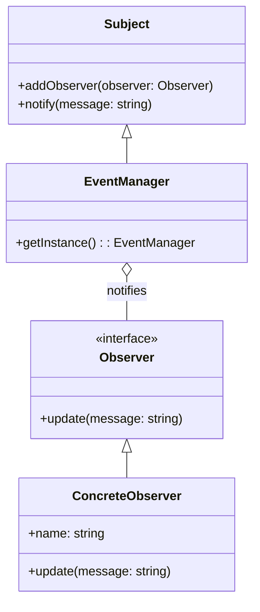

## 18.5 Trade-offs and Considerations in C++ Design Patterns

In the realm of software engineering, design patterns are indispensable tools that help developers solve recurring problems with proven solutions. However, the application of these patterns is not without its challenges. As we explore the trade-offs and considerations involved in applying multiple design patterns in C++, we aim to strike a balance between maintainability and complexity. This section will guide you through the nuances of pattern selection, implementation, and the inherent trade-offs that come with them.

### Understanding Design Patterns in C++

Design patterns are like blueprints for solving common software design problems. They provide a standard terminology and are specific to particular scenarios. In C++, design patterns are implemented using the language's features such as classes, inheritance, and polymorphism. However, the choice of pattern and its implementation can significantly impact the software's maintainability and complexity.

#### Key Concepts

- **Maintainability**: Refers to the ease with which a software system can be modified to correct faults, improve performance, or adapt to a changed environment.
- **Complexity**: Involves the intricacies of the software design, which can affect the ease of understanding, testing, and modifying the code.

### Balancing Maintainability and Complexity

Balancing maintainability and complexity is a critical aspect of software design. While design patterns can enhance maintainability by providing clear, reusable solutions, they can also introduce complexity if not used judiciously.

#### Factors Influencing Maintainability

1. **Code Readability**: Patterns should enhance, not hinder, the readability of the code.
2. **Modularity**: Patterns should promote modular design, allowing parts of the system to be developed, tested, and maintained independently.
3. **Reusability**: Patterns should encourage code reuse, reducing redundancy and potential errors.

#### Factors Contributing to Complexity

1. **Over-Engineering**: Using patterns unnecessarily can lead to over-engineering, making the system more complex than needed.
2. **Pattern Overlap**: Combining multiple patterns can lead to overlapping responsibilities, increasing complexity.
3. **Performance Overheads**: Some patterns introduce performance overheads, which can complicate the system.

### Practical Considerations in Pattern Selection

When selecting design patterns, it's essential to consider the specific needs of your project. Here are some practical considerations to guide your decision-making process:

#### Assessing Project Requirements

- **Identify Core Problems**: Clearly define the problems you are trying to solve. This will help in selecting the most appropriate patterns.
- **Evaluate Constraints**: Consider constraints such as time, resources, and performance requirements.

#### Choosing the Right Pattern

- **Match Patterns to Problems**: Select patterns that align closely with the problems identified.
- **Consider Simplicity**: Opt for simpler patterns when possible to minimize complexity.
- **Evaluate Scalability**: Ensure the chosen patterns can scale with the project.

#### Integrating Multiple Patterns

- **Ensure Compatibility**: When combining patterns, ensure they are compatible and do not conflict with each other.
- **Maintain Clarity**: Document the use of patterns clearly to maintain clarity for future developers.
- **Test Extensively**: Thoroughly test the integration of patterns to ensure they work harmoniously.

### Code Examples and Visualizations

To illustrate these concepts, let's explore a practical example of integrating multiple design patterns in a C++ application. We'll use the Observer and Singleton patterns to create a simple event notification system.

#### Observer Pattern

The Observer pattern defines a one-to-many dependency between objects, allowing one object to notify others of changes.

```cpp
#include <iostream>
#include <vector>
#include <memory>

// Observer interface
class Observer {
public:
    virtual void update(const std::string& message) = 0;
};

// Subject class
class Subject {
    std::vector<std::shared_ptr<Observer>> observers;
public:
    void addObserver(std::shared_ptr<Observer> observer) {
        observers.push_back(observer);
    }

    void notify(const std::string& message) {
        for (auto& observer : observers) {
            observer->update(message);
        }
    }
};

// Concrete Observer
class ConcreteObserver : public Observer {
    std::string name;
public:
    ConcreteObserver(const std::string& name) : name(name) {}

    void update(const std::string& message) override {
        std::cout << name << " received: " << message << std::endl;
    }
};
```

#### Singleton Pattern

The Singleton pattern ensures a class has only one instance and provides a global point of access to it.

```cpp
// Singleton class
class EventManager : public Subject {
private:
    static std::shared_ptr<EventManager> instance;

    EventManager() = default; // Private constructor

public:
    static std::shared_ptr<EventManager> getInstance() {
        if (!instance) {
            instance = std::shared_ptr<EventManager>(new EventManager());
        }
        return instance;
    }
};

std::shared_ptr<EventManager> EventManager::instance = nullptr;
```

#### Integrating Patterns

By integrating the Observer and Singleton patterns, we create a centralized event manager that notifies observers of events.

```cpp
int main() {
    auto eventManager = EventManager::getInstance();

    auto observer1 = std::make_shared<ConcreteObserver>("Observer1");
    auto observer2 = std::make_shared<ConcreteObserver>("Observer2");

    eventManager->addObserver(observer1);
    eventManager->addObserver(observer2);

    eventManager->notify("Event 1");
    eventManager->notify("Event 2");

    return 0;
}
```

### Visualizing the Design

Below is a Mermaid.js diagram illustrating the interaction between the Observer and Singleton patterns in our example.



### Design Considerations

When integrating multiple patterns, consider the following:

- **Cohesion**: Ensure that the patterns work together cohesively to solve the problem.
- **Separation of Concerns**: Maintain clear boundaries between different parts of the system.
- **Flexibility**: Design the system to be flexible and adaptable to future changes.

### Differences and Similarities

It's important to understand the differences and similarities between patterns to avoid confusion:

- **Observer vs. Mediator**: Both patterns deal with communication between objects, but the Mediator centralizes communication to reduce dependencies, while the Observer allows direct notification.
- **Singleton vs. Multiton**: The Singleton pattern restricts a class to a single instance, while the Multiton pattern allows multiple instances, each identified by a key.

### Try It Yourself

Experiment with the code examples by:

- **Adding More Observers**: Add additional observers to see how the notification system scales.
- **Implementing Different Events**: Modify the `notify` method to handle different types of events.
- **Exploring Other Patterns**: Try integrating other patterns, such as the Factory or Command patterns, to extend functionality.

### References and Further Reading

- [Design Patterns: Elements of Reusable Object-Oriented Software](https://www.amazon.com/Design-Patterns-Elements-Reusable-Object-Oriented/dp/0201633612) by Erich Gamma, Richard Helm, Ralph Johnson, and John Vlissides.
- [C++ Programming Language](https://en.cppreference.com/w/) - Comprehensive reference for C++ language features.
- [Boost C++ Libraries](https://www.boost.org/) - A collection of peer-reviewed portable C++ source libraries.

### Knowledge Check

To reinforce your understanding, consider the following questions:

- What are the key factors influencing maintainability in software design?
- How can over-engineering affect software complexity?
- What considerations should be made when integrating multiple design patterns?

### Embrace the Journey

Remember, mastering design patterns is a journey. As you continue to explore and apply these patterns, you'll gain deeper insights into their trade-offs and considerations. Keep experimenting, stay curious, and enjoy the process of building robust and maintainable software systems.

## Quiz Time!



### What is a key factor influencing maintainability in software design?

- [x] Code readability
- [ ] Over-engineering
- [ ] Pattern overlap
- [ ] Performance overheads

> **Explanation:** Code readability is crucial for maintainability as it makes the code easier to understand and modify.

### What can over-engineering lead to in software design?

- [x] Increased complexity
- [ ] Improved performance
- [ ] Enhanced readability
- [ ] Reduced modularity

> **Explanation:** Over-engineering can lead to increased complexity by introducing unnecessary features or patterns.

### Which pattern ensures a class has only one instance?

- [x] Singleton
- [ ] Observer
- [ ] Factory
- [ ] Command

> **Explanation:** The Singleton pattern ensures a class has only one instance and provides a global point of access to it.

### What is the primary purpose of the Observer pattern?

- [x] To define a one-to-many dependency between objects
- [ ] To encapsulate object creation
- [ ] To provide a unified interface to a set of interfaces
- [ ] To decouple abstraction from implementation

> **Explanation:** The Observer pattern defines a one-to-many dependency between objects, allowing one object to notify others of changes.

### What should be considered when integrating multiple design patterns?

- [x] Compatibility
- [ ] Over-engineering
- [x] Clarity
- [ ] Performance overheads

> **Explanation:** Ensuring compatibility and maintaining clarity are essential when integrating multiple design patterns.

### What is a potential drawback of using design patterns?

- [x] Increased complexity
- [ ] Improved modularity
- [ ] Enhanced readability
- [ ] Better scalability

> **Explanation:** While design patterns can improve modularity and readability, they can also increase complexity if not used judiciously.

### What is the difference between the Observer and Mediator patterns?

- [x] Observer allows direct notification, while Mediator centralizes communication
- [ ] Mediator allows direct notification, while Observer centralizes communication
- [ ] Both patterns centralize communication
- [ ] Both patterns allow direct notification

> **Explanation:** The Observer pattern allows direct notification between objects, whereas the Mediator pattern centralizes communication to reduce dependencies.

### What is a benefit of using design patterns?

- [x] Reusability
- [ ] Over-engineering
- [ ] Pattern overlap
- [ ] Performance overheads

> **Explanation:** Design patterns promote reusability by providing standard solutions to common problems.

### What is the primary focus of the Singleton pattern?

- [x] Ensuring a class has only one instance
- [ ] Defining a one-to-many dependency
- [ ] Encapsulating object creation
- [ ] Decoupling abstraction from implementation

> **Explanation:** The Singleton pattern focuses on ensuring a class has only one instance and provides a global point of access to it.

### True or False: The Observer pattern is used to encapsulate object creation.

- [ ] True
- [x] False

> **Explanation:** False. The Observer pattern is used to define a one-to-many dependency between objects, not to encapsulate object creation.


