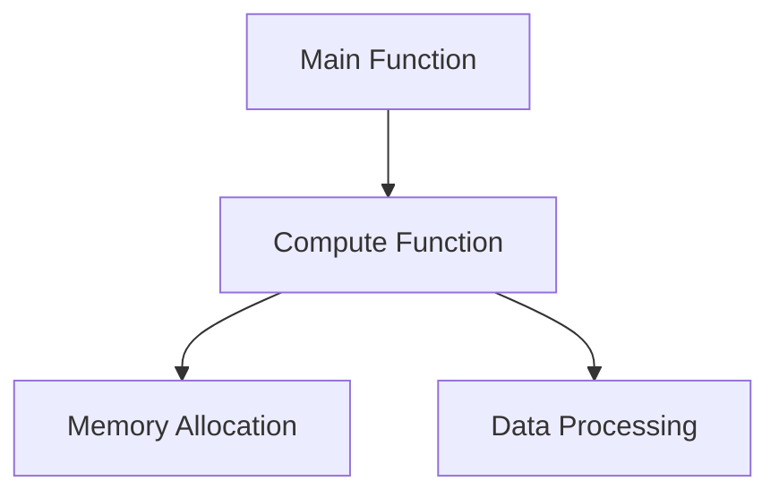

## 19.1 Profiling Tools and Techniques

In the realm of software development, particularly in C++ programming, performance optimization is a crucial aspect that can significantly impact the efficiency and responsiveness of applications. Profiling tools and techniques are indispensable for identifying performance bottlenecks and optimizing code. This section delves into various profiling tools such as gprof, Valgrind, and Visual Studio Profiler, and provides insights into interpreting profiling data to enhance your C++ applications.

### Understanding Profiling

Profiling is the process of measuring the space (memory) and time complexity of a program, identifying parts of the code that consume the most resources. It helps in pinpointing inefficient code segments, enabling developers to optimize them for better performance.

#### Key Concepts in Profiling

1. **Execution Time**: The total time taken by a program to execute.
2. **Memory Usage**: The amount of memory consumed during execution.
3. **Function Call Frequency**: How often functions are called, which can indicate hotspots.
4. **Call Graphs**: Visual representations of function calls and their relationships.

### Profiling Tools Overview

Let's explore some of the most popular profiling tools used in the C++ ecosystem.

#### gprof

**gprof** is a GNU profiler that provides a flat profile and a call graph profile of a program. It is widely used due to its integration with the GNU Compiler Collection (GCC).

- **Installation**: gprof is typically included with GCC. You can check its availability by running `gprof --version` in your terminal.
- **Usage**: Compile your program with the `-pg` flag to enable profiling. For example:
  ```bash
  g++ -pg -o my_program my_program.cpp
  ```
  After running your program, a `gmon.out` file is generated. Use gprof to analyze this file:
  ```bash
  gprof my_program gmon.out > analysis.txt
  ```

#### Valgrind

**Valgrind** is a versatile tool suite for debugging and profiling Linux programs. It includes tools like Memcheck for memory debugging and Callgrind for profiling.

- **Installation**: Install Valgrind using your package manager. For example, on Ubuntu:
  ```bash
  sudo apt-get install valgrind
  ```
- **Usage**: To profile a program with Callgrind:
  ```bash
  valgrind --tool=callgrind ./my_program
  ```
  This generates a `callgrind.out` file, which can be visualized using tools like KCachegrind.

#### Visual Studio Profiler

The **Visual Studio Profiler** is a powerful tool for profiling applications on Windows. It provides detailed performance insights, including CPU usage, memory allocation, and more.

- **Installation**: The profiler is integrated into Visual Studio. Ensure you have the appropriate version installed.
- **Usage**: Open your project in Visual Studio, go to `Debug > Performance Profiler`, and select the profiling tools you wish to use.

### Interpreting Profiling Data

Interpreting profiling data is crucial for identifying and resolving performance issues. Here are some key aspects to consider:

#### Flat Profile

A flat profile shows the time spent in each function, helping identify which functions consume the most CPU time.

- **Example**: If a function `compute()` takes up 40% of the execution time, it is a candidate for optimization.

#### Call Graph

A call graph provides a visual representation of function calls, showing the relationships and call hierarchy.

- **Example**: If `compute()` is called by `main()` and `process()`, optimizing `compute()` could improve the performance of both callers.

#### Memory Profiling

Memory profiling helps identify memory leaks and inefficient memory usage.

- **Example**: If `allocateMemory()` is called frequently and consumes a large amount of memory, consider optimizing memory allocation or using smart pointers.

### Code Examples

Let's explore a simple C++ program and how to profile it using gprof and Valgrind.

```cpp
#include <iostream>
#include <vector>

// Function to perform some computation
void compute(std::vector<int>& data) {
    for (auto& val : data) {
        val *= 2; // Double each element
    }
}

// Main function
int main() {
    std::vector<int> data(1000000, 1); // Initialize a large vector
    compute(data); // Call the compute function
    std::cout << "Computation complete." << std::endl;
    return 0;
}
```

#### Profiling with gprof

1. **Compile with Profiling Enabled**:
   ```bash
   g++ -pg -o my_program my_program.cpp
   ```

2. **Run the Program**:
   ```bash
   ./my_program
   ```

3. **Analyze with gprof**:
   ```bash
   gprof my_program gmon.out > analysis.txt
   ```

#### Profiling with Valgrind

1. **Run with Callgrind**:
   ```bash
   valgrind --tool=callgrind ./my_program
   ```

2. **Visualize with KCachegrind**:
   Open `callgrind.out` in KCachegrind for a detailed analysis.

### Visualizing Profiling Data

Visualizing profiling data can greatly enhance understanding and aid in identifying performance bottlenecks. Tools like KCachegrind provide graphical representations of call graphs and execution paths.



**Diagram Description**: This call graph illustrates the relationship between the main function and the compute function, highlighting memory allocation and data processing as key components.

### Try It Yourself

Experiment with the provided code by modifying the `compute()` function to include additional operations, such as sorting the vector or performing more complex calculations. Profile the modified program to observe changes in performance metrics.

### Further Reading

For more in-depth information on profiling tools and techniques, consider exploring the following resources:

- [GNU gprof Documentation](https://sourceware.org/binutils/docs/gprof/)
- [Valgrind Documentation](http://valgrind.org/docs/manual/manual.html)
- [Visual Studio Profiler Documentation](https://docs.microsoft.com/en-us/visualstudio/profiling/?view=vs-2019)

### Knowledge Check

Before we conclude, let's review some key takeaways:

- Profiling is essential for identifying performance bottlenecks in C++ applications.
- Tools like gprof, Valgrind, and Visual Studio Profiler provide valuable insights into execution time, memory usage, and function call frequency.
- Interpreting profiling data involves analyzing flat profiles, call graphs, and memory usage patterns.
- Visualizing profiling data can aid in understanding complex relationships and optimizing code.

### Embrace the Journey

Remember, profiling is an iterative process. As you continue to refine your skills, you'll become more adept at identifying and resolving performance issues. Keep experimenting, stay curious, and enjoy the journey of optimizing your C++ applications!

## Quiz Time!



### What is the primary purpose of profiling in software development?

- [x] To identify performance bottlenecks and optimize code
- [ ] To compile code into executable binaries
- [ ] To debug syntax errors in code
- [ ] To manage version control systems

> **Explanation:** Profiling is used to measure the performance of a program, identifying areas that consume the most resources, and optimizing them for better efficiency.

### Which of the following tools is NOT a profiler?

- [ ] gprof
- [ ] Valgrind
- [x] Git
- [ ] Visual Studio Profiler

> **Explanation:** Git is a version control system, not a profiling tool. gprof, Valgrind, and Visual Studio Profiler are used for profiling applications.

### How do you enable profiling with gprof during compilation?

- [x] Use the `-pg` flag
- [ ] Use the `-g` flag
- [ ] Use the `-O2` flag
- [ ] Use the `-Wall` flag

> **Explanation:** The `-pg` flag is used to enable profiling with gprof during the compilation of a program.

### What file does gprof generate after running a profiled program?

- [x] gmon.out
- [ ] profile.txt
- [ ] analysis.log
- [ ] callgraph.dat

> **Explanation:** After running a profiled program, gprof generates a file named `gmon.out`, which contains the profiling data.

### Which tool can be used to visualize Callgrind output?

- [x] KCachegrind
- [ ] GDB
- [ ] Eclipse
- [ ] Visual Studio Code

> **Explanation:** KCachegrind is a tool used to visualize the output of Callgrind, a profiling tool within the Valgrind suite.

### What is a flat profile in the context of profiling?

- [x] A report showing the time spent in each function
- [ ] A visual representation of function calls
- [ ] A summary of memory usage
- [ ] A list of syntax errors in code

> **Explanation:** A flat profile shows the time spent in each function, helping identify which functions consume the most CPU time.

### What does a call graph represent in profiling?

- [x] The relationships and hierarchy of function calls
- [ ] The memory usage of a program
- [ ] The syntax errors in code
- [ ] The version history of a project

> **Explanation:** A call graph provides a visual representation of function calls, showing the relationships and call hierarchy.

### Which profiler is integrated into Visual Studio?

- [x] Visual Studio Profiler
- [ ] gprof
- [ ] Valgrind
- [ ] Eclipse Profiler

> **Explanation:** The Visual Studio Profiler is integrated into Visual Studio and provides detailed performance insights for applications.

### True or False: Profiling can help identify memory leaks in a program.

- [x] True
- [ ] False

> **Explanation:** Profiling tools can help identify memory leaks by analyzing memory usage patterns and detecting inefficient memory allocation.

### Which of the following is a key takeaway from profiling?

- [x] Profiling is essential for identifying performance bottlenecks in C++ applications.
- [ ] Profiling is only useful for debugging syntax errors.
- [ ] Profiling is not necessary for optimizing code.
- [ ] Profiling tools are only available for Windows platforms.

> **Explanation:** Profiling is crucial for identifying performance bottlenecks and optimizing C++ applications. It is not limited to debugging syntax errors or specific platforms.


