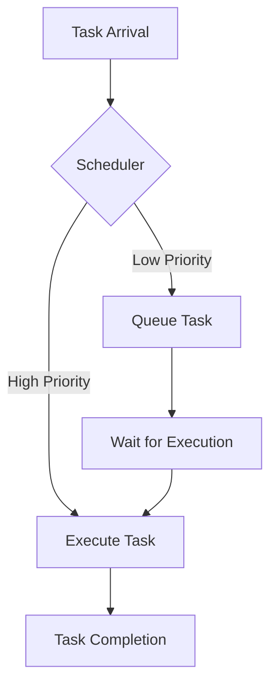

## 19.10 Real-Time Constraints

In the world of high-performance computing and embedded systems, real-time constraints are critical. These constraints ensure that systems respond to inputs or events within a specified time frame, which is crucial in applications like automotive control systems, medical devices, and financial trading platforms. In this section, we will delve into the intricacies of real-time constraints in C++ programming, focusing on deterministic execution and how to design, implement, and optimize real-time systems using advanced C++ techniques.

### Understanding Real-Time Systems

Real-time systems are designed to perform tasks within a strict time limit. These systems can be categorized into two types:

1. **Hard Real-Time Systems**: Missing a deadline can lead to catastrophic failures. Examples include pacemakers and automotive airbag systems.
2. **Soft Real-Time Systems**: Missing a deadline results in degraded performance but not catastrophic failure. Examples include video streaming and online gaming.

#### Deterministic Execution

Deterministic execution is the cornerstone of real-time systems. It ensures that operations are completed within a predictable time frame. This predictability is crucial for meeting the timing requirements of real-time systems.

### Key Concepts in Real-Time Constraints

To design systems with real-time constraints, we need to understand several key concepts:

- **Latency**: The time taken to respond to an event.
- **Jitter**: The variability in response time.
- **Throughput**: The number of tasks processed in a given time frame.
- **Priority**: The importance of a task relative to others.

### Designing Real-Time Systems in C++

Designing real-time systems in C++ involves several strategies and techniques to ensure deterministic execution and meet timing requirements.

#### 1. Task Scheduling

Task scheduling is crucial in real-time systems. It involves determining the order and timing of task execution to meet deadlines.

- **Priority Scheduling**: Assigns priority levels to tasks, ensuring that high-priority tasks are executed first.
- **Rate Monotonic Scheduling (RMS)**: A fixed-priority algorithm where tasks with shorter periods have higher priorities.
- **Earliest Deadline First (EDF)**: A dynamic scheduling algorithm where tasks with the nearest deadlines are prioritized.

#### 2. Resource Management

Efficient resource management is essential to prevent bottlenecks and ensure timely task execution.

- **Memory Management**: Use of static memory allocation to avoid the unpredictability of dynamic memory allocation.
- **Processor Affinity**: Binding tasks to specific processors to reduce context-switching overhead.

#### 3. Synchronization Mechanisms

Synchronization is vital to ensure data consistency and prevent race conditions in concurrent real-time systems.

- **Mutexes and Locks**: Use lightweight locks to minimize blocking time.
- **Lock-Free Programming**: Employ atomic operations to avoid locks and reduce latency.

#### 4. Real-Time Operating Systems (RTOS)

An RTOS provides the necessary infrastructure for managing real-time tasks, including scheduling, synchronization, and resource management.

- **Popular RTOS for C++**: Examples include FreeRTOS, VxWorks, and QNX.

### Implementing Real-Time Systems in C++

Let's explore how to implement real-time systems in C++ with practical examples and code snippets.

#### Example: Priority Scheduling

```cpp
#include <iostream>
#include <thread>
#include <vector>
#include <queue>
#include <mutex>
#include <condition_variable>

// Task structure
struct Task {
    int priority;
    std::function<void()> func;
};

// Comparator for priority queue
struct CompareTask {
    bool operator()(Task const& t1, Task const& t2) {
        return t1.priority < t2.priority; // Higher priority first
    }
};

std::priority_queue<Task, std::vector<Task>, CompareTask> taskQueue;
std::mutex queueMutex;
std::condition_variable cv;

// Worker function
void worker() {
    while (true) {
        std::unique_lock<std::mutex> lock(queueMutex);
        cv.wait(lock, [] { return !taskQueue.empty(); });

        Task task = taskQueue.top();
        taskQueue.pop();
        lock.unlock();

        task.func(); // Execute task
    }
}

int main() {
    // Create worker threads
    std::vector<std::thread> workers;
    for (int i = 0; i < 4; ++i) {
        workers.emplace_back(worker);
    }

    // Add tasks to the queue
    {
        std::lock_guard<std::mutex> lock(queueMutex);
        taskQueue.push({1, [] { std::cout << "Task 1 executed\n"; }});
        taskQueue.push({3, [] { std::cout << "Task 3 executed\n"; }});
        taskQueue.push({2, [] { std::cout << "Task 2 executed\n"; }});
    }
    cv.notify_all();

    for (auto& worker : workers) {
        worker.join();
    }

    return 0;
}
```

In this example, we use a priority queue to manage tasks based on their priority. The worker threads execute tasks in order of priority, ensuring that high-priority tasks are executed first.

#### Example: Lock-Free Programming

```cpp
#include <iostream>
#include <atomic>
#include <thread>
#include <vector>

std::atomic<int> counter(0);

void increment() {
    for (int i = 0; i < 1000; ++i) {
        counter.fetch_add(1, std::memory_order_relaxed);
    }
}

int main() {
    std::vector<std::thread> threads;
    for (int i = 0; i < 10; ++i) {
        threads.emplace_back(increment);
    }

    for (auto& thread : threads) {
        thread.join();
    }

    std::cout << "Counter: " << counter.load() << std::endl;
    return 0;
}
```

This example demonstrates lock-free programming using atomic operations. The `std::atomic` type ensures that the `counter` variable is updated atomically, eliminating the need for locks and reducing latency.

### Optimizing Real-Time Systems

Optimization is crucial in real-time systems to ensure that they meet timing requirements and operate efficiently.

#### 1. Code Optimization

- **Inline Functions**: Use inline functions to reduce function call overhead.
- **Loop Unrolling**: Unroll loops to decrease the number of iterations and improve performance.

#### 2. Compiler Optimizations

- **Profile-Guided Optimization (PGO)**: Use profiling data to guide compiler optimizations.
- **Link-Time Optimization (LTO)**: Optimize across translation units during the linking phase.

#### 3. Hardware Considerations

- **Cache Optimization**: Organize data to improve cache locality and reduce cache misses.
- **SIMD Instructions**: Use SIMD (Single Instruction, Multiple Data) instructions to perform parallel operations on data.

### Visualizing Real-Time Systems

To better understand the architecture and flow of real-time systems, let's use a diagram to visualize task scheduling and execution.



**Diagram Description**: This flowchart illustrates the process of task scheduling in a real-time system. Tasks arrive and are evaluated by the scheduler. High-priority tasks are executed immediately, while low-priority tasks are queued for later execution.

### Challenges and Considerations

Designing real-time systems in C++ presents several challenges and considerations:

- **Timing Analysis**: Accurately analyzing and predicting task execution times is challenging but essential for meeting deadlines.
- **Resource Contention**: Managing shared resources without introducing significant latency or jitter is critical.
- **Scalability**: Designing systems that can scale with increasing workloads while maintaining real-time constraints.

### Try It Yourself

Experiment with the provided code examples by modifying task priorities, adding more tasks, or implementing additional scheduling algorithms. Observe how these changes affect task execution and system performance.

### References and Further Reading

- [Real-Time Systems: Theory and Practice](https://www.springer.com/gp/book/9781441963031)
- [FreeRTOS Documentation](https://www.freertos.org/Documentation/RTOS_book.html)
- [C++ Concurrency in Action](https://www.manning.com/books/c-plus-plus-concurrency-in-action)

### Knowledge Check

- What are the key differences between hard and soft real-time systems?
- How does priority scheduling ensure deterministic execution?
- What are some common challenges in designing real-time systems?

### Embrace the Journey

Designing real-time systems in C++ is a complex but rewarding endeavor. As you continue to explore and experiment with real-time constraints, remember that practice and experience are your best teachers. Stay curious, keep experimenting, and enjoy the journey of mastering real-time systems in C++!

## Quiz Time!



### What is a key characteristic of hard real-time systems?

- [x] Missing a deadline can lead to catastrophic failures.
- [ ] They are more flexible with deadlines.
- [ ] They prioritize throughput over latency.
- [ ] They do not require deterministic execution.

> **Explanation:** Hard real-time systems have strict deadlines, and missing them can result in catastrophic failures, unlike soft real-time systems.

### Which scheduling algorithm prioritizes tasks with the nearest deadlines?

- [ ] Rate Monotonic Scheduling (RMS)
- [x] Earliest Deadline First (EDF)
- [ ] Priority Scheduling
- [ ] Round Robin Scheduling

> **Explanation:** Earliest Deadline First (EDF) is a dynamic scheduling algorithm that prioritizes tasks with the nearest deadlines.

### What is the purpose of using `std::atomic` in C++?

- [x] To perform atomic operations without locks.
- [ ] To increase the size of data types.
- [ ] To slow down execution for debugging.
- [ ] To create complex data structures.

> **Explanation:** `std::atomic` is used to perform atomic operations without the need for locks, reducing latency and preventing race conditions.

### What is a common technique to reduce function call overhead in real-time systems?

- [ ] Using dynamic memory allocation
- [x] Using inline functions
- [ ] Increasing loop iterations
- [ ] Adding more threads

> **Explanation:** Inline functions reduce function call overhead by expanding the function code at the call site, improving performance.

### Which of the following is a benefit of using SIMD instructions?

- [x] Performing parallel operations on data
- [ ] Increasing code complexity
- [ ] Reducing data size
- [ ] Slowing down execution

> **Explanation:** SIMD (Single Instruction, Multiple Data) instructions allow parallel operations on data, enhancing performance.

### What is a challenge in designing real-time systems?

- [x] Accurately predicting task execution times
- [ ] Reducing code readability
- [ ] Increasing resource contention
- [ ] Decreasing system scalability

> **Explanation:** Accurately predicting task execution times is crucial for meeting deadlines in real-time systems, making it a significant challenge.

### How can cache optimization improve real-time system performance?

- [x] By improving cache locality and reducing cache misses
- [ ] By increasing the number of cache lines
- [ ] By decreasing data size
- [ ] By adding more threads

> **Explanation:** Cache optimization improves performance by organizing data to enhance cache locality and reduce cache misses.

### What is the role of a Real-Time Operating System (RTOS)?

- [x] To provide infrastructure for managing real-time tasks
- [ ] To increase the complexity of task scheduling
- [ ] To reduce system reliability
- [ ] To eliminate the need for synchronization

> **Explanation:** An RTOS provides the necessary infrastructure for managing real-time tasks, including scheduling, synchronization, and resource management.

### Which of the following is a method to prevent resource contention in real-time systems?

- [x] Efficient resource management
- [ ] Increasing the number of tasks
- [ ] Reducing task priorities
- [ ] Using dynamic memory allocation

> **Explanation:** Efficient resource management helps prevent resource contention, ensuring timely task execution in real-time systems.

### True or False: Lock-free programming eliminates the need for synchronization in real-time systems.

- [ ] True
- [x] False

> **Explanation:** Lock-free programming reduces the need for locks but does not eliminate the need for synchronization entirely. It uses atomic operations to ensure data consistency.


