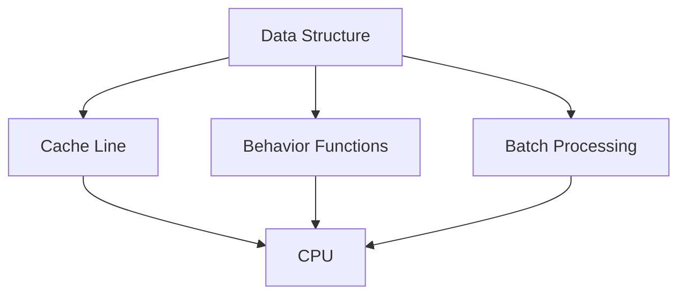

## 19.11 Data-Oriented Design

In the realm of software development, especially in performance-critical applications, the way we organize and manage data can significantly impact the efficiency and scalability of our systems. Data-Oriented Design (DOD) is a paradigm that emphasizes structuring code around data rather than around functions or objects. This approach can lead to substantial performance gains by optimizing data access patterns and reducing computational overhead. In this section, we will delve into the principles of Data-Oriented Design, explore its benefits, and provide practical examples and strategies for implementing DOD in C++ applications.

### Understanding Data-Oriented Design

Data-Oriented Design is a methodology that focuses on the efficient organization and manipulation of data. Unlike traditional Object-Oriented Design (OOD), which centers around objects and their interactions, DOD prioritizes the layout and access patterns of data. The core idea is to design systems that align with how data is processed by the hardware, particularly the CPU and memory hierarchy.

#### Key Concepts of Data-Oriented Design

1. **Data Layout and Access Patterns**: Organize data in a way that minimizes cache misses and maximizes memory throughput. This often involves using contiguous memory blocks and structuring data to align with the CPU's cache lines.

2. **Separation of Data and Behavior**: Unlike OOD, where data and behavior are encapsulated within objects, DOD advocates for separating data from the functions that operate on it. This separation allows for more flexible and efficient data processing.

3. **Focus on Hot Paths**: Identify and optimize the critical paths in your application where performance is most crucial. This often involves profiling and analyzing the code to determine bottlenecks.

4. **Batch Processing**: Process data in batches to reduce the overhead of frequent function calls and improve cache locality.

5. **Data Transformation**: Transform data into formats that are more efficient for processing. This might involve converting data structures or reordering elements to align with processing needs.

### Benefits of Data-Oriented Design

Data-Oriented Design offers several advantages, particularly in performance-critical applications such as game development, real-time systems, and high-performance computing:

- **Improved Cache Efficiency**: By organizing data to align with cache lines, DOD reduces cache misses and improves memory access times.

- **Enhanced Parallelism**: DOD facilitates parallel processing by decoupling data and behavior, allowing for more straightforward implementation of parallel algorithms.

- **Scalability**: Systems designed with DOD principles can scale more efficiently, as they are better aligned with the underlying hardware architecture.

- **Flexibility**: Separating data from behavior allows for more flexible system design, enabling easier adaptation to changing requirements.

### Implementing Data-Oriented Design in C++

To effectively implement Data-Oriented Design in C++, we need to consider several strategies and techniques that align with the principles of DOD. Let's explore some of these strategies with practical examples.

#### Organizing Data for Cache Efficiency

One of the primary goals of DOD is to optimize data layout for cache efficiency. This involves structuring data in a way that minimizes cache misses and maximizes memory throughput.

```cpp
#include <vector>
#include <iostream>

// Example of structuring data for cache efficiency
struct Particle {
    float position[3];
    float velocity[3];
    float mass;
};

void updateParticles(std::vector<Particle>& particles, float deltaTime) {
    for (auto& particle : particles) {
        // Update position based on velocity
        for (int i = 0; i < 3; ++i) {
            particle.position[i] += particle.velocity[i] * deltaTime;
        }
    }
}

int main() {
    std::vector<Particle> particles(1000); // Initialize 1000 particles

    // Simulate particle update
    updateParticles(particles, 0.016f); // Assuming 60 FPS, deltaTime = 1/60

    std::cout << "Particles updated!" << std::endl;
    return 0;
}
```

In this example, we organize particle data in a contiguous memory block, which improves cache locality when updating particle positions.

#### Separating Data and Behavior

By separating data from the functions that operate on it, we can achieve more flexible and efficient data processing.

```cpp
#include <vector>
#include <iostream>

// Data structure for particles
struct ParticleData {
    std::vector<float> positions;
    std::vector<float> velocities;
    std::vector<float> masses;
};

// Function to update particle positions
void updatePositions(ParticleData& data, float deltaTime) {
    for (size_t i = 0; i < data.positions.size(); i += 3) {
        data.positions[i] += data.velocities[i] * deltaTime;
        data.positions[i + 1] += data.velocities[i + 1] * deltaTime;
        data.positions[i + 2] += data.velocities[i + 2] * deltaTime;
    }
}

int main() {
    ParticleData data;
    data.positions.resize(3000); // 1000 particles, 3 coordinates each
    data.velocities.resize(3000);
    data.masses.resize(1000);

    // Simulate position update
    updatePositions(data, 0.016f);

    std::cout << "Particle positions updated!" << std::endl;
    return 0;
}
```

Here, we separate the particle data from the update logic, allowing for more flexible manipulation of the data.

#### Batch Processing for Performance

Batch processing involves processing data in chunks to reduce the overhead of frequent function calls and improve cache locality.

```cpp
#include <vector>
#include <iostream>

// Function to process data in batches
void processBatch(std::vector<int>& data, size_t batchSize) {
    for (size_t i = 0; i < data.size(); i += batchSize) {
        size_t end = std::min(i + batchSize, data.size());
        for (size_t j = i; j < end; ++j) {
            data[j] *= 2; // Example operation: doubling each element
        }
    }
}

int main() {
    std::vector<int> data(10000, 1); // Initialize with 10000 elements

    // Process data in batches of 1000
    processBatch(data, 1000);

    std::cout << "Data processed in batches!" << std::endl;
    return 0;
}
```

In this example, we process data in batches of 1000 elements, reducing the overhead of frequent function calls.

### Visualizing Data-Oriented Design

To better understand the principles of Data-Oriented Design, let's visualize how data is organized and processed in a DOD system.



**Diagram Description**: This diagram illustrates the flow of data in a Data-Oriented Design system. Data is organized into structures that align with cache lines, optimizing access by the CPU. Behavior functions operate on this data, often in batches, to improve performance.

### Advanced Techniques in Data-Oriented Design

As we delve deeper into Data-Oriented Design, we can explore more advanced techniques that leverage the power of modern C++ features and hardware capabilities.

#### Using SIMD for Parallel Processing

Single Instruction, Multiple Data (SIMD) is a parallel processing technique that allows the execution of a single instruction on multiple data points simultaneously. This can significantly enhance performance in data-oriented systems.

```cpp
#include <immintrin.h> // For SIMD intrinsics
#include <iostream>

// Example of using SIMD to process data
void processWithSIMD(float* data, size_t size) {
    __m128 factor = _mm_set1_ps(2.0f); // Set all elements to 2.0

    for (size_t i = 0; i < size; i += 4) {
        __m128 values = _mm_loadu_ps(&data[i]); // Load 4 floats
        values = _mm_mul_ps(values, factor);    // Multiply by factor
        _mm_storeu_ps(&data[i], values);        // Store result
    }
}

int main() {
    float data[8] = {1.0f, 2.0f, 3.0f, 4.0f, 5.0f, 6.0f, 7.0f, 8.0f};

    // Process data using SIMD
    processWithSIMD(data, 8);

    for (float value : data) {
        std::cout << value << " "; // Output: 2 4 6 8 10 12 14 16
    }
    std::cout << std::endl;

    return 0;
}
```

In this example, we use SIMD intrinsics to multiply an array of floats by a factor of 2, demonstrating how SIMD can be used to process data in parallel.

#### Leveraging Modern C++ Features

Modern C++ features, such as lambda expressions, range-based loops, and smart pointers, can enhance the implementation of Data-Oriented Design by providing more expressive and efficient code.

```cpp
#include <vector>
#include <iostream>
#include <algorithm>

// Using lambda expressions and range-based loops
void processWithLambdas(std::vector<int>& data) {
    std::for_each(data.begin(), data.end(), [](int& value) {
        value *= 2; // Example operation: doubling each element
    });
}

int main() {
    std::vector<int> data(10000, 1); // Initialize with 10000 elements

    // Process data using lambdas
    processWithLambdas(data);

    std::cout << "Data processed with lambdas!" << std::endl;
    return 0;
}
```

Here, we use a lambda expression with `std::for_each` to process data, demonstrating the power and flexibility of modern C++ features.

### Challenges and Considerations

While Data-Oriented Design offers significant performance benefits, it also presents certain challenges and considerations:

- **Complexity**: DOD can lead to more complex code structures, making it harder to maintain and understand.

- **Debugging**: Separating data and behavior can complicate debugging, as it may be less clear how data flows through the system.

- **Compatibility**: DOD may not always align with existing codebases or frameworks, requiring significant refactoring to implement.

- **Trade-offs**: Balancing the benefits of DOD with the potential increase in complexity and maintenance overhead is crucial.

### Try It Yourself

To gain a deeper understanding of Data-Oriented Design, try experimenting with the code examples provided. Here are some suggestions for modifications:

- **Experiment with Different Data Layouts**: Try reorganizing the data structures in the examples to see how it affects performance.

- **Implement Batch Processing**: Modify the batch processing example to use different batch sizes and observe the impact on performance.

- **Explore SIMD**: Experiment with different SIMD operations and data types to understand the capabilities and limitations of SIMD processing.

### Conclusion

Data-Oriented Design is a powerful paradigm that can lead to significant performance improvements in C++ applications. By focusing on data layout and access patterns, separating data from behavior, and leveraging modern C++ features, we can build systems that are both efficient and scalable. As you continue to explore and implement DOD principles, remember to balance performance gains with code complexity and maintainability.

## Quiz Time!



### What is the primary focus of Data-Oriented Design?

- [x] Organizing code around data structures
- [ ] Encapsulating data and behavior within objects
- [ ] Prioritizing function overloading and polymorphism
- [ ] Designing systems with a focus on inheritance

> **Explanation:** Data-Oriented Design focuses on organizing code around data structures to optimize data access patterns and improve performance.

### Which of the following is a benefit of Data-Oriented Design?

- [x] Improved cache efficiency
- [ ] Increased code complexity
- [ ] Greater reliance on inheritance
- [ ] Reduced need for data separation

> **Explanation:** Data-Oriented Design improves cache efficiency by organizing data to align with cache lines, reducing cache misses.

### What is a key principle of Data-Oriented Design?

- [x] Separation of data and behavior
- [ ] Encapsulation of data within objects
- [ ] Use of inheritance for code reuse
- [ ] Prioritizing function overloading

> **Explanation:** Data-Oriented Design separates data from behavior to allow for more flexible and efficient data processing.

### How does batch processing benefit performance in Data-Oriented Design?

- [x] Reduces overhead of frequent function calls
- [ ] Increases the number of function calls
- [ ] Decreases cache locality
- [ ] Complicates data access patterns

> **Explanation:** Batch processing reduces the overhead of frequent function calls and improves cache locality, enhancing performance.

### What is SIMD used for in Data-Oriented Design?

- [x] Parallel processing of data
- [ ] Serial processing of data
- [ ] Increasing code complexity
- [ ] Reducing data separation

> **Explanation:** SIMD (Single Instruction, Multiple Data) is used for parallel processing of data, allowing a single instruction to operate on multiple data points simultaneously.

### Which modern C++ feature can enhance Data-Oriented Design implementation?

- [x] Lambda expressions
- [ ] Multiple inheritance
- [ ] Virtual functions
- [ ] Operator overloading

> **Explanation:** Lambda expressions provide more expressive and efficient code, enhancing the implementation of Data-Oriented Design.

### What challenge does Data-Oriented Design present?

- [x] Increased code complexity
- [ ] Reduced performance
- [ ] Greater reliance on inheritance
- [ ] Simplified debugging

> **Explanation:** Data-Oriented Design can lead to increased code complexity, making it harder to maintain and understand.

### What is a consideration when implementing Data-Oriented Design?

- [x] Balancing performance gains with code complexity
- [ ] Prioritizing inheritance over composition
- [ ] Reducing data separation
- [ ] Increasing reliance on polymorphism

> **Explanation:** When implementing Data-Oriented Design, it's important to balance performance gains with the potential increase in code complexity.

### How can you experiment with Data-Oriented Design principles?

- [x] Modify data layouts and observe performance impacts
- [ ] Increase reliance on inheritance
- [ ] Reduce data separation
- [ ] Prioritize function overloading

> **Explanation:** Experimenting with different data layouts and observing performance impacts can help you understand Data-Oriented Design principles.

### Data-Oriented Design is primarily concerned with optimizing data access patterns.

- [x] True
- [ ] False

> **Explanation:** True. Data-Oriented Design focuses on optimizing data access patterns to improve performance and efficiency.


