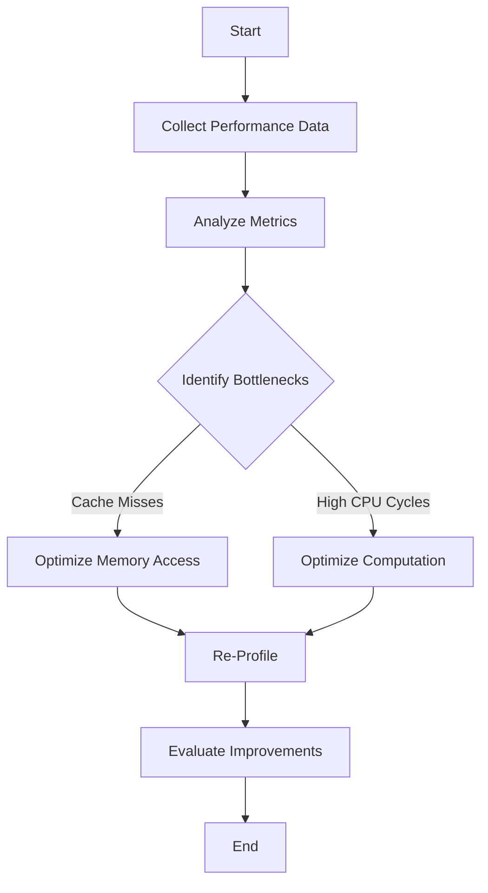

## 19.12 Using Hardware Performance Counters

In the realm of software engineering, especially when working with C++, performance optimization is a critical aspect that can significantly impact the efficiency and responsiveness of applications. One of the most powerful tools at our disposal for performance optimization is the use of hardware performance counters. These counters provide invaluable insights into the low-level operations of a system, allowing developers to pinpoint bottlenecks and optimize their code effectively.

### Introduction to Hardware Performance Counters

Hardware performance counters are special-purpose registers built into modern CPUs that keep track of various low-level operations. These operations include instructions executed, cache hits and misses, branch predictions, and more. By leveraging these counters, developers can gain a detailed understanding of how their code interacts with the hardware, enabling them to make informed decisions about optimizations.

#### Key Concepts

- **Instructions Retired**: The number of instructions that have been executed by the CPU.
- **Cache Hits and Misses**: Metrics that indicate how often data is successfully retrieved from the cache versus how often it must be fetched from slower memory.
- **Branch Mispredictions**: Occurrences where the CPU incorrectly predicts the path of a branch, leading to performance penalties.
- **CPU Cycles**: The number of clock cycles taken by the CPU to execute instructions.

### Tools for Utilizing Hardware Performance Counters

There are several tools available that allow developers to access and analyze hardware performance counters. Two of the most popular tools are `perf` and Intel VTune.

#### Perf

`perf` is a powerful performance analysis tool for Linux systems that provides a wide range of capabilities for profiling and tracing applications. It allows developers to collect and analyze performance data from hardware counters, software events, and tracepoints.

##### Getting Started with Perf

To begin using `perf`, you need to ensure it is installed on your system. On most Linux distributions, you can install it using the package manager:

```bash
sudo apt-get install linux-tools-common linux-tools-generic linux-tools-$(uname -r)
```

Once installed, you can start using `perf` to collect performance data. For example, to measure the number of instructions executed by a program, you can use the following command:

```bash
perf stat -e instructions ./your_program
```

This command will output the number of instructions executed by `your_program`.

##### Analyzing Cache Performance

To analyze cache performance, you can use `perf` to measure cache hits and misses:

```bash
perf stat -e cache-references,cache-misses ./your_program
```

This will provide you with data on how efficiently your program is utilizing the CPU cache.

#### Intel VTune

Intel VTune is another powerful tool for performance analysis, offering a comprehensive suite of features for profiling and optimizing applications. It provides detailed insights into CPU utilization, threading performance, memory access patterns, and more.

##### Setting Up Intel VTune

To use Intel VTune, you need to download and install it from the [Intel website](https://software.intel.com/content/www/us/en/develop/tools/vtune-profiler.html). Once installed, you can launch the VTune GUI or use the command-line interface to start profiling your applications.

##### Profiling with Intel VTune

Intel VTune offers a wide range of profiling options. For example, to analyze CPU utilization, you can create a new analysis and select the "CPU Usage" option. This will provide you with detailed information on how your application utilizes the CPU, including hotspots and potential bottlenecks.

### Practical Application: Optimizing a C++ Program

Let's walk through a practical example of using hardware performance counters to optimize a C++ program. We'll use a simple matrix multiplication program as our case study.

#### Initial Code

Here's a basic implementation of matrix multiplication in C++:

```cpp
#include <iostream>
#include <vector>

using Matrix = std::vector<std::vector<int>>;

Matrix multiplyMatrices(const Matrix& A, const Matrix& B) {
    size_t n = A.size();
    Matrix C(n, std::vector<int>(n, 0));

    for (size_t i = 0; i < n; ++i) {
        for (size_t j = 0; j < n; ++j) {
            for (size_t k = 0; k < n; ++k) {
                C[i][j] += A[i][k] * B[k][j];
            }
        }
    }

    return C;
}

int main() {
    size_t n = 1000; // Size of the matrix
    Matrix A(n, std::vector<int>(n, 1));
    Matrix B(n, std::vector<int>(n, 2));

    Matrix C = multiplyMatrices(A, B);

    std::cout << "Matrix multiplication completed." << std::endl;

    return 0;
}
```

This code performs matrix multiplication on two 1000x1000 matrices. While functional, it may not be the most efficient implementation.

#### Profiling with Perf

To profile this program using `perf`, compile it with optimization flags and then run `perf`:

```bash
g++ -O2 -o matrix_multiply matrix_multiply.cpp
perf stat -e instructions,cache-references,cache-misses ./matrix_multiply
```

Analyze the output to identify potential bottlenecks. Look for high cache miss rates or excessive instruction counts, which may indicate inefficient memory access patterns or unnecessary computations.

#### Optimizing the Code

Based on the profiling data, we can make several optimizations to improve performance:

1. **Loop Unrolling**: Unroll loops to reduce the overhead of loop control and increase instruction-level parallelism.

2. **Blocking**: Divide the matrices into smaller blocks to improve cache locality and reduce cache misses.

3. **Parallelization**: Use multithreading to take advantage of multiple CPU cores.

Here's an optimized version of the matrix multiplication code:

```cpp
#include <iostream>
#include <vector>
#include <thread>

using Matrix = std::vector<std::vector<int>>;

void multiplyBlock(const Matrix& A, const Matrix& B, Matrix& C, size_t start, size_t end) {
    size_t n = A.size();
    for (size_t i = start; i < end; ++i) {
        for (size_t j = 0; j < n; ++j) {
            for (size_t k = 0; k < n; ++k) {
                C[i][j] += A[i][k] * B[k][j];
            }
        }
    }
}

Matrix multiplyMatrices(const Matrix& A, const Matrix& B) {
    size_t n = A.size();
    Matrix C(n, std::vector<int>(n, 0));

    size_t numThreads = std::thread::hardware_concurrency();
    std::vector<std::thread> threads;
    size_t blockSize = n / numThreads;

    for (size_t t = 0; t < numThreads; ++t) {
        size_t start = t * blockSize;
        size_t end = (t == numThreads - 1) ? n : start + blockSize;
        threads.emplace_back(multiplyBlock, std::cref(A), std::cref(B), std::ref(C), start, end);
    }

    for (auto& thread : threads) {
        thread.join();
    }

    return C;
}

int main() {
    size_t n = 1000; // Size of the matrix
    Matrix A(n, std::vector<int>(n, 1));
    Matrix B(n, std::vector<int>(n, 2));

    Matrix C = multiplyMatrices(A, B);

    std::cout << "Matrix multiplication completed." << std::endl;

    return 0;
}
```

This version uses multithreading to parallelize the computation, potentially improving performance on multi-core systems.

#### Re-Profiling and Analysis

After making optimizations, re-profile the program using `perf` to evaluate the impact of the changes. Compare the new performance metrics with the original ones to assess the effectiveness of the optimizations.

### Visualizing Performance Data

Visualizing performance data can provide additional insights into how your application behaves. Tools like Intel VTune offer graphical representations of performance metrics, making it easier to identify patterns and anomalies.



*Figure: Workflow for Performance Optimization Using Hardware Performance Counters*

### Try It Yourself

Experiment with the matrix multiplication code by:

- Varying the matrix size to see how performance scales.
- Implementing additional optimizations, such as SIMD (Single Instruction, Multiple Data) instructions for vectorized operations.
- Using different numbers of threads to observe the impact on performance.

### Knowledge Check

1. **What are hardware performance counters, and why are they useful?**
   - Hardware performance counters are registers that track low-level CPU operations, providing insights into performance bottlenecks.

2. **How can you use `perf` to measure cache performance?**
   - Use `perf stat -e cache-references,cache-misses ./your_program` to collect cache performance data.

3. **What are some common optimizations for matrix multiplication?**
   - Loop unrolling, blocking, and parallelization are common optimizations.

### Conclusion

Using hardware performance counters is an essential skill for C++ developers aiming to optimize their applications. By leveraging tools like `perf` and Intel VTune, you can gain deep insights into the performance characteristics of your code and make informed decisions to enhance efficiency. Remember, this is just the beginning. As you progress, you'll build more complex and optimized applications. Keep experimenting, stay curious, and enjoy the journey!

## Quiz Time!



### What are hardware performance counters?

- [x] Special-purpose registers that track low-level CPU operations
- [ ] Software tools for debugging code
- [ ] Libraries for graphical user interfaces
- [ ] Functions for memory management

> **Explanation:** Hardware performance counters are registers built into CPUs that track operations like instructions executed, cache hits, and branch predictions.

### Which tool is used for performance analysis on Linux systems?

- [x] Perf
- [ ] Visual Studio Profiler
- [ ] GDB
- [ ] Eclipse

> **Explanation:** `perf` is a performance analysis tool available on Linux systems for profiling and tracing applications.

### What does the `perf stat -e instructions ./your_program` command do?

- [x] Measures the number of instructions executed by the program
- [ ] Compiles the program with optimization flags
- [ ] Analyzes memory usage of the program
- [ ] Displays the program's source code

> **Explanation:** This command uses `perf` to count the number of instructions executed by `your_program`.

### What is a common optimization technique for matrix multiplication?

- [x] Loop unrolling
- [ ] Using global variables
- [ ] Increasing the matrix size
- [ ] Decreasing the number of threads

> **Explanation:** Loop unrolling reduces the overhead of loop control and increases instruction-level parallelism.

### How can you improve cache locality in matrix multiplication?

- [x] Use blocking to divide matrices into smaller blocks
- [ ] Increase the matrix size
- [ ] Use global variables
- [ ] Decrease the number of threads

> **Explanation:** Blocking improves cache locality by dividing matrices into smaller blocks, reducing cache misses.

### What is the benefit of using multithreading in matrix multiplication?

- [x] Takes advantage of multiple CPU cores for parallel computation
- [ ] Reduces the size of the matrices
- [ ] Increases the number of instructions executed
- [ ] Decreases memory usage

> **Explanation:** Multithreading allows parallel computation, utilizing multiple CPU cores to improve performance.

### What does Intel VTune provide for performance analysis?

- [x] Detailed insights into CPU utilization and memory access patterns
- [ ] A compiler for C++ programs
- [ ] A debugger for finding code errors
- [ ] A library for graphical user interfaces

> **Explanation:** Intel VTune offers comprehensive profiling features, including CPU utilization and memory access analysis.

### How can you visualize performance data?

- [x] Use tools like Intel VTune for graphical representations
- [ ] Write custom scripts to parse data
- [ ] Use a text editor to view raw data
- [ ] Print data to the console

> **Explanation:** Tools like Intel VTune provide graphical representations of performance data, making it easier to analyze.

### What is the purpose of re-profiling a program after optimization?

- [x] Evaluate the impact of changes and assess improvements
- [ ] Compile the program with new flags
- [ ] Increase the program's execution time
- [ ] Decrease the program's memory usage

> **Explanation:** Re-profiling helps evaluate the effectiveness of optimizations by comparing new performance metrics with the original ones.

### True or False: Hardware performance counters can only be used on Linux systems.

- [ ] True
- [x] False

> **Explanation:** Hardware performance counters are available on various platforms, not just Linux systems.


