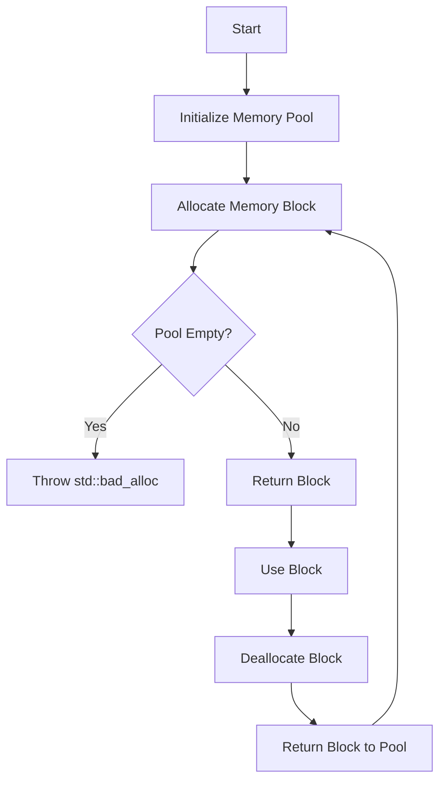

## 19.3 Memory Management Optimization

Memory management is a critical aspect of C++ programming, especially when building high-performance applications. Efficient memory management can significantly impact the speed and reliability of software. In this section, we will delve into strategies for optimizing memory management by reducing allocations and deallocations, with a particular focus on pool allocation strategies.

### Introduction to Memory Management in C++

C++ provides powerful mechanisms for memory management, allowing developers to control memory allocation and deallocation explicitly. However, this control comes with the responsibility of managing memory efficiently to prevent leaks and fragmentation, which can degrade performance.

#### Key Concepts

- **Heap vs. Stack Memory**: Understanding the difference between heap and stack memory is fundamental. The stack is used for static memory allocation, while the heap is used for dynamic memory allocation.
- **Fragmentation**: Fragmentation occurs when memory is allocated and deallocated in such a way that it leaves unusable gaps. This can lead to inefficient memory use and increased allocation times.
- **Memory Leaks**: Memory leaks happen when allocated memory is not properly deallocated, leading to a gradual increase in memory usage.

### Reducing Allocations and Deallocations

Frequent allocations and deallocations can be costly in terms of performance. Reducing the number of these operations can lead to significant performance improvements.

#### Strategies for Reducing Allocations

1. **Reuse Memory**: Instead of allocating new memory for each object, reuse existing memory whenever possible. This can be achieved through object pooling or caching.

2. **Use Stack Memory**: Whenever possible, prefer stack allocation over heap allocation. Stack allocations are faster and automatically managed by the compiler.

3. **Optimize Data Structures**: Choose data structures that minimize memory usage and allocation overhead. For example, using `std::vector` instead of `std::list` can reduce allocations due to its contiguous memory layout.

4. **Avoid Unnecessary Copies**: Use move semantics and references to avoid unnecessary copying of objects, which can lead to additional allocations.

5. **Preallocate Memory**: If the maximum size of a container is known, preallocate memory to avoid multiple reallocations.

#### Strategies for Reducing Deallocations

1. **RAII (Resource Acquisition Is Initialization)**: Use RAII to ensure that resources are automatically released when they go out of scope. This reduces the need for explicit deallocation.

2. **Smart Pointers**: Use smart pointers (`std::unique_ptr`, `std::shared_ptr`) to manage dynamic memory automatically and reduce the risk of memory leaks.

3. **Batch Deallocation**: Deallocate memory in batches rather than individually to reduce the overhead of deallocation operations.

### Pool Allocation Strategies

Pool allocation is a technique used to manage memory more efficiently by allocating a pool of memory blocks at once and reusing them as needed. This approach can significantly reduce the overhead of frequent allocations and deallocations.

#### What is Pool Allocation?

Pool allocation involves creating a pool of memory blocks that can be reused for objects of the same size. When an object is needed, a block from the pool is used instead of allocating new memory. When the object is no longer needed, the block is returned to the pool for reuse.

#### Benefits of Pool Allocation

- **Reduced Fragmentation**: By reusing memory blocks, pool allocation reduces fragmentation, leading to more efficient memory use.
- **Improved Performance**: Pool allocation can significantly reduce the time spent on memory allocation and deallocation, as the pool is preallocated.
- **Predictable Memory Usage**: Pool allocation provides more predictable memory usage patterns, which can be beneficial in real-time systems.

#### Implementing Pool Allocation in C++

Let's explore how to implement a simple memory pool in C++.

```cpp
#include <iostream>
#include <vector>

class MemoryPool {
public:
    MemoryPool(size_t blockSize, size_t poolSize)
        : blockSize(blockSize), poolSize(poolSize) {
        pool.reserve(poolSize);
        for (size_t i = 0; i < poolSize; ++i) {
            pool.push_back(new char[blockSize]);
        }
    }

    ~MemoryPool() {
        for (auto block : pool) {
            delete[] block;
        }
    }

    void* allocate() {
        if (pool.empty()) {
            throw std::bad_alloc();
        }
        void* block = pool.back();
        pool.pop_back();
        return block;
    }

    void deallocate(void* block) {
        pool.push_back(static_cast<char*>(block));
    }

private:
    size_t blockSize;
    size_t poolSize;
    std::vector<char*> pool;
};

int main() {
    const size_t blockSize = 32;
    const size_t poolSize = 10;

    MemoryPool pool(blockSize, poolSize);

    void* block1 = pool.allocate();
    void* block2 = pool.allocate();

    pool.deallocate(block1);
    pool.deallocate(block2);

    return 0;
}
```

**Explanation:**

- **MemoryPool Class**: This class manages a pool of memory blocks. It preallocates a specified number of blocks in the constructor and stores them in a vector.
- **allocate Method**: This method retrieves a block from the pool. If the pool is empty, it throws a `std::bad_alloc` exception.
- **deallocate Method**: This method returns a block to the pool for reuse.

#### Try It Yourself

Experiment with the memory pool implementation by:

- Changing the block size and pool size to see how it affects performance.
- Adding a mechanism to expand the pool dynamically if needed.
- Implementing a thread-safe version of the memory pool.

### Visualizing Memory Pool Allocation

To better understand how pool allocation works, let's visualize the process using a Mermaid.js diagram.



**Diagram Explanation:**

- **Initialize Memory Pool**: The pool is initialized with a set number of blocks.
- **Allocate Memory Block**: A block is allocated from the pool.
- **Pool Empty Check**: If the pool is empty, an exception is thrown.
- **Return Block**: If a block is available, it is returned for use.
- **Deallocate Block**: Once the block is no longer needed, it is returned to the pool.

### Advanced Pool Allocation Techniques

For more complex applications, consider these advanced pool allocation techniques:

1. **Object Pooling**: Use object pooling for objects that are expensive to create and destroy. This involves maintaining a pool of pre-initialized objects that can be reused.

2. **Thread-Safe Pools**: Implement thread-safe pools using synchronization primitives like mutexes to ensure safe access in multithreaded environments.

3. **Custom Allocators**: Implement custom allocators that use pool allocation internally. This allows you to use pool allocation with STL containers.

4. **Fixed-Size vs. Variable-Size Pools**: Decide whether to use fixed-size pools (all blocks are the same size) or variable-size pools (blocks can have different sizes) based on your application's needs.

### Code Example: Thread-Safe Memory Pool

Let's extend our memory pool implementation to support thread-safe operations.

```cpp
#include <iostream>
#include <vector>
#include <mutex>

class ThreadSafeMemoryPool {
public:
    ThreadSafeMemoryPool(size_t blockSize, size_t poolSize)
        : blockSize(blockSize), poolSize(poolSize) {
        pool.reserve(poolSize);
        for (size_t i = 0; i < poolSize; ++i) {
            pool.push_back(new char[blockSize]);
        }
    }

    ~ThreadSafeMemoryPool() {
        for (auto block : pool) {
            delete[] block;
        }
    }

    void* allocate() {
        std::lock_guard<std::mutex> lock(poolMutex);
        if (pool.empty()) {
            throw std::bad_alloc();
        }
        void* block = pool.back();
        pool.pop_back();
        return block;
    }

    void deallocate(void* block) {
        std::lock_guard<std::mutex> lock(poolMutex);
        pool.push_back(static_cast<char*>(block));
    }

private:
    size_t blockSize;
    size_t poolSize;
    std::vector<char*> pool;
    std::mutex poolMutex;
};

int main() {
    const size_t blockSize = 32;
    const size_t poolSize = 10;

    ThreadSafeMemoryPool pool(blockSize, poolSize);

    void* block1 = pool.allocate();
    void* block2 = pool.allocate();

    pool.deallocate(block1);
    pool.deallocate(block2);

    return 0;
}
```

**Explanation:**

- **Thread Safety**: We use `std::mutex` to ensure that the pool operations are thread-safe. The `std::lock_guard` is used to lock the mutex during allocation and deallocation.

### Design Considerations

When implementing memory optimization strategies, consider the following:

- **Performance vs. Complexity**: While pool allocation can improve performance, it also adds complexity to the codebase. Balance the benefits against the added complexity.
- **Memory Overhead**: Pool allocation can lead to increased memory usage if the pool size is not carefully managed.
- **Thread Safety**: Ensure that your pool implementation is thread-safe if used in a multithreaded environment.

### Differences and Similarities with Other Patterns

Pool allocation shares similarities with other design patterns like object pooling and custom allocators. However, it is distinct in its focus on managing memory blocks rather than objects or resources.

### References and Further Reading

For more information on memory management and optimization in C++, consider the following resources:

- [C++ Core Guidelines](https://isocpp.github.io/CppCoreGuidelines/CppCoreGuidelines)
- [Effective C++ by Scott Meyers](https://www.amazon.com/Effective-Specific-Improve-Programs-Designs/dp/0321334876)
- [Memory Management Reference](https://en.cppreference.com/w/cpp/memory)

### Embrace the Journey

Remember, mastering memory management is a journey. As you progress, you'll build more efficient and robust applications. Keep experimenting, stay curious, and enjoy the journey!

## Quiz Time!



### What is the primary benefit of using pool allocation in C++?

- [x] Reduced fragmentation and improved performance
- [ ] Increased memory usage
- [ ] Easier code maintenance
- [ ] Better readability

> **Explanation:** Pool allocation reduces fragmentation and improves performance by reusing memory blocks.

### Which of the following is a strategy to reduce memory allocations?

- [x] Reuse memory
- [ ] Use more global variables
- [ ] Increase heap size
- [ ] Avoid using the stack

> **Explanation:** Reusing memory helps reduce the number of allocations needed.

### What is the role of `std::mutex` in a thread-safe memory pool?

- [x] To ensure safe access to shared resources
- [ ] To increase allocation speed
- [ ] To reduce memory usage
- [ ] To simplify code

> **Explanation:** `std::mutex` is used to ensure that only one thread can access the pool at a time, preventing data races.

### What does RAII stand for?

- [x] Resource Acquisition Is Initialization
- [ ] Random Access Is Important
- [ ] Resource Allocation Is Immediate
- [ ] Rapid Allocation Is Ideal

> **Explanation:** RAII stands for Resource Acquisition Is Initialization, a principle that ensures resources are released when they go out of scope.

### Which of the following is NOT a benefit of pool allocation?

- [ ] Reduced fragmentation
- [ ] Improved performance
- [x] Increased code readability
- [ ] Predictable memory usage

> **Explanation:** While pool allocation improves performance and reduces fragmentation, it can add complexity to the code, potentially reducing readability.

### What is a potential downside of pool allocation?

- [x] Increased memory overhead
- [ ] Reduced performance
- [ ] Increased fragmentation
- [ ] Easier debugging

> **Explanation:** Pool allocation can lead to increased memory overhead if the pool size is not managed properly.

### How can you make a memory pool thread-safe?

- [x] Use synchronization primitives like `std::mutex`
- [ ] Increase the pool size
- [ ] Use global variables
- [ ] Avoid using the stack

> **Explanation:** Synchronization primitives like `std::mutex` ensure that only one thread can access the pool at a time.

### What is the purpose of the `deallocate` method in a memory pool?

- [x] To return a block to the pool for reuse
- [ ] To allocate a new block
- [ ] To increase the pool size
- [ ] To delete the pool

> **Explanation:** The `deallocate` method returns a block to the pool, making it available for reuse.

### Which of the following is a benefit of using smart pointers?

- [x] Automatic memory management
- [ ] Increased memory usage
- [ ] Faster allocation
- [ ] Easier debugging

> **Explanation:** Smart pointers provide automatic memory management, reducing the risk of memory leaks.

### True or False: Pool allocation can lead to more predictable memory usage patterns.

- [x] True
- [ ] False

> **Explanation:** Pool allocation provides more predictable memory usage patterns by reusing preallocated memory blocks.


