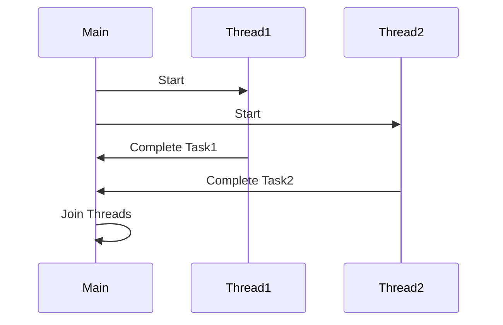

## 19.4 Concurrent Execution

In the realm of modern software development, concurrent execution is a critical concept that allows us to harness the full potential of multicore processors. By executing multiple threads or processes simultaneously, we can significantly enhance the performance and responsiveness of our applications. In this section, we will delve into the principles of concurrent execution in C++, exploring how to effectively leverage multicore processors while avoiding common pitfalls such as contention and synchronization overhead.

### Understanding Concurrent Execution

Concurrent execution involves the simultaneous execution of multiple threads or processes. In C++, this is typically achieved through multithreading, where multiple threads of execution run within the same program. Each thread can perform a different task, allowing for parallelism and improved performance.

Let's break down some key concepts:

- **Thread**: A thread is the smallest unit of processing that can be scheduled by an operating system. In C++, threads can be created using the `std::thread` class from the C++ Standard Library.

- **Multicore Processor**: A multicore processor is a single computing component with two or more independent processing units called cores. Each core can execute threads independently, allowing for true parallel execution.

- **Concurrency vs. Parallelism**: Concurrency refers to the ability of a system to handle multiple tasks at once, while parallelism involves the simultaneous execution of multiple tasks. In a multicore environment, parallelism is achieved by running threads on separate cores.

### Leveraging Multicore Processors

To fully utilize multicore processors, we must design our applications to take advantage of parallel execution. This involves dividing tasks into smaller, independent units that can be executed concurrently. Here are some strategies to achieve this:

#### Task Decomposition

Task decomposition involves breaking down a large task into smaller, manageable subtasks that can be executed concurrently. This is often the first step in designing a concurrent application.

**Example**: Consider a matrix multiplication task. Instead of multiplying the entire matrices in a single thread, we can divide the matrices into smaller blocks and multiply them in parallel.

```cpp
#include <iostream>
#include <vector>
#include <thread>

// Function to multiply a block of the matrix
void multiplyBlock(const std::vector<std::vector<int>>& A,
                   const std::vector<std::vector<int>>& B,
                   std::vector<std::vector<int>>& C,
                   int startRow, int endRow) {
    int N = A.size();
    for (int i = startRow; i < endRow; ++i) {
        for (int j = 0; j < N; ++j) {
            C[i][j] = 0;
            for (int k = 0; k < N; ++k) {
                C[i][j] += A[i][k] * B[k][j];
            }
        }
    }
}

int main() {
    const int N = 4;
    std::vector<std::vector<int>> A(N, std::vector<int>(N, 1));
    std::vector<std::vector<int>> B(N, std::vector<int>(N, 2));
    std::vector<std::vector<int>> C(N, std::vector<int>(N, 0));

    std::thread t1(multiplyBlock, std::cref(A), std::cref(B), std::ref(C), 0, N / 2);
    std::thread t2(multiplyBlock, std::cref(A), std::cref(B), std::ref(C), N / 2, N);

    t1.join();
    t2.join();

    for (const auto& row : C) {
        for (int val : row) {
            std::cout << val << " ";
        }
        std::cout << std::endl;
    }

    return 0;
}
```

In this example, we divide the matrix multiplication task into two subtasks, each handled by a separate thread. This allows us to utilize multiple cores for parallel execution.

#### Data Parallelism

Data parallelism involves distributing data across multiple threads, with each thread performing the same operation on different data elements. This is particularly useful for tasks that involve large datasets.

**Example**: Applying a transformation to each element of a large array.

```cpp
#include <iostream>
#include <vector>
#include <thread>
#include <algorithm>

void transformRange(std::vector<int>& data, int start, int end) {
    std::transform(data.begin() + start, data.begin() + end, data.begin() + start, [](int x) { return x * 2; });
}

int main() {
    const int N = 1000;
    std::vector<int> data(N, 1);

    std::thread t1(transformRange, std::ref(data), 0, N / 2);
    std::thread t2(transformRange, std::ref(data), N / 2, N);

    t1.join();
    t2.join();

    for (int i = 0; i < 10; ++i) {
        std::cout << data[i] << " ";
    }
    std::cout << std::endl;

    return 0;
}
```

Here, we use two threads to apply a transformation to different halves of the array, effectively doubling each element in parallel.

### Avoiding Contention and Synchronization Overhead

While concurrent execution can significantly improve performance, it also introduces challenges such as contention and synchronization overhead. Contention occurs when multiple threads compete for the same resource, leading to performance bottlenecks. Synchronization overhead arises from the need to coordinate access to shared resources.

#### Minimizing Contention

To minimize contention, we should aim to reduce the number of shared resources and ensure that threads operate on independent data as much as possible.

- **Use Local Variables**: Whenever possible, use local variables within threads to avoid sharing state.

- **Partition Data**: Divide data into independent partitions that can be processed concurrently without interference.

- **Avoid Global State**: Minimize the use of global variables and shared state, as these can lead to contention.

#### Efficient Synchronization

When synchronization is necessary, we should use efficient mechanisms to coordinate access to shared resources.

- **Mutexes and Locks**: Use `std::mutex` and `std::lock_guard` to protect critical sections. However, be mindful of lock contention and avoid holding locks for extended periods.

- **Atomic Operations**: Use `std::atomic` for simple operations that require synchronization. Atomic operations are lock-free and can be more efficient than mutexes for certain tasks.

- **Condition Variables**: Use `std::condition_variable` to coordinate threads waiting for specific conditions. This is useful for implementing producer-consumer patterns.

**Example**: Using a mutex to protect a shared resource.

```cpp
#include <iostream>
#include <thread>
#include <mutex>

int sharedCounter = 0;
std::mutex counterMutex;

void incrementCounter() {
    for (int i = 0; i < 1000; ++i) {
        std::lock_guard<std::mutex> lock(counterMutex);
        ++sharedCounter;
    }
}

int main() {
    std::thread t1(incrementCounter);
    std::thread t2(incrementCounter);

    t1.join();
    t2.join();

    std::cout << "Final counter value: " << sharedCounter << std::endl;

    return 0;
}
```

In this example, we use a mutex to protect access to a shared counter, ensuring that increments are performed safely by multiple threads.

### Advanced Techniques for Concurrent Execution

Beyond basic multithreading, there are advanced techniques and patterns that can further optimize concurrent execution in C++.

#### Thread Pools

A thread pool is a collection of pre-initialized threads that can be reused to execute tasks. This reduces the overhead of creating and destroying threads for each task.

**Example**: Implementing a simple thread pool.

```cpp
#include <iostream>
#include <vector>
#include <thread>
#include <queue>
#include <functional>
#include <condition_variable>
#include <atomic>

class ThreadPool {
public:
    ThreadPool(size_t numThreads);
    ~ThreadPool();
    void enqueueTask(std::function<void()> task);

private:
    std::vector<std::thread> workers;
    std::queue<std::function<void()>> tasks;
    std::mutex queueMutex;
    std::condition_variable condition;
    std::atomic<bool> stop;

    void workerThread();
};

ThreadPool::ThreadPool(size_t numThreads) : stop(false) {
    for (size_t i = 0; i < numThreads; ++i) {
        workers.emplace_back(&ThreadPool::workerThread, this);
    }
}

ThreadPool::~ThreadPool() {
    stop = true;
    condition.notify_all();
    for (std::thread& worker : workers) {
        worker.join();
    }
}

void ThreadPool::enqueueTask(std::function<void()> task) {
    {
        std::lock_guard<std::mutex> lock(queueMutex);
        tasks.push(task);
    }
    condition.notify_one();
}

void ThreadPool::workerThread() {
    while (!stop) {
        std::function<void()> task;
        {
            std::unique_lock<std::mutex> lock(queueMutex);
            condition.wait(lock, [this] { return stop || !tasks.empty(); });
            if (stop && tasks.empty()) return;
            task = std::move(tasks.front());
            tasks.pop();
        }
        task();
    }
}

int main() {
    ThreadPool pool(4);

    for (int i = 0; i < 10; ++i) {
        pool.enqueueTask([i] {
            std::cout << "Task " << i << " is being processed." << std::endl;
        });
    }

    // Allow some time for tasks to complete
    std::this_thread::sleep_for(std::chrono::seconds(1));

    return 0;
}
```

This example demonstrates a simple thread pool implementation, where tasks are enqueued and processed by a fixed number of worker threads.

#### Lock-Free Programming

Lock-free programming involves designing data structures and algorithms that do not require locks for synchronization. This can reduce contention and improve performance in highly concurrent environments.

- **Atomic Operations**: Use atomic operations to implement lock-free data structures. These operations are guaranteed to be atomic and can be used to safely update shared data without locks.

- **Compare-and-Swap (CAS)**: The CAS operation is a common primitive in lock-free programming. It allows a thread to update a value only if it matches an expected value, ensuring safe concurrent updates.

**Example**: Implementing a lock-free stack using atomic operations.

```cpp
#include <iostream>
#include <atomic>

template <typename T>
class LockFreeStack {
public:
    void push(T value);
    bool pop(T& result);

private:
    struct Node {
        T value;
        Node* next;
    };

    std::atomic<Node*> head{nullptr};
};

template <typename T>
void LockFreeStack<T>::push(T value) {
    Node* newNode = new Node{value, nullptr};
    newNode->next = head.load();
    while (!head.compare_exchange_weak(newNode->next, newNode));
}

template <typename T>
bool LockFreeStack<T>::pop(T& result) {
    Node* oldHead = head.load();
    while (oldHead && !head.compare_exchange_weak(oldHead, oldHead->next));
    if (oldHead) {
        result = oldHead->value;
        delete oldHead;
        return true;
    }
    return false;
}

int main() {
    LockFreeStack<int> stack;
    stack.push(1);
    stack.push(2);

    int value;
    if (stack.pop(value)) {
        std::cout << "Popped: " << value << std::endl;
    }

    return 0;
}
```

In this example, we implement a lock-free stack using atomic operations and the CAS primitive to ensure safe concurrent access.

### Visualizing Thread Execution

To better understand how threads execute concurrently, let's visualize the process using a sequence diagram.



**Diagram Description**: This sequence diagram illustrates the concurrent execution of two threads (`Thread1` and `Thread2`) initiated by the `Main` function. Each thread performs its task independently and reports completion back to the `Main` function, which then joins the threads.

### Try It Yourself

Now that we've explored the basics of concurrent execution in C++, let's experiment with some code. Try modifying the examples provided to see how changes affect performance and behavior.

- **Experiment with Thread Count**: In the thread pool example, try increasing or decreasing the number of threads and observe the impact on task processing.

- **Implement Additional Synchronization**: Add more complex synchronization mechanisms, such as condition variables, to coordinate thread execution.

- **Create a Lock-Free Queue**: Using the lock-free stack example as a reference, implement a lock-free queue and test its performance.

### Knowledge Check

To reinforce your understanding of concurrent execution, consider the following questions:

- What is the difference between concurrency and parallelism?
- How can task decomposition improve the performance of a concurrent application?
- What are some strategies for minimizing contention in multithreaded applications?
- How does a thread pool improve the efficiency of task execution?
- What is the role of atomic operations in lock-free programming?

### Conclusion

Concurrent execution is a powerful tool for optimizing the performance of C++ applications on multicore processors. By understanding the principles of multithreading, task decomposition, and synchronization, we can design efficient and responsive software. As you continue to explore concurrent execution, remember to experiment with different techniques and patterns to find the best solutions for your specific use cases.

## Quiz Time!



### What is the primary benefit of using a thread pool?

- [x] Reduces the overhead of creating and destroying threads
- [ ] Increases the number of available threads
- [ ] Simplifies the code structure
- [ ] Eliminates the need for synchronization

> **Explanation:** A thread pool reduces the overhead of creating and destroying threads by reusing a fixed number of threads to execute tasks.

### Which of the following is a common primitive used in lock-free programming?

- [ ] Mutex
- [x] Compare-and-Swap (CAS)
- [ ] Condition Variable
- [ ] Semaphore

> **Explanation:** Compare-and-Swap (CAS) is a common primitive used in lock-free programming to ensure safe concurrent updates without locks.

### How can you minimize contention in a multithreaded application?

- [ ] Use more global variables
- [x] Partition data into independent sections
- [ ] Increase the number of threads
- [ ] Use more locks

> **Explanation:** Partitioning data into independent sections allows threads to operate without interference, minimizing contention.

### What is the role of `std::atomic` in concurrent programming?

- [x] Provides lock-free synchronization for simple operations
- [ ] Creates new threads
- [ ] Manages thread lifecycles
- [ ] Coordinates thread communication

> **Explanation:** `std::atomic` provides lock-free synchronization for simple operations, ensuring safe concurrent access to shared data.

### Which of the following is an advantage of lock-free programming?

- [x] Reduces contention
- [ ] Requires more memory
- [ ] Increases synchronization overhead
- [ ] Simplifies code structure

> **Explanation:** Lock-free programming reduces contention by avoiding locks, leading to improved performance in highly concurrent environments.

### What is a common use case for condition variables?

- [ ] Creating new threads
- [ ] Protecting shared resources
- [x] Coordinating threads waiting for specific conditions
- [ ] Managing thread lifecycles

> **Explanation:** Condition variables are used to coordinate threads waiting for specific conditions, such as in producer-consumer patterns.

### How does task decomposition improve concurrent execution?

- [ ] Increases the number of threads
- [x] Breaks down tasks into smaller, manageable subtasks
- [ ] Reduces memory usage
- [ ] Simplifies code structure

> **Explanation:** Task decomposition breaks down tasks into smaller, manageable subtasks that can be executed concurrently, improving performance.

### What is the primary challenge of concurrent execution?

- [ ] Creating new threads
- [ ] Managing memory
- [x] Avoiding contention and synchronization overhead
- [ ] Simplifying code structure

> **Explanation:** The primary challenge of concurrent execution is avoiding contention and synchronization overhead, which can lead to performance bottlenecks.

### True or False: Parallelism and concurrency are the same.

- [ ] True
- [x] False

> **Explanation:** Parallelism involves the simultaneous execution of multiple tasks, while concurrency refers to the ability to handle multiple tasks at once, not necessarily simultaneously.

### Which C++ feature is used to protect critical sections in multithreaded applications?

- [x] `std::mutex`
- [ ] `std::thread`
- [ ] `std::condition_variable`
- [ ] `std::atomic`

> **Explanation:** `std::mutex` is used to protect critical sections in multithreaded applications, ensuring that only one thread can access a shared resource at a time.



Remember, this is just the beginning. As you progress, you'll build more complex and interactive applications. Keep experimenting, stay curious, and enjoy the journey!
