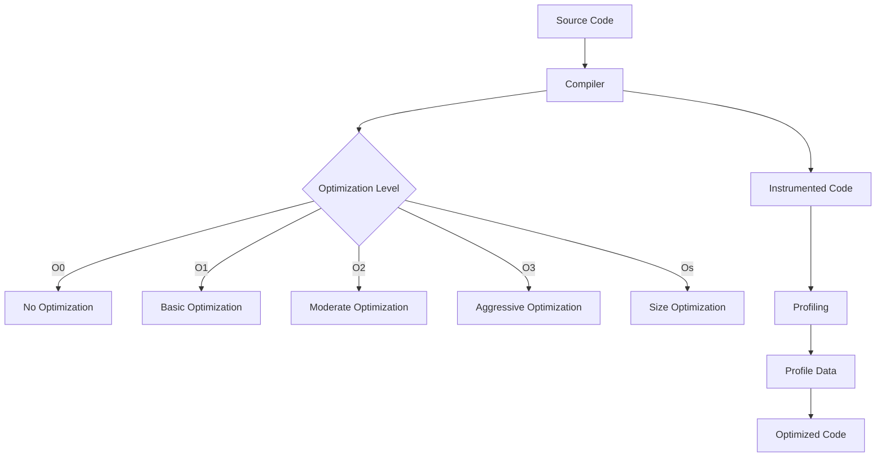

## 19.5 Compiler Optimizations

In the realm of C++ programming, compiler optimizations play a pivotal role in enhancing the performance and efficiency of applications. By leveraging compiler optimizations, developers can ensure that their code runs faster, consumes less memory, and utilizes system resources more effectively. This section delves into the intricacies of compiler optimizations, focusing on understanding compiler flags and profile-guided optimization (PGO).

### Understanding Compiler Flags

Compiler flags are options that you can pass to the compiler to control the optimization level and behavior of the compilation process. These flags can significantly impact the performance of the generated binary. Let's explore some common compiler flags and their implications.

#### Optimization Levels

Most C++ compilers, such as GCC and Clang, provide different levels of optimization, which can be specified using flags like `-O0`, `-O1`, `-O2`, `-O3`, and `-Os`. Each level represents a trade-off between compilation time and runtime performance.

- **`-O0`: No Optimization**
  - This is the default optimization level. The compiler focuses on reducing compilation time and debugging ease, generating unoptimized code.
  - Use this level during development and debugging to ensure that the code structure remains unchanged.

- **`-O1`: Basic Optimization**
  - Enables simple optimizations that do not significantly increase compilation time.
  - Suitable for quick performance improvements without extensive compilation overhead.

- **`-O2`: Moderate Optimization**
  - Activates a wide range of optimizations, including inlining, loop unrolling, and dead code elimination.
  - Balances between compilation time and runtime performance, making it a popular choice for production builds.

- **`-O3`: Aggressive Optimization**
  - Includes all optimizations from `-O2` and adds more aggressive techniques like function cloning and vectorization.
  - Can lead to significant performance gains but may increase binary size and compilation time.

- **`-Os`: Optimize for Size**
  - Similar to `-O2` but focuses on reducing the binary size.
  - Ideal for embedded systems and applications with memory constraints.

#### Specific Optimization Flags

In addition to general optimization levels, compilers offer specific flags to fine-tune the optimization process:

- **`-funroll-loops`**: Unrolls loops to reduce the overhead of loop control, potentially improving performance in loop-intensive code.
- **`-finline-functions`**: Inlines small functions to reduce function call overhead.
- **`-fomit-frame-pointer`**: Omits the frame pointer for functions that do not require it, freeing up a register for other uses.
- **`-ffast-math`**: Allows the compiler to make aggressive assumptions about floating-point arithmetic, potentially improving performance but at the risk of reduced numerical accuracy.

### Profile-Guided Optimization (PGO)

Profile-guided optimization is an advanced optimization technique that uses runtime profiling data to guide the compiler in optimizing the code. PGO involves three main steps: instrumentation, profiling, and optimization.

#### Instrumentation

In the instrumentation phase, the compiler generates an instrumented version of the program. This version includes additional code to collect profiling data during execution.

```cpp
// Example of instrumented code
void compute(int* data, size_t size) {
    for (size_t i = 0; i < size; ++i) {
        data[i] *= 2; // Instrumentation collects data on loop execution
    }
}
```

#### Profiling

The instrumented program is executed with typical input data to gather profiling information. This data provides insights into which parts of the code are most frequently executed.

```bash
./instrumented_program input_data.txt
```

#### Optimization

Using the collected profiling data, the compiler performs optimizations tailored to the program's actual runtime behavior. This can lead to significant performance improvements.

```bash
g++ -O2 -fprofile-use=profile_data.prof main.cpp -o optimized_program
```

### Benefits of Profile-Guided Optimization

- **Improved Performance**: PGO can lead to substantial performance gains by optimizing hot paths and frequently executed code.
- **Better Inlining Decisions**: The compiler can make more informed decisions about function inlining based on runtime data.
- **Enhanced Branch Prediction**: PGO provides insights into branch behavior, allowing the compiler to optimize branch prediction.

### Visualizing Compiler Optimization Process

To better understand the compiler optimization process, let's visualize the flow of optimization using a Mermaid.js flowchart.



### Key Considerations for Compiler Optimizations

- **Trade-offs**: Higher optimization levels can increase compilation time and binary size. Evaluate the trade-offs based on your application's requirements.
- **Debugging**: Optimized code may be harder to debug due to changes in code structure and variable lifetimes.
- **Platform-Specific Flags**: Different compilers and platforms may have unique flags. Consult the compiler documentation for platform-specific optimizations.

### Code Example: Compiler Optimization in Action

Let's explore a practical example demonstrating the impact of compiler optimizations on performance.

```cpp
#include <iostream>
#include <vector>
#include <chrono>

// Function to perform a simple computation
void compute(std::vector<int>& data) {
    for (auto& val : data) {
        val *= 2; // Simple computation
    }
}

int main() {
    const size_t dataSize = 1000000;
    std::vector<int> data(dataSize, 1);

    auto start = std::chrono::high_resolution_clock::now();
    compute(data);
    auto end = std::chrono::high_resolution_clock::now();

    std::chrono::duration<double> duration = end - start;
    std::cout << "Computation time: " << duration.count() << " seconds" << std::endl;

    return 0;
}
```

#### Experimenting with Compiler Flags

Try compiling the above code with different optimization levels and observe the impact on performance.

```bash
g++ -O0 main.cpp -o program_O0

g++ -O2 main.cpp -o program_O2

g++ -O3 main.cpp -o program_O3
```

### Try It Yourself

Experiment with the code example by modifying the computation function or changing the data size. Observe how different compiler flags affect the execution time.

### Further Reading and Resources

- [GCC Optimization Options](https://gcc.gnu.org/onlinedocs/gcc/Optimize-Options.html)
- [Clang Compiler User's Manual](https://clang.llvm.org/docs/UsersManual.html)
- [Profile-Guided Optimization in GCC](https://gcc.gnu.org/wiki/PGO)

### Knowledge Check

- What are the trade-offs between different optimization levels?
- How does profile-guided optimization improve performance?
- Why might optimized code be more challenging to debug?

### Embrace the Journey

Remember, mastering compiler optimizations is an ongoing journey. As you continue to explore and experiment, you'll gain deeper insights into how to harness the full potential of your C++ applications. Keep pushing the boundaries, stay curious, and enjoy the process of optimizing your code for peak performance!

## Quiz Time!



### What is the default optimization level in most C++ compilers?

- [x] `-O0`
- [ ] `-O1`
- [ ] `-O2`
- [ ] `-O3`

> **Explanation:** `-O0` is the default optimization level, focusing on reducing compilation time and ease of debugging.

### Which optimization level is known for aggressive optimizations?

- [ ] `-O0`
- [ ] `-O1`
- [ ] `-O2`
- [x] `-O3`

> **Explanation:** `-O3` includes all optimizations from `-O2` and adds more aggressive techniques like function cloning and vectorization.

### What does the `-Os` flag optimize for?

- [ ] Speed
- [x] Size
- [ ] Debugging
- [ ] Security

> **Explanation:** The `-Os` flag optimizes for size, reducing the binary size.

### What is the first step in Profile-Guided Optimization (PGO)?

- [x] Instrumentation
- [ ] Profiling
- [ ] Optimization
- [ ] Compilation

> **Explanation:** Instrumentation is the first step, where the compiler generates an instrumented version of the program to collect profiling data.

### What is the purpose of the `-ffast-math` flag?

- [x] Allows aggressive assumptions about floating-point arithmetic
- [ ] Enables loop unrolling
- [ ] Inlines small functions
- [ ] Omits the frame pointer

> **Explanation:** `-ffast-math` allows the compiler to make aggressive assumptions about floating-point arithmetic, potentially improving performance.

### Which flag would you use to unroll loops?

- [ ] `-finline-functions`
- [x] `-funroll-loops`
- [ ] `-fomit-frame-pointer`
- [ ] `-ffast-math`

> **Explanation:** `-funroll-loops` unrolls loops to reduce the overhead of loop control.

### What does PGO use to guide optimizations?

- [ ] Source code analysis
- [x] Runtime profiling data
- [ ] Compiler heuristics
- [ ] User input

> **Explanation:** PGO uses runtime profiling data to guide the compiler in optimizing the code.

### Which optimization level is often used for production builds?

- [ ] `-O0`
- [ ] `-O1`
- [x] `-O2`
- [ ] `-O3`

> **Explanation:** `-O2` is commonly used for production builds as it balances between compilation time and runtime performance.

### True or False: Optimized code is always easier to debug.

- [ ] True
- [x] False

> **Explanation:** Optimized code may be harder to debug due to changes in code structure and variable lifetimes.

### Which of the following is a benefit of PGO?

- [x] Improved performance
- [x] Better inlining decisions
- [x] Enhanced branch prediction
- [ ] Increased compilation time

> **Explanation:** PGO improves performance, makes better inlining decisions, and enhances branch prediction based on runtime data.


