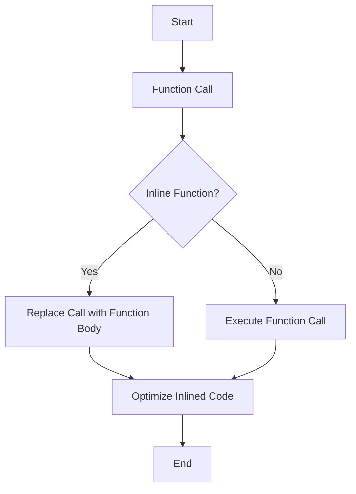

## 19.6 Inlining and Code Bloat

In the realm of C++ programming, performance optimization is a critical aspect that can significantly impact the efficiency and responsiveness of applications. One of the techniques employed to enhance performance is function inlining. However, inlining is a double-edged sword; while it can reduce function call overhead and improve execution speed, it can also lead to code bloat, which may negatively affect the overall application size and performance. In this section, we will delve into the intricacies of inlining in C++, explore its benefits and drawbacks, and provide guidance on when and how to use inlining effectively.

### Understanding Function Inlining

**Function inlining** is a compiler optimization technique where the compiler replaces a function call with the actual code of the function. This can eliminate the overhead associated with function calls, such as stack frame setup and teardown, parameter passing, and return value handling. By inlining a function, the compiler can also enable further optimizations, such as constant folding and loop unrolling, which can lead to more efficient code execution.

#### How Inlining Works

When a function is inlined, the compiler inserts the function's body directly into the caller's code. This process is illustrated in the following example:

```cpp
inline int add(int a, int b) {
    return a + b;
}

int main() {
    int result = add(5, 3); // The call to add() is replaced with the expression (5 + 3)
    return 0;
}
```

In this example, the `add` function is declared as `inline`, suggesting to the compiler that it should attempt to inline the function. The call to `add(5, 3)` is replaced with the expression `(5 + 3)`, eliminating the function call overhead.

#### Benefits of Inlining

1. **Reduced Function Call Overhead**: Inlining removes the need for stack frame management, parameter passing, and return value handling, which can reduce execution time.

2. **Enhanced Optimization Opportunities**: By exposing the function's body to the caller's context, the compiler can perform additional optimizations, such as constant propagation and loop unrolling.

3. **Improved Instruction Cache Utilization**: Inlining can improve instruction cache locality by reducing the number of function calls and increasing the density of frequently executed code.

### The Downside: Code Bloat

While inlining can improve performance, it can also lead to **code bloat**, which is the increase in the size of the compiled binary due to the duplication of function code. This can have several negative consequences:

1. **Increased Binary Size**: Duplicating function code across multiple call sites can significantly increase the size of the compiled binary, leading to longer load times and increased memory usage.

2. **Decreased Instruction Cache Efficiency**: Larger binaries can lead to more cache misses, as the instruction cache may not be able to hold as much of the frequently executed code.

3. **Longer Compilation Times**: Inlining can increase the complexity of the code, leading to longer compilation times as the compiler performs additional optimizations.

### Deciding When to Inline Functions

Deciding whether to inline a function is a critical decision that requires balancing the potential performance gains against the risk of code bloat. Here are some guidelines to help make this decision:

#### When to Consider Inlining

1. **Small, Frequently Called Functions**: Functions that are small and called frequently can benefit the most from inlining, as the reduction in call overhead can outweigh the increase in code size.

2. **Performance-Critical Code**: Inlining can be beneficial in performance-critical sections of code where even small improvements in execution speed are valuable.

3. **Functions with Simple Logic**: Functions with simple logic and few instructions are good candidates for inlining, as they are less likely to contribute significantly to code bloat.

#### When to Avoid Inlining

1. **Large Functions**: Inlining large functions can lead to significant code bloat, as the function's code is duplicated at each call site.

2. **Rarely Called Functions**: Functions that are called infrequently may not benefit from inlining, as the reduction in call overhead is unlikely to impact overall performance.

3. **Recursive Functions**: Inlining recursive functions can lead to excessive code duplication and should generally be avoided.

### Managing Code Size

To manage code size effectively while taking advantage of inlining, consider the following strategies:

#### Use the `inline` Keyword Judiciously

The `inline` keyword is a suggestion to the compiler, not a command. Modern compilers use heuristics to decide whether to inline a function, regardless of the presence of the `inline` keyword. Use the keyword to indicate that a function is a good candidate for inlining, but rely on the compiler's judgment.

#### Profile and Measure Performance

Use profiling tools to measure the impact of inlining on performance and code size. Focus on optimizing the most performance-critical sections of code, and avoid premature optimization.

#### Use Compiler Flags

Most compilers provide flags to control inlining behavior. For example, the `-finline-functions` flag in GCC enables function inlining, while the `-fno-inline` flag disables it. Experiment with these flags to find the right balance between performance and code size.

#### Limit Inlining with `inline` and `noinline` Attributes

Use compiler-specific attributes to control inlining behavior. For example, GCC and Clang support the `__attribute__((noinline))` attribute to prevent a function from being inlined:

```cpp
__attribute__((noinline)) void largeFunction() {
    // Function body
}
```

### Code Example: Inlining and Code Bloat

Let's explore a more complex example that demonstrates the impact of inlining on performance and code size:

```cpp
#include <iostream>
#include <chrono>

inline int add(int a, int b) {
    return a + b;
}

int multiply(int a, int b) {
    return a * b;
}

int main() {
    const int iterations = 100000000;
    int result = 0;

    auto start = std::chrono::high_resolution_clock::now();
    for (int i = 0; i < iterations; ++i) {
        result += add(i, i);
    }
    auto end = std::chrono::high_resolution_clock::now();
    std::chrono::duration<double> duration = end - start;
    std::cout << "Time taken with inlining: " << duration.count() << " seconds\n";

    start = std::chrono::high_resolution_clock::now();
    for (int i = 0; i < iterations; ++i) {
        result += multiply(i, i);
    }
    end = std::chrono::high_resolution_clock::now();
    duration = end - start;
    std::cout << "Time taken without inlining: " << duration.count() << " seconds\n";

    return result;
}
```

In this example, we compare the performance of an inlined `add` function with a non-inlined `multiply` function over a large number of iterations. By measuring the execution time, we can observe the impact of inlining on performance.

### Visualizing Inlining and Code Bloat

To better understand the impact of inlining on code size and performance, let's visualize the process using a flowchart:



**Figure 1: The Inlining Process Flowchart**

This flowchart illustrates the decision-making process for inlining a function. If the function is inlined, the call is replaced with the function body, and further optimizations are applied. If not, the function call is executed as usual.

### Try It Yourself

Experiment with the provided code example by modifying the functions and observing the impact on performance. Try the following:

1. **Inline the `multiply` Function**: Add the `inline` keyword to the `multiply` function and compare the execution times.

2. **Increase the Function Complexity**: Add more logic to the `add` and `multiply` functions and observe how it affects performance and code size.

3. **Use Compiler Flags**: Experiment with different compiler flags to control inlining behavior and measure their impact on performance.

### Knowledge Check

To reinforce your understanding of inlining and code bloat, consider the following questions:

- What are the benefits of function inlining in C++?
- How can inlining lead to code bloat?
- When should you avoid inlining a function?
- How can you manage code size while using inlining?

### Conclusion

Inlining is a powerful optimization technique in C++ that can enhance performance by reducing function call overhead and enabling further optimizations. However, it also carries the risk of code bloat, which can negatively impact application size and performance. By understanding the trade-offs and using inlining judiciously, you can optimize your C++ applications effectively.

Remember, this is just the beginning. As you progress, you'll build more complex and efficient applications. Keep experimenting, stay curious, and enjoy the journey!

## Quiz Time!



### What is the primary benefit of function inlining?

- [x] Reducing function call overhead
- [ ] Increasing code readability
- [ ] Improving memory usage
- [ ] Simplifying code structure

> **Explanation:** Function inlining reduces the overhead associated with function calls, such as stack frame setup and parameter passing, which can improve performance.

### What is a potential downside of excessive inlining?

- [ ] Improved performance
- [ ] Better code readability
- [x] Code bloat
- [ ] Enhanced modularity

> **Explanation:** Excessive inlining can lead to code bloat, which is the increase in binary size due to duplicated function code across multiple call sites.

### When should you consider inlining a function?

- [x] When the function is small and frequently called
- [ ] When the function is large and complex
- [ ] When the function is rarely used
- [ ] When the function is recursive

> **Explanation:** Small, frequently called functions are good candidates for inlining as the reduction in call overhead can outweigh the increase in code size.

### What compiler attribute can be used to prevent a function from being inlined?

- [ ] `__attribute__((inline))`
- [x] `__attribute__((noinline))`
- [ ] `__attribute__((always_inline))`
- [ ] `__attribute__((optimize))`

> **Explanation:** The `__attribute__((noinline))` attribute can be used to prevent a function from being inlined by the compiler.

### How can inlining affect instruction cache efficiency?

- [x] It can decrease efficiency due to larger binary size
- [ ] It always improves efficiency
- [ ] It has no impact on cache efficiency
- [ ] It reduces cache misses

> **Explanation:** Inlining can lead to larger binaries, which may result in more cache misses as the instruction cache may not hold as much frequently executed code.

### What is a common compiler flag to enable function inlining in GCC?

- [x] `-finline-functions`
- [ ] `-fno-inline`
- [ ] `-O0`
- [ ] `-Wall`

> **Explanation:** The `-finline-functions` flag in GCC enables function inlining, allowing the compiler to inline functions based on its heuristics.

### What is the effect of inlining on compilation times?

- [ ] It always reduces compilation times
- [x] It can increase compilation times
- [ ] It has no effect on compilation times
- [ ] It simplifies the compilation process

> **Explanation:** Inlining can increase compilation times as the compiler performs additional optimizations on the inlined code.

### Which of the following is NOT a benefit of inlining?

- [ ] Reduced function call overhead
- [ ] Enhanced optimization opportunities
- [x] Increased binary size
- [ ] Improved instruction cache utilization

> **Explanation:** Increased binary size is a potential downside of inlining, not a benefit.

### True or False: The `inline` keyword guarantees that a function will be inlined.

- [ ] True
- [x] False

> **Explanation:** The `inline` keyword is a suggestion to the compiler, not a command. The compiler may choose not to inline a function based on its heuristics.

### What should you do before deciding to inline a function?

- [x] Profile and measure performance
- [ ] Always inline functions for better performance
- [ ] Avoid using the `inline` keyword
- [ ] Only inline recursive functions

> **Explanation:** Profiling and measuring performance helps determine if inlining a function will provide a significant benefit, avoiding premature optimization.


