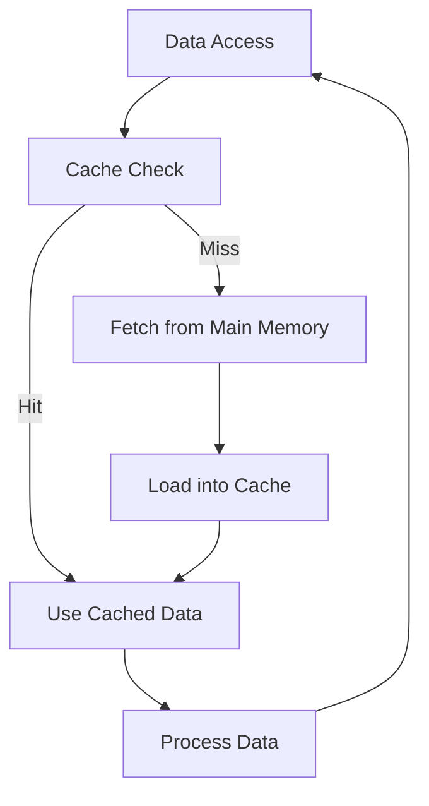

## 19.7 Cache Optimization Techniques

In the world of high-performance computing, the efficiency of your application can often hinge on how well it utilizes the CPU cache. Cache optimization is a critical aspect of performance tuning, especially in C++ applications where low-level memory management is a common requirement. In this section, we will delve into cache optimization techniques, focusing on data locality, minimizing cache misses, and avoiding false sharing. 

### Understanding CPU Cache

Before we dive into optimization techniques, let's briefly review what a CPU cache is and why it matters. The CPU cache is a smaller, faster memory located closer to the CPU cores than the main memory (RAM). It stores copies of frequently accessed data to reduce the time it takes to retrieve this data from the main memory. 

Caches are organized in levels (L1, L2, L3), with L1 being the smallest and fastest, and L3 being larger but slower. The effectiveness of a cache depends on its ability to predict which data will be needed next, a concept known as cache locality.

### Data Locality

Data locality refers to the use of data elements within relatively close storage locations. There are two types of data locality:

1. **Temporal Locality**: If a memory location is accessed, it is likely to be accessed again soon.
2. **Spatial Locality**: If a memory location is accessed, nearby memory locations are likely to be accessed soon.

Enhancing data locality can significantly improve cache performance by reducing cache misses.

#### Improving Temporal Locality

Temporal locality can be improved by ensuring that frequently accessed data is kept in cache as long as possible. This involves:

- **Loop Unrolling**: This technique involves replicating the loop body multiple times to reduce the overhead of loop control and increase the temporal locality of the data being processed.

```cpp
// Original loop
for (int i = 0; i < n; ++i) {
    process(data[i]);
}

// Unrolled loop
for (int i = 0; i < n; i += 4) {
    process(data[i]);
    process(data[i + 1]);
    process(data[i + 2]);
    process(data[i + 3]);
}
```

- **Caching Results**: Store the results of expensive computations that are likely to be reused.

```cpp
// Expensive computation
int result = expensiveComputation(x);

// Use cached result
useResult(result);
```

#### Enhancing Spatial Locality

Spatial locality can be improved by organizing data structures so that data elements that are accessed together are stored together in memory.

- **Array of Structures vs. Structure of Arrays**: Choose the data layout that best suits your access pattern.

```cpp
// Structure of Arrays
struct Point {
    float x, y, z;
};

Point points[1000];

// Array of Structures
struct Points {
    float x[1000], y[1000], z[1000];
};

Points points;
```

In scenarios where you frequently access all `x`, `y`, and `z` of a single point, a structure of arrays may provide better spatial locality.

- **Contiguous Memory Allocation**: Use contiguous memory allocation for data structures to improve spatial locality.

```cpp
std::vector<int> data(n); // Contiguous memory allocation
```

### Minimizing Cache Misses

A cache miss occurs when the data requested by the CPU is not found in the cache, leading to a longer fetch time from the main memory. Minimizing cache misses is crucial for performance optimization.

#### Types of Cache Misses

1. **Compulsory Misses**: Occur when data is accessed for the first time.
2. **Capacity Misses**: Occur when the cache cannot contain all the data needed during execution.
3. **Conflict Misses**: Occur when multiple data objects compete for the same cache line.

#### Strategies to Minimize Cache Misses

- **Blocking (Tiling)**: Divide data into blocks that fit into the cache to reduce capacity misses.

```cpp
// Blocking example for matrix multiplication
for (int i = 0; i < n; i += blockSize) {
    for (int j = 0; j < n; j += blockSize) {
        for (int k = 0; k < n; k += blockSize) {
            // Process block
            for (int ii = i; ii < i + blockSize; ++ii) {
                for (int jj = j; jj < j + blockSize; ++jj) {
                    for (int kk = k; kk < k + blockSize; ++kk) {
                        C[ii][jj] += A[ii][kk] * B[kk][jj];
                    }
                }
            }
        }
    }
}
```

- **Prefetching**: Use compiler or hardware prefetching to load data into cache before it is needed.

```cpp
// Example of prefetching
for (int i = 0; i < n; ++i) {
    __builtin_prefetch(&data[i + 1], 0, 1); // Prefetch next element
    process(data[i]);
}
```

- **Data Alignment**: Align data structures to cache line boundaries to reduce conflict misses.

```cpp
struct alignas(64) AlignedData {
    int data[16];
};
```

### Avoiding False Sharing

False sharing occurs when multiple threads modify variables that reside on the same cache line, leading to unnecessary cache coherence traffic. This can significantly degrade performance in multithreaded applications.

#### Strategies to Avoid False Sharing

- **Padding**: Add padding to data structures to ensure that variables modified by different threads do not share the same cache line.

```cpp
struct PaddedData {
    int data;
    char padding[64 - sizeof(int)]; // Assuming 64-byte cache line
};
```

- **Thread-Local Storage**: Use thread-local storage to ensure that each thread has its own copy of the data.

```cpp
thread_local int localData;
```

- **Data Partitioning**: Partition data so that each thread works on a separate portion, minimizing shared data.

```cpp
// Partition data among threads
#pragma omp parallel for
for (int i = 0; i < n; ++i) {
    process(data[i]);
}
```

### Visualizing Cache Optimization

To better understand how cache optimization techniques work, let's visualize the process using a diagram.



**Diagram Description**: This flowchart illustrates the process of data access in a CPU cache. When data is accessed, the cache is checked. If the data is found (cache hit), it is used directly. If not (cache miss), it is fetched from the main memory, loaded into the cache, and then used.

### Try It Yourself

To solidify your understanding of cache optimization techniques, try modifying the code examples provided. Experiment with different block sizes in the blocking example, or try adding and removing padding to observe the effects on performance. Use profiling tools to measure the impact of your changes.

### References and Further Reading

- [Intel's Optimization Reference Manual](https://www.intel.com/content/www/us/en/developer/articles/technical/intel-sdm.html)
- [AMD Optimization Guide](https://developer.amd.com/resources/developer-guides-manuals/)
- [Cache Optimization Techniques](https://en.wikipedia.org/wiki/Cache_optimization)

### Knowledge Check

1. What is the primary purpose of a CPU cache?
2. Explain the difference between temporal and spatial locality.
3. Describe a scenario where loop unrolling would be beneficial.
4. What is a compulsory cache miss?
5. How can data alignment help reduce cache misses?
6. What is false sharing, and how can it be avoided?
7. Why is thread-local storage useful in avoiding false sharing?
8. How does blocking help minimize cache misses?
9. What is the role of prefetching in cache optimization?
10. Explain the concept of data partitioning in multithreaded applications.

### Embrace the Journey

Remember, mastering cache optimization techniques is a journey. As you continue to explore and experiment with these techniques, you'll gain a deeper understanding of how to write efficient, high-performance C++ applications. Keep experimenting, stay curious, and enjoy the journey!

## Quiz Time!



### What is the primary purpose of a CPU cache?

- [x] To store frequently accessed data closer to the CPU
- [ ] To increase the size of the main memory
- [ ] To replace the need for RAM
- [ ] To execute instructions faster

> **Explanation:** The CPU cache stores frequently accessed data closer to the CPU to reduce access time compared to fetching data from the main memory.

### Which type of data locality refers to the likelihood of accessing nearby memory locations?

- [ ] Temporal Locality
- [x] Spatial Locality
- [ ] Sequential Locality
- [ ] Random Locality

> **Explanation:** Spatial locality refers to the likelihood of accessing nearby memory locations when a particular memory location is accessed.

### What is a compulsory cache miss?

- [x] A miss that occurs when data is accessed for the first time
- [ ] A miss due to cache line conflicts
- [ ] A miss caused by cache capacity limitations
- [ ] A miss that happens when data is evicted

> **Explanation:** A compulsory cache miss occurs when data is accessed for the first time and is not present in the cache.

### How can false sharing be avoided in multithreaded applications?

- [x] By adding padding to data structures
- [ ] By using smaller cache lines
- [ ] By increasing the number of threads
- [ ] By reducing the size of the data

> **Explanation:** Adding padding to data structures ensures that variables modified by different threads do not share the same cache line, thus avoiding false sharing.

### What is the benefit of loop unrolling in cache optimization?

- [x] It increases temporal locality by reducing loop control overhead
- [ ] It decreases the size of the executable
- [ ] It simplifies the code
- [ ] It reduces the number of loops

> **Explanation:** Loop unrolling increases temporal locality by reducing the overhead of loop control and increasing the temporal locality of the data being processed.

### Why is data alignment important in cache optimization?

- [x] It reduces conflict misses by aligning data structures to cache line boundaries
- [ ] It increases the size of the cache
- [ ] It simplifies memory allocation
- [ ] It speeds up data processing

> **Explanation:** Data alignment reduces conflict misses by ensuring that data structures are aligned to cache line boundaries, minimizing cache line conflicts.

### What is the role of prefetching in cache optimization?

- [x] To load data into cache before it is needed
- [ ] To increase the cache size
- [ ] To replace data in the cache
- [ ] To execute instructions faster

> **Explanation:** Prefetching loads data into the cache before it is needed, reducing the likelihood of cache misses when the data is accessed.

### How does blocking (tiling) help minimize cache misses?

- [x] By dividing data into blocks that fit into the cache
- [ ] By increasing the size of the cache
- [ ] By reducing the number of data accesses
- [ ] By simplifying the code

> **Explanation:** Blocking divides data into blocks that fit into the cache, reducing capacity misses by ensuring that the working set fits into the cache.

### What is the advantage of using thread-local storage?

- [x] It ensures each thread has its own copy of the data, avoiding false sharing
- [ ] It increases the size of the cache
- [ ] It simplifies thread management
- [ ] It speeds up data processing

> **Explanation:** Thread-local storage ensures each thread has its own copy of the data, avoiding false sharing by preventing multiple threads from modifying the same cache line.

### True or False: Data partitioning is a technique used to minimize cache misses in single-threaded applications.

- [ ] True
- [x] False

> **Explanation:** Data partitioning is typically used in multithreaded applications to minimize shared data and avoid false sharing, rather than to minimize cache misses in single-threaded applications.


