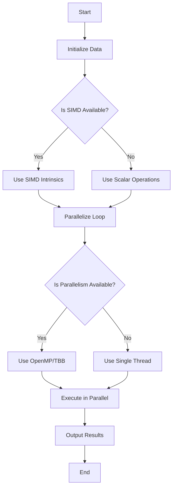

## 19.8 SIMD and Parallel Programming

In the realm of high-performance computing, achieving optimal performance is often a critical requirement. C++ developers have a variety of tools at their disposal to enhance the speed and efficiency of their applications. Among these tools, SIMD (Single Instruction, Multiple Data) and parallel programming stand out as powerful techniques to leverage modern hardware capabilities. In this section, we will delve into the intricacies of SIMD and parallel programming, exploring how they can be utilized in C++ to maximize performance.

### Introduction to SIMD

SIMD, or Single Instruction, Multiple Data, is a parallel computing architecture that allows a single instruction to be executed on multiple data points simultaneously. This is particularly useful in scenarios where the same operation needs to be applied to a large dataset, such as in graphics processing, scientific computations, and machine learning.

#### Key Concepts of SIMD

- **Vectorization**: SIMD relies on vectorization, where data is processed in chunks or vectors, allowing multiple operations to be performed in parallel.
- **Data Parallelism**: Unlike task parallelism, which distributes different tasks across processors, data parallelism involves performing the same operation on different pieces of distributed data simultaneously.
- **SIMD Registers**: Modern CPUs come equipped with SIMD registers that can store multiple data elements, enabling parallel processing.

#### Benefits of SIMD

- **Increased Throughput**: By processing multiple data elements simultaneously, SIMD can significantly increase the throughput of an application.
- **Reduced Execution Time**: SIMD can reduce the execution time of data-intensive operations by leveraging parallelism at the hardware level.
- **Efficient Resource Utilization**: SIMD makes efficient use of CPU resources, maximizing the potential of modern processors.

### Using SIMD Intrinsics in C++

SIMD intrinsics are low-level programming constructs that allow developers to directly utilize SIMD instructions provided by the CPU. These intrinsics are typically provided by the compiler and map closely to the underlying hardware instructions.

#### Introduction to SIMD Intrinsics

SIMD intrinsics are available in C++ through libraries provided by CPU manufacturers, such as Intel's SSE (Streaming SIMD Extensions) and AVX (Advanced Vector Extensions). These intrinsics provide a way to write vectorized code without relying on automatic vectorization by the compiler.

#### Example: Vector Addition with SIMD Intrinsics

Let's consider a simple example of adding two vectors using SIMD intrinsics. We'll use Intel's SSE intrinsics for this demonstration.

```cpp
#include <iostream>
#include <xmmintrin.h> // Header for SSE intrinsics

void addVectors(const float* a, const float* b, float* result, size_t size) {
    size_t i = 0;
    for (; i <= size - 4; i += 4) {
        // Load 4 floats from each vector
        __m128 vecA = _mm_loadu_ps(&a[i]);
        __m128 vecB = _mm_loadu_ps(&b[i]);
        
        // Perform SIMD addition
        __m128 vecResult = _mm_add_ps(vecA, vecB);
        
        // Store the result
        _mm_storeu_ps(&result[i], vecResult);
    }
    
    // Handle remaining elements
    for (; i < size; ++i) {
        result[i] = a[i] + b[i];
    }
}

int main() {
    const size_t size = 8;
    float a[size] = {1.0, 2.0, 3.0, 4.0, 5.0, 6.0, 7.0, 8.0};
    float b[size] = {8.0, 7.0, 6.0, 5.0, 4.0, 3.0, 2.0, 1.0};
    float result[size];

    addVectors(a, b, result, size);

    for (size_t i = 0; i < size; ++i) {
        std::cout << result[i] << " ";
    }
    std::cout << std::endl;

    return 0;
}
```

In this example, we use the `_mm_loadu_ps` intrinsic to load four floating-point numbers from each input vector into SIMD registers. The `_mm_add_ps` intrinsic performs the addition in parallel, and the result is stored back using `_mm_storeu_ps`.

#### Try It Yourself

Experiment with different vector sizes and data types. Modify the code to perform other operations, such as subtraction or multiplication, using the appropriate SIMD intrinsics.

### Parallelizing Loops

Parallelizing loops is a common technique to improve the performance of applications by distributing the workload across multiple processor cores. This approach is particularly effective for loops that perform independent operations on large datasets.

#### Identifying Parallelizable Loops

To parallelize a loop, it is essential to ensure that the iterations are independent, meaning that the execution of one iteration does not affect the others. This independence is crucial for avoiding race conditions and ensuring correct results.

#### Example: Parallelizing a Loop with OpenMP

OpenMP is a popular API for parallel programming in C++. It provides a simple and flexible way to parallelize loops and other code sections.

```cpp
#include <iostream>
#include <omp.h>

void parallelLoopExample(float* array, size_t size) {
    #pragma omp parallel for
    for (size_t i = 0; i < size; ++i) {
        array[i] *= 2.0f; // Double each element
    }
}

int main() {
    const size_t size = 1000000;
    float* array = new float[size];

    // Initialize the array
    for (size_t i = 0; i < size; ++i) {
        array[i] = static_cast<float>(i);
    }

    // Parallelize the loop
    parallelLoopExample(array, size);

    // Output some results
    for (size_t i = 0; i < 10; ++i) {
        std::cout << array[i] << " ";
    }
    std::cout << std::endl;

    delete[] array;
    return 0;
}
```

In this example, the `#pragma omp parallel for` directive tells the compiler to parallelize the loop. OpenMP automatically handles the distribution of iterations across available threads.

#### Try It Yourself

Modify the loop to perform different operations, such as addition or division. Experiment with different array sizes and observe the performance improvements.

### OpenMP: A Closer Look

OpenMP (Open Multi-Processing) is an API that supports multi-platform shared memory multiprocessing programming in C++. It is widely used for parallelizing loops and sections of code in scientific and engineering applications.

#### Key Features of OpenMP

- **Ease of Use**: OpenMP provides a simple and intuitive interface for parallel programming, using compiler directives to specify parallel regions.
- **Portability**: OpenMP is supported by most major compilers, making it a portable solution for parallel programming.
- **Scalability**: OpenMP can scale from a single processor to large multi-core systems, making it suitable for a wide range of applications.

#### Example: Parallelizing a Matrix Multiplication with OpenMP

Matrix multiplication is a common operation that can benefit significantly from parallelization. Let's see how we can parallelize it using OpenMP.

```cpp
#include <iostream>
#include <omp.h>

void matrixMultiply(const float* A, const float* B, float* C, size_t N) {
    #pragma omp parallel for collapse(2)
    for (size_t i = 0; i < N; ++i) {
        for (size_t j = 0; j < N; ++j) {
            float sum = 0.0f;
            for (size_t k = 0; k < N; ++k) {
                sum += A[i * N + k] * B[k * N + j];
            }
            C[i * N + j] = sum;
        }
    }
}

int main() {
    const size_t N = 512;
    float* A = new float[N * N];
    float* B = new float[N * N];
    float* C = new float[N * N];

    // Initialize matrices
    for (size_t i = 0; i < N * N; ++i) {
        A[i] = static_cast<float>(i);
        B[i] = static_cast<float>(i);
    }

    // Perform matrix multiplication
    matrixMultiply(A, B, C, N);

    // Output some results
    for (size_t i = 0; i < 10; ++i) {
        std::cout << C[i] << " ";
    }
    std::cout << std::endl;

    delete[] A;
    delete[] B;
    delete[] C;
    return 0;
}
```

In this example, the `#pragma omp parallel for collapse(2)` directive parallelizes the outer two loops, distributing the workload across available threads.

#### Try It Yourself

Experiment with different matrix sizes and observe the performance improvements. Modify the code to perform other matrix operations, such as addition or transposition.

### Intel Threading Building Blocks (TBB)

Intel Threading Building Blocks (TBB) is a C++ library that provides a rich set of tools for parallel programming. It abstracts the complexity of managing threads and provides high-level constructs for parallelism.

#### Key Features of TBB

- **Task-Based Parallelism**: TBB uses a task-based approach, allowing developers to express parallelism at a higher level of abstraction.
- **Scalability**: TBB automatically scales the workload across available processor cores, optimizing performance.
- **Portability**: TBB is cross-platform and can be used on various operating systems and architectures.

#### Example: Parallelizing a Loop with TBB

Let's see how we can parallelize a loop using TBB.

```cpp
#include <iostream>
#include <tbb/tbb.h>

void parallelLoopExample(float* array, size_t size) {
    tbb::parallel_for(tbb::blocked_range<size_t>(0, size),
                      [=](const tbb::blocked_range<size_t>& r) {
                          for (size_t i = r.begin(); i != r.end(); ++i) {
                              array[i] *= 2.0f; // Double each element
                          }
                      });
}

int main() {
    const size_t size = 1000000;
    float* array = new float[size];

    // Initialize the array
    for (size_t i = 0; i < size; ++i) {
        array[i] = static_cast<float>(i);
    }

    // Parallelize the loop
    parallelLoopExample(array, size);

    // Output some results
    for (size_t i = 0; i < 10; ++i) {
        std::cout << array[i] << " ";
    }
    std::cout << std::endl;

    delete[] array;
    return 0;
}
```

In this example, the `tbb::parallel_for` function is used to parallelize the loop. TBB automatically handles the distribution of iterations across available threads.

#### Try It Yourself

Modify the loop to perform different operations, such as addition or division. Experiment with different array sizes and observe the performance improvements.

### Visualizing SIMD and Parallel Programming

To better understand the concepts of SIMD and parallel programming, let's visualize the process of parallelizing a loop using a flowchart.



**Caption**: This flowchart illustrates the decision-making process for optimizing a loop using SIMD and parallel programming techniques.

### Design Considerations

When implementing SIMD and parallel programming techniques, it's essential to consider the following:

- **Data Dependencies**: Ensure that loop iterations are independent to avoid race conditions and ensure correct results.
- **Memory Alignment**: SIMD operations often require data to be aligned in memory. Ensure proper alignment to avoid performance penalties.
- **Scalability**: Consider the scalability of your solution. Ensure that it can scale across different hardware configurations and processor counts.
- **Portability**: Use portable libraries and APIs, such as OpenMP and TBB, to ensure that your solution works across different platforms and compilers.

### Differences and Similarities

SIMD and parallel programming are often used together to achieve optimal performance, but they have distinct characteristics:

- **SIMD**: Focuses on data parallelism, executing the same operation on multiple data points simultaneously. It is hardware-specific and requires careful consideration of memory alignment and vectorization.
- **Parallel Programming**: Focuses on task parallelism, distributing different tasks across multiple processor cores. It is more flexible and can be implemented using high-level libraries like OpenMP and TBB.

### Knowledge Check

Before we conclude, let's reinforce our understanding with a few questions:

- What is SIMD, and how does it differ from task parallelism?
- How can SIMD intrinsics be used to optimize vector operations in C++?
- What are the key considerations when parallelizing loops with OpenMP?
- How does TBB simplify parallel programming in C++?

### Embrace the Journey

Remember, mastering SIMD and parallel programming is a journey. As you experiment with these techniques, you'll gain a deeper understanding of how to leverage modern hardware capabilities to optimize your applications. Keep exploring, stay curious, and enjoy the process!

### References and Links

- [Intel Intrinsics Guide](https://software.intel.com/sites/landingpage/IntrinsicsGuide/)
- [OpenMP Official Website](https://www.openmp.org/)
- [Intel TBB Documentation](https://software.intel.com/content/www/us/en/develop/tools/oneapi/components/onetbb.html)

## Quiz Time!



### What is SIMD?

- [x] Single Instruction, Multiple Data
- [ ] Single Instruction, Multiple Devices
- [ ] Single Instruction, Multiple Directives
- [ ] Single Instruction, Multiple Designs

> **Explanation:** SIMD stands for Single Instruction, Multiple Data, a parallel computing architecture that allows a single instruction to be executed on multiple data points simultaneously.

### Which of the following is a benefit of SIMD?

- [x] Increased Throughput
- [ ] Decreased Complexity
- [ ] Reduced Memory Usage
- [ ] Enhanced Security

> **Explanation:** SIMD increases throughput by processing multiple data elements simultaneously, which can significantly speed up data-intensive operations.

### What is the primary focus of SIMD?

- [x] Data Parallelism
- [ ] Task Parallelism
- [ ] Process Parallelism
- [ ] Thread Parallelism

> **Explanation:** SIMD focuses on data parallelism, executing the same operation on multiple data points simultaneously.

### Which library provides SIMD intrinsics for Intel processors?

- [x] SSE and AVX
- [ ] OpenMP
- [ ] TBB
- [ ] CUDA

> **Explanation:** Intel's SSE (Streaming SIMD Extensions) and AVX (Advanced Vector Extensions) provide SIMD intrinsics for Intel processors.

### What is the purpose of the `#pragma omp parallel for` directive in OpenMP?

- [x] To parallelize a loop
- [ ] To serialize a loop
- [ ] To vectorize a loop
- [ ] To optimize a loop

> **Explanation:** The `#pragma omp parallel for` directive in OpenMP is used to parallelize a loop, distributing iterations across available threads.

### What does TBB stand for?

- [x] Threading Building Blocks
- [ ] Threading Basic Blocks
- [ ] Threading Binary Blocks
- [ ] Threading Byte Blocks

> **Explanation:** TBB stands for Threading Building Blocks, a C++ library that provides tools for parallel programming.

### What is the primary advantage of using TBB?

- [x] Task-Based Parallelism
- [ ] Data-Based Parallelism
- [ ] Process-Based Parallelism
- [ ] Thread-Based Parallelism

> **Explanation:** TBB uses a task-based approach, allowing developers to express parallelism at a higher level of abstraction.

### What is the main consideration when parallelizing loops?

- [x] Ensuring iteration independence
- [ ] Ensuring iteration dependence
- [ ] Ensuring iteration complexity
- [ ] Ensuring iteration simplicity

> **Explanation:** When parallelizing loops, it is essential to ensure that the iterations are independent to avoid race conditions and ensure correct results.

### Which of the following is a key feature of OpenMP?

- [x] Ease of Use
- [ ] Complexity
- [ ] Limited Scalability
- [ ] Platform-Specific

> **Explanation:** OpenMP is known for its ease of use, providing a simple and intuitive interface for parallel programming.

### SIMD and parallel programming are often used together to achieve optimal performance.

- [x] True
- [ ] False

> **Explanation:** SIMD and parallel programming are complementary techniques that can be used together to maximize performance by leveraging both data and task parallelism.


