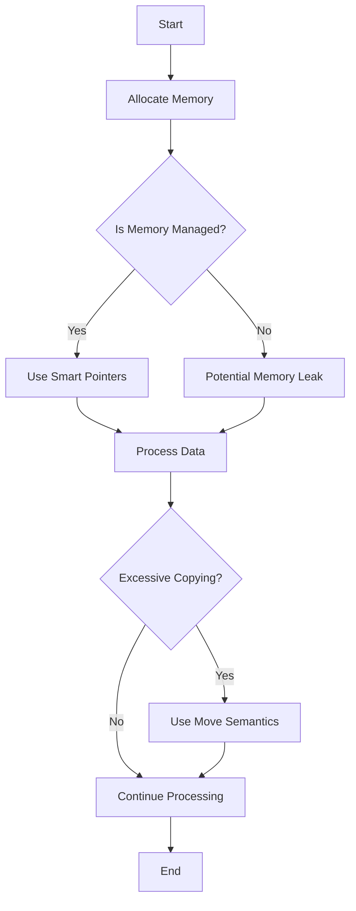

## 19.9 Avoiding Performance Pitfalls

In the realm of C++ programming, performance optimization is a critical aspect that can significantly impact the efficiency and scalability of your applications. As expert software engineers and architects, understanding and avoiding common performance pitfalls is essential to ensure your code runs efficiently and effectively. In this section, we will delve into the common mistakes that degrade performance and explore best practices for writing high-performance C++ code.

### Understanding Performance Pitfalls

Before we dive into specific techniques and practices, let's first understand what performance pitfalls are. Performance pitfalls are common mistakes or oversights in code that lead to inefficient execution, increased resource consumption, or slower response times. These pitfalls can arise from various factors such as poor algorithm choices, inefficient memory management, and improper use of language features.

#### Common Performance Pitfalls

1. **Inefficient Algorithms**: Choosing suboptimal algorithms can lead to unnecessary computations and slow down your application.
2. **Poor Memory Management**: Mismanagement of memory can result in memory leaks, fragmentation, and excessive allocations.
3. **Excessive Copying**: Unnecessary copying of objects can lead to increased memory usage and slower execution.
4. **Inefficient Use of Containers**: Misusing standard library containers can lead to performance bottlenecks.
5. **Improper Concurrency Management**: Poor handling of multithreading can result in race conditions, deadlocks, and inefficient CPU utilization.
6. **Ignoring Compiler Optimizations**: Failing to leverage compiler optimizations can result in missed opportunities for performance gains.

### Best Practices for High-Performance Code

To avoid these pitfalls and write high-performance C++ code, consider the following best practices:

#### 1. Choose the Right Algorithms

The choice of algorithm can have a profound impact on the performance of your application. Always aim to use the most efficient algorithm for the task at hand. For example, using a quicksort algorithm for sorting large datasets is generally more efficient than using a bubble sort.

**Example: Sorting Algorithms**

```cpp
#include <vector>
#include <algorithm>
#include <iostream>

// Efficient sorting using std::sort (quicksort)
void efficientSort(std::vector<int>& data) {
    std::sort(data.begin(), data.end());
}

int main() {
    std::vector<int> data = {5, 3, 8, 1, 9, 2};
    efficientSort(data);
    for (int num : data) {
        std::cout << num << " ";
    }
    return 0;
}
```

**Key Takeaway**: Always analyze the time complexity of algorithms and choose the one that best fits your needs.

#### 2. Optimize Memory Management

Efficient memory management is crucial for high-performance applications. Use smart pointers (`std::unique_ptr`, `std::shared_ptr`) to manage dynamic memory and avoid memory leaks. Additionally, minimize the use of dynamic memory allocation by using stack allocation whenever possible.

**Example: Using Smart Pointers**

```cpp
#include <memory>
#include <iostream>

class Resource {
public:
    Resource() { std::cout << "Resource acquired\n"; }
    ~Resource() { std::cout << "Resource released\n"; }
};

void useResource() {
    std::unique_ptr<Resource> res = std::make_unique<Resource>();
    // Use the resource
}

int main() {
    useResource();
    return 0;
}
```

**Key Takeaway**: Leverage RAII (Resource Acquisition Is Initialization) to ensure resources are properly managed and released.

#### 3. Minimize Object Copying

Excessive copying of objects can degrade performance, especially for large objects. Use move semantics and rvalue references to avoid unnecessary copying.

**Example: Move Semantics**

```cpp
#include <iostream>
#include <vector>

class LargeObject {
public:
    LargeObject() { std::cout << "LargeObject created\n"; }
    LargeObject(const LargeObject&) { std::cout << "LargeObject copied\n"; }
    LargeObject(LargeObject&&) noexcept { std::cout << "LargeObject moved\n"; }
};

void processObject(LargeObject obj) {
    // Process the object
}

int main() {
    LargeObject obj;
    processObject(std::move(obj)); // Move instead of copy
    return 0;
}
```

**Key Takeaway**: Use `std::move` to transfer ownership of resources and avoid unnecessary copies.

#### 4. Use Containers Efficiently

Standard library containers such as `std::vector`, `std::list`, and `std::map` are powerful tools, but they must be used wisely. Choose the right container for your needs and be mindful of their performance characteristics.

**Example: Choosing the Right Container**

```cpp
#include <vector>
#include <list>
#include <iostream>

void processData(const std::vector<int>& data) {
    // Efficient random access
    std::cout << "First element: " << data[0] << "\n";
}

void processListData(const std::list<int>& data) {
    // Efficient insertion and deletion
    std::cout << "First element: " << data.front() << "\n";
}

int main() {
    std::vector<int> vec = {1, 2, 3, 4, 5};
    std::list<int> lst = {1, 2, 3, 4, 5};

    processData(vec);
    processListData(lst);

    return 0;
}
```

**Key Takeaway**: Understand the time complexity of operations on containers and choose the one that best suits your use case.

#### 5. Manage Concurrency Properly

Concurrency can greatly enhance performance, but it must be managed carefully to avoid pitfalls such as race conditions and deadlocks. Use synchronization primitives like `std::mutex` and `std::lock_guard` to protect shared resources.

**Example: Thread Synchronization**

```cpp
#include <iostream>
#include <thread>
#include <mutex>

std::mutex mtx;

void printMessage(const std::string& message) {
    std::lock_guard<std::mutex> lock(mtx);
    std::cout << message << "\n";
}

int main() {
    std::thread t1(printMessage, "Hello from thread 1");
    std::thread t2(printMessage, "Hello from thread 2");

    t1.join();
    t2.join();

    return 0;
}
```

**Key Takeaway**: Use locks to ensure thread safety and avoid data races.

#### 6. Leverage Compiler Optimizations

Modern compilers offer a range of optimization options that can significantly improve performance. Use compiler flags to enable optimizations and profile your code to identify bottlenecks.

**Example: Compiler Optimization Flags**

When compiling your code, use optimization flags such as `-O2` or `-O3` with GCC or Clang to enable optimizations.

```bash
g++ -O2 -o optimized_program program.cpp
```

**Key Takeaway**: Regularly profile your code and experiment with different compiler flags to achieve optimal performance.

### Visualizing Performance Pitfalls

To better understand how performance pitfalls can affect your application, let's visualize the impact of inefficient memory management and excessive copying using a flowchart.



**Diagram Description**: This flowchart illustrates the decision-making process for managing memory and minimizing copying in C++ applications. It highlights the importance of using smart pointers and move semantics to avoid common performance pitfalls.

### Try It Yourself

To reinforce your understanding of these concepts, try modifying the code examples provided in this section. Experiment with different algorithms, containers, and concurrency techniques to see how they affect performance. Use profiling tools to measure the impact of your changes and identify areas for further optimization.

### Knowledge Check

1. What are some common performance pitfalls in C++ programming?
2. How can you minimize object copying in your code?
3. Why is it important to choose the right container for your data?
4. What are some best practices for managing concurrency in C++?
5. How can compiler optimizations improve the performance of your code?

### Embrace the Journey

Remember, optimizing performance is an ongoing process that requires continuous learning and experimentation. As you progress in your C++ development journey, keep exploring new techniques and tools to enhance the efficiency of your applications. Stay curious, keep experimenting, and enjoy the journey!

## Quiz Time!



### What is a common performance pitfall in C++ programming?

- [x] Inefficient algorithms
- [ ] Using smart pointers
- [ ] Leveraging move semantics
- [ ] Choosing the right container

> **Explanation:** Inefficient algorithms can lead to unnecessary computations and slow down your application, making them a common performance pitfall.

### How can you minimize object copying in C++?

- [x] Use move semantics
- [ ] Use smart pointers
- [ ] Use std::vector
- [ ] Use std::list

> **Explanation:** Move semantics allow you to transfer ownership of resources, avoiding unnecessary copying of objects.

### Why is it important to choose the right container for your data?

- [x] To optimize performance based on the container's characteristics
- [ ] To ensure data is stored in a list
- [ ] To avoid using vectors
- [ ] To prevent memory leaks

> **Explanation:** Choosing the right container allows you to leverage its performance characteristics, such as efficient random access or insertion, to optimize your code.

### What is a best practice for managing concurrency in C++?

- [x] Use locks to ensure thread safety
- [ ] Avoid using threads
- [ ] Use std::vector for all data
- [ ] Use std::list for all data

> **Explanation:** Using locks, such as std::mutex and std::lock_guard, helps ensure thread safety and avoid data races in concurrent programming.

### How can compiler optimizations improve the performance of your code?

- [x] By enabling optimization flags like -O2 or -O3
- [ ] By using std::list
- [ ] By avoiding smart pointers
- [ ] By using inefficient algorithms

> **Explanation:** Compiler optimization flags enable various optimizations that can significantly improve the performance of your code.

### What is the impact of excessive copying on performance?

- [x] Increased memory usage and slower execution
- [ ] Improved memory usage and faster execution
- [ ] No impact on performance
- [ ] Reduced memory usage and faster execution

> **Explanation:** Excessive copying can lead to increased memory usage and slower execution, negatively impacting performance.

### How can smart pointers help with memory management?

- [x] By automatically managing the lifetime of dynamically allocated objects
- [ ] By avoiding the use of std::vector
- [ ] By increasing memory usage
- [ ] By preventing the use of move semantics

> **Explanation:** Smart pointers automatically manage the lifetime of dynamically allocated objects, helping to prevent memory leaks and improve memory management.

### What is the benefit of using move semantics?

- [x] To avoid unnecessary copying of objects
- [ ] To increase memory usage
- [ ] To prevent the use of std::list
- [ ] To ensure data is stored in a vector

> **Explanation:** Move semantics allow you to transfer ownership of resources, avoiding unnecessary copying and improving performance.

### What is a potential consequence of improper concurrency management?

- [x] Race conditions and deadlocks
- [ ] Improved thread safety
- [ ] Faster execution
- [ ] Reduced memory usage

> **Explanation:** Improper concurrency management can lead to race conditions and deadlocks, negatively impacting performance and reliability.

### True or False: Compiler optimizations can significantly improve code performance.

- [x] True
- [ ] False

> **Explanation:** Compiler optimizations can enable various performance improvements, making them a valuable tool for optimizing code.


