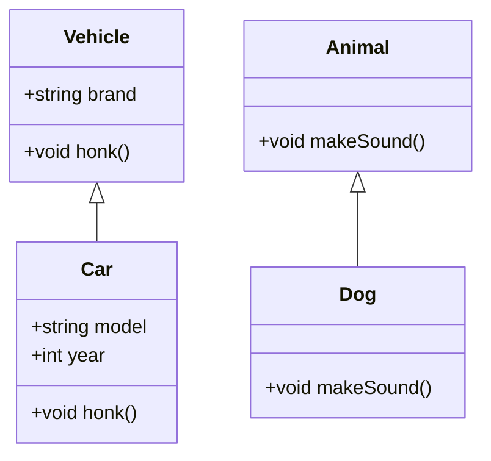

## 2.1 Object-Oriented Programming in C++

Object-Oriented Programming (OOP) is a paradigm that uses "objects" to design applications and computer programs. It utilizes several key concepts, including classes, inheritance, polymorphism, encapsulation, and abstraction. In this section, we will explore these concepts in the context of C++, a language that has been at the forefront of OOP since its inception.

### Classes and Objects

In C++, a class is a blueprint for creating objects (a particular data structure), providing initial values for state (member variables or attributes), and implementations of behavior (member functions or methods). An object is an instance of a class.

#### Defining a Class

To define a class in C++, use the `class` keyword followed by the class name and a pair of curly braces. Inside the braces, you define the class's attributes and methods.

```cpp
class Car {
public:
    std::string brand;
    std::string model;
    int year;

    void displayInfo() {
        std::cout << "Brand: " << brand << ", Model: " << model << ", Year: " << year << std::endl;
    }
};
```

In this example, `Car` is a class with three public attributes: `brand`, `model`, and `year`, and one method `displayInfo()`.

#### Creating Objects

Once a class is defined, you can create objects of that class type. Here's how you can create an object of the `Car` class and use it:

```cpp
int main() {
    Car myCar;
    myCar.brand = "Toyota";
    myCar.model = "Corolla";
    myCar.year = 2020;
    myCar.displayInfo(); // Output: Brand: Toyota, Model: Corolla, Year: 2020
    return 0;
}
```

#### Constructors and Destructors

Constructors are special class functions that are called when a new object of the class is created. They initialize the object's attributes. Destructors, on the other hand, are called when an object is destroyed and are used to free resources.

```cpp
class Car {
public:
    std::string brand;
    std::string model;
    int year;

    // Constructor
    Car(std::string b, std::string m, int y) : brand(b), model(m), year(y) {}

    // Destructor
    ~Car() {
        std::cout << "Destroying Car: " << brand << " " << model << std::endl;
    }

    void displayInfo() {
        std::cout << "Brand: " << brand << ", Model: " << model << ", Year: " << year << std::endl;
    }
};
```

### Inheritance and Polymorphism

Inheritance allows a class (derived class) to inherit the properties and behavior of another class (base class). This promotes code reusability and establishes a natural hierarchy between classes.

#### Implementing Inheritance

In C++, inheritance is implemented by specifying a colon and the access specifier followed by the base class name.

```cpp
class Vehicle {
public:
    std::string brand;
    void honk() {
        std::cout << "Beep beep!" << std::endl;
    }
};

class Car : public Vehicle {
public:
    std::string model;
    int year;
};
```

Here, `Car` inherits from `Vehicle`, meaning `Car` objects have access to the `brand` attribute and `honk()` method.

#### Polymorphism

Polymorphism allows methods to do different things based on the object it is acting upon, even if they share the same name. This is achieved through method overriding and virtual functions.

##### Virtual Functions

To enable polymorphism, declare a method in the base class as `virtual`. This tells the compiler to support late binding for this method.

```cpp
class Vehicle {
public:
    virtual void honk() {
        std::cout << "Vehicle beep!" << std::endl;
    }
};

class Car : public Vehicle {
public:
    void honk() override {
        std::cout << "Car beep!" << std::endl;
    }
};
```

In this example, calling `honk()` on a `Vehicle` pointer that points to a `Car` object will call the `Car`'s version of `honk()`.

#### Abstract Classes and Pure Virtual Functions

An abstract class is a class that cannot be instantiated and is typically used as a base class. It contains at least one pure virtual function, which is declared by assigning `0` to it.

```cpp
class Animal {
public:
    virtual void makeSound() = 0; // Pure virtual function
};

class Dog : public Animal {
public:
    void makeSound() override {
        std::cout << "Woof!" << std::endl;
    }
};
```

In this example, `Animal` is an abstract class, and `Dog` is a concrete class that implements the `makeSound()` method.

### Encapsulation and Abstraction

Encapsulation is the bundling of data and methods that operate on that data within a single unit or class. It restricts direct access to some of an object's components, which can prevent the accidental modification of data.

#### Implementing Encapsulation

In C++, encapsulation is achieved using access specifiers: `public`, `protected`, and `private`.

```cpp
class Box {
private:
    double length;
    double width;
    double height;

public:
    void setDimensions(double l, double w, double h) {
        length = l;
        width = w;
        height = h;
    }

    double getVolume() {
        return length * width * height;
    }
};
```

In this example, the dimensions of the `Box` are private, and they can only be set and accessed through public methods.

#### Abstraction

Abstraction is the concept of hiding the complex reality while exposing only the necessary parts. It helps in reducing programming complexity and effort.

```cpp
class AbstractShape {
public:
    virtual double area() const = 0;
    virtual double perimeter() const = 0;
};

class Circle : public AbstractShape {
private:
    double radius;

public:
    Circle(double r) : radius(r) {}

    double area() const override {
        return 3.14159 * radius * radius;
    }

    double perimeter() const override {
        return 2 * 3.14159 * radius;
    }
};
```

In this example, `AbstractShape` provides an abstract interface for shapes, and `Circle` implements this interface.

### Visualizing Object-Oriented Concepts

To better understand the relationships between classes, inheritance, and polymorphism, let's visualize these concepts using a class diagram.



This diagram shows the inheritance relationship between `Vehicle` and `Car`, and `Animal` and `Dog`. It also highlights the polymorphic nature of the `honk()` and `makeSound()` methods.

### Try It Yourself

Experiment with the code examples provided above. Try modifying the `Car` class to include additional methods or attributes. Implement a new class that inherits from `Vehicle` and override the `honk()` method. This hands-on practice will reinforce your understanding of OOP concepts in C++.

### Knowledge Check

- Explain the difference between a class and an object.
- What is the purpose of a constructor in a class?
- How does inheritance promote code reusability?
- Describe how polymorphism is achieved in C++.
- What is the difference between encapsulation and abstraction?

### Further Reading

For more in-depth information on C++ and Object-Oriented Programming, consider exploring the following resources:

- [C++ Programming Language by Bjarne Stroustrup](https://www.stroustrup.com/C++.html)
- [Effective C++ by Scott Meyers](https://www.aristeia.com/books.html)
- [C++ Primer by Stanley B. Lippman](https://www.pearson.com/us/higher-education/program/Lippman-C-Plus-Plus-Primer-5th-Edition/PGM332148.html)

## Quiz Time!



### What is an object in C++?

- [x] An instance of a class
- [ ] A blueprint for creating classes
- [ ] A function within a class
- [ ] A data type

> **Explanation:** An object is an instance of a class, which is a blueprint for creating objects.

### What is the purpose of a constructor in C++?

- [x] To initialize an object
- [ ] To destroy an object
- [ ] To define a class
- [ ] To overload operators

> **Explanation:** A constructor is used to initialize an object when it is created.

### How is polymorphism achieved in C++?

- [x] Through virtual functions
- [ ] Through static methods
- [ ] By using macros
- [ ] By using templates

> **Explanation:** Polymorphism in C++ is achieved through virtual functions, which allow for dynamic method binding.

### What is encapsulation in C++?

- [x] Bundling data and methods within a class
- [ ] Inheriting properties from another class
- [ ] Overloading functions
- [ ] Using templates

> **Explanation:** Encapsulation involves bundling data and methods that operate on that data within a single unit or class.

### What is the difference between a class and an object?

- [x] A class is a blueprint, an object is an instance
- [ ] A class is an instance, an object is a blueprint
- [ ] A class is a function, an object is a variable
- [ ] A class is a data type, an object is a function

> **Explanation:** A class is a blueprint for creating objects, while an object is an instance of a class.

### What is a pure virtual function?

- [x] A function with no implementation in the base class
- [ ] A function that cannot be overridden
- [ ] A function that is always inline
- [ ] A function that is private

> **Explanation:** A pure virtual function is declared by assigning `0` to it and has no implementation in the base class.

### What is abstraction in C++?

- [x] Hiding complex reality while exposing only necessary parts
- [ ] Overloading operators
- [ ] Using pointers
- [ ] Implementing templates

> **Explanation:** Abstraction involves hiding complex details and exposing only the necessary parts of an object.

### What is the role of a destructor in C++?

- [x] To free resources when an object is destroyed
- [ ] To initialize an object
- [ ] To overload operators
- [ ] To define a class

> **Explanation:** A destructor is used to free resources when an object is destroyed.

### What is the benefit of inheritance in C++?

- [x] Code reusability
- [ ] Faster execution
- [ ] Smaller code size
- [ ] Easier debugging

> **Explanation:** Inheritance promotes code reusability by allowing a class to inherit properties and methods from another class.

### True or False: An abstract class can be instantiated.

- [ ] True
- [x] False

> **Explanation:** An abstract class cannot be instantiated because it contains at least one pure virtual function.



Remember, this is just the beginning. As you progress, you'll build more complex and interactive applications using these foundational concepts. Keep experimenting, stay curious, and enjoy the journey!
