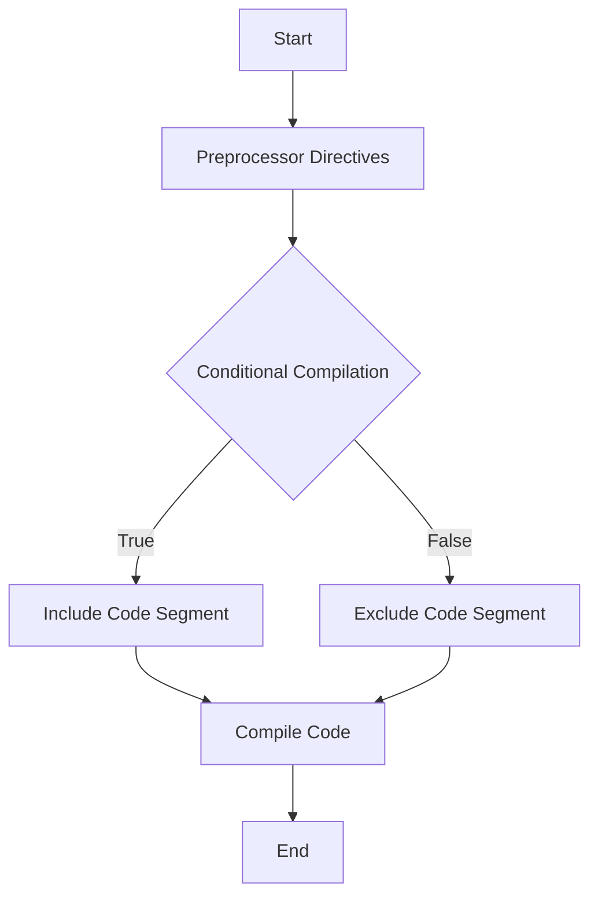

## 2.10 Preprocessor Directives and Conditional Compilation

In the world of C++ programming, preprocessor directives and conditional compilation are powerful tools that allow developers to manage code configuration and platform-specific requirements efficiently. By leveraging these features, you can write more adaptable, maintainable, and optimized code. In this section, we will delve into the intricacies of preprocessor directives and conditional compilation, providing you with the knowledge and skills to harness their full potential.

### Understanding the C++ Preprocessor

Before diving into preprocessor directives, it's essential to understand the role of the C++ preprocessor. The preprocessor is a tool that processes your source code before it is compiled. It performs textual transformations on the code, allowing you to define macros, include files, and conditionally compile code segments. The preprocessor operates on directives, which are instructions that begin with the `#` symbol.

### Key Preprocessor Directives

Let's explore some of the most commonly used preprocessor directives in C++:

#### `#include`

The `#include` directive is used to include the contents of a file into your source code. This is commonly used to include header files that contain declarations and definitions needed by your program.

```cpp
#include <iostream>  // Includes the standard input-output stream library
#include "myheader.h" // Includes a user-defined header file
```

#### `#define`

The `#define` directive allows you to define macros, which are essentially symbolic names or constants. Macros can be used to simplify code and make it more readable.

```cpp
#define PI 3.14159
#define SQUARE(x) ((x) * (x))

int main() {
    std::cout << "The square of 5 is: " << SQUARE(5) << std::endl;
    return 0;
}
```

#### `#undef`

The `#undef` directive is used to undefine a macro. This can be useful if you want to redefine a macro later in your code.

```cpp
#define TEMP 100
#undef TEMP
#define TEMP 200
```

#### `#ifdef` and `#ifndef`

These directives are used for conditional compilation. `#ifdef` checks if a macro is defined, while `#ifndef` checks if a macro is not defined.

```cpp
#define DEBUG

#ifdef DEBUG
    std::cout << "Debugging is enabled." << std::endl;
#endif

#ifndef RELEASE
    std::cout << "Release mode is not defined." << std::endl;
#endif
```

#### `#if`, `#elif`, `#else`, and `#endif`

These directives allow for more complex conditional compilation by evaluating expressions.

```cpp
#define VERSION 2

#if VERSION == 1
    std::cout << "Version 1" << std::endl;
#elif VERSION == 2
    std::cout << "Version 2" << std::endl;
#else
    std::cout << "Unknown version" << std::endl;
#endif
```

### Conditional Compilation

Conditional compilation is a technique that allows you to compile certain parts of your code based on specific conditions. This is particularly useful for managing platform-specific code and enabling or disabling features.

#### Managing Platform-Specific Code

When developing cross-platform applications, you often need to write code that behaves differently on different operating systems. Conditional compilation allows you to include platform-specific code segments.

```cpp
#ifdef _WIN32
    std::cout << "Running on Windows" << std::endl;
#elif __linux__
    std::cout << "Running on Linux" << std::endl;
#elif __APPLE__
    std::cout << "Running on macOS" << std::endl;
#else
    std::cout << "Unknown platform" << std::endl;
#endif
```

#### Optimizing Configuration

Conditional compilation can also be used to optimize code configuration by enabling or disabling features based on user-defined macros.

```cpp
#define FEATURE_X

#ifdef FEATURE_X
    void featureX() {
        std::cout << "Feature X is enabled." << std::endl;
    }
#else
    void featureX() {
        std::cout << "Feature X is disabled." << std::endl;
    }
#endif
```

### Advanced Preprocessor Techniques

#### Token Pasting and Stringizing

The preprocessor provides operators for token pasting (`##`) and stringizing (`#`). These operators allow for more advanced macro manipulations.

```cpp
#define CONCAT(a, b) a##b
#define STRINGIFY(x) #x

int main() {
    int xy = 10;
    std::cout << CONCAT(x, y) << std::endl; // Outputs: 10
    std::cout << STRINGIFY(Hello World) << std::endl; // Outputs: "Hello World"
    return 0;
}
```

#### Variadic Macros

Variadic macros allow you to define macros that accept a variable number of arguments. This is useful for creating flexible and reusable code snippets.

```cpp
#define LOG(format, ...) printf(format, __VA_ARGS__)

int main() {
    LOG("Value: %d\n", 42);
    LOG("Coordinates: (%d, %d)\n", 10, 20);
    return 0;
}
```

### Best Practices for Using Preprocessor Directives

1. **Limit Macro Usage**: Use macros sparingly, as they can make code difficult to read and debug. Prefer constants and inline functions when possible.

2. **Use Meaningful Names**: Choose descriptive names for macros to improve code readability.

3. **Avoid Side Effects**: Be cautious of macros that have side effects, especially when using expressions as arguments.

4. **Document Conditional Compilation**: Clearly document why certain code segments are conditionally compiled to aid future maintenance.

5. **Test Across Platforms**: Ensure that platform-specific code is tested on all intended platforms to avoid runtime errors.

### Visualizing Preprocessor Flow

To better understand how the preprocessor handles directives, let's visualize the flow of preprocessor operations using a flowchart.



**Figure 1**: This flowchart illustrates the decision-making process of the preprocessor when encountering conditional compilation directives.

### Try It Yourself

Experiment with the following code snippet by modifying the defined macros and observing the changes in output. Try adding new platform-specific conditions or features.

```cpp
#define PLATFORM_LINUX
#define FEATURE_Y

int main() {
#ifdef PLATFORM_WINDOWS
    std::cout << "Windows-specific code" << std::endl;
#elif defined(PLATFORM_LINUX)
    std::cout << "Linux-specific code" << std::endl;
#endif

#ifdef FEATURE_Y
    std::cout << "Feature Y is enabled." << std::endl;
#endif

    return 0;
}
```

### References and Further Reading

- [C++ Preprocessor Directives](https://en.cppreference.com/w/cpp/preprocessor)
- [Conditional Compilation in C++](https://www.geeksforgeeks.org/conditional-compilation-in-c/)
- [Managing Platform-Specific Code](https://www.cprogramming.com/tutorial/cpreprocessor.html)

### Knowledge Check

- What is the primary role of the C++ preprocessor?
- How can you manage platform-specific code using preprocessor directives?
- What are the potential pitfalls of using macros in C++?

### Embrace the Journey

Remember, mastering preprocessor directives and conditional compilation is a journey. As you continue to explore and experiment with these tools, you'll gain a deeper understanding of how to write efficient and adaptable C++ code. Keep experimenting, stay curious, and enjoy the journey!

## Quiz Time!



### What is the primary role of the C++ preprocessor?

- [x] To process source code before compilation
- [ ] To execute code at runtime
- [ ] To manage memory allocation
- [ ] To handle user input

> **Explanation:** The preprocessor processes source code before it is compiled, performing tasks like macro expansion and conditional compilation.

### Which directive is used to include the contents of a file in C++?

- [x] `#include`
- [ ] `#define`
- [ ] `#ifdef`
- [ ] `#undef`

> **Explanation:** The `#include` directive is used to include the contents of a file into the source code.

### How can you define a macro in C++?

- [x] Using `#define`
- [ ] Using `#include`
- [ ] Using `#ifdef`
- [ ] Using `#endif`

> **Explanation:** The `#define` directive is used to define macros in C++.

### What is the purpose of the `#ifdef` directive?

- [x] To check if a macro is defined
- [ ] To define a macro
- [ ] To include a file
- [ ] To undefine a macro

> **Explanation:** The `#ifdef` directive checks if a macro is defined and conditionally compiles code based on that.

### Which directive is used to undefine a macro?

- [x] `#undef`
- [ ] `#define`
- [ ] `#include`
- [ ] `#ifdef`

> **Explanation:** The `#undef` directive is used to undefine a macro.

### What is the purpose of conditional compilation?

- [x] To compile code based on specific conditions
- [ ] To execute code at runtime
- [ ] To manage memory allocation
- [ ] To handle user input

> **Explanation:** Conditional compilation allows certain parts of the code to be compiled based on specific conditions.

### How can you manage platform-specific code in C++?

- [x] Using conditional compilation directives
- [ ] Using runtime checks
- [ ] Using dynamic memory allocation
- [ ] Using function overloading

> **Explanation:** Conditional compilation directives allow you to include platform-specific code segments.

### What is the risk of using macros with side effects?

- [x] They can make code difficult to read and debug
- [ ] They improve code performance
- [ ] They simplify code maintenance
- [ ] They enhance code security

> **Explanation:** Macros with side effects can make code difficult to read and debug, as they may introduce unexpected behavior.

### What does the `##` operator do in a macro?

- [x] It pastes tokens together
- [ ] It stringizes tokens
- [ ] It defines a macro
- [ ] It includes a file

> **Explanation:** The `##` operator is used for token pasting in macros.

### True or False: The preprocessor executes code at runtime.

- [ ] True
- [x] False

> **Explanation:** The preprocessor processes code before compilation, not at runtime.


