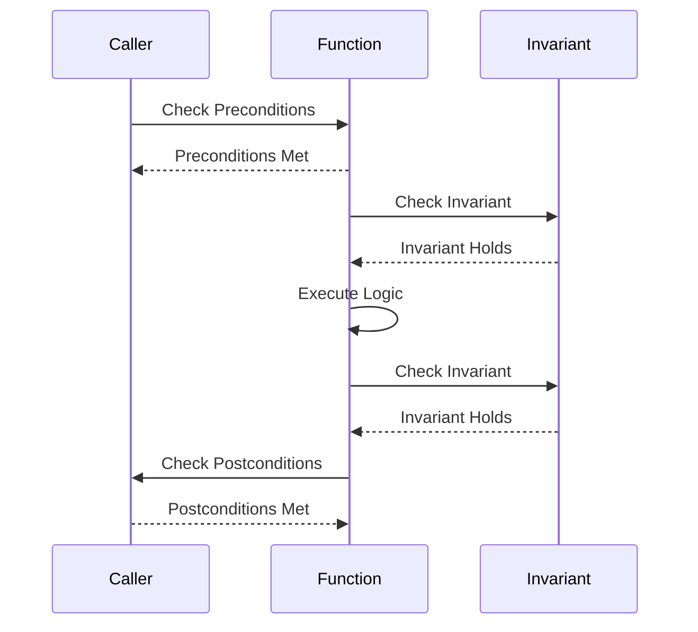

## 2.11 Design by Contract and Defensive Programming

In the realm of software engineering, ensuring that software behaves correctly and predictably is paramount. Two methodologies that aid in achieving this goal are Design by Contract (DbC) and Defensive Programming. These approaches help developers create robust, reliable, and maintainable code by explicitly defining the expectations and responsibilities of software components. In this section, we will delve into these concepts, explore their application in C++, and provide practical examples to illustrate their effectiveness.

### Understanding Design by Contract

Design by Contract is a programming methodology introduced by Bertrand Meyer in the context of the Eiffel programming language. The central idea of DbC is to view software components as participants in a contract, where each component has explicit obligations and benefits. This contract is defined by three main elements: preconditions, postconditions, and invariants.

#### Preconditions

Preconditions are conditions that must be true before a function or method is executed. They define the expectations that a caller must satisfy for the function to operate correctly. Preconditions are essentially the "promises" that the caller makes to the function.

**Example:**

```cpp
#include <iostream>
#include <stdexcept>

class Calculator {
public:
    // Function to divide two numbers with a precondition
    double divide(double numerator, double denominator) {
        // Check precondition
        if (denominator == 0) {
            throw std::invalid_argument("Denominator cannot be zero.");
        }
        return numerator / denominator;
    }
};

int main() {
    Calculator calc;
    try {
        std::cout << "Result: " << calc.divide(10, 2) << std::endl; // Valid
        std::cout << "Result: " << calc.divide(10, 0) << std::endl; // Invalid
    } catch (const std::invalid_argument& e) {
        std::cerr << "Error: " << e.what() << std::endl;
    }
    return 0;
}
```

In this example, the precondition for the `divide` function is that the denominator must not be zero. If this precondition is violated, an exception is thrown.

#### Postconditions

Postconditions are conditions that must be true after a function or method has executed. They define what the function promises to deliver if the preconditions were met.

**Example:**

```cpp
#include <iostream>
#include <stdexcept>

class Account {
private:
    double balance;

public:
    Account(double initialBalance) : balance(initialBalance) {}

    // Function to deposit money with a postcondition
    void deposit(double amount) {
        if (amount <= 0) {
            throw std::invalid_argument("Deposit amount must be positive.");
        }
        balance += amount;

        // Check postcondition
        if (balance <= 0) {
            throw std::logic_error("Postcondition failed: balance must be positive after deposit.");
        }
    }

    double getBalance() const {
        return balance;
    }
};

int main() {
    Account account(100);
    try {
        account.deposit(50);
        std::cout << "Balance: " << account.getBalance() << std::endl;
    } catch (const std::exception& e) {
        std::cerr << "Error: " << e.what() << std::endl;
    }
    return 0;
}
```

Here, the postcondition ensures that the account balance remains positive after a deposit operation.

#### Invariants

Invariants are conditions that must always be true for a class or data structure. They define the consistent state that an object must maintain throughout its lifecycle.

**Example:**

```cpp
#include <iostream>
#include <stdexcept>

class Rectangle {
private:
    double width;
    double height;

public:
    Rectangle(double w, double h) : width(w), height(h) {
        checkInvariant();
    }

    void setWidth(double w) {
        width = w;
        checkInvariant();
    }

    void setHeight(double h) {
        height = h;
        checkInvariant();
    }

    double area() const {
        return width * height;
    }

private:
    void checkInvariant() const {
        if (width <= 0 || height <= 0) {
            throw std::logic_error("Invariant failed: width and height must be positive.");
        }
    }
};

int main() {
    try {
        Rectangle rect(10, 5);
        std::cout << "Area: " << rect.area() << std::endl;
        rect.setWidth(15);
        std::cout << "Area: " << rect.area() << std::endl;
        rect.setHeight(-5); // This will fail
    } catch (const std::logic_error& e) {
        std::cerr << "Error: " << e.what() << std::endl;
    }
    return 0;
}
```

In this example, the invariant ensures that both the width and height of the rectangle are always positive.

### Defensive Programming

Defensive Programming is a methodology that involves writing code to handle unexpected or erroneous inputs and states gracefully. The goal is to make the software more robust and less prone to failure. This approach often involves validating inputs, handling exceptions, and ensuring that the program can recover from errors.

#### Key Principles of Defensive Programming

1. **Input Validation:** Always validate inputs to ensure they meet expected criteria. This prevents invalid data from causing unexpected behavior.

2. **Error Handling:** Implement comprehensive error handling to manage exceptions and recover from errors without crashing the program.

3. **Fail-Safe Defaults:** Design systems to default to a safe state in case of failure. This minimizes the impact of errors.

4. **Redundancy:** Use redundancy to provide backup options in case of failure. This can include retry mechanisms or alternative pathways.

5. **Code Clarity:** Write clear and understandable code to reduce the likelihood of introducing errors. Use comments and documentation to explain complex logic.

#### Defensive Programming in C++

**Example:**

```cpp
#include <iostream>
#include <stdexcept>
#include <limits>

class SafeInput {
public:
    // Function to safely read an integer from user input
    int readInteger() {
        int value;
        while (true) {
            std::cout << "Enter an integer: ";
            std::cin >> value;

            if (std::cin.fail()) {
                std::cin.clear(); // Clear the error flag
                std::cin.ignore(std::numeric_limits<std::streamsize>::max(), '\n'); // Discard invalid input
                std::cout << "Invalid input. Please enter a valid integer." << std::endl;
            } else {
                return value;
            }
        }
    }
};

int main() {
    SafeInput input;
    int number = input.readInteger();
    std::cout << "You entered: " << number << std::endl;
    return 0;
}
```

In this example, the `readInteger` function uses defensive programming techniques to handle invalid input gracefully. It continuously prompts the user until a valid integer is entered.

### Using Assertions Effectively

Assertions are a powerful tool for verifying assumptions in code. They are typically used to check conditions that should never occur during normal execution. Assertions help catch programming errors early in the development process.

**Example:**

```cpp
#include <iostream>
#include <cassert>

int factorial(int n) {
    // Assert precondition: n must be non-negative
    assert(n >= 0);

    if (n == 0) return 1;
    return n * factorial(n - 1);
}

int main() {
    int value = 5;
    std::cout << "Factorial of " << value << " is " << factorial(value) << std::endl;

    // Uncommenting the following line will trigger an assertion failure
    // std::cout << "Factorial of -1 is " << factorial(-1) << std::endl;

    return 0;
}
```

In this example, the assertion ensures that the input to the `factorial` function is non-negative. If this condition is violated, the program will terminate with an assertion failure.

### Visualizing Design by Contract

To better understand the flow of Design by Contract, let's visualize the interaction between preconditions, postconditions, and invariants using a sequence diagram.



This diagram illustrates the sequence of checks and operations in a typical Design by Contract scenario. The caller first ensures that preconditions are met, the function checks invariants before and after execution, and finally, the caller verifies postconditions.

### Try It Yourself

Experiment with the code examples provided in this section. Try modifying the preconditions, postconditions, and invariants to see how they affect the behavior of the program. Additionally, practice implementing defensive programming techniques in your own projects to enhance robustness.

### Knowledge Check

- What are the key components of Design by Contract?
- How does Defensive Programming differ from Design by Contract?
- Why are assertions useful in programming?
- How can you handle invalid user input gracefully in C++?

### Summary

Design by Contract and Defensive Programming are essential methodologies for creating reliable and maintainable software. By explicitly defining the expectations and responsibilities of software components, developers can build systems that are robust and less prone to errors. Assertions, input validation, and error handling are crucial tools in achieving these goals. As you continue your journey in C++ programming, remember to apply these principles to enhance the quality of your code.

## Quiz Time!



### What is the primary goal of Design by Contract?

- [x] To define explicit expectations and responsibilities for software components
- [ ] To write code that handles all possible errors
- [ ] To optimize code for performance
- [ ] To ensure code is always backward compatible

> **Explanation:** Design by Contract focuses on defining clear expectations and responsibilities for software components through preconditions, postconditions, and invariants.

### Which of the following is a key principle of Defensive Programming?

- [x] Input Validation
- [ ] Code Obfuscation
- [ ] Code Minification
- [ ] Code Compilation

> **Explanation:** Defensive Programming emphasizes input validation to ensure that inputs meet expected criteria and prevent invalid data from causing unexpected behavior.

### What is the purpose of assertions in programming?

- [x] To verify assumptions in code
- [ ] To handle runtime errors
- [ ] To optimize memory usage
- [ ] To document code

> **Explanation:** Assertions are used to verify assumptions in code, helping catch programming errors early in the development process.

### In the context of Design by Contract, what are invariants?

- [x] Conditions that must always be true for a class or data structure
- [ ] Conditions that must be true before a function is executed
- [ ] Conditions that must be true after a function is executed
- [ ] Conditions that are true only during testing

> **Explanation:** Invariants are conditions that must always hold true for a class or data structure, ensuring its consistent state throughout its lifecycle.

### How can you handle invalid user input in C++?

- [x] By using input validation and error handling
- [ ] By ignoring the input
- [ ] By terminating the program
- [ ] By logging the input

> **Explanation:** Handling invalid user input involves using input validation to ensure inputs meet expected criteria and implementing error handling to manage exceptions gracefully.

### What does the sequence diagram in the article illustrate?

- [x] The interaction between preconditions, postconditions, and invariants in Design by Contract
- [ ] The flow of data in a network application
- [ ] The lifecycle of a software project
- [ ] The process of compiling a C++ program

> **Explanation:** The sequence diagram illustrates the interaction between preconditions, postconditions, and invariants in a typical Design by Contract scenario.

### Which of the following is NOT a component of Design by Contract?

- [ ] Preconditions
- [ ] Postconditions
- [x] Error Handling
- [ ] Invariants

> **Explanation:** Error handling is not a component of Design by Contract. The components are preconditions, postconditions, and invariants.

### What is a common use of defensive programming?

- [x] To make software more robust and less prone to failure
- [ ] To increase the complexity of code
- [ ] To reduce the readability of code
- [ ] To minimize the use of comments

> **Explanation:** Defensive programming is used to make software more robust and less prone to failure by handling unexpected or erroneous inputs and states gracefully.

### What happens if an assertion fails in C++?

- [x] The program terminates with an assertion failure
- [ ] The program continues execution
- [ ] The program logs a warning
- [ ] The program retries the operation

> **Explanation:** If an assertion fails in C++, the program typically terminates with an assertion failure, indicating that an assumption in the code was violated.

### True or False: Defensive Programming and Design by Contract are mutually exclusive methodologies.

- [ ] True
- [x] False

> **Explanation:** Defensive Programming and Design by Contract are not mutually exclusive. They can be used together to enhance the robustness and reliability of software.


