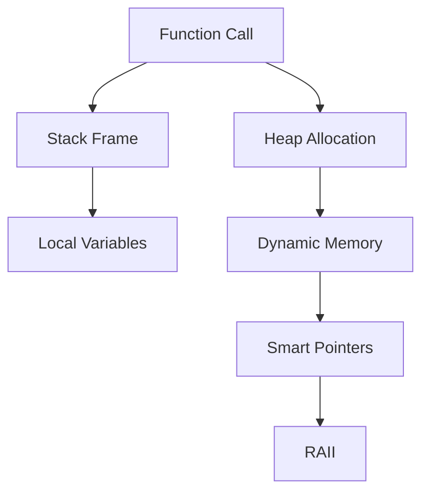

## 2.2 Efficient Memory Management

Efficient memory management is a cornerstone of robust and high-performance C++ applications. As expert software engineers and architects, understanding how to manage memory effectively is crucial for creating scalable and maintainable software. In this section, we will delve into the intricacies of memory management in C++, focusing on the stack and heap, dynamic memory allocation, smart pointers, and the Resource Acquisition Is Initialization (RAII) idiom.

### Understanding the Stack and the Heap

In C++, memory is typically divided into two main areas: the stack and the heap. Each serves a distinct purpose and has its own characteristics.

#### The Stack

The stack is a region of memory that stores automatic variables. It is managed by the CPU and follows a Last In, First Out (LIFO) order. The stack is fast and efficient, but it is limited in size. Variables on the stack are automatically allocated and deallocated when they go out of scope.

**Key Characteristics of the Stack:**

- **Automatic Memory Management:** Variables are automatically destroyed when they go out of scope.
- **Fast Access:** Due to its LIFO nature, the stack provides fast memory allocation and deallocation.
- **Limited Size:** The stack size is limited, which can lead to stack overflow if too much memory is used.

#### The Heap

The heap is a region of memory used for dynamic memory allocation. Unlike the stack, memory on the heap is manually managed, meaning you must allocate and deallocate it explicitly.

**Key Characteristics of the Heap:**

- **Manual Memory Management:** Memory must be explicitly allocated and deallocated using `new` and `delete`.
- **Flexible Size:** The heap is larger than the stack and can grow dynamically.
- **Slower Access:** Accessing heap memory is generally slower than stack memory due to its non-contiguous nature.

### Dynamic Memory Allocation with Pointers and References

Dynamic memory allocation allows you to allocate memory at runtime, which is essential for creating flexible and scalable applications. In C++, this is typically done using pointers.

#### Using `new` and `delete`

The `new` operator is used to allocate memory on the heap, while `delete` is used to deallocate it.

```cpp
int* ptr = new int; // Allocate memory for an integer on the heap
*ptr = 10;          // Assign a value to the allocated memory
delete ptr;         // Deallocate the memory
```

**Important Considerations:**

- **Memory Leaks:** Failing to deallocate memory with `delete` leads to memory leaks.
- **Dangling Pointers:** Using a pointer after it has been deleted results in undefined behavior.

#### Using References

References provide an alternative to pointers, offering a safer way to access memory. However, they cannot be null and must be initialized when declared.

```cpp
int value = 42;
int& ref = value; // Reference to the variable 'value'
ref = 100;        // Modifies 'value' to 100
```

### Smart Pointers

Smart pointers are a modern C++ feature that helps manage dynamic memory automatically, reducing the risk of memory leaks and dangling pointers.

#### `std::unique_ptr`

`std::unique_ptr` is a smart pointer that ensures exclusive ownership of a dynamically allocated object. It automatically deletes the object when the `std::unique_ptr` goes out of scope.

```cpp
#include <memory>

std::unique_ptr<int> uniquePtr(new int(42)); // Allocate memory
// No need to manually delete; handled by unique_ptr
```

**Key Features:**

- **Exclusive Ownership:** Only one `std::unique_ptr` can own a particular object.
- **Move Semantics:** Supports move semantics, allowing transfer of ownership.

#### `std::shared_ptr`

`std::shared_ptr` is a smart pointer that allows multiple pointers to share ownership of an object. The object is deleted when the last `std::shared_ptr` goes out of scope.

```cpp
#include <memory>

std::shared_ptr<int> sharedPtr1 = std::make_shared<int>(42);
std::shared_ptr<int> sharedPtr2 = sharedPtr1; // Shared ownership
```

**Key Features:**

- **Shared Ownership:** Multiple `std::shared_ptr` instances can own the same object.
- **Reference Counting:** Uses reference counting to manage the object's lifetime.

#### `std::weak_ptr`

`std::weak_ptr` is a smart pointer that provides a non-owning reference to an object managed by `std::shared_ptr`. It is useful for breaking circular references.

```cpp
#include <memory>

std::shared_ptr<int> sharedPtr = std::make_shared<int>(42);
std::weak_ptr<int> weakPtr = sharedPtr; // Non-owning reference
```

**Key Features:**

- **Non-Owning:** Does not affect the reference count of the object.
- **Safe Access:** Can be converted to `std::shared_ptr` for safe access.

### Resource Acquisition Is Initialization (RAII)

RAII is a programming idiom that ties resource management to object lifetime. It ensures that resources are acquired during object creation and released during object destruction.

#### Implementing RAII

RAII is typically implemented using classes that manage resources, such as file handles or network connections.

```cpp
#include <fstream>

class FileHandler {
public:
    FileHandler(const std::string& filename) : file(filename) {}
    ~FileHandler() { file.close(); }

private:
    std::fstream file;
};

FileHandler handler("example.txt"); // File opened
// File automatically closed when 'handler' goes out of scope
```

**Benefits of RAII:**

- **Automatic Resource Management:** Resources are automatically released when objects go out of scope.
- **Exception Safety:** Ensures resources are released even if an exception is thrown.

### Visualizing Memory Management

To better understand memory management in C++, let's visualize the stack and heap operations using a diagram:



**Diagram Explanation:**

- **Function Call:** Initiates a stack frame for local variables.
- **Stack Frame:** Contains local variables, managed automatically.
- **Heap Allocation:** Memory allocated on the heap for dynamic use.
- **Dynamic Memory:** Managed using pointers and smart pointers.
- **Smart Pointers:** Automate memory management.
- **RAII:** Ensures resources are tied to object lifetimes.

### Try It Yourself

Experiment with the following code examples to deepen your understanding of memory management in C++. Try modifying the code to see how different memory management techniques affect program behavior.

#### Example 1: Stack vs. Heap

```cpp
#include <iostream>

void stackAllocation() {
    int stackVar = 10; // Allocated on the stack
    std::cout << "Stack Variable: " << stackVar << std::endl;
}

void heapAllocation() {
    int* heapVar = new int(20); // Allocated on the heap
    std::cout << "Heap Variable: " << *heapVar << std::endl;
    delete heapVar; // Deallocate memory
}

int main() {
    stackAllocation();
    heapAllocation();
    return 0;
}
```

**Challenge:** Modify the `heapAllocation` function to use `std::unique_ptr` instead of raw pointers.

#### Example 2: Smart Pointers

```cpp
#include <iostream>
#include <memory>

void useSmartPointers() {
    std::unique_ptr<int> uniquePtr(new int(30));
    std::shared_ptr<int> sharedPtr1 = std::make_shared<int>(40);
    std::shared_ptr<int> sharedPtr2 = sharedPtr1; // Shared ownership

    std::cout << "Unique Pointer: " << *uniquePtr << std::endl;
    std::cout << "Shared Pointer: " << *sharedPtr1 << std::endl;
}

int main() {
    useSmartPointers();
    return 0;
}
```

**Challenge:** Add a `std::weak_ptr` to the `useSmartPointers` function and demonstrate its usage.

### References and Links

- [C++ Reference: Smart Pointers](https://en.cppreference.com/w/cpp/memory)
- [C++ Core Guidelines: Resource Management](https://isocpp.github.io/CppCoreGuidelines/CppCoreGuidelines#S-resource)

### Knowledge Check

- **Question:** What is the main difference between stack and heap memory?
- **Exercise:** Implement a class using RAII to manage a network connection.

### Embrace the Journey

Remember, mastering memory management in C++ is a journey. As you progress, you'll build more complex and efficient applications. Keep experimenting, stay curious, and enjoy the process!

## Quiz Time!



### What is the primary advantage of using the stack for memory allocation?

- [x] Automatic memory management
- [ ] Larger memory size
- [ ] Manual control over memory
- [ ] Faster access than the heap

> **Explanation:** The stack provides automatic memory management, which means variables are automatically deallocated when they go out of scope.

### Which of the following is a key characteristic of heap memory?

- [ ] Automatic deallocation
- [x] Manual memory management
- [ ] Limited size
- [ ] Faster access than the stack

> **Explanation:** Heap memory requires manual allocation and deallocation using `new` and `delete`.

### What is the purpose of `std::unique_ptr` in C++?

- [x] To ensure exclusive ownership of a dynamically allocated object
- [ ] To allow shared ownership of an object
- [ ] To provide a non-owning reference to an object
- [ ] To manage reference counting

> **Explanation:** `std::unique_ptr` ensures exclusive ownership of a dynamically allocated object, automatically deleting it when it goes out of scope.

### How does `std::shared_ptr` manage the lifetime of an object?

- [ ] By using move semantics
- [ ] By exclusive ownership
- [x] By reference counting
- [ ] By using `std::weak_ptr`

> **Explanation:** `std::shared_ptr` uses reference counting to manage the object's lifetime, deleting it when the last reference goes out of scope.

### What is the role of `std::weak_ptr`?

- [x] To provide a non-owning reference to an object managed by `std::shared_ptr`
- [ ] To manage exclusive ownership
- [ ] To automatically delete an object
- [ ] To increase reference count

> **Explanation:** `std::weak_ptr` provides a non-owning reference to an object managed by `std::shared_ptr`, helping to break circular references.

### What is the main benefit of RAII in C++?

- [ ] Manual resource management
- [x] Automatic resource management tied to object lifetime
- [ ] Faster memory allocation
- [ ] Larger memory size

> **Explanation:** RAII ties resource management to object lifetime, ensuring resources are automatically released when objects go out of scope.

### Which of the following is a common issue with manual memory management?

- [ ] Automatic deallocation
- [x] Memory leaks
- [ ] Faster access
- [ ] Limited size

> **Explanation:** Manual memory management can lead to memory leaks if memory is not properly deallocated.

### How can `std::unique_ptr` be transferred to another pointer?

- [ ] By copying
- [x] By moving
- [ ] By reference counting
- [ ] By using `std::weak_ptr`

> **Explanation:** `std::unique_ptr` supports move semantics, allowing ownership to be transferred to another pointer using `std::move`.

### What does RAII stand for?

- [x] Resource Acquisition Is Initialization
- [ ] Resource Allocation Is Initialization
- [ ] Resource Acquisition Is Immediate
- [ ] Resource Allocation Is Immediate

> **Explanation:** RAII stands for Resource Acquisition Is Initialization, a programming idiom that ties resource management to object lifetime.

### True or False: `std::weak_ptr` affects the reference count of an object.

- [ ] True
- [x] False

> **Explanation:** `std::weak_ptr` does not affect the reference count of an object, as it provides a non-owning reference.


