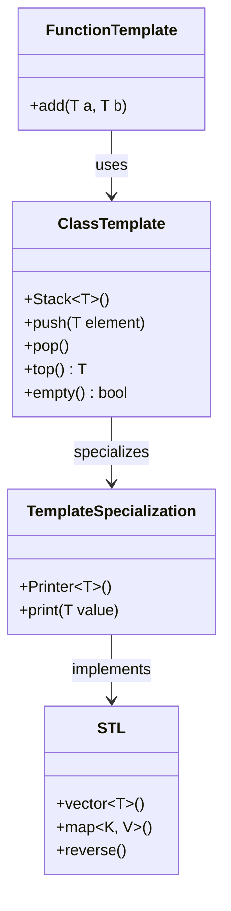

## 2.3 Templates and Generic Programming

In C++, templates and generic programming are powerful tools that allow developers to write flexible, reusable, and type-safe code. By abstracting operations over types, templates enable us to define functions and classes that work with any data type. This section will delve into the intricacies of function templates, class templates, template specialization, and the Standard Template Library (STL), providing you with the knowledge to harness these features effectively.

### Function Templates

Function templates are a cornerstone of generic programming in C++. They allow you to write a single function that can operate on different data types. Let's explore how function templates work and how they can be implemented in C++.

#### Defining Function Templates

A function template is defined using the `template` keyword followed by a template parameter list enclosed in angle brackets. Here's a simple example:

```cpp
#include <iostream>

// Define a function template
template <typename T>
T add(T a, T b) {
    return a + b;
}

int main() {
    std::cout << "Sum of integers: " << add(3, 4) << std::endl; // Calls add<int>
    std::cout << "Sum of doubles: " << add(3.5, 4.5) << std::endl; // Calls add<double>
    return 0;
}
```

In this example, the `add` function template can add two numbers of any type. The compiler generates specific versions of the function for each type used in the program.

#### Key Points

- **Type Deduction**: The compiler automatically deduces the type of the template parameters based on the arguments passed to the function.
- **Explicit Instantiation**: You can explicitly specify the template arguments when calling the function, e.g., `add<int>(3, 4);`.
- **Template Parameters**: You can use multiple template parameters, e.g., `template <typename T, typename U>`.

#### Try It Yourself

Experiment with the `add` function template by adding support for custom types. Define a simple `Point` struct and overload the `+` operator to see how the template handles user-defined types.

### Class Templates

Class templates extend the concept of templates to classes, allowing you to create generic data structures and classes. This section will guide you through the process of defining and using class templates.

#### Defining Class Templates

A class template is defined similarly to a function template, but it applies to an entire class. Here's an example of a simple stack class template:

```cpp
#include <iostream>
#include <vector>

// Define a class template
template <typename T>
class Stack {
private:
    std::vector<T> elements;

public:
    void push(const T& element) {
        elements.push_back(element);
    }

    void pop() {
        if (!elements.empty()) {
            elements.pop_back();
        }
    }

    T top() const {
        if (!elements.empty()) {
            return elements.back();
        }
        throw std::out_of_range("Stack<>::top(): empty stack");
    }

    bool empty() const {
        return elements.empty();
    }
};

int main() {
    Stack<int> intStack;
    intStack.push(1);
    intStack.push(2);
    std::cout << "Top of intStack: " << intStack.top() << std::endl;

    Stack<std::string> stringStack;
    stringStack.push("Hello");
    stringStack.push("World");
    std::cout << "Top of stringStack: " << stringStack.top() << std::endl;

    return 0;
}
```

In this example, the `Stack` class template can store elements of any type. The type is specified when creating an instance of the class.

#### Key Points

- **Type Flexibility**: Class templates allow you to create flexible data structures that can work with any data type.
- **Instantiation**: The compiler generates a specific version of the class for each type used in the program.
- **Member Functions**: Template member functions can be defined inside or outside the class definition.

#### Try It Yourself

Modify the `Stack` class template to include a `size` method that returns the number of elements in the stack. Test it with different data types to ensure it works as expected.

### Template Specialization

Template specialization allows you to define specific implementations of a template for particular types. This is useful when you need to handle certain types differently.

#### Full Specialization

Full specialization involves providing a complete implementation of a template for a specific type. Here's an example:

```cpp
#include <iostream>

// Primary template
template <typename T>
class Printer {
public:
    void print(const T& value) {
        std::cout << "Value: " << value << std::endl;
    }
};

// Full specialization for char*
template <>
class Printer<char*> {
public:
    void print(const char* value) {
        std::cout << "String: " << value << std::endl;
    }
};

int main() {
    Printer<int> intPrinter;
    intPrinter.print(42);

    Printer<char*> stringPrinter;
    stringPrinter.print("Hello, World!");

    return 0;
}
```

In this example, the `Printer` class template has a full specialization for `char*`, which handles strings differently from other types.

#### Partial Specialization

Partial specialization allows you to specialize a template for a subset of its parameters. Here's an example with a class template:

```cpp
#include <iostream>

// Primary template
template <typename T, typename U>
class Pair {
public:
    void display() {
        std::cout << "Generic Pair" << std::endl;
    }
};

// Partial specialization for pairs with the same type
template <typename T>
class Pair<T, T> {
public:
    void display() {
        std::cout << "Specialized Pair" << std::endl;
    }
};

int main() {
    Pair<int, double> genericPair;
    genericPair.display(); // Outputs: Generic Pair

    Pair<int, int> specializedPair;
    specializedPair.display(); // Outputs: Specialized Pair

    return 0;
}
```

In this example, the `Pair` class template has a partial specialization for pairs where both types are the same.

#### Key Points

- **Full Specialization**: Provides a complete implementation for a specific type.
- **Partial Specialization**: Specializes a template for a subset of its parameters.
- **Use Cases**: Specialization is useful for optimizing performance or handling specific types differently.

#### Try It Yourself

Create a class template for a `Matrix` and provide a specialization for `Matrix<bool>` that uses a more memory-efficient representation.

### The Standard Template Library (STL)

The Standard Template Library (STL) is a powerful library that provides a set of common data structures and algorithms. It heavily relies on templates to offer generic and reusable components.

#### Overview of STL Components

The STL consists of several components, including:

- **Containers**: Data structures like `vector`, `list`, `map`, and `set` that store collections of objects.
- **Iterators**: Objects that allow traversal of elements in a container.
- **Algorithms**: Functions for performing operations on containers, such as sorting, searching, and transforming.
- **Function Objects**: Objects that can be used as functions, often used with algorithms.

#### Using STL Containers

STL containers are versatile and can store any data type. Here's an example using a `vector`:

```cpp
#include <iostream>
#include <vector>
#include <algorithm>

int main() {
    std::vector<int> numbers = {1, 2, 3, 4, 5};

    // Use an STL algorithm to reverse the vector
    std::reverse(numbers.begin(), numbers.end());

    // Print the reversed vector
    for (int num : numbers) {
        std::cout << num << " ";
    }
    std::cout << std::endl;

    return 0;
}
```

In this example, the `vector` container stores integers, and the `reverse` algorithm reverses the order of the elements.

#### Key Points

- **Genericity**: STL containers and algorithms are highly generic and can work with any data type.
- **Efficiency**: STL components are optimized for performance and memory usage.
- **Interoperability**: Containers, iterators, and algorithms are designed to work seamlessly together.

#### Try It Yourself

Experiment with different STL containers and algorithms. For example, use a `map` to count the frequency of words in a text and sort them by frequency.

### Visualizing Templates and Generic Programming

To better understand the relationships between templates, specialization, and the STL, let's visualize these concepts using a class diagram.



#### Diagram Explanation

- **FunctionTemplate**: Represents a generic function template, such as `add`.
- **ClassTemplate**: Represents a generic class template, such as `Stack`.
- **TemplateSpecialization**: Represents specialized templates, such as `Printer<char*>`.
- **STL**: Represents STL components, such as `vector` and `map`.

### References and Links

For further reading on templates and generic programming in C++, consider exploring the following resources:

- [C++ Templates: The Complete Guide](https://www.amazon.com/C-Templates-Complete-Guide-2nd/dp/0321714121) by David Vandevoorde and Nicolai M. Josuttis
- [The C++ Standard Library: A Tutorial and Reference](https://www.amazon.com/Standard-Library-Tutorial-Reference-2nd/dp/0321623215) by Nicolai M. Josuttis
- [cppreference.com](https://en.cppreference.com/w/) for detailed documentation on C++ templates and the STL

### Knowledge Check

Before moving on, let's review some key concepts:

- **Function Templates**: Allow you to write functions that work with any data type.
- **Class Templates**: Enable you to create generic data structures and classes.
- **Template Specialization**: Provides specific implementations for certain types.
- **STL**: A powerful library of generic data structures and algorithms.

### Embrace the Journey

Remember, mastering templates and generic programming in C++ is a journey. As you continue to experiment and explore, you'll discover new ways to leverage these powerful features to write more efficient and reusable code. Keep experimenting, stay curious, and enjoy the journey!

## Quiz Time!



### What is the primary purpose of function templates in C++?

- [x] To allow functions to operate on different data types
- [ ] To improve the performance of a program
- [ ] To simplify the syntax of functions
- [ ] To restrict functions to a single data type

> **Explanation:** Function templates enable functions to work with any data type, making them flexible and reusable.

### How do you explicitly specify template arguments when calling a function template?

- [x] By using angle brackets, e.g., `add<int>(3, 4);`
- [ ] By using square brackets, e.g., `add[int](3, 4);`
- [ ] By using parentheses, e.g., `add(int)(3, 4);`
- [ ] By using curly braces, e.g., `add{int}(3, 4);`

> **Explanation:** Template arguments are specified using angle brackets when explicitly calling a function template.

### What is the main advantage of class templates?

- [x] They allow the creation of generic data structures that work with any data type.
- [ ] They automatically optimize the performance of a program.
- [ ] They simplify the syntax of class definitions.
- [ ] They restrict classes to a single data type.

> **Explanation:** Class templates enable the creation of flexible data structures that can store any type of data.

### What is template specialization used for?

- [x] To provide specific implementations of a template for certain types
- [ ] To improve the performance of a template
- [ ] To simplify the syntax of templates
- [ ] To restrict templates to a single data type

> **Explanation:** Template specialization allows for specific implementations of a template for particular types, optimizing performance or handling special cases.

### Which of the following is NOT a component of the STL?

- [ ] Containers
- [ ] Iterators
- [ ] Algorithms
- [x] Classes

> **Explanation:** The STL consists of containers, iterators, and algorithms, but not classes as a separate component.

### What is the purpose of STL iterators?

- [x] To allow traversal of elements in a container
- [ ] To store collections of objects
- [ ] To perform operations on containers
- [ ] To define function objects

> **Explanation:** STL iterators are used to traverse elements in a container, enabling algorithms to operate on them.

### How does the STL achieve genericity?

- [x] By using templates to define containers and algorithms
- [ ] By using inheritance to define containers and algorithms
- [ ] By using macros to define containers and algorithms
- [ ] By using polymorphism to define containers and algorithms

> **Explanation:** The STL uses templates to define generic containers and algorithms that can work with any data type.

### What is the role of function objects in the STL?

- [x] To be used as functions, often with algorithms
- [ ] To store collections of objects
- [ ] To define iterators for containers
- [ ] To perform input/output operations

> **Explanation:** Function objects in the STL can be used as functions, often in conjunction with algorithms to perform operations.

### True or False: Partial specialization allows you to specialize a template for a subset of its parameters.

- [x] True
- [ ] False

> **Explanation:** Partial specialization allows you to specialize a template for a subset of its parameters, providing flexibility in template design.

### True or False: The STL is optimized for performance and memory usage.

- [x] True
- [ ] False

> **Explanation:** The STL is designed to be efficient in terms of performance and memory usage, making it suitable for a wide range of applications.


