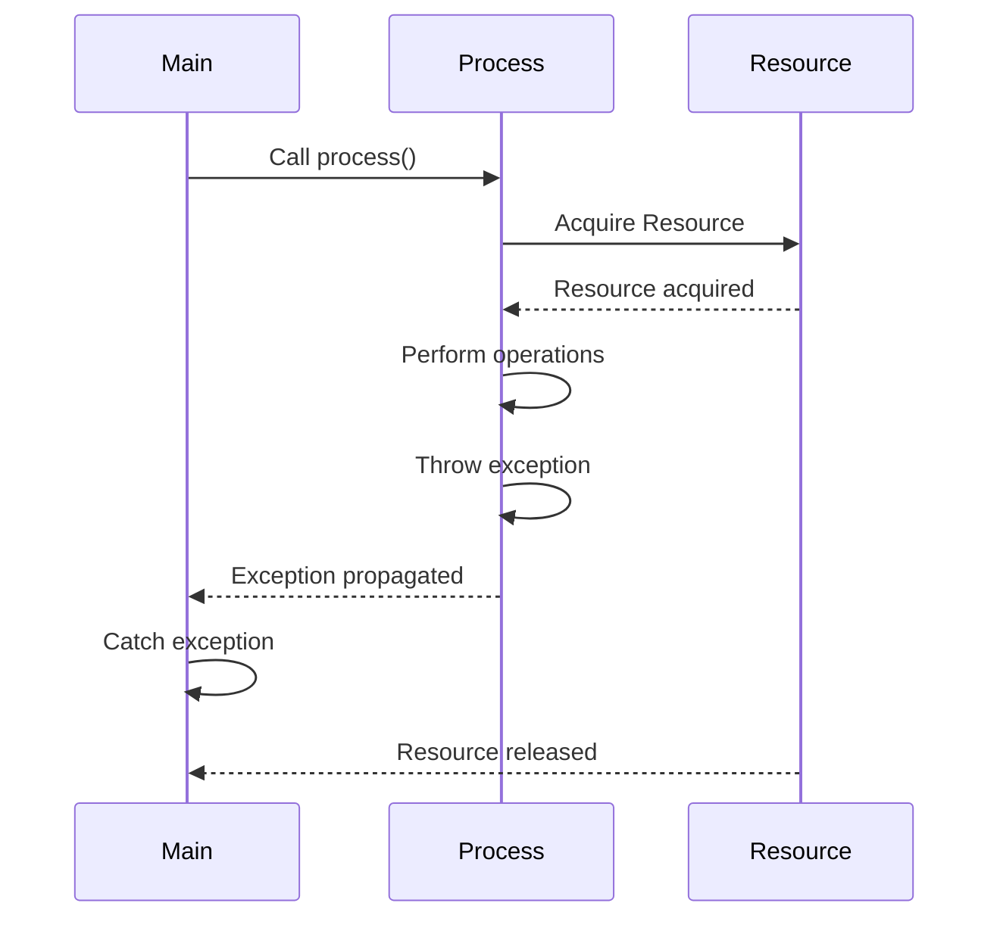

## 2.4 Exception Handling

Exception handling is a critical aspect of robust software development in C++. It provides a structured way to detect and manage runtime errors, ensuring that your applications can gracefully recover from unexpected conditions. In this section, we will delve into the intricacies of exception handling in C++, covering the mechanics of throwing and catching exceptions, best practices for ensuring exception safety, and the use of Resource Acquisition Is Initialization (RAII) for managing resources effectively.

### Introduction to Exception Handling in C++

Exception handling in C++ is designed to manage errors and exceptional situations in a controlled manner. Unlike traditional error-handling techniques, such as return codes, exceptions allow you to separate error-handling code from regular code, leading to cleaner and more maintainable programs.

#### Key Concepts

- **Exception**: An object representing an error or unexpected condition.
- **Throwing an Exception**: The process of signaling that an error has occurred.
- **Catching an Exception**: The process of handling an error by executing a block of code.
- **Exception Propagation**: The process by which an exception moves up the call stack until it is caught.

### Throwing and Catching Exceptions

In C++, exceptions are thrown using the `throw` keyword and caught using `try` and `catch` blocks. Let's explore these concepts in detail.

#### Throwing Exceptions

To signal an error, you throw an exception using the `throw` keyword followed by an exception object. This object can be of any type, but it is common to use classes derived from `std::exception`.

```cpp
#include <iostream>
#include <stdexcept>

void divide(int numerator, int denominator) {
    if (denominator == 0) {
        throw std::invalid_argument("Denominator cannot be zero");
    }
    std::cout << "Result: " << numerator / denominator << std::endl;
}
```

In the example above, we throw a `std::invalid_argument` exception if the denominator is zero. This exception is a standard library class that inherits from `std::exception`.

#### Catching Exceptions

To handle exceptions, use a `try` block to wrap the code that might throw an exception, followed by one or more `catch` blocks to handle specific exceptions.

```cpp
int main() {
    try {
        divide(10, 0);
    } catch (const std::invalid_argument& e) {
        std::cerr << "Caught exception: " << e.what() << std::endl;
    }
    return 0;
}
```

In this example, the `catch` block handles `std::invalid_argument` exceptions. The `what()` method provides a description of the exception.

#### Multiple Catch Blocks

You can use multiple `catch` blocks to handle different types of exceptions. The order of `catch` blocks matters, as the first matching block will be executed.

```cpp
try {
    // Code that might throw exceptions
} catch (const std::invalid_argument& e) {
    // Handle invalid argument exceptions
} catch (const std::runtime_error& e) {
    // Handle runtime errors
} catch (...) {
    // Handle any other exceptions
}
```

The ellipsis (`...`) in the last `catch` block is a catch-all handler that can catch any exception not caught by previous blocks.

### Best Practices for Exception Safety

Ensuring exception safety is crucial for writing robust C++ applications. Exception safety guarantees that a program remains in a valid state even when exceptions occur. There are three levels of exception safety:

1. **Basic Guarantee**: Ensures that invariants are preserved and no resources are leaked. However, the state of the program might be inconsistent.
2. **Strong Guarantee**: Ensures that operations are either completed successfully or have no effect, similar to a transaction.
3. **No-Throw Guarantee**: Ensures that operations will not throw exceptions. This is typically used for destructors and swap functions.

#### Implementing Exception Safety

To achieve exception safety, follow these best practices:

- **Use RAII**: Resource Acquisition Is Initialization (RAII) is a C++ idiom that ties resource management to object lifetime. By using RAII, you can ensure that resources are automatically released when objects go out of scope, even if exceptions occur.
- **Prefer Stack Allocation**: Allocate objects on the stack whenever possible, as they are automatically destroyed when they go out of scope.
- **Use Smart Pointers**: Use smart pointers (`std::unique_ptr`, `std::shared_ptr`) to manage dynamic memory and avoid memory leaks.
- **Avoid Raw Pointers**: Minimize the use of raw pointers to reduce the risk of memory leaks and dangling pointers.
- **Use `noexcept`**: Mark functions that are guaranteed not to throw exceptions with the `noexcept` specifier. This can improve performance and help the compiler optimize code.

#### Example of Exception Safety

Let's look at an example that demonstrates exception safety using RAII and smart pointers.

```cpp
#include <iostream>
#include <memory>
#include <stdexcept>

class Resource {
public:
    Resource() { std::cout << "Resource acquired\n"; }
    ~Resource() { std::cout << "Resource released\n"; }
};

void process() {
    std::unique_ptr<Resource> resource = std::make_unique<Resource>();
    // Perform operations on the resource
    throw std::runtime_error("Error during processing");
}

int main() {
    try {
        process();
    } catch (const std::runtime_error& e) {
        std::cerr << "Caught exception: " << e.what() << std::endl;
    }
    return 0;
}
```

In this example, the `Resource` object is managed by a `std::unique_ptr`, ensuring that it is automatically released when an exception is thrown.

### RAII for Exception Safety

RAII is a powerful idiom in C++ that binds resource management to object lifetime. By acquiring resources in a constructor and releasing them in a destructor, you can ensure that resources are properly managed, even in the presence of exceptions.

#### Understanding RAII

RAII stands for Resource Acquisition Is Initialization. It is based on the principle that resources should be acquired and released in a deterministic manner, tied to the lifetime of an object.

- **Acquisition**: Resources are acquired in the constructor of a class.
- **Initialization**: The acquired resources are initialized and ready for use.
- **Release**: Resources are released in the destructor of the class.

#### Benefits of RAII

- **Automatic Resource Management**: Resources are automatically released when objects go out of scope, reducing the risk of resource leaks.
- **Exception Safety**: RAII ensures that resources are released even if exceptions occur, maintaining program stability.
- **Simplified Code**: RAII simplifies code by encapsulating resource management within classes, reducing the need for manual cleanup.

#### Example of RAII

Let's explore an example that demonstrates RAII in action.

```cpp
#include <iostream>
#include <fstream>
#include <stdexcept>

class FileHandler {
public:
    FileHandler(const std::string& filename) : file(filename) {
        if (!file.is_open()) {
            throw std::runtime_error("Failed to open file");
        }
    }

    ~FileHandler() {
        if (file.is_open()) {
            file.close();
        }
    }

    void write(const std::string& data) {
        if (!file.is_open()) {
            throw std::runtime_error("File is not open");
        }
        file << data;
    }

private:
    std::ofstream file;
};

int main() {
    try {
        FileHandler fileHandler("example.txt");
        fileHandler.write("Hello, World!");
    } catch (const std::runtime_error& e) {
        std::cerr << "Caught exception: " << e.what() << std::endl;
    }
    return 0;
}
```

In this example, the `FileHandler` class uses RAII to manage a file resource. The file is opened in the constructor and closed in the destructor, ensuring that it is properly managed even if exceptions occur.

### Visualizing Exception Handling Flow

To better understand the flow of exception handling, let's visualize the process using a sequence diagram.



**Figure 1: Exception Handling Flow** - This diagram illustrates the flow of exception handling in a C++ program. The `process()` function acquires a resource, performs operations, and throws an exception. The exception is propagated to the `main()` function, where it is caught, and the resource is automatically released.

### Try It Yourself

To reinforce your understanding of exception handling in C++, try modifying the code examples provided. Here are some suggestions:

- **Modify the Exception Type**: Change the type of exception thrown in the `divide()` function and observe how the `catch` block handles it.
- **Add Additional Catch Blocks**: Add more `catch` blocks to handle different types of exceptions and test the program with various inputs.
- **Experiment with RAII**: Create a new class that manages a different type of resource using RAII and test its exception safety.

### References and Further Reading

- [C++ Reference: Exception Handling](https://en.cppreference.com/w/cpp/language/exceptions)
- [C++ Core Guidelines: Error Handling](https://isocpp.github.io/CppCoreGuidelines/CppCoreGuidelines#S-errors)
- [Effective C++ by Scott Meyers](https://www.amazon.com/Effective-Specific-Improve-Programs-Designs/dp/0321334876)

### Knowledge Check

Let's summarize the key takeaways from this section:

- Exception handling in C++ allows you to manage errors in a structured way, separating error-handling code from regular code.
- Throwing exceptions is done using the `throw` keyword, and exceptions are caught using `try` and `catch` blocks.
- Exception safety guarantees that a program remains in a valid state even when exceptions occur, with three levels: basic, strong, and no-throw.
- RAII is a powerful idiom that ties resource management to object lifetime, ensuring automatic resource release and exception safety.

Remember, mastering exception handling is an ongoing journey. Keep experimenting, stay curious, and enjoy the process of building robust and reliable C++ applications!

## Quiz Time!



### What is the primary purpose of exception handling in C++?

- [x] To manage errors and exceptional situations in a controlled manner.
- [ ] To improve the performance of C++ programs.
- [ ] To simplify the syntax of C++ code.
- [ ] To enhance the readability of C++ programs.

> **Explanation:** Exception handling in C++ is designed to manage errors and exceptional situations in a controlled manner, allowing for cleaner and more maintainable code.

### Which keyword is used to throw an exception in C++?

- [ ] catch
- [x] throw
- [ ] try
- [ ] except

> **Explanation:** The `throw` keyword is used to signal that an error has occurred by throwing an exception.

### What is the role of a `catch` block in C++ exception handling?

- [x] To handle exceptions by executing a block of code.
- [ ] To propagate exceptions up the call stack.
- [ ] To signal that an error has occurred.
- [ ] To initialize resources.

> **Explanation:** A `catch` block is used to handle exceptions by executing a block of code that addresses the error.

### What is the basic guarantee in exception safety?

- [x] Ensures that invariants are preserved and no resources are leaked.
- [ ] Ensures that operations are either completed successfully or have no effect.
- [ ] Ensures that operations will not throw exceptions.
- [ ] Ensures that exceptions are propagated to the caller.

> **Explanation:** The basic guarantee ensures that invariants are preserved and no resources are leaked, although the program state might be inconsistent.

### What does RAII stand for in C++?

- [x] Resource Acquisition Is Initialization
- [ ] Resource Allocation Is Initialization
- [ ] Resource Acquisition Is Immediate
- [ ] Resource Allocation Is Immediate

> **Explanation:** RAII stands for Resource Acquisition Is Initialization, a C++ idiom that ties resource management to object lifetime.

### What is the purpose of the `noexcept` specifier in C++?

- [x] To mark functions that are guaranteed not to throw exceptions.
- [ ] To catch exceptions thrown by a function.
- [ ] To throw exceptions from a function.
- [ ] To initialize resources in a function.

> **Explanation:** The `noexcept` specifier is used to mark functions that are guaranteed not to throw exceptions, which can improve performance and optimization.

### How does RAII contribute to exception safety?

- [x] By ensuring that resources are released even if exceptions occur.
- [ ] By preventing exceptions from being thrown.
- [ ] By catching exceptions at runtime.
- [ ] By improving the performance of exception handling.

> **Explanation:** RAII ensures that resources are released even if exceptions occur, contributing to exception safety by maintaining program stability.

### Which of the following is a benefit of using RAII?

- [x] Automatic resource management
- [ ] Improved syntax readability
- [ ] Faster execution speed
- [ ] Simplified error messages

> **Explanation:** RAII provides automatic resource management by tying resource acquisition and release to object lifetime, reducing the risk of resource leaks.

### What is the role of a destructor in RAII?

- [x] To release resources when an object goes out of scope.
- [ ] To acquire resources when an object is created.
- [ ] To throw exceptions when an error occurs.
- [ ] To catch exceptions during object destruction.

> **Explanation:** In RAII, the destructor is responsible for releasing resources when an object goes out of scope, ensuring proper resource management.

### True or False: RAII can be used to manage both memory and non-memory resources in C++.

- [x] True
- [ ] False

> **Explanation:** RAII can be used to manage both memory and non-memory resources, such as file handles and network connections, by tying resource management to object lifetime.


