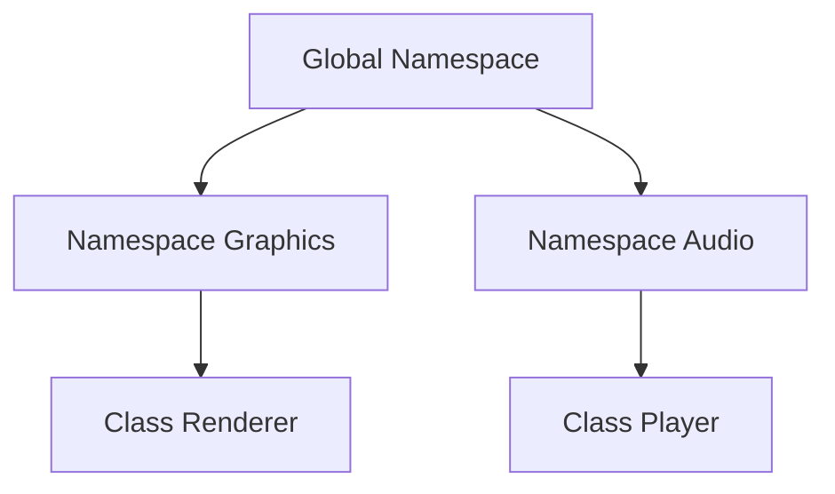

## 2.5 Namespace Management

In the realm of C++ programming, managing namespaces is a crucial aspect of organizing code and avoiding name clashes, especially in large projects. Namespaces provide a way to group related classes, functions, and variables under a single umbrella, thus preventing conflicts between identifiers that might otherwise have the same name. In this section, we will delve into the intricacies of namespace management, exploring best practices and techniques to enhance code modularity and maintainability.

### Understanding Namespaces in C++

Namespaces in C++ are a mechanism to group entities like classes, objects, and functions under a name. This feature helps in organizing code logically and avoiding name conflicts, especially when integrating multiple libraries or working on large projects.

```cpp
namespace MyNamespace {
    class MyClass {
    public:
        void display();
    };
    
    void MyClass::display() {
        std::cout << "Hello from MyNamespace!" << std::endl;
    }
}
```

In the example above, `MyClass` is encapsulated within `MyNamespace`, ensuring that any other `MyClass` in a different namespace won't conflict with this one.

### The Importance of Namespace Management

1. **Avoiding Name Clashes**: In large projects, it's common to encounter name clashes where two different entities share the same name. Namespaces help avoid these clashes by providing a scope for identifiers.

2. **Code Organization**: Namespaces allow developers to logically group related functionalities, making the codebase easier to navigate and understand.

3. **Modularity**: By encapsulating code within namespaces, you can create modular components that can be reused across different parts of a project or even in different projects.

4. **Maintainability**: Well-organized code is easier to maintain. Namespaces contribute to this by reducing the likelihood of errors related to name conflicts and by making the code structure more intuitive.

### Best Practices for Using Namespaces

#### 1. Use Descriptive Namespace Names

Choose names that clearly describe the purpose or functionality of the code within the namespace. This practice enhances readability and helps other developers understand the code's intent.

```cpp
namespace AudioProcessing {
    // Code related to audio processing
}
```

#### 2. Avoid Using `using namespace` in Headers

Using `using namespace` in header files can lead to name clashes in any file that includes the header. Instead, use fully qualified names or limit `using namespace` to source files.

```cpp
// Avoid this in header files
using namespace std;

// Prefer this
std::string name = "Example";
```

#### 3. Nest Namespaces for Hierarchical Organization

In complex projects, you might need to create a hierarchy of namespaces to reflect the structure of your codebase.

```cpp
namespace Company {
    namespace Product {
        namespace Module {
            // Code specific to a module
        }
    }
}
```

#### 4. Use Anonymous Namespaces for Internal Linkage

Anonymous namespaces are useful for defining entities that should only be visible within a single translation unit, preventing external linkage.

```cpp
namespace {
    void helperFunction() {
        // This function is only accessible within this file
    }
}
```

#### 5. Consider Namespace Aliases for Convenience

Namespace aliases can simplify code by providing a shorter name for a namespace, especially when dealing with deeply nested namespaces.

```cpp
namespace MP = MyProject::Utilities::Math;
MP::calculate();
```

### Code Examples and Common Patterns

#### Example: Avoiding Name Clashes

Consider a scenario where two libraries define a function with the same name:

```cpp
namespace LibraryA {
    void process() {
        std::cout << "Processing in Library A" << std::endl;
    }
}

namespace LibraryB {
    void process() {
        std::cout << "Processing in Library B" << std::endl;
    }
}

int main() {
    LibraryA::process();
    LibraryB::process();
    return 0;
}
```

By using namespaces, we can call the correct `process` function without any ambiguity.

#### Example: Organizing Code with Namespaces

Let's organize a simple project with namespaces:

```cpp
namespace Graphics {
    class Renderer {
    public:
        void render();
    };
}

namespace Audio {
    class Player {
    public:
        void play();
    };
}

int main() {
    Graphics::Renderer renderer;
    Audio::Player player;

    renderer.render();
    player.play();

    return 0;
}
```

This structure helps in maintaining a clear separation of concerns, making the codebase easier to manage.

### Visualizing Namespace Hierarchies

To better understand how namespaces can be structured, let's visualize a simple hierarchy using Mermaid.js:



This diagram illustrates how the `Graphics` and `Audio` namespaces are part of the global namespace, each containing their respective classes.

### Challenges and Considerations

While namespaces are powerful, they come with their own set of challenges:

- **Complexity**: Overusing namespaces or creating deeply nested namespaces can lead to complexity, making the code harder to read and maintain.
- **Namespace Pollution**: Introducing too many entities into a single namespace can lead to pollution, where the namespace becomes cluttered and difficult to navigate.
- **Compatibility**: When integrating third-party libraries, ensure that namespace conventions are compatible to avoid conflicts.

### Try It Yourself

Experiment with the following code to see how namespaces can be used to organize code and avoid name clashes:

```cpp
namespace Math {
    int add(int a, int b) {
        return a + b;
    }
}

namespace Physics {
    int add(int a, int b) {
        return a * b; // Hypothetical operation
    }
}

int main() {
    std::cout << "Math Add: " << Math::add(3, 4) << std::endl;
    std::cout << "Physics Add: " << Physics::add(3, 4) << std::endl;
    return 0;
}
```

Try modifying the `add` function in each namespace to perform different operations and observe the results.

### References and Further Reading

- [C++ Reference: Namespaces](https://en.cppreference.com/w/cpp/language/namespace)
- [ISO C++ Committee](https://isocpp.org/)
- [C++ Core Guidelines](https://isocpp.github.io/CppCoreGuidelines/CppCoreGuidelines)

### Knowledge Check

Before we wrap up, let's reinforce what we've learned with a few questions:

- What is the primary purpose of namespaces in C++?
- Why should `using namespace` be avoided in header files?
- How can anonymous namespaces be used to limit the scope of entities?

### Conclusion

Mastering namespace management in C++ is essential for organizing code effectively and avoiding name clashes in large projects. By following best practices and understanding the nuances of namespaces, you can enhance the modularity and maintainability of your codebase. Remember, this is just the beginning. As you progress, you'll build more complex and interactive applications. Keep experimenting, stay curious, and enjoy the journey!

## Quiz Time!



### What is the primary purpose of namespaces in C++?

- [x] To avoid name clashes and organize code logically
- [ ] To improve code execution speed
- [ ] To simplify syntax
- [ ] To manage memory allocation

> **Explanation:** Namespaces are used to avoid name clashes and organize code logically, especially in large projects or when integrating multiple libraries.

### Why should `using namespace` be avoided in header files?

- [x] It can lead to name clashes in any file that includes the header
- [ ] It makes code execution slower
- [ ] It increases the size of the compiled binary
- [ ] It is deprecated in modern C++

> **Explanation:** Using `using namespace` in header files can lead to name clashes in any file that includes the header, as it brings all the names from the namespace into the global scope.

### How can anonymous namespaces be used effectively?

- [x] To limit the scope of entities to a single translation unit
- [ ] To create global variables
- [ ] To improve code readability
- [ ] To manage memory allocation

> **Explanation:** Anonymous namespaces are used to limit the scope of entities to a single translation unit, preventing external linkage.

### What is a potential drawback of overusing namespaces?

- [x] Increased complexity and difficulty in reading the code
- [ ] Reduced code execution speed
- [ ] Increased memory usage
- [ ] Decreased modularity

> **Explanation:** Overusing namespaces or creating deeply nested namespaces can lead to increased complexity, making the code harder to read and maintain.

### What is a namespace alias?

- [x] A shorter name for a namespace
- [ ] A type of variable
- [ ] A function pointer
- [ ] A macro definition

> **Explanation:** A namespace alias is a shorter name for a namespace, used to simplify code, especially when dealing with deeply nested namespaces.

### Which of the following is a benefit of using namespaces?

- [x] Improved code modularity
- [ ] Faster code execution
- [ ] Reduced memory usage
- [ ] Simplified syntax

> **Explanation:** Namespaces improve code modularity by allowing developers to logically group related functionalities, making the codebase easier to navigate and understand.

### What is namespace pollution?

- [x] Introducing too many entities into a single namespace
- [ ] Using too many global variables
- [ ] Overloading functions excessively
- [ ] Using too many macros

> **Explanation:** Namespace pollution occurs when too many entities are introduced into a single namespace, making it cluttered and difficult to navigate.

### How can you prevent namespace pollution?

- [x] By organizing code into multiple, smaller namespaces
- [ ] By using global variables
- [ ] By avoiding function overloading
- [ ] By using macros

> **Explanation:** Prevent namespace pollution by organizing code into multiple, smaller namespaces, each with a clear purpose.

### What is the benefit of using nested namespaces?

- [x] They reflect the hierarchical structure of the codebase
- [ ] They increase code execution speed
- [ ] They reduce memory usage
- [ ] They simplify syntax

> **Explanation:** Nested namespaces reflect the hierarchical structure of the codebase, helping in organizing complex projects logically.

### True or False: Namespaces can be used to manage memory allocation.

- [ ] True
- [x] False

> **Explanation:** Namespaces are not used to manage memory allocation. They are used to organize code and avoid name clashes.


