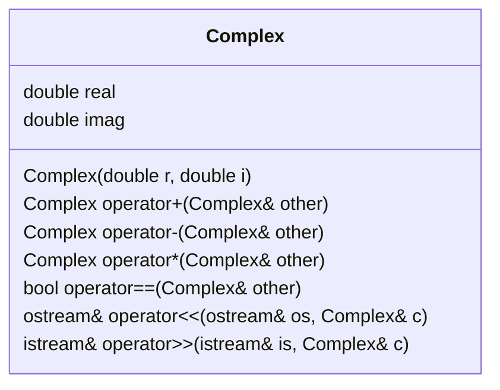

## 2.6 Operator Overloading

Operator overloading is a powerful feature in C++ that allows developers to redefine the way operators work with user-defined types. By enabling operators to work with custom objects, you can make your classes more intuitive and easier to use. In this section, we will delve into the intricacies of operator overloading, explore the rules and best practices, and provide comprehensive examples to illustrate these concepts.

### Understanding Operator Overloading

#### What is Operator Overloading?

Operator overloading allows you to define the behavior of operators (such as `+`, `-`, `*`, `==`, etc.) for your custom types. This means you can use these operators with objects of your classes just as you would with built-in types. For instance, if you have a `Complex` number class, you can overload the `+` operator to add two `Complex` numbers.

#### Why Use Operator Overloading?

- **Intuitive Syntax**: Operator overloading allows you to use operators in a way that is natural and intuitive, making your code easier to read and maintain.
- **Consistency**: It provides a consistent interface for your custom types, similar to built-in types.
- **Enhanced Functionality**: By overloading operators, you can extend the functionality of your classes and make them more versatile.

### Rules and Best Practices

#### Rules for Operator Overloading

1. **Cannot Create New Operators**: You can only overload existing operators. You cannot create new operators.
2. **Preserve Operator Arity**: The number of operands an operator takes cannot be changed. For example, you cannot make the unary `-` operator take two operands.
3. **Respect Operator Precedence**: The precedence and associativity of operators cannot be changed.
4. **Overload as Member or Non-member**: Operators can be overloaded as member functions or non-member functions. However, certain operators (like `=`) must be overloaded as member functions.
5. **Return Types**: The return type of an overloaded operator can be any type, but it should be consistent with the operator's expected behavior.

#### Best Practices for Operator Overloading

- **Maintain Consistency**: Ensure that the overloaded operators behave in a way that is consistent with their use on built-in types.
- **Use Friend Functions Wisely**: Use friend functions for binary operators when the left operand is not an object of your class.
- **Avoid Overloading Unintuitive Operators**: Do not overload operators in a way that is not intuitive or expected.
- **Document Overloaded Operators**: Clearly document the behavior of overloaded operators to avoid confusion.
- **Consider Performance**: Be mindful of performance implications, especially with operators that involve complex computations.

### Implementing Operator Overloading

Let's explore how to implement operator overloading with a practical example. We'll create a `Complex` class and overload several operators to demonstrate the process.

#### Example: Overloading Operators for a Complex Number Class

```cpp
#include <iostream>

class Complex {
private:
    double real;
    double imag;

public:
    // Constructor
    Complex(double r = 0.0, double i = 0.0) : real(r), imag(i) {}

    // Overload the + operator
    Complex operator+(const Complex& other) const {
        return Complex(real + other.real, imag + other.imag);
    }

    // Overload the - operator
    Complex operator-(const Complex& other) const {
        return Complex(real - other.real, imag - other.imag);
    }

    // Overload the * operator
    Complex operator*(const Complex& other) const {
        return Complex(real * other.real - imag * other.imag,
                       real * other.imag + imag * other.real);
    }

    // Overload the == operator
    bool operator==(const Complex& other) const {
        return (real == other.real) && (imag == other.imag);
    }

    // Friend function to overload the << operator
    friend std::ostream& operator<<(std::ostream& os, const Complex& c) {
        os << c.real << " + " << c.imag << "i";
        return os;
    }

    // Friend function to overload the >> operator
    friend std::istream& operator>>(std::istream& is, Complex& c) {
        is >> c.real >> c.imag;
        return is;
    }
};

int main() {
    Complex c1(3.0, 4.0);
    Complex c2(1.0, 2.0);

    Complex c3 = c1 + c2;
    Complex c4 = c1 - c2;
    Complex c5 = c1 * c2;

    std::cout << "c1: " << c1 << "\n";
    std::cout << "c2: " << c2 << "\n";
    std::cout << "c1 + c2: " << c3 << "\n";
    std::cout << "c1 - c2: " << c4 << "\n";
    std::cout << "c1 * c2: " << c5 << "\n";

    if (c1 == c2) {
        std::cout << "c1 and c2 are equal.\n";
    } else {
        std::cout << "c1 and c2 are not equal.\n";
    }

    return 0;
}
```

#### Explanation of the Code

- **Constructor**: Initializes the real and imaginary parts of the complex number.
- **Operator `+`**: Adds two complex numbers by adding their real and imaginary parts separately.
- **Operator `-`**: Subtracts one complex number from another.
- **Operator `*`**: Multiplies two complex numbers using the formula `(a + bi)(c + di) = (ac - bd) + (ad + bc)i`.
- **Operator `==`**: Compares two complex numbers for equality.
- **Friend Functions**: Used to overload the `<<` and `>>` operators for input and output operations.

### Try It Yourself

Experiment with the `Complex` class by adding more operators, such as `/` for division or `!=` for inequality. You can also try implementing the `+=` and `-=` operators to modify the current object.

### Visualizing Operator Overloading

To better understand how operator overloading works, let's visualize the process using a class diagram.



This diagram illustrates the `Complex` class with its member functions and overloaded operators.

### Advanced Operator Overloading Techniques

#### Overloading Unary Operators

Unary operators, such as `++`, `--`, and `-`, can also be overloaded. These operators typically operate on a single operand.

```cpp
class Counter {
private:
    int count;

public:
    Counter(int c = 0) : count(c) {}

    // Overload the prefix ++ operator
    Counter& operator++() {
        ++count;
        return *this;
    }

    // Overload the postfix ++ operator
    Counter operator++(int) {
        Counter temp = *this;
        ++count;
        return temp;
    }

    // Overload the unary - operator
    Counter operator-() const {
        return Counter(-count);
    }

    int getCount() const {
        return count;
    }
};

int main() {
    Counter c(5);

    ++c; // Prefix increment
    std::cout << "After prefix increment: " << c.getCount() << "\n";

    c++; // Postfix increment
    std::cout << "After postfix increment: " << c.getCount() << "\n";

    Counter neg = -c; // Unary minus
    std::cout << "Negated counter: " << neg.getCount() << "\n";

    return 0;
}
```

#### Explanation of Unary Operator Overloading

- **Prefix `++`**: Increments the count and returns the incremented object.
- **Postfix `++`**: Increments the count but returns the original object before incrementing.
- **Unary `-`**: Returns a new `Counter` object with the negated count.

### Operator Overloading for Custom Containers

Operator overloading is particularly useful for custom container classes, such as matrices or vectors. Let's explore how to overload operators for a simple `Matrix` class.

#### Example: Overloading Operators for a Matrix Class

```cpp
#include <iostream>
#include <vector>

class Matrix {
private:
    std::vector<std::vector<int>> data;
    int rows, cols;

public:
    Matrix(int r, int c) : rows(r), cols(c), data(r, std::vector<int>(c)) {}

    // Overload the + operator
    Matrix operator+(const Matrix& other) const {
        if (rows != other.rows || cols != other.cols) {
            throw std::invalid_argument("Matrices must have the same dimensions.");
        }

        Matrix result(rows, cols);
        for (int i = 0; i < rows; ++i) {
            for (int j = 0; j < cols; ++j) {
                result.data[i][j] = data[i][j] + other.data[i][j];
            }
        }
        return result;
    }

    // Overload the << operator for output
    friend std::ostream& operator<<(std::ostream& os, const Matrix& m) {
        for (const auto& row : m.data) {
            for (int val : row) {
                os << val << " ";
            }
            os << "\n";
        }
        return os;
    }
};

int main() {
    Matrix m1(2, 2);
    Matrix m2(2, 2);

    // Initialize matrices
    m1 = Matrix({{1, 2}, {3, 4}});
    m2 = Matrix({{5, 6}, {7, 8}});

    Matrix m3 = m1 + m2;

    std::cout << "Matrix m1:\n" << m1;
    std::cout << "Matrix m2:\n" << m2;
    std::cout << "Matrix m1 + m2:\n" << m3;

    return 0;
}
```

#### Explanation of the Matrix Example

- **Operator `+`**: Adds two matrices element-wise. Throws an exception if the dimensions do not match.
- **Operator `<<`**: Outputs the matrix to the console.

### Design Considerations

When overloading operators, consider the following design aspects:

- **Consistency with Built-in Types**: Ensure that your overloaded operators behave similarly to their built-in counterparts.
- **Error Handling**: Implement appropriate error handling, such as throwing exceptions for invalid operations.
- **Performance**: Be aware of the performance implications of your overloaded operators, especially for complex data structures.

### Differences and Similarities with Other Patterns

Operator overloading can sometimes be confused with function overloading. While both involve defining multiple behaviors for a single name, operator overloading is specifically for operators, whereas function overloading is for functions with different parameter lists.

### Knowledge Check

- **What is operator overloading, and why is it useful?**
- **What are some rules you must follow when overloading operators?**
- **How do you overload a binary operator as a friend function?**
- **What is the difference between overloading prefix and postfix increment operators?**

### Conclusion

Operator overloading is a powerful tool in C++ that allows you to extend the functionality of your classes and make them more intuitive to use. By following the rules and best practices outlined in this guide, you can effectively implement operator overloading in your projects. Remember to experiment with different operators and custom types to deepen your understanding and enhance your coding skills.

## Quiz Time!



### What is operator overloading in C++?

- [x] A feature that allows operators to be redefined for custom types.
- [ ] A feature that allows creating new operators.
- [ ] A feature that changes the precedence of operators.
- [ ] A feature that only works with built-in types.

> **Explanation:** Operator overloading allows existing operators to be redefined for user-defined types, enhancing their functionality and usability.

### Which of the following operators must be overloaded as a member function?

- [x] Assignment operator `=`
- [ ] Addition operator `+`
- [ ] Subtraction operator `-`
- [ ] Equality operator `==`

> **Explanation:** The assignment operator `=` must be overloaded as a member function because it directly modifies the object on the left-hand side.

### What is a key consideration when overloading operators?

- [x] Consistency with built-in types.
- [ ] Changing operator precedence.
- [ ] Creating new operators.
- [ ] Ignoring performance implications.

> **Explanation:** Consistency with built-in types ensures that overloaded operators behave in an expected manner, making code more intuitive.

### How do you overload the `<<` operator for a custom class?

- [x] As a friend function.
- [ ] As a member function.
- [ ] As a global function.
- [ ] As a static function.

> **Explanation:** The `<<` operator is typically overloaded as a friend function to allow access to private members of the class.

### What is the difference between prefix and postfix increment operators?

- [x] Prefix returns the incremented value; postfix returns the original value.
- [ ] Prefix returns the original value; postfix returns the incremented value.
- [ ] Both return the incremented value.
- [ ] Both return the original value.

> **Explanation:** The prefix increment operator increments the value and returns it, while the postfix increment operator returns the original value before incrementing.

### Which operator cannot be overloaded?

- [x] Scope resolution operator `::`
- [ ] Addition operator `+`
- [ ] Multiplication operator `*`
- [ ] Equality operator `==`

> **Explanation:** The scope resolution operator `::` cannot be overloaded in C++.

### What should you consider when overloading operators for performance?

- [x] Avoid unnecessary computations.
- [ ] Change operator precedence.
- [ ] Use global functions only.
- [ ] Ignore memory management.

> **Explanation:** Avoiding unnecessary computations helps maintain performance efficiency when overloading operators.

### Which of the following is a unary operator?

- [x] Negation operator `-`
- [ ] Addition operator `+`
- [ ] Multiplication operator `*`
- [ ] Division operator `/`

> **Explanation:** The negation operator `-` is a unary operator that operates on a single operand.

### What is a common use case for overloading the `[]` operator?

- [x] Custom container classes.
- [ ] Arithmetic operations.
- [ ] Logical comparisons.
- [ ] Bitwise operations.

> **Explanation:** Overloading the `[]` operator is common in custom container classes to provide array-like access to elements.

### True or False: You can change the number of operands an operator takes when overloading it.

- [ ] True
- [x] False

> **Explanation:** You cannot change the number of operands an operator takes when overloading it; the arity must remain the same.



Remember, mastering operator overloading is just one step in your journey to becoming an expert in C++ programming. Keep experimenting, stay curious, and enjoy the process of learning and applying these powerful techniques!
