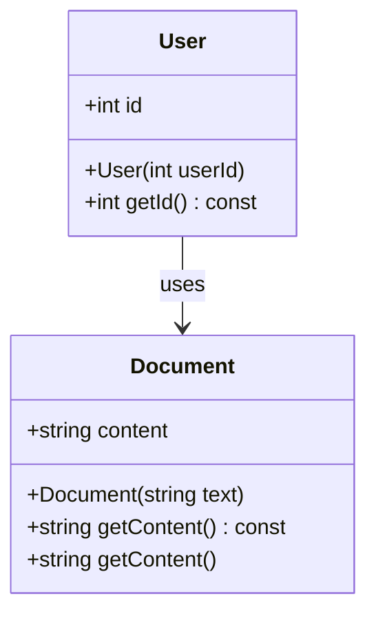

## 2.7 Const Correctness

In the realm of C++ programming, const correctness is a fundamental concept that plays a crucial role in ensuring the stability and reliability of software interfaces. By using the `const` keyword effectively, we can express our intent clearly, prevent unintended modifications, and enhance the maintainability of our code. In this section, we will delve deep into the principles of const correctness, explore its applications, and provide practical examples to illustrate its significance.

### Understanding Const Correctness

Const correctness refers to the practice of using the `const` keyword to specify which variables or objects should not be modified after they are initialized. This concept is essential for expressing the intent of your code and ensuring that certain parts of your program remain immutable. By enforcing immutability, you can prevent accidental changes that could lead to bugs or unexpected behavior.

#### The Role of Const in C++

In C++, the `const` keyword can be applied to various entities, including variables, pointers, member functions, and function parameters. Let's explore each of these applications in detail:

1. **Const Variables**: When you declare a variable as `const`, you are indicating that its value cannot be changed after initialization. This is particularly useful for defining constants or values that should remain fixed throughout the program.

   ```cpp
   const int MAX_USERS = 100;
   ```

2. **Const Pointers**: Const can be used with pointers to specify whether the pointer itself or the value it points to should remain constant.

   - **Pointer to Const**: The pointer can change, but the value it points to cannot.

     ```cpp
     const int* ptrToConst = &MAX_USERS;
     ```

   - **Const Pointer**: The pointer cannot change, but the value it points to can.

     ```cpp
     int* const constPtr = &someVariable;
     ```

   - **Const Pointer to Const**: Neither the pointer nor the value it points to can change.

     ```cpp
     const int* const constPtrToConst = &MAX_USERS;
     ```

3. **Const Member Functions**: When a member function is declared as `const`, it indicates that the function does not modify the state of the object. This is crucial for maintaining the integrity of objects and ensuring that certain operations do not alter the object's data.

   ```cpp
   class User {
   public:
       int getId() const {
           return id;
       }
   private:
       int id;
   };
   ```

4. **Const Function Parameters**: By declaring function parameters as `const`, you can ensure that the function does not modify the arguments passed to it. This is particularly useful for functions that should only read data without altering it.

   ```cpp
   void printUserName(const std::string& name) {
       std::cout << "User Name: " << name << std::endl;
   }
   ```

### Benefits of Const Correctness

Implementing const correctness in your C++ code offers several advantages:

- **Expressing Intent**: By using `const`, you clearly communicate your intention to other developers (and to yourself) that certain variables or objects should not be modified. This enhances code readability and maintainability.

- **Ensuring Interface Stability**: Const correctness helps maintain the stability of interfaces by preventing unintended modifications. This is particularly important in large codebases where multiple developers may interact with the same code.

- **Enabling Compiler Optimizations**: The compiler can make certain optimizations when it knows that a variable or object is immutable. This can lead to improved performance in some cases.

- **Preventing Bugs**: By enforcing immutability, you reduce the risk of accidental changes that could introduce bugs or unexpected behavior.

### Best Practices for Const Correctness

To effectively implement const correctness in your C++ code, consider the following best practices:

1. **Use Const Wherever Possible**: Adopt a mindset of using `const` by default unless you have a specific reason not to. This approach encourages immutability and reduces the likelihood of unintended modifications.

2. **Const-Correct Function Signatures**: Ensure that your function signatures reflect const correctness. If a function does not modify an object, declare it as `const`. Similarly, use `const` for function parameters that should not be altered.

3. **Const-Correct Member Functions**: When designing classes, identify which member functions should be `const`. This is particularly important for accessor functions that retrieve data without modifying the object's state.

4. **Const-Correct Pointers and References**: Pay attention to the use of `const` with pointers and references. Ensure that your code accurately reflects whether the pointer or the value it points to should remain constant.

5. **Avoid Const-Casting**: While C++ provides mechanisms for casting away `const`, such as `const_cast`, use them sparingly and only when absolutely necessary. Const-casting can lead to undefined behavior if not used carefully.

### Code Examples and Applications

Let's explore some practical code examples to illustrate the application of const correctness in C++:

#### Example 1: Const Variables

In this example, we define a constant value for the maximum number of users allowed in a system. By using `const`, we ensure that this value remains unchanged throughout the program.

```cpp
#include <iostream>

const int MAX_USERS = 100;

void displayMaxUsers() {
    std::cout << "Maximum Users: " << MAX_USERS << std::endl;
}

int main() {
    displayMaxUsers();
    // MAX_USERS = 200; // Error: Attempting to modify a const variable
    return 0;
}
```

#### Example 2: Const Member Functions

Consider a class `User` that represents a user in a system. We define a `const` member function `getId` to retrieve the user's ID without modifying the object's state.

```cpp
#include <iostream>

class User {
public:
    User(int userId) : id(userId) {}

    int getId() const {
        return id;
    }

private:
    int id;
};

int main() {
    User user(42);
    std::cout << "User ID: " << user.getId() << std::endl;
    return 0;
}
```

#### Example 3: Const Function Parameters

In this example, we define a function `printUserName` that takes a `const` reference to a string. This ensures that the function does not modify the input string.

```cpp
#include <iostream>
#include <string>

void printUserName(const std::string& name) {
    std::cout << "User Name: " << name << std::endl;
}

int main() {
    std::string userName = "Alice";
    printUserName(userName);
    return 0;
}
```

### Advanced Const Correctness Techniques

As you become more proficient with const correctness, you can explore advanced techniques to further enhance your code's stability and expressiveness.

#### Const-Correct Overloading

C++ allows you to overload member functions based on their constness. This means you can have two versions of a function: one that modifies the object and one that does not.

```cpp
#include <iostream>
#include <string>

class Document {
public:
    Document(const std::string& text) : content(text) {}

    // Const version
    const std::string& getContent() const {
        std::cout << "Const getContent called" << std::endl;
        return content;
    }

    // Non-const version
    std::string& getContent() {
        std::cout << "Non-const getContent called" << std::endl;
        return content;
    }

private:
    std::string content;
};

int main() {
    Document doc("Hello, World!");

    // Call const version
    const Document& constDoc = doc;
    std::cout << constDoc.getContent() << std::endl;

    // Call non-const version
    std::cout << doc.getContent() << std::endl;

    return 0;
}
```

#### Const-Correct Iterators

When working with STL containers, it's important to use const-correct iterators to ensure that you do not modify the container's elements unintentionally.

```cpp
#include <iostream>
#include <vector>

int main() {
    std::vector<int> numbers = {1, 2, 3, 4, 5};

    // Const iterator
    for (std::vector<int>::const_iterator it = numbers.begin(); it != numbers.end(); ++it) {
        std::cout << *it << " ";
        // *it = 10; // Error: Cannot modify element through const iterator
    }
    std::cout << std::endl;

    return 0;
}
```

### Visualizing Const Correctness

To better understand the concept of const correctness, let's visualize how const is applied to different entities in C++ using a class diagram.



**Diagram Description**: This class diagram illustrates two classes, `User` and `Document`. The `User` class has a `const` member function `getId`, while the `Document` class demonstrates const-correct overloading with two versions of the `getContent` function.

### Try It Yourself

To reinforce your understanding of const correctness, try modifying the code examples provided above. Experiment with adding or removing `const` qualifiers and observe the compiler's response. Consider the following challenges:

- Modify the `User` class to include a `setId` function that attempts to change the user's ID. Observe how the `const` qualifier affects this function's implementation.
- Create a new class `Book` with a `const` member function `getTitle` and a non-const member function `setTitle`. Implement const-correct overloading for these functions.
- Use const-correct iterators to traverse a `std::map` and print its key-value pairs.

### References and Further Reading

For more information on const correctness and its applications in C++, consider exploring the following resources:

- [C++ Reference: Const](https://en.cppreference.com/w/cpp/language/cv)
- [C++ Core Guidelines: Const Correctness](https://isocpp.github.io/CppCoreGuidelines/CppCoreGuidelines#S-const)
- [Effective C++ by Scott Meyers](https://www.oreilly.com/library/view/effective-c-55/9780134998051/)

### Knowledge Check

To test your understanding of const correctness, consider the following questions:

1. What is the primary purpose of using the `const` keyword in C++?
2. How does const correctness contribute to interface stability?
3. What are the differences between a pointer to const and a const pointer?
4. How can const-correct overloading be used to provide different versions of a member function?
5. What are the potential risks of using `const_cast` in C++?

### Embrace the Journey

Remember, mastering const correctness is an ongoing journey. As you continue to explore C++ programming, keep experimenting with const qualifiers, stay curious, and enjoy the process of writing more stable and expressive code. Const correctness is a powerful tool that can significantly enhance the quality of your software, so embrace it and let it guide you toward better coding practices.

## Quiz Time!



### What is the primary purpose of using the `const` keyword in C++?

- [x] To prevent unintended modifications to variables or objects
- [ ] To improve the performance of the program
- [ ] To simplify the syntax of the code
- [ ] To enable dynamic memory allocation

> **Explanation:** The primary purpose of using the `const` keyword in C++ is to prevent unintended modifications to variables or objects, thereby enhancing code stability and expressing developer intent.

### How does const correctness contribute to interface stability?

- [x] By preventing unintended modifications to objects
- [ ] By allowing dynamic changes to function signatures
- [ ] By enabling runtime polymorphism
- [ ] By reducing the size of the compiled code

> **Explanation:** Const correctness contributes to interface stability by preventing unintended modifications to objects, ensuring that the interface remains consistent and reliable.

### What is the difference between a pointer to const and a const pointer?

- [x] A pointer to const allows the pointer to change, but not the value it points to
- [ ] A const pointer allows the value to change, but not the pointer itself
- [ ] A pointer to const allows both the pointer and value to change
- [ ] A const pointer allows neither the pointer nor the value to change

> **Explanation:** A pointer to const allows the pointer to change, but not the value it points to, while a const pointer allows the value to change, but not the pointer itself.

### How can const-correct overloading be used in C++?

- [x] By providing different versions of a member function based on constness
- [ ] By allowing multiple functions with the same name and parameters
- [ ] By enabling runtime polymorphism
- [ ] By simplifying the syntax of the code

> **Explanation:** Const-correct overloading can be used in C++ by providing different versions of a member function based on constness, allowing for both const and non-const operations.

### What are the potential risks of using `const_cast` in C++?

- [x] It can lead to undefined behavior if used improperly
- [ ] It simplifies the code and improves performance
- [ ] It enhances the readability of the code
- [ ] It allows for dynamic memory allocation

> **Explanation:** The potential risks of using `const_cast` in C++ include leading to undefined behavior if used improperly, as it removes constness from variables or objects.

### Which of the following is a benefit of const correctness?

- [x] Preventing accidental changes to variables
- [ ] Allowing dynamic memory allocation
- [ ] Enabling runtime polymorphism
- [ ] Reducing the size of the compiled code

> **Explanation:** A benefit of const correctness is preventing accidental changes to variables, which enhances code stability and reliability.

### What is the purpose of a const member function in a class?

- [x] To indicate that the function does not modify the object's state
- [ ] To allow the function to modify the object's state
- [ ] To enable dynamic memory allocation
- [ ] To simplify the syntax of the code

> **Explanation:** The purpose of a const member function in a class is to indicate that the function does not modify the object's state, ensuring the object's integrity.

### How can const-correct iterators be used in C++?

- [x] By ensuring that elements in a container are not modified
- [ ] By allowing elements in a container to be modified
- [ ] By enabling dynamic memory allocation
- [ ] By simplifying the syntax of the code

> **Explanation:** Const-correct iterators can be used in C++ by ensuring that elements in a container are not modified, maintaining the container's integrity.

### What is the role of const function parameters in C++?

- [x] To ensure that the function does not modify the arguments passed to it
- [ ] To allow the function to modify the arguments passed to it
- [ ] To enable dynamic memory allocation
- [ ] To simplify the syntax of the code

> **Explanation:** The role of const function parameters in C++ is to ensure that the function does not modify the arguments passed to it, preserving the original data.

### True or False: Const correctness can lead to improved compiler optimizations.

- [x] True
- [ ] False

> **Explanation:** True. Const correctness can lead to improved compiler optimizations, as the compiler can make certain assumptions about the immutability of variables or objects.


