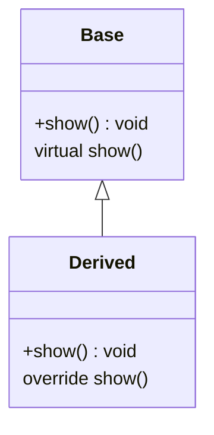

## 2.8 Type Casting and Conversion

Type casting and conversion are fundamental concepts in C++ programming that allow developers to convert one data type into another. This is crucial for ensuring that operations are performed correctly and efficiently, especially when dealing with different data types. In this section, we will delve into the various types of casting available in C++, including static, dynamic, reinterpret, and const casting, as well as conversion operators. We will explore their uses, benefits, and potential pitfalls, providing you with a comprehensive understanding of type casting in C++.

### Introduction to Type Casting

Type casting in C++ is the process of converting a variable from one data type to another. This can be necessary for a variety of reasons, such as when working with legacy code, interfacing with hardware, or optimizing performance. C++ provides several mechanisms for type casting, each with its own use cases and considerations.

#### Why Type Casting is Important

- **Interoperability**: Allows different data types to interact seamlessly.
- **Performance Optimization**: Enables more efficient use of resources by converting data types to more suitable forms.
- **Code Clarity**: Makes intentions explicit when dealing with different data types.

### Types of Casting in C++

C++ offers four main types of casting: static_cast, dynamic_cast, reinterpret_cast, and const_cast. Each serves a specific purpose and has its own set of rules and limitations.

#### Static Casting

`static_cast` is the most common form of casting in C++. It is used for conversions between compatible types, such as converting an integer to a float or a pointer to a base class to a pointer to a derived class.

```cpp
#include <iostream>

class Base {
public:
    virtual void show() { std::cout << "Base class\n"; }
};

class Derived : public Base {
public:
    void show() override { std::cout << "Derived class\n"; }
};

int main() {
    Base* basePtr = new Derived();
    Derived* derivedPtr = static_cast<Derived*>(basePtr);
    derivedPtr->show();  // Outputs: Derived class
    delete basePtr;
    return 0;
}
```

**Key Points:**

- `static_cast` is used for well-defined and safe conversions.
- It performs compile-time type checking.
- It cannot be used for converting between unrelated types.

#### Dynamic Casting

`dynamic_cast` is used for safe downcasting in class hierarchies. It is primarily used with polymorphic classes (classes that have virtual functions).

```cpp
#include <iostream>
#include <typeinfo>

class Base {
public:
    virtual ~Base() = default;
};

class Derived : public Base {};

int main() {
    Base* basePtr = new Derived();
    Derived* derivedPtr = dynamic_cast<Derived*>(basePtr);
    if (derivedPtr) {
        std::cout << "Dynamic cast successful\n";
    } else {
        std::cout << "Dynamic cast failed\n";
    }
    delete basePtr;
    return 0;
}
```

**Key Points:**

- `dynamic_cast` performs runtime type checking.
- It is used for safe downcasting in inheritance hierarchies.
- It requires the base class to have at least one virtual function.

#### Reinterpret Casting

`reinterpret_cast` is used for low-level casting operations. It allows you to convert any pointer type to any other pointer type, even if the types are unrelated.

```cpp
#include <iostream>

int main() {
    int num = 42;
    int* numPtr = &num;
    char* charPtr = reinterpret_cast<char*>(numPtr);

    std::cout << "Reinterpreted value: " << *charPtr << std::endl;
    return 0;
}
```

**Key Points:**

- `reinterpret_cast` is used for low-level, unsafe conversions.
- It does not perform any type checking.
- It should be used with caution as it can lead to undefined behavior.

#### Const Casting

`const_cast` is used to add or remove the `const` qualifier from a variable. It is the only cast that can be used to change the constness of a variable.

```cpp
#include <iostream>

void printValue(const int* ptr) {
    int* modifiablePtr = const_cast<int*>(ptr);
    *modifiablePtr = 100;  // Modifying the value
    std::cout << "Modified value: " << *ptr << std::endl;
}

int main() {
    int value = 42;
    printValue(&value);
    std::cout << "Value after modification: " << value << std::endl;
    return 0;
}
```

**Key Points:**

- `const_cast` is used to cast away constness.
- It should be used with caution as it can lead to undefined behavior if the original object is truly const.

### Conversion Operators

Conversion operators in C++ allow objects to be implicitly converted to other types. They are defined using the `operator` keyword followed by the target type.

#### Defining Conversion Operators

```cpp
#include <iostream>

class Complex {
    double real, imag;
public:
    Complex(double r, double i) : real(r), imag(i) {}

    // Conversion operator to double
    operator double() const {
        return real;
    }
};

int main() {
    Complex c(3.0, 4.0);
    double realPart = c;  // Implicit conversion
    std::cout << "Real part: " << realPart << std::endl;
    return 0;
}
```

**Key Points:**

- Conversion operators provide a way to define implicit conversions.
- They can lead to unexpected behavior if not used carefully.
- It's often better to prefer explicit conversions to avoid ambiguity.

### Visualizing Type Casting in C++

To better understand the relationships and operations involved in type casting, let's visualize the process using a class diagram.



**Diagram Description:**

This class diagram illustrates a simple inheritance hierarchy where `Derived` is a subclass of `Base`. The `show()` method is overridden in `Derived`, demonstrating polymorphism. This setup is commonly used with `dynamic_cast` for safe downcasting.

### Practical Considerations

When working with type casting and conversion in C++, it's important to consider the following:

- **Safety**: Always prefer safe casts (`static_cast`, `dynamic_cast`) over unsafe ones (`reinterpret_cast`).
- **Performance**: Be mindful of the performance implications of runtime checks with `dynamic_cast`.
- **Maintainability**: Use conversion operators judiciously to avoid unexpected implicit conversions.

### Try It Yourself

Experiment with the code examples provided in this section. Try modifying the class hierarchy or adding new conversion operators to see how they affect the behavior of the program. This hands-on approach will deepen your understanding of type casting and conversion in C++.

### Knowledge Check

To reinforce your understanding, consider the following questions:

- What is the primary use case for `dynamic_cast`?
- How does `reinterpret_cast` differ from `static_cast`?
- Why might `const_cast` lead to undefined behavior?

### Conclusion

Type casting and conversion are powerful tools in C++ programming, enabling developers to manipulate data types efficiently and safely. By mastering these concepts, you can write more robust and maintainable code, leveraging the full potential of C++'s type system.

## Quiz Time!



### What is the primary use case for `dynamic_cast`?

- [x] Safe downcasting in class hierarchies
- [ ] Converting between unrelated types
- [ ] Removing constness from a variable
- [ ] Low-level casting operations

> **Explanation:** `dynamic_cast` is used for safe downcasting in class hierarchies, ensuring that the cast is valid at runtime.

### Which cast is used for low-level, unsafe conversions?

- [ ] static_cast
- [ ] dynamic_cast
- [x] reinterpret_cast
- [ ] const_cast

> **Explanation:** `reinterpret_cast` is used for low-level, unsafe conversions, allowing any pointer type to be converted to any other pointer type.

### What is the purpose of `const_cast`?

- [ ] To perform compile-time type checking
- [x] To add or remove the const qualifier from a variable
- [ ] To convert between unrelated types
- [ ] To define implicit conversions

> **Explanation:** `const_cast` is used to add or remove the const qualifier from a variable, allowing modification of a const variable.

### Which cast performs compile-time type checking?

- [x] static_cast
- [ ] dynamic_cast
- [ ] reinterpret_cast
- [ ] const_cast

> **Explanation:** `static_cast` performs compile-time type checking, ensuring that the conversion is valid at compile time.

### What is a potential risk of using conversion operators?

- [x] Unexpected implicit conversions
- [ ] Compile-time errors
- [ ] Increased performance
- [ ] Simplified code

> **Explanation:** Conversion operators can lead to unexpected implicit conversions, which may cause ambiguity and unintended behavior.

### How does `dynamic_cast` ensure safety?

- [ ] By performing compile-time checks
- [x] By performing runtime type checking
- [ ] By converting any pointer type to any other pointer type
- [ ] By adding or removing the const qualifier

> **Explanation:** `dynamic_cast` ensures safety by performing runtime type checking, verifying that the cast is valid.

### Which cast should be used with caution due to potential undefined behavior?

- [ ] static_cast
- [ ] dynamic_cast
- [x] reinterpret_cast
- [x] const_cast

> **Explanation:** Both `reinterpret_cast` and `const_cast` should be used with caution due to potential undefined behavior.

### What is the key difference between `static_cast` and `reinterpret_cast`?

- [x] `static_cast` performs compile-time checks, while `reinterpret_cast` does not
- [ ] `reinterpret_cast` is safer than `static_cast`
- [ ] `static_cast` is used for low-level conversions
- [ ] `reinterpret_cast` performs runtime checks

> **Explanation:** `static_cast` performs compile-time checks, ensuring type safety, while `reinterpret_cast` does not perform any checks.

### True or False: `const_cast` can be used to add constness to a variable.

- [x] True
- [ ] False

> **Explanation:** `const_cast` can be used to both add and remove constness from a variable.

### What is the primary benefit of using conversion operators?

- [x] They allow objects to be implicitly converted to other types
- [ ] They perform runtime type checking
- [ ] They enable low-level casting operations
- [ ] They remove the const qualifier from variables

> **Explanation:** Conversion operators allow objects to be implicitly converted to other types, providing flexibility in type conversions.


