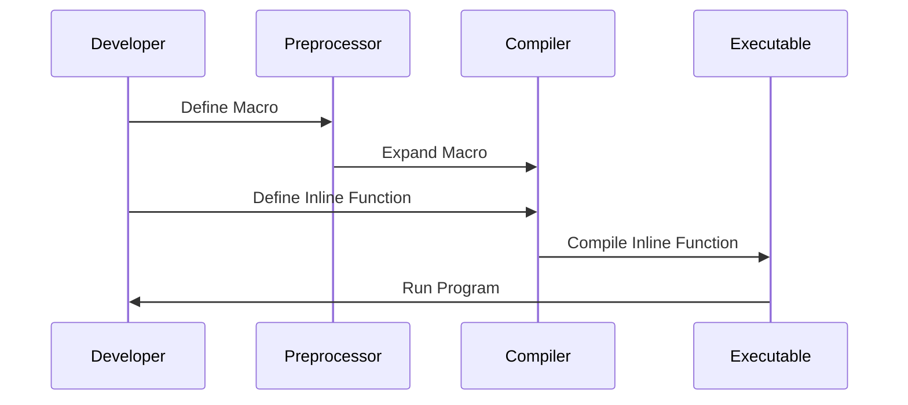

## 2.9 Inline Functions and Macros

In the realm of C++ programming, inline functions and macros are powerful tools that can significantly influence the performance and maintainability of your code. Understanding their proper usage is crucial for any expert software engineer or architect aiming to optimize C++ applications.

### Introduction to Inline Functions

Inline functions are a feature of C++ that allows the compiler to expand the function's code at the point of each call, rather than performing a traditional function call. This can lead to performance improvements by eliminating the overhead associated with function calls, especially in scenarios where the function is small and called frequently.

#### What Are Inline Functions?

An inline function is defined using the `inline` keyword. The primary intent is to suggest to the compiler that the function's code should be inserted directly at each point of call, rather than being invoked through the usual function call mechanism.

```cpp
inline int add(int a, int b) {
    return a + b;
}

int main() {
    int result = add(5, 3); // The code for add is inserted here
    return 0;
}
```

#### Benefits of Using Inline Functions

1. **Performance Improvement**: By avoiding the overhead of a function call, inline functions can enhance performance, particularly for small, frequently called functions.
2. **Code Readability**: Inline functions maintain the readability and modularity of code, unlike macros, which can obscure logic.
3. **Type Safety**: Inline functions offer type checking, which macros do not, reducing the risk of errors.

#### When to Use Inline Functions

- **Small Functions**: Ideal for small functions where the overhead of a function call is significant compared to the function's execution time.
- **Frequently Called Functions**: Functions that are called frequently in performance-critical sections of code.
- **Accessor Functions**: Commonly used for simple accessor functions in classes.

#### Limitations of Inline Functions

- **Code Bloat**: Excessive use of inline functions can lead to code bloat, increasing the size of the binary.
- **Compiler Discretion**: The `inline` keyword is merely a suggestion to the compiler, which may choose not to inline a function if it deems it inappropriate.
- **Debugging Complexity**: Inlining can make debugging more challenging, as the function call stack is altered.

### Understanding Macros

Macros are a feature of the C++ preprocessor that allows for text substitution before the actual compilation process begins. They are defined using the `#define` directive and can be used for constants, code snippets, or even complex expressions.

#### What Are Macros?

Macros are essentially templates that the preprocessor replaces with their defined values or expressions before the compilation of the code. They are not type-safe and do not perform any type checking.

```cpp
#define PI 3.14159
#define SQUARE(x) ((x) * (x))

int main() {
    double area = PI * SQUARE(5); // Expands to 3.14159 * (5 * 5)
    return 0;
}
```

#### Benefits of Using Macros

1. **Code Reusability**: Macros can be used to define reusable code snippets.
2. **Conditional Compilation**: They enable conditional compilation, allowing code to be included or excluded based on certain conditions.
3. **Constant Definitions**: Useful for defining constants that are used throughout the code.

#### Risks and Limitations of Macros

- **Lack of Type Safety**: Macros do not provide type checking, leading to potential errors.
- **Debugging Difficulty**: Errors in macros can be hard to trace, as they are expanded before compilation.
- **Complexity**: Complex macros can make code difficult to read and maintain.

### Inline Functions vs. Macros

While both inline functions and macros can be used to optimize performance, they have distinct differences and use cases.

#### Key Differences

- **Type Safety**: Inline functions provide type safety, while macros do not.
- **Scope**: Inline functions respect C++ scope rules, whereas macros are simply text substitutions.
- **Debugging**: Inline functions are easier to debug compared to macros, which can obscure the source of errors.

#### When to Choose Inline Functions Over Macros

- **Type Safety**: When type safety is a concern, prefer inline functions.
- **Complex Logic**: For complex logic, inline functions are preferable due to better readability and maintainability.
- **Debugging**: Inline functions are easier to debug, making them a better choice in most scenarios.

### Code Examples and Best Practices

#### Inline Function Example

Let's explore a practical example of using inline functions in a class to improve performance.

```cpp
class Vector {
public:
    Vector(double x, double y) : x_(x), y_(y) {}

    inline double length() const {
        return std::sqrt(x_ * x_ + y_ * y_);
    }

private:
    double x_, y_;
};

int main() {
    Vector v(3.0, 4.0);
    double len = v.length(); // Inline expansion of length()
    return 0;
}
```

**Key Points**:
- The `length` function is small and frequently called, making it a good candidate for inlining.
- The inline function maintains type safety and readability.

#### Macro Example

Here's an example of using macros for conditional compilation.

```cpp
#define DEBUG

int main() {
#ifdef DEBUG
    std::cout << "Debug mode is enabled." << std::endl;
#endif
    return 0;
}
```

**Key Points**:
- The macro `DEBUG` is used to include debug-specific code.
- This approach is useful for toggling features or logging during development.

### Visualizing Inline Functions and Macros

To better understand the differences and interactions between inline functions and macros, let's visualize their workflow using a sequence diagram.



**Diagram Explanation**:
- The developer defines both macros and inline functions.
- The preprocessor expands macros before the code reaches the compiler.
- The compiler handles inline functions, potentially expanding them at the point of call.
- The executable is generated and run by the developer.

### Best Practices for Using Inline Functions and Macros

1. **Use Inline Functions for Type Safety**: Prefer inline functions over macros when type safety is important.
2. **Limit Macro Complexity**: Keep macros simple to avoid readability and maintenance issues.
3. **Avoid Macro Side Effects**: Be cautious of side effects in macros, especially with expressions that have multiple evaluations.
4. **Leverage Conditional Compilation**: Use macros for conditional compilation to manage different build configurations.
5. **Profile Performance**: Measure the performance impact of inlining to ensure it provides the desired benefits.

### Try It Yourself

Experiment with the provided code examples by modifying them to see how changes affect performance and readability. For instance, try converting a macro to an inline function and observe the differences in behavior and type safety.

### Knowledge Check

- **What is the primary benefit of using inline functions?**
- **How do macros differ from inline functions in terms of type safety?**
- **Why might excessive use of inline functions lead to code bloat?**
- **What are some common pitfalls associated with macros?**

### Conclusion

Inline functions and macros are powerful tools in C++ that, when used appropriately, can optimize performance and enhance code maintainability. By understanding their benefits and limitations, you can make informed decisions about when and how to use them in your projects.

### Further Reading

For more information on inline functions and macros, consider exploring the following resources:

- [C++ Reference: Inline Functions](https://en.cppreference.com/w/cpp/language/inline)
- [C++ Reference: Macros](https://en.cppreference.com/w/cpp/preprocessor/replace)
- [Effective C++ by Scott Meyers](https://www.amazon.com/Effective-Specific-Improve-Programs-Designs/dp/0321334876)

## Quiz Time!



### What is the primary benefit of using inline functions in C++?

- [x] Reducing function call overhead
- [ ] Increasing code readability
- [ ] Ensuring type safety
- [ ] Simplifying complex logic

> **Explanation:** Inline functions reduce the overhead associated with function calls by expanding the function's code at the point of call.

### How do macros differ from inline functions in terms of type safety?

- [x] Macros lack type safety
- [ ] Macros provide type safety
- [ ] Inline functions lack type safety
- [ ] Inline functions and macros both provide type safety

> **Explanation:** Macros are text substitutions and do not perform type checking, whereas inline functions provide type safety.

### Why might excessive use of inline functions lead to code bloat?

- [x] Because the function code is duplicated at each call site
- [ ] Because inline functions are larger than regular functions
- [ ] Because inline functions require more memory
- [ ] Because inline functions are compiled multiple times

> **Explanation:** Inline functions can lead to code bloat because their code is duplicated at each call site, increasing the binary size.

### What are some common pitfalls associated with macros?

- [x] Lack of type safety and potential for side effects
- [ ] Improved readability and maintainability
- [ ] Enhanced debugging capabilities
- [ ] Simplified error tracing

> **Explanation:** Macros lack type safety and can introduce side effects, making debugging and maintenance challenging.

### When should you prefer inline functions over macros?

- [x] When type safety is important
- [ ] When you need conditional compilation
- [ ] When you want to simplify complex logic
- [ ] When you need to define constants

> **Explanation:** Inline functions should be preferred over macros when type safety is a concern.

### What is a key advantage of using macros for conditional compilation?

- [x] They allow code to be included or excluded based on conditions
- [ ] They provide type safety
- [ ] They simplify complex logic
- [ ] They improve code readability

> **Explanation:** Macros enable conditional compilation, allowing code to be included or excluded based on specific conditions.

### How can inline functions affect debugging?

- [x] They can make debugging more challenging by altering the call stack
- [ ] They simplify debugging by providing clear error messages
- [ ] They have no impact on debugging
- [ ] They improve debugging by expanding code

> **Explanation:** Inline functions can alter the call stack, making it more challenging to trace errors during debugging.

### What is a common use case for macros in C++?

- [x] Defining constants and reusable code snippets
- [ ] Ensuring type safety
- [ ] Simplifying complex logic
- [ ] Improving code readability

> **Explanation:** Macros are commonly used for defining constants and reusable code snippets.

### What is the role of the preprocessor in handling macros?

- [x] It expands macros before compilation
- [ ] It compiles macros into machine code
- [ ] It provides type safety for macros
- [ ] It optimizes macros for performance

> **Explanation:** The preprocessor expands macros before the actual compilation process begins.

### True or False: Inline functions are always expanded at the point of call.

- [ ] True
- [x] False

> **Explanation:** The `inline` keyword is a suggestion to the compiler, which may choose not to inline a function if it deems it inappropriate.


