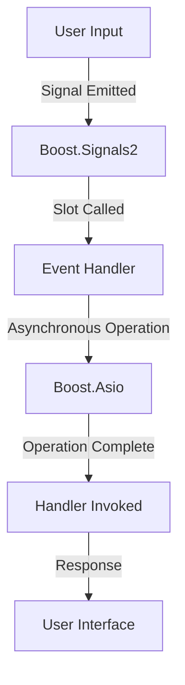

## 20.1 Boost Libraries and Patterns

The Boost C++ Libraries are a collection of peer-reviewed, open-source libraries that extend the functionality of C++. They provide robust solutions for a wide range of programming tasks and are often used as a proving ground for new features that eventually make their way into the C++ Standard Library. In this section, we will explore how Boost Libraries can be used in conjunction with design patterns to create more efficient, scalable, and maintainable C++ applications.

### Introduction to Boost Libraries

Boost Libraries are widely regarded as one of the most comprehensive and versatile sets of libraries available for C++. They cover a wide array of functionalities, including but not limited to, smart pointers, regular expressions, threading, and networking. The libraries are designed to work well with the C++ Standard Library, providing additional capabilities that are not available in the standard library.

#### Key Features of Boost Libraries

- **Cross-Platform Compatibility**: Boost Libraries are designed to be portable across different platforms, making them a reliable choice for cross-platform development.
- **High Performance**: Many Boost Libraries are optimized for performance, making them suitable for high-performance computing applications.
- **Extensive Documentation**: Boost Libraries come with comprehensive documentation, making it easier for developers to understand and use them effectively.
- **Community Support**: Being open-source, Boost Libraries have a large community of developers who contribute to their development and maintenance.

### Boost and Design Patterns

Design patterns provide a reusable solution to common software design problems. By integrating Boost Libraries with design patterns, developers can leverage the strengths of both to create robust and efficient software architectures. In this section, we will explore some of the key design patterns that can be implemented using Boost Libraries.

#### Signals and Slots Pattern with Boost.Signals2

The Signals and Slots pattern is a popular design pattern used for communication between objects. It is particularly useful in event-driven programming, where objects need to respond to events triggered by other objects. Boost.Signals2 is a library that provides a robust implementation of the Signals and Slots pattern.

##### Intent

The intent of the Signals and Slots pattern is to decouple the sender of an event from the receivers, allowing for a flexible and dynamic connection between objects.

##### Key Participants

- **Signal**: Represents an event that can be emitted by an object.
- **Slot**: Represents a function or method that can be connected to a signal and is called when the signal is emitted.

##### Sample Code Snippet

```cpp
#include <boost/signals2.hpp>
#include <iostream>

// Define a signal with no arguments and no return value
boost::signals2::signal<void()> signal;

void slot1() {
    std::cout << "Slot 1 called!" << std::endl;
}

void slot2() {
    std::cout << "Slot 2 called!" << std::endl;
}

int main() {
    // Connect slots to the signal
    signal.connect(&slot1);
    signal.connect(&slot2);

    // Emit the signal
    signal();

    return 0;
}
```

In this example, we define a signal with no arguments and no return value. We then connect two slots, `slot1` and `slot2`, to the signal. When the signal is emitted, both slots are called.

##### Design Considerations

- **Thread Safety**: Boost.Signals2 is designed to be thread-safe, making it suitable for multithreaded applications.
- **Connection Management**: Connections between signals and slots can be managed dynamically, allowing for flexible and dynamic event handling.

##### Applicability

The Signals and Slots pattern is applicable in scenarios where objects need to communicate with each other in a decoupled manner. It is particularly useful in GUI applications, where user actions trigger events that need to be handled by different components.

#### Asynchronous I/O with Boost.Asio

Boost.Asio is a cross-platform C++ library for network and low-level I/O programming. It provides a consistent asynchronous model using modern C++ techniques, making it a powerful tool for implementing the Reactor and Proactor patterns.

##### Intent

The intent of using Boost.Asio is to provide a scalable and efficient way to handle asynchronous I/O operations, such as network communication and file I/O.

##### Key Participants

- **io_context**: Represents the core I/O service, responsible for dispatching handlers for asynchronous operations.
- **Socket**: Represents a network endpoint for communication.
- **Handler**: A function or callable object that is invoked when an asynchronous operation completes.

##### Sample Code Snippet

```cpp
#include <boost/asio.hpp>
#include <iostream>

using boost::asio::ip::tcp;

void handle_accept(const boost::system::error_code& error) {
    if (!error) {
        std::cout << "Connection accepted!" << std::endl;
    }
}

int main() {
    boost::asio::io_context io_context;

    tcp::acceptor acceptor(io_context, tcp::endpoint(tcp::v4(), 12345));
    tcp::socket socket(io_context);

    acceptor.async_accept(socket, handle_accept);

    io_context.run();

    return 0;
}
```

In this example, we create an `io_context` object, which is responsible for managing asynchronous operations. We then create a TCP acceptor and a socket. The `async_accept` function is used to asynchronously accept incoming connections, and the `handle_accept` function is called when a connection is accepted.

##### Design Considerations

- **Scalability**: Boost.Asio is designed to handle a large number of concurrent connections efficiently, making it suitable for high-performance network applications.
- **Error Handling**: Boost.Asio provides a robust error handling mechanism, allowing developers to handle errors gracefully.

##### Applicability

Boost.Asio is applicable in scenarios where asynchronous I/O operations are required, such as network servers, client applications, and file I/O operations.

### Visualizing Boost Patterns

To better understand how Boost Libraries can be integrated with design patterns, let's visualize the architecture of a simple event-driven application using Boost.Signals2 and Boost.Asio.



**Diagram Description**: This diagram illustrates the flow of an event-driven application using Boost.Signals2 and Boost.Asio. User input triggers a signal, which calls an event handler. The event handler performs an asynchronous operation using Boost.Asio. Once the operation is complete, a handler is invoked, and a response is sent to the user interface.

### Try It Yourself

Experiment with the provided code examples by modifying the signals and slots or changing the asynchronous operations. Try connecting multiple slots to a single signal or handling different types of asynchronous operations using Boost.Asio. This hands-on approach will help solidify your understanding of how Boost Libraries can be used with design patterns.

### Knowledge Check

- **Question**: What is the primary benefit of using the Signals and Slots pattern?
  - **Answer**: The primary benefit is decoupling the sender of an event from the receivers, allowing for flexible and dynamic connections between objects.

- **Question**: How does Boost.Asio handle asynchronous operations?
  - **Answer**: Boost.Asio uses an `io_context` object to manage asynchronous operations and dispatch handlers when operations complete.

### Conclusion

Boost Libraries provide powerful tools for implementing design patterns in C++. By leveraging Boost.Signals2 and Boost.Asio, developers can create scalable, efficient, and maintainable software architectures. The integration of Boost Libraries with design patterns allows developers to take full advantage of modern C++ techniques, resulting in robust and high-performance applications.

## Quiz Time!



### What is the primary benefit of using the Signals and Slots pattern?

- [x] Decoupling the sender of an event from the receivers
- [ ] Increasing code complexity
- [ ] Reducing the number of classes
- [ ] Improving memory management

> **Explanation:** The Signals and Slots pattern decouples the sender of an event from the receivers, allowing for flexible and dynamic connections between objects.

### How does Boost.Asio handle asynchronous operations?

- [x] Using an `io_context` object to manage operations
- [ ] By blocking threads until operations complete
- [ ] Through direct manipulation of sockets
- [ ] By using global variables to track operations

> **Explanation:** Boost.Asio uses an `io_context` object to manage asynchronous operations and dispatch handlers when operations complete.

### Which Boost library provides a robust implementation of the Signals and Slots pattern?

- [x] Boost.Signals2
- [ ] Boost.Thread
- [ ] Boost.Asio
- [ ] Boost.Regex

> **Explanation:** Boost.Signals2 provides a robust implementation of the Signals and Slots pattern.

### What is the role of the `io_context` in Boost.Asio?

- [x] It manages asynchronous operations
- [ ] It represents a network endpoint
- [ ] It handles error logging
- [ ] It provides a graphical user interface

> **Explanation:** The `io_context` in Boost.Asio is responsible for managing asynchronous operations.

### In the provided Boost.Asio example, what function is used to accept incoming connections asynchronously?

- [x] `async_accept`
- [ ] `connect`
- [ ] `bind`
- [ ] `listen`

> **Explanation:** The `async_accept` function is used to accept incoming connections asynchronously in Boost.Asio.

### What is a key feature of Boost Libraries?

- [x] Cross-platform compatibility
- [ ] Limited documentation
- [ ] Proprietary licensing
- [ ] Incompatibility with the C++ Standard Library

> **Explanation:** Boost Libraries are known for their cross-platform compatibility, making them a reliable choice for cross-platform development.

### Which of the following is NOT a key participant in the Signals and Slots pattern?

- [x] Mutex
- [ ] Signal
- [ ] Slot
- [ ] Event Handler

> **Explanation:** A mutex is not a key participant in the Signals and Slots pattern, which involves signals, slots, and event handlers.

### What does the `handle_accept` function do in the Boost.Asio example?

- [x] It is called when a connection is accepted
- [ ] It sends data to the client
- [ ] It closes the socket
- [ ] It logs errors

> **Explanation:** The `handle_accept` function is called when a connection is accepted in the Boost.Asio example.

### True or False: Boost.Asio is suitable for high-performance network applications.

- [x] True
- [ ] False

> **Explanation:** True. Boost.Asio is designed to handle a large number of concurrent connections efficiently, making it suitable for high-performance network applications.

### True or False: Boost.Signals2 is not thread-safe.

- [ ] True
- [x] False

> **Explanation:** False. Boost.Signals2 is designed to be thread-safe, making it suitable for multithreaded applications.


