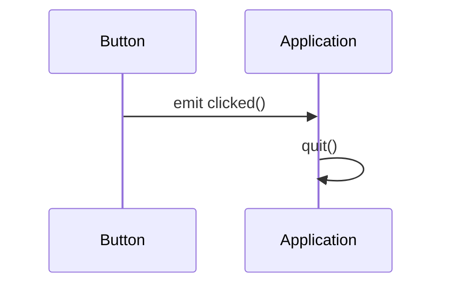
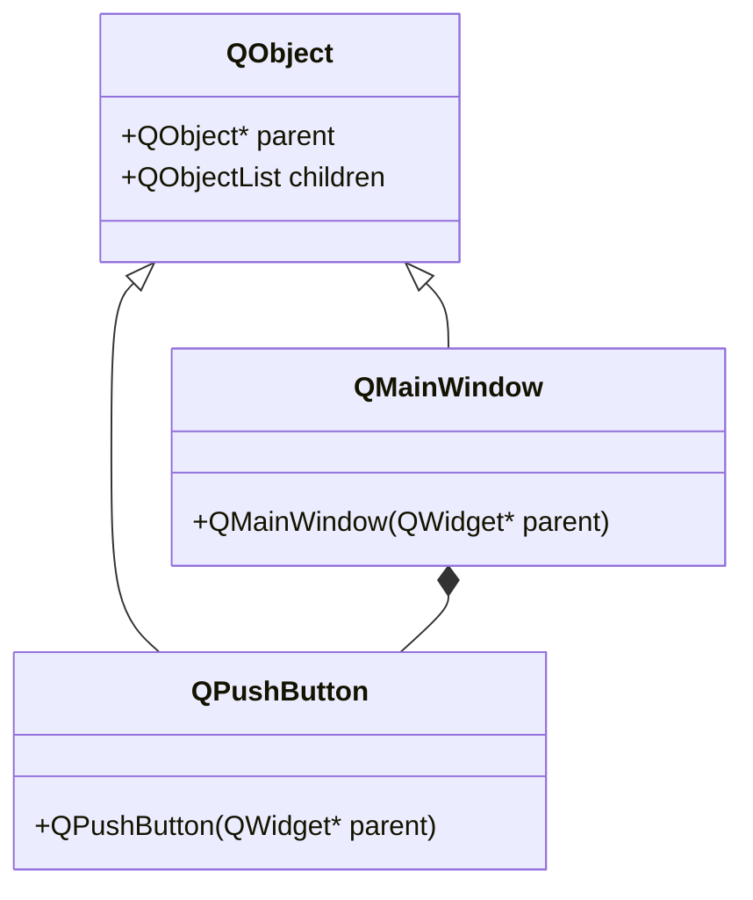

## 20.2 Qt Framework Patterns

The Qt framework is a powerful tool for C++ developers, offering a robust set of libraries for building cross-platform applications. One of its most distinctive features is the **Signals and Slots** mechanism, which provides a flexible way to handle events and communication between objects. In this section, we'll delve into how design patterns can be implemented using Qt, with a particular focus on the Signals and Slots mechanism.

### Introduction to Qt Framework

Before diving into specific patterns, it's essential to understand the basics of the Qt framework. Qt is a free and open-source widget toolkit for creating graphical user interfaces, as well as cross-platform applications that run on various software and hardware platforms. It is widely used for developing applications with a graphical user interface (GUI) but is also used for developing non-GUI programs such as command-line tools and consoles for servers.

### Signals and Slots Mechanism

#### Intent

The Signals and Slots mechanism is designed to simplify communication between objects in a way that is both type-safe and flexible. It allows objects to communicate without having to know anything about each other, thus promoting loose coupling.

#### Key Participants

- **Signals**: Emitted by objects when they change state or when an event occurs. They are essentially messages that an object can send.
- **Slots**: Functions that are called in response to a particular signal. They can be member functions, static functions, or even lambda expressions.

#### How It Works

When a signal is emitted, the connected slots are automatically invoked. This is done through a mechanism that is similar to the Observer pattern, where the signal acts as the subject and the slots act as observers.

```cpp
#include <QApplication>
#include <QPushButton>

int main(int argc, char *argv[]) {
    QApplication app(argc, argv);

    QPushButton button("Click Me");
    QObject::connect(&button, &QPushButton::clicked, &app, &QApplication::quit);

    button.show();
    return app.exec();
}
```

In this example, a `QPushButton` emits a `clicked` signal when it is pressed. The `QApplication::quit` slot is connected to this signal, causing the application to terminate when the button is clicked.

### Visualizing the Signals and Slots Mechanism

To better understand how signals and slots work, let's visualize the process using a sequence diagram.



This diagram illustrates the flow of control when a button is clicked. The `Button` emits a `clicked()` signal, which is received by the `Application`, triggering the `quit()` slot.

### Implementing Design Patterns with Qt

#### Observer Pattern

The Signals and Slots mechanism is inherently similar to the Observer pattern. In Qt, signals act as the subject, and slots act as observers. This allows for a clean separation of concerns and promotes a decoupled architecture.

**Sample Code Snippet**

```cpp
class Subject : public QObject {
    Q_OBJECT
public:
    void changeState() {
        emit stateChanged();
    }

signals:
    void stateChanged();
};

class Observer : public QObject {
    Q_OBJECT
public slots:
    void onStateChanged() {
        qDebug() << "State changed!";
    }
};

int main() {
    Subject subject;
    Observer observer;

    QObject::connect(&subject, &Subject::stateChanged, &observer, &Observer::onStateChanged);

    subject.changeState();
    return 0;
}
```

In this example, the `Subject` class emits a `stateChanged` signal, which is connected to the `Observer` class's `onStateChanged` slot. When the state changes, the observer is notified.

#### Command Pattern

The Command pattern can be implemented in Qt using signals and slots to encapsulate requests as objects. This is particularly useful in GUI applications where actions can be triggered by user interactions.

**Sample Code Snippet**

```cpp
class Command : public QObject {
    Q_OBJECT
public:
    void execute() {
        emit commandExecuted();
    }

signals:
    void commandExecuted();
};

class Receiver : public QObject {
    Q_OBJECT
public slots:
    void onCommandExecuted() {
        qDebug() << "Command executed!";
    }
};

int main() {
    Command command;
    Receiver receiver;

    QObject::connect(&command, &Command::commandExecuted, &receiver, &Receiver::onCommandExecuted);

    command.execute();
    return 0;
}
```

Here, the `Command` class emits a `commandExecuted` signal, which is connected to the `Receiver` class's `onCommandExecuted` slot. This setup allows the command to be executed and the receiver to respond to it.

### Design Considerations

When using the Signals and Slots mechanism, consider the following:

- **Thread Safety**: Qt's signals and slots are thread-safe, but care must be taken when connecting signals and slots across different threads.
- **Performance**: While signals and slots provide a flexible communication mechanism, they can introduce overhead. Use them judiciously in performance-critical applications.
- **Memory Management**: Qt uses a parent-child hierarchy for object ownership, which simplifies memory management. Ensure that objects are properly parented to avoid memory leaks.

### Differences and Similarities with Other Patterns

The Signals and Slots mechanism is similar to the Observer pattern but offers more flexibility and type safety. Unlike traditional callback mechanisms, signals and slots can be connected and disconnected at runtime, allowing for dynamic behavior.

### Try It Yourself

Experiment with the provided code examples by modifying the signals and slots. Try creating a new signal in the `Subject` class and connect it to a different slot in the `Observer` class. Observe how the application behavior changes with different connections.

### Visualizing Qt's Object Hierarchy

To understand how Qt manages object ownership and memory, let's visualize a simple object hierarchy.



In this diagram, `QPushButton` and `QMainWindow` inherit from `QObject`. The `QMainWindow` owns the `QPushButton`, ensuring that the button is deleted when the main window is destroyed.

### Knowledge Check

- **Question**: What is the primary purpose of the Signals and Slots mechanism in Qt?
  - [ ] To manage memory allocation
  - [x] To facilitate communication between objects
  - [ ] To handle file I/O operations
  - [ ] To perform network operations

  > **Explanation**: The Signals and Slots mechanism is designed to facilitate communication between objects in Qt applications.

- **Question**: How does the Signals and Slots mechanism promote loose coupling?
  - [x] By allowing objects to communicate without knowing about each other
  - [ ] By enforcing strict type checking
  - [ ] By requiring objects to be in the same thread
  - [ ] By using global variables

  > **Explanation**: Signals and slots allow objects to communicate without knowing about each other, promoting loose coupling.

### Embrace the Journey

As you explore the Qt framework and its design patterns, remember that this is just the beginning. The Signals and Slots mechanism is a powerful tool that can greatly enhance the flexibility and maintainability of your applications. Keep experimenting, stay curious, and enjoy the journey!

### References and Links

- [Qt Documentation](https://doc.qt.io/)
- [Signals and Slots in Qt](https://doc.qt.io/qt-5/signalsandslots.html)
- [Observer Pattern](https://en.wikipedia.org/wiki/Observer_pattern)

## Quiz Time!



### What is the primary purpose of the Signals and Slots mechanism in Qt?

- [ ] To manage memory allocation
- [x] To facilitate communication between objects
- [ ] To handle file I/O operations
- [ ] To perform network operations

> **Explanation:** The Signals and Slots mechanism is designed to facilitate communication between objects in Qt applications.

### How does the Signals and Slots mechanism promote loose coupling?

- [x] By allowing objects to communicate without knowing about each other
- [ ] By enforcing strict type checking
- [ ] By requiring objects to be in the same thread
- [ ] By using global variables

> **Explanation:** Signals and slots allow objects to communicate without knowing about each other, promoting loose coupling.

### What is a key advantage of using signals and slots over traditional callback mechanisms?

- [x] Type safety and flexibility
- [ ] Faster execution speed
- [ ] Simpler syntax
- [ ] Requires less memory

> **Explanation:** Signals and slots provide type safety and flexibility, allowing connections to be made and broken at runtime.

### In Qt, what is a slot?

- [ ] A function that emits signals
- [x] A function that is called in response to a signal
- [ ] A data structure for storing signals
- [ ] A mechanism for managing threads

> **Explanation:** A slot is a function that is called in response to a signal being emitted.

### What is the relationship between signals and slots in Qt?

- [x] Signals are emitted and slots are invoked in response
- [ ] Slots emit signals and signals invoke slots
- [ ] Signals and slots are unrelated
- [ ] Slots manage the lifecycle of signals

> **Explanation:** Signals are emitted by objects, and slots are invoked in response to those signals.

### How can you ensure thread safety when using signals and slots across different threads?

- [x] By using Qt's thread-safe mechanisms
- [ ] By avoiding signals and slots altogether
- [ ] By using global variables
- [ ] By manually locking and unlocking threads

> **Explanation:** Qt provides thread-safe mechanisms for using signals and slots across different threads.

### What is a key consideration when using signals and slots in performance-critical applications?

- [ ] They always improve performance
- [x] They can introduce overhead
- [ ] They are not suitable for GUI applications
- [ ] They require manual memory management

> **Explanation:** While signals and slots provide flexibility, they can introduce overhead in performance-critical applications.

### What does the `QObject` class provide in Qt?

- [ ] A mechanism for handling file I/O
- [x] A base class for all Qt objects, providing signals and slots
- [ ] A way to manage network connections
- [ ] A data structure for storing application settings

> **Explanation:** `QObject` is the base class for all Qt objects, providing the signals and slots mechanism.

### What is the role of the `QApplication` class in a Qt application?

- [ ] To manage database connections
- [x] To manage application-level resources and event loops
- [ ] To handle file operations
- [ ] To provide network services

> **Explanation:** `QApplication` manages application-level resources and the event loop in a Qt application.

### True or False: In Qt, signals and slots can only be connected at compile time.

- [ ] True
- [x] False

> **Explanation:** Signals and slots can be connected and disconnected at runtime, providing dynamic behavior.


