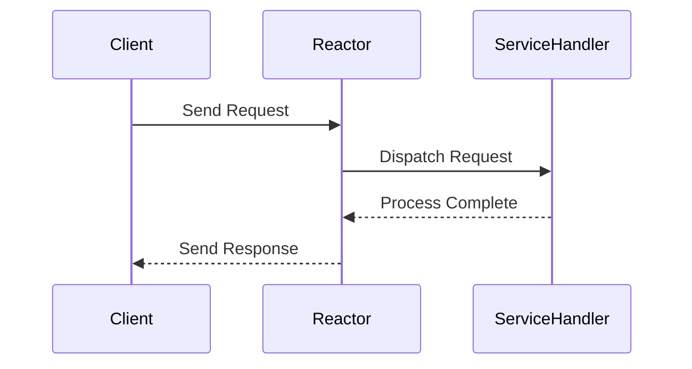
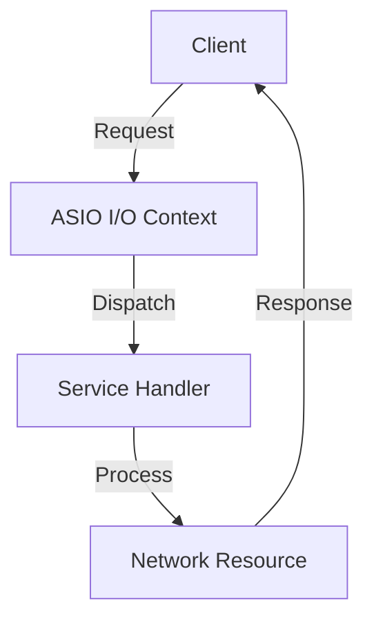

## 20.3 Network Programming with ASIO

### Introduction

Network programming is a critical aspect of modern software development, enabling applications to communicate over networks, whether local or global. In C++, the ASIO (Asynchronous Input/Output) library provides a powerful framework for handling asynchronous network operations. This section delves into the intricacies of network programming with ASIO, focusing on asynchronous I/O patterns and the design of scalable network services.

### Understanding ASIO

ASIO is a cross-platform C++ library that facilitates network and low-level I/O programming. It abstracts the complexities of asynchronous programming, allowing developers to write efficient and scalable network applications. ASIO is part of the Boost library collection and is also proposed for inclusion in the C++ standard library.

#### Key Features of ASIO

- **Asynchronous Operations**: ASIO supports asynchronous operations, which are crucial for non-blocking I/O. This allows applications to handle multiple connections simultaneously without being blocked by slow operations.
- **Cross-Platform Compatibility**: ASIO works across different operating systems, including Windows, Linux, and macOS, providing a consistent API for network programming.
- **Scalability**: With ASIO, you can design applications that scale efficiently, handling thousands of concurrent connections with minimal overhead.
- **Integration with Boost**: ASIO is part of the Boost library, offering seamless integration with other Boost components.

### Asynchronous I/O Patterns

Asynchronous I/O is a programming paradigm that allows a program to initiate an I/O operation and continue executing other tasks while waiting for the operation to complete. This is particularly useful in network programming, where I/O operations can be slow and unpredictable.

#### The Reactor Pattern

The Reactor pattern is a design pattern used to handle service requests that are delivered concurrently to a service handler by one or more inputs. It is particularly useful in network programming for managing asynchronous I/O.



**Diagram Description**: The Reactor pattern involves a reactor that listens for events and dispatches them to the appropriate service handler for processing.

#### Implementing the Reactor Pattern with ASIO

In ASIO, the reactor pattern is implemented using the `io_context` object, which acts as the central event dispatcher.

```cpp
#include <boost/asio.hpp>
#include <iostream>

void handle_accept(const boost::system::error_code& error) {
    if (!error) {
        std::cout << "Connection accepted!" << std::endl;
    }
}

int main() {
    boost::asio::io_context io_context;
    boost::asio::ip::tcp::acceptor acceptor(io_context, boost::asio::ip::tcp::endpoint(boost::asio::ip::tcp::v4(), 12345));

    boost::asio::ip::tcp::socket socket(io_context);
    acceptor.async_accept(socket, handle_accept);

    io_context.run();
    return 0;
}
```

**Code Explanation**: This example sets up a TCP server that listens for incoming connections on port 12345. The `async_accept` function initiates an asynchronous accept operation, and `handle_accept` is called when a connection is accepted.

### Designing Scalable Network Services

Scalability is a crucial factor in network service design, ensuring that applications can handle increasing loads without performance degradation. ASIO provides several features that facilitate the development of scalable network services.

#### Thread Pooling

Thread pooling is a technique used to manage a pool of worker threads that can be reused to perform tasks. This reduces the overhead of creating and destroying threads for each task.

```cpp
#include <boost/asio.hpp>
#include <thread>
#include <vector>

void worker_thread(boost::asio::io_context& io_context) {
    io_context.run();
}

int main() {
    boost::asio::io_context io_context;
    std::vector<std::thread> threads;

    for (int i = 0; i < 4; ++i) {
        threads.emplace_back(worker_thread, std::ref(io_context));
    }

    for (auto& thread : threads) {
        thread.join();
    }

    return 0;
}
```

**Code Explanation**: This example demonstrates how to create a thread pool with ASIO. Four threads are created, each running the `io_context` to handle asynchronous operations.

#### Load Balancing

Load balancing is essential for distributing incoming network traffic across multiple servers to ensure no single server becomes overwhelmed.

```cpp
#include <boost/asio.hpp>
#include <iostream>
#include <thread>

void handle_request(boost::asio::ip::tcp::socket socket) {
    std::cout << "Handling request from: " << socket.remote_endpoint() << std::endl;
    // Process the request
}

int main() {
    boost::asio::io_context io_context;
    boost::asio::ip::tcp::acceptor acceptor(io_context, boost::asio::ip::tcp::endpoint(boost::asio::ip::tcp::v4(), 12345));

    while (true) {
        boost::asio::ip::tcp::socket socket(io_context);
        acceptor.accept(socket);
        std::thread(handle_request, std::move(socket)).detach();
    }

    return 0;
}
```

**Code Explanation**: This example shows a simple load balancer that accepts incoming connections and spawns a new thread to handle each request. This approach can be further optimized by integrating with a dedicated load balancer.

### Advanced ASIO Concepts

ASIO offers advanced features that can be leveraged to build robust and efficient network applications.

#### Timers

ASIO provides timer functionality, which can be used to implement timeouts and periodic tasks.

```cpp
#include <boost/asio.hpp>
#include <iostream>

void timer_handler(const boost::system::error_code& error) {
    if (!error) {
        std::cout << "Timer expired!" << std::endl;
    }
}

int main() {
    boost::asio::io_context io_context;
    boost::asio::steady_timer timer(io_context, boost::asio::chrono::seconds(5));

    timer.async_wait(timer_handler);
    io_context.run();

    return 0;
}
```

**Code Explanation**: This example sets up a timer that expires after 5 seconds, triggering the `timer_handler` function.

#### SSL/TLS Support

ASIO supports SSL/TLS, enabling secure communication over networks.

```cpp
#include <boost/asio.hpp>
#include <boost/asio/ssl.hpp>
#include <iostream>

void handle_handshake(const boost::system::error_code& error) {
    if (!error) {
        std::cout << "SSL Handshake successful!" << std::endl;
    }
}

int main() {
    boost::asio::io_context io_context;
    boost::asio::ssl::context ssl_context(boost::asio::ssl::context::sslv23);
    ssl_context.set_default_verify_paths();

    boost::asio::ssl::stream<boost::asio::ip::tcp::socket> ssl_socket(io_context, ssl_context);
    boost::asio::ip::tcp::resolver resolver(io_context);
    auto endpoints = resolver.resolve("www.example.com", "https");

    boost::asio::async_connect(ssl_socket.lowest_layer(), endpoints, [&](const boost::system::error_code& error, const boost::asio::ip::tcp::endpoint&) {
        if (!error) {
            ssl_socket.async_handshake(boost::asio::ssl::stream_base::client, handle_handshake);
        }
    });

    io_context.run();
    return 0;
}
```

**Code Explanation**: This example demonstrates how to perform an SSL handshake with a remote server using ASIO.

### Try It Yourself

Experiment with the provided code examples by modifying them to suit your needs. For instance, try changing the port numbers, adding more threads to the thread pool, or implementing additional features like logging or error handling.

### Visualizing ASIO's Architecture



**Diagram Description**: This diagram illustrates the flow of a network request through ASIO's architecture, from the client to the service handler and back.

### References and Further Reading

- [Boost ASIO Documentation](https://www.boost.org/doc/libs/release/doc/html/boost_asio.html)
- [C++ Network Programming by Douglas Schmidt](https://www.dre.vanderbilt.edu/~schmidt/PDF/JAOO-2002.pdf)
- [Asynchronous Programming in C++](https://www.microsoft.com/en-us/research/publication/asynchronous-programming-in-c/)

### Knowledge Check

- **What is ASIO, and how does it facilitate network programming in C++?**
- **Explain the Reactor pattern and its implementation in ASIO.**
- **How does ASIO support scalability in network services?**
- **Describe the role of timers in ASIO.**
- **What is the significance of SSL/TLS support in ASIO?**

### Embrace the Journey

Remember, mastering network programming with ASIO is a journey. As you progress, you'll build more complex and scalable network services. Keep experimenting, stay curious, and enjoy the journey!

## Quiz Time!



### What is the primary purpose of ASIO in C++?

- [x] To facilitate asynchronous network programming
- [ ] To provide a GUI framework
- [ ] To handle file I/O operations
- [ ] To manage memory allocation

> **Explanation:** ASIO is designed to support asynchronous network programming, allowing developers to handle network operations efficiently.

### Which design pattern is commonly used with ASIO for handling asynchronous I/O?

- [x] Reactor Pattern
- [ ] Singleton Pattern
- [ ] Factory Pattern
- [ ] Observer Pattern

> **Explanation:** The Reactor pattern is used in ASIO to manage asynchronous I/O operations by dispatching events to the appropriate handlers.

### How does ASIO achieve cross-platform compatibility?

- [x] By providing a consistent API across different operating systems
- [ ] By using platform-specific code for each OS
- [ ] By relying on third-party libraries for compatibility
- [ ] By avoiding OS-specific features

> **Explanation:** ASIO provides a consistent API that works across various operating systems, ensuring cross-platform compatibility.

### What is the role of `io_context` in ASIO?

- [x] It acts as the central event dispatcher
- [ ] It manages memory allocation
- [ ] It handles file operations
- [ ] It provides a GUI interface

> **Explanation:** `io_context` is the core component in ASIO that dispatches events and manages asynchronous operations.

### Which feature of ASIO allows for secure communication over networks?

- [x] SSL/TLS Support
- [ ] Thread Pooling
- [ ] Load Balancing
- [ ] Timer Functionality

> **Explanation:** ASIO supports SSL/TLS, enabling secure communication over networks.

### What is the benefit of using thread pooling in ASIO?

- [x] It reduces the overhead of creating and destroying threads
- [ ] It increases the number of connections
- [ ] It simplifies code readability
- [ ] It enhances GUI performance

> **Explanation:** Thread pooling allows for efficient management of threads, reducing the overhead associated with thread creation and destruction.

### How can ASIO's timer functionality be used in network programming?

- [x] To implement timeouts and periodic tasks
- [ ] To manage memory allocation
- [ ] To handle file I/O operations
- [ ] To provide a GUI interface

> **Explanation:** ASIO's timer functionality is used to implement timeouts and periodic tasks in network applications.

### What is the significance of the `async_accept` function in ASIO?

- [x] It initiates an asynchronous accept operation for incoming connections
- [ ] It synchronously accepts connections
- [ ] It handles file operations
- [ ] It manages memory allocation

> **Explanation:** `async_accept` is used to initiate an asynchronous operation for accepting incoming network connections.

### Which component in ASIO is responsible for handling SSL handshakes?

- [x] `ssl::stream`
- [ ] `io_context`
- [ ] `tcp::acceptor`
- [ ] `steady_timer`

> **Explanation:** The `ssl::stream` component in ASIO is responsible for handling SSL handshakes and secure communication.

### True or False: ASIO can only be used for network programming.

- [ ] True
- [x] False

> **Explanation:** While ASIO is primarily used for network programming, it can also handle other asynchronous I/O operations.


