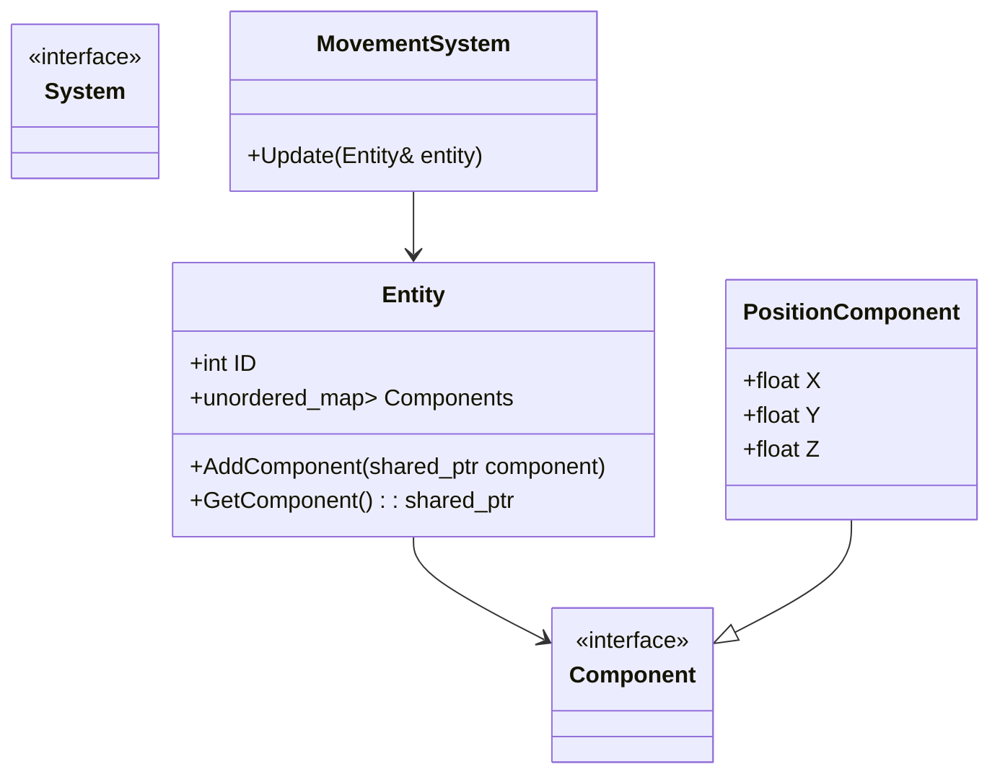

## 20.4 Game Development Frameworks

Game development is a complex and multifaceted discipline that requires a deep understanding of both software engineering principles and creative design. In this section, we will delve into the world of game development frameworks with a particular focus on C++ design patterns. We will explore the architectural patterns used in popular frameworks like Unreal Engine, and examine the entity-component system (ECS) architecture, which has become a staple in modern game development.

### Introduction to Game Development Frameworks

Game development frameworks provide a foundation upon which developers can build complex, interactive, and visually stunning games. These frameworks offer a suite of tools, libraries, and APIs that abstract away much of the low-level programming involved in game development, allowing developers to focus on game logic, design, and user experience.

#### Key Concepts in Game Development Frameworks

1. **Rendering Engine**: Handles the drawing of graphics on the screen, including 2D and 3D rendering.
2. **Physics Engine**: Simulates physical interactions between objects, such as collisions and gravity.
3. **Audio Engine**: Manages sound playback and effects.
4. **Scripting System**: Allows for dynamic behavior scripting, often using languages like Lua or Python.
5. **Networking**: Supports multiplayer capabilities and online interactions.
6. **Entity-Component System (ECS)**: A design pattern that promotes flexibility and reusability in game object management.

### Unreal Engine and C++ APIs

Unreal Engine is one of the most popular and powerful game development frameworks available today. Known for its high-quality graphics and robust toolset, Unreal Engine is used by both indie developers and major game studios. At the heart of Unreal Engine is its C++ API, which provides developers with the flexibility and performance needed to create cutting-edge games.

#### Key Features of Unreal Engine's C++ API

- **Performance**: C++ allows for high-performance game logic and real-time rendering.
- **Flexibility**: Developers can extend and customize the engine to suit their needs.
- **Integration**: Seamless integration with Unreal Engine's Blueprint visual scripting system.
- **Community and Support**: A large community and extensive documentation make it easier to learn and troubleshoot.

### Design Patterns in Unreal Engine

Unreal Engine employs several design patterns to manage complexity and enhance code maintainability. Understanding these patterns is crucial for developers looking to harness the full power of Unreal Engine.

#### Singleton Pattern

The Singleton pattern ensures that a class has only one instance and provides a global point of access to it. In Unreal Engine, singletons are often used for manager classes that handle resources or game states.

```cpp
class UGameManager : public UObject
{
public:
    static UGameManager* GetInstance()
    {
        if (!Instance)
        {
            Instance = NewObject<UGameManager>();
        }
        return Instance;
    }

private:
    static UGameManager* Instance;
    UGameManager() {}
};

UGameManager* UGameManager::Instance = nullptr;
```

#### Observer Pattern

The Observer pattern is used to create a subscription mechanism to allow multiple objects to listen for and react to events. Unreal Engine's event system utilizes this pattern extensively.

```cpp
class UHealthComponent : public UActorComponent
{
public:
    DECLARE_EVENT(UHealthComponent, FOnHealthChanged)
    FOnHealthChanged& OnHealthChanged() { return HealthChangedEvent; }

    void TakeDamage(float DamageAmount)
    {
        Health -= DamageAmount;
        HealthChangedEvent.Broadcast();
    }

private:
    float Health;
    FOnHealthChanged HealthChangedEvent;
};
```

#### Factory Pattern

The Factory pattern is used to create objects without specifying the exact class of object that will be created. Unreal Engine uses factories for asset creation and management.

```cpp
class UWeaponFactory : public UObject
{
public:
    UWeapon* CreateWeapon(EWeaponType Type)
    {
        switch (Type)
        {
        case EWeaponType::Sword:
            return NewObject<USword>();
        case EWeaponType::Bow:
            return NewObject<UBow>();
        default:
            return nullptr;
        }
    }
};
```

### Entity-Component System (ECS)

The Entity-Component System (ECS) is a design pattern that provides a flexible and efficient way to manage game objects. ECS separates data (components) from behavior (systems), allowing for greater flexibility and reusability.

#### Key Concepts of ECS

- **Entity**: A unique identifier that represents a game object.
- **Component**: A data structure that holds specific attributes of an entity, such as position or health.
- **System**: A process that operates on entities with specific components, implementing game logic.

#### Benefits of ECS

- **Performance**: ECS can improve cache efficiency and parallelism.
- **Flexibility**: Easily add, remove, or modify components to change entity behavior.
- **Reusability**: Systems and components can be reused across different entities and projects.

#### Implementing ECS in C++

```cpp
class Entity
{
public:
    int ID;
    std::unordered_map<std::type_index, std::shared_ptr<void>> Components;

    template <typename T>
    void AddComponent(std::shared_ptr<T> component)
    {
        Components[typeid(T)] = component;
    }

    template <typename T>
    std::shared_ptr<T> GetComponent()
    {
        return std::static_pointer_cast<T>(Components[typeid(T)]);
    }
};

class PositionComponent
{
public:
    float X, Y, Z;
};

class MovementSystem
{
public:
    void Update(Entity& entity)
    {
        auto position = entity.GetComponent<PositionComponent>();
        if (position)
        {
            // Update position logic
        }
    }
};
```

### Try It Yourself

To gain a deeper understanding of ECS, try implementing a simple game using the ECS architecture. Start by creating entities with different components and systems that operate on them. Experiment with adding new components and systems to see how they affect the game.

### Visualizing ECS Architecture



### Design Considerations

When implementing ECS and other design patterns in game development, consider the following:

- **Performance**: Optimize data access patterns to improve cache efficiency.
- **Scalability**: Design systems that can handle a large number of entities.
- **Maintainability**: Keep systems and components modular and reusable.

### Differences and Similarities

ECS is often compared to traditional object-oriented programming (OOP) approaches. While OOP focuses on encapsulating data and behavior within objects, ECS separates data and behavior, allowing for more flexible and efficient designs.

### Conclusion

Game development frameworks like Unreal Engine provide a powerful platform for creating complex and engaging games. By leveraging C++ design patterns and architectures like ECS, developers can build scalable, maintainable, and high-performance games. Remember, the journey of mastering game development is ongoing. Keep experimenting, stay curious, and enjoy the process of bringing your creative visions to life.

## Quiz Time!



### What is the primary purpose of a game development framework?

- [x] To provide a foundation for building games with tools and libraries
- [ ] To replace the need for programming in game development
- [ ] To handle only the graphics rendering in games
- [ ] To ensure games are bug-free

> **Explanation:** Game development frameworks offer a suite of tools and libraries that help developers build games by abstracting low-level programming tasks.

### Which design pattern is used in Unreal Engine to ensure a class has only one instance?

- [x] Singleton Pattern
- [ ] Observer Pattern
- [ ] Factory Pattern
- [ ] Strategy Pattern

> **Explanation:** The Singleton pattern is used to ensure a class has only one instance and provides a global point of access to it.

### What is a key benefit of the Entity-Component System (ECS) architecture?

- [x] Flexibility in adding, removing, or modifying components
- [ ] It eliminates the need for a rendering engine
- [ ] It simplifies audio management
- [ ] It ensures all entities have the same components

> **Explanation:** ECS provides flexibility by allowing developers to easily add, remove, or modify components to change entity behavior.

### In ECS, what does a 'System' do?

- [x] Operates on entities with specific components to implement game logic
- [ ] Stores data attributes of an entity
- [ ] Represents a unique identifier for a game object
- [ ] Manages the rendering of graphics

> **Explanation:** In ECS, a System processes entities with specific components, implementing the game logic.

### How does the Factory pattern benefit Unreal Engine?

- [x] By creating objects without specifying the exact class
- [ ] By managing event subscriptions
- [ ] By ensuring a class has only one instance
- [ ] By encapsulating requests as objects

> **Explanation:** The Factory pattern allows for the creation of objects without specifying the exact class, which is useful for asset creation and management.

### What is a primary feature of Unreal Engine's C++ API?

- [x] High-performance game logic and real-time rendering
- [ ] Simplified audio management
- [ ] Automatic bug fixing
- [ ] Built-in multiplayer support

> **Explanation:** Unreal Engine's C++ API allows for high-performance game logic and real-time rendering, providing flexibility and performance.

### What is a common use of the Observer pattern in Unreal Engine?

- [x] To create a subscription mechanism for event handling
- [ ] To ensure a class has only one instance
- [ ] To manage asset creation
- [ ] To encapsulate requests as objects

> **Explanation:** The Observer pattern is used to create a subscription mechanism, allowing multiple objects to listen for and react to events.

### What does a 'Component' represent in ECS?

- [x] A data structure holding specific attributes of an entity
- [ ] A unique identifier for a game object
- [ ] A process that operates on entities
- [ ] A rendering engine component

> **Explanation:** In ECS, a Component is a data structure that holds specific attributes of an entity, such as position or health.

### Which pattern is often compared to traditional object-oriented programming?

- [x] Entity-Component System (ECS)
- [ ] Singleton Pattern
- [ ] Observer Pattern
- [ ] Factory Pattern

> **Explanation:** ECS is often compared to traditional OOP approaches, as it separates data and behavior, allowing for more flexible and efficient designs.

### True or False: ECS improves cache efficiency and parallelism.

- [x] True
- [ ] False

> **Explanation:** ECS can improve cache efficiency and parallelism by optimizing data access patterns and separating data from behavior.


