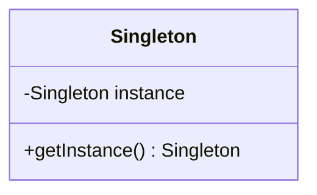
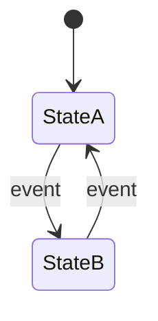
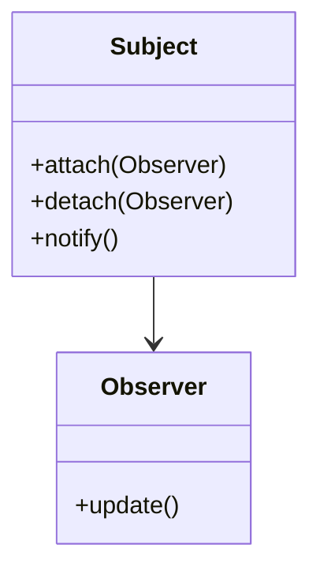
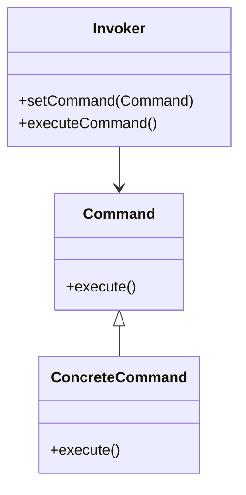
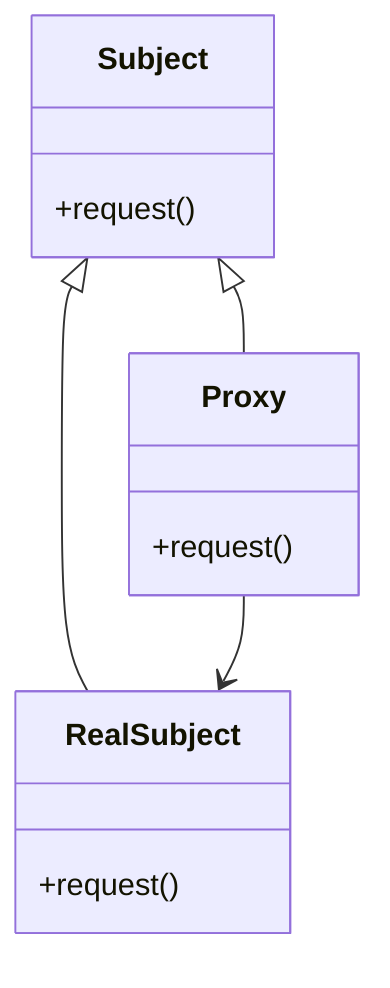
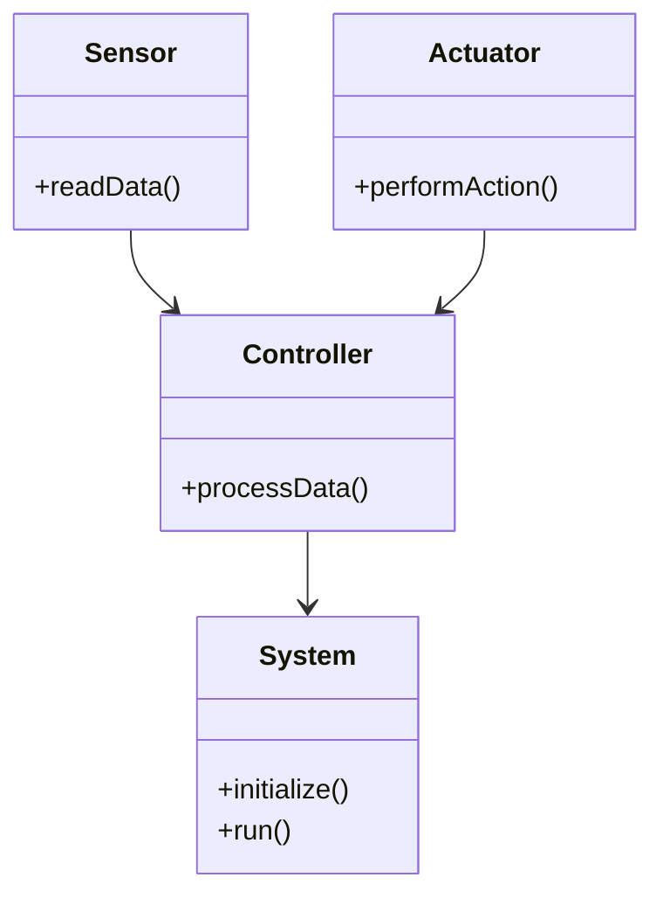

## 20.5 Patterns in Embedded Systems

Embedded systems are specialized computing systems that perform dedicated functions within larger systems. These systems are often resource-constrained, requiring careful consideration of memory, processing power, and energy consumption. In this section, we will explore design patterns that are particularly useful in the context of embedded systems, focusing on how they can be applied using C++ to create efficient, reliable, and scalable software.

### Introduction to Embedded Systems

Embedded systems are ubiquitous, found in devices ranging from household appliances to complex industrial machinery. They often operate under stringent constraints, including limited memory, processing power, and energy availability. As a result, software design for embedded systems requires a unique approach, emphasizing efficiency and reliability.

#### Key Characteristics of Embedded Systems

- **Resource Constraints**: Limited memory, processing power, and energy.
- **Real-Time Operation**: Many embedded systems must meet strict timing requirements.
- **Reliability**: High reliability is crucial, as failures can lead to significant consequences.
- **Specific Functionality**: Embedded systems are typically designed for specific tasks.

### Design Patterns for Embedded Systems

Design patterns are reusable solutions to common software design problems. In the context of embedded systems, certain patterns are particularly beneficial due to their ability to optimize resource usage and enhance system reliability. Let's explore some of these patterns.

#### 1. Singleton Pattern

**Category**: Creational

**Intent**: Ensure a class has only one instance and provide a global point of access to it.

**Diagrams**:


**Key Participants**:
- **Singleton**: The class that is restricted to a single instance.

**Applicability**: Use the Singleton pattern when a single instance of a class is required across the system, such as for managing hardware resources or configuration settings.

**Sample Code Snippet**:
```cpp
class Singleton {
private:
    static Singleton* instance;
    Singleton() {} // Private constructor

public:
    static Singleton* getInstance() {
        if (instance == nullptr) {
            instance = new Singleton();
        }
        return instance;
    }
};

// Initialize static member
Singleton* Singleton::instance = nullptr;
```

**Design Considerations**: Ensure thread safety, especially in multi-threaded environments. Consider using a mutex or double-checked locking.

**Differences and Similarities**: Similar to the Multiton pattern, but Singleton restricts to one instance.

#### 2. State Pattern

**Category**: Behavioral

**Intent**: Allow an object to alter its behavior when its internal state changes.

**Diagrams**:


**Key Participants**:
- **Context**: Maintains an instance of a ConcreteState subclass.
- **State**: Defines an interface for encapsulating the behavior associated with a particular state.

**Applicability**: Use the State pattern for devices with multiple operational modes, such as a thermostat with heating and cooling states.

**Sample Code Snippet**:
```cpp
class State {
public:
    virtual void handle() = 0;
};

class StateA : public State {
public:
    void handle() override {
        // Handle StateA behavior
    }
};

class StateB : public State {
public:
    void handle() override {
        // Handle StateB behavior
    }
};

class Context {
private:
    State* currentState;

public:
    void setState(State* state) {
        currentState = state;
    }

    void request() {
        currentState->handle();
    }
};
```

**Design Considerations**: Ensure that state transitions are well-defined and that the system can handle unexpected states gracefully.

**Differences and Similarities**: Similar to the Strategy pattern, but focuses on state transitions rather than interchangeable algorithms.

#### 3. Observer Pattern

**Category**: Behavioral

**Intent**: Define a one-to-many dependency between objects so that when one object changes state, all its dependents are notified and updated automatically.

**Diagrams**:


**Key Participants**:
- **Subject**: Knows its observers and provides an interface for attaching and detaching them.
- **Observer**: Defines an updating interface for objects that should be notified of changes in a subject.

**Applicability**: Use the Observer pattern for event-driven systems, such as a sensor network where multiple components need to react to sensor data changes.

**Sample Code Snippet**:
```cpp
#include <vector>

class Observer {
public:
    virtual void update() = 0;
};

class Subject {
private:
    std::vector<Observer*> observers;

public:
    void attach(Observer* observer) {
        observers.push_back(observer);
    }

    void detach(Observer* observer) {
        observers.erase(std::remove(observers.begin(), observers.end(), observer), observers.end());
    }

    void notify() {
        for (Observer* observer : observers) {
            observer->update();
        }
    }
};
```

**Design Considerations**: Consider the overhead of managing a list of observers, especially in resource-constrained environments.

**Differences and Similarities**: Similar to the Mediator pattern, but Observer focuses on broadcast communication rather than centralizing control.

#### 4. Command Pattern

**Category**: Behavioral

**Intent**: Encapsulate a request as an object, thereby allowing for parameterization of clients with queues, requests, and operations.

**Diagrams**:


**Key Participants**:
- **Command**: Declares an interface for executing an operation.
- **ConcreteCommand**: Implements the Command interface.
- **Invoker**: Asks the command to carry out the request.

**Applicability**: Use the Command pattern for implementing undo/redo functionality in embedded systems, such as controlling a robotic arm.

**Sample Code Snippet**:
```cpp
class Command {
public:
    virtual void execute() = 0;
};

class ConcreteCommand : public Command {
public:
    void execute() override {
        // Execute command
    }
};

class Invoker {
private:
    Command* command;

public:
    void setCommand(Command* cmd) {
        command = cmd;
    }

    void executeCommand() {
        command->execute();
    }
};
```

**Design Considerations**: Ensure that commands are lightweight and that the system can handle command queuing efficiently.

**Differences and Similarities**: Similar to the Strategy pattern, but Command focuses on encapsulating requests rather than algorithms.

#### 5. Proxy Pattern

**Category**: Structural

**Intent**: Provide a surrogate or placeholder for another object to control access to it.

**Diagrams**:


**Key Participants**:
- **Subject**: Defines the common interface for RealSubject and Proxy.
- **RealSubject**: The real object that the proxy represents.
- **Proxy**: Maintains a reference to the RealSubject and controls access to it.

**Applicability**: Use the Proxy pattern for controlling access to hardware resources, such as a network interface or a file system.

**Sample Code Snippet**:
```cpp
class Subject {
public:
    virtual void request() = 0;
};

class RealSubject : public Subject {
public:
    void request() override {
        // Handle real request
    }
};

class Proxy : public Subject {
private:
    RealSubject* realSubject;

public:
    void request() override {
        if (!realSubject) {
            realSubject = new RealSubject();
        }
        realSubject->request();
    }
};
```

**Design Considerations**: Consider the overhead of proxying requests and ensure that the proxy does not become a bottleneck.

**Differences and Similarities**: Similar to the Decorator pattern, but Proxy focuses on controlling access rather than adding behavior.

### Constraints and Considerations in Embedded Programming

Embedded systems often operate under unique constraints that influence software design. Let's explore some of these constraints and how they affect the application of design patterns.

#### Memory Constraints

Embedded systems typically have limited memory, requiring efficient use of available resources. Design patterns such as Singleton and Flyweight can help minimize memory usage by sharing instances and data.

#### Processing Power

Limited processing power necessitates efficient algorithms and data structures. Patterns like State and Strategy can help optimize performance by enabling dynamic behavior changes without complex conditional logic.

#### Energy Consumption

Energy efficiency is critical in battery-powered devices. Patterns that minimize processing and memory usage, such as Proxy and Command, can help reduce energy consumption.

#### Real-Time Requirements

Many embedded systems must meet strict timing requirements. Patterns like Observer and Command can help manage event-driven systems and ensure timely responses.

### Try It Yourself

To deepen your understanding of these patterns, try modifying the provided code examples. For instance, implement thread-safe Singletons using mutexes, or extend the State pattern to include additional states and transitions. Experimenting with these patterns will help solidify your understanding and prepare you for real-world applications.

### Visualizing Embedded System Design

To better understand how these patterns fit into an embedded system, let's visualize a simple embedded system architecture using a combination of these patterns.



In this architecture, the `System` class initializes and runs the embedded system, utilizing `Sensor` and `Actuator` classes to interact with the environment. The `Controller` class processes data from sensors and controls actuators, potentially using the State pattern to manage different operational modes.

### References and Links

For further reading on embedded systems and design patterns, consider the following resources:

- [Embedded Systems Design Patterns](https://www.embedded.com/design-patterns-for-embedded-systems/)
- [C++ Design Patterns](https://www.cplusplus.com/doc/tutorial/design_patterns/)
- [Real-Time Systems and Programming Languages](https://www.amazon.com/Real-Time-Systems-Programming-Languages/dp/0321417452)

### Knowledge Check

To reinforce your understanding of embedded system design patterns, consider the following questions:

1. How can the Singleton pattern help manage hardware resources in an embedded system?
2. What are the key differences between the State and Strategy patterns?
3. How can the Observer pattern be used in a sensor network?
4. What are the benefits of using the Proxy pattern in an embedded system?

### Embrace the Journey

Remember, mastering design patterns in embedded systems is a journey. As you continue to explore and apply these patterns, you'll develop a deeper understanding of how to create efficient, reliable, and scalable software for resource-constrained devices. Keep experimenting, stay curious, and enjoy the journey!

## Quiz Time!



### What is the primary intent of the Singleton pattern in embedded systems?

- [x] To ensure a class has only one instance and provide a global point of access to it.
- [ ] To allow an object to alter its behavior when its internal state changes.
- [ ] To define a one-to-many dependency between objects.
- [ ] To encapsulate a request as an object.

> **Explanation:** The Singleton pattern ensures that a class has only one instance and provides a global point of access to it, which is particularly useful for managing hardware resources in embedded systems.

### Which pattern is most suitable for managing multiple operational modes in a device?

- [ ] Singleton
- [x] State
- [ ] Observer
- [ ] Command

> **Explanation:** The State pattern is ideal for managing multiple operational modes, allowing an object to change its behavior when its internal state changes.

### How can the Observer pattern be applied in a sensor network?

- [x] By defining a one-to-many dependency so that when one object changes state, all its dependents are notified and updated automatically.
- [ ] By encapsulating a request as an object.
- [ ] By ensuring a class has only one instance.
- [ ] By providing a surrogate for another object to control access to it.

> **Explanation:** The Observer pattern is useful in sensor networks for notifying multiple components of changes in sensor data.

### What is a key consideration when using the Proxy pattern in embedded systems?

- [ ] Ensuring thread safety
- [x] Avoiding bottlenecks
- [ ] Managing state transitions
- [ ] Encapsulating requests

> **Explanation:** When using the Proxy pattern, it's important to ensure that the proxy does not become a bottleneck, especially in resource-constrained environments.

### Which pattern is similar to the Strategy pattern but focuses on state transitions?

- [ ] Singleton
- [x] State
- [ ] Observer
- [ ] Command

> **Explanation:** The State pattern is similar to the Strategy pattern but focuses on state transitions rather than interchangeable algorithms.

### What is a common use case for the Command pattern in embedded systems?

- [x] Implementing undo/redo functionality
- [ ] Managing hardware resources
- [ ] Controlling access to objects
- [ ] Defining a one-to-many dependency

> **Explanation:** The Command pattern is often used to implement undo/redo functionality by encapsulating requests as objects.

### How does the Proxy pattern differ from the Decorator pattern?

- [x] Proxy focuses on controlling access, while Decorator adds behavior.
- [ ] Proxy adds behavior, while Decorator controls access.
- [ ] Both patterns focus on controlling access.
- [ ] Both patterns focus on adding behavior.

> **Explanation:** The Proxy pattern focuses on controlling access to an object, while the Decorator pattern adds behavior to an object.

### What is a key benefit of using design patterns in embedded systems?

- [x] They provide reusable solutions to common design problems.
- [ ] They increase memory usage.
- [ ] They complicate the software architecture.
- [ ] They reduce system reliability.

> **Explanation:** Design patterns provide reusable solutions to common design problems, helping to create efficient and reliable software.

### Which pattern is used to encapsulate a request as an object?

- [ ] Singleton
- [ ] State
- [ ] Observer
- [x] Command

> **Explanation:** The Command pattern encapsulates a request as an object, allowing for parameterization of clients with queues, requests, and operations.

### True or False: The Observer pattern is similar to the Mediator pattern, but focuses on broadcast communication rather than centralizing control.

- [x] True
- [ ] False

> **Explanation:** The Observer pattern is similar to the Mediator pattern, but it focuses on broadcast communication, notifying all observers of changes, whereas the Mediator pattern centralizes control.


