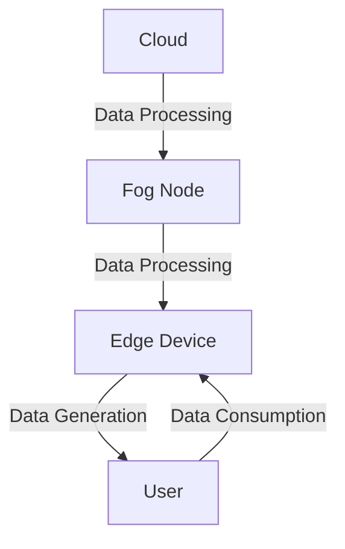

## 20.6 Patterns in Cloud Computing and Edge Computing

In the rapidly evolving landscape of software development, cloud and edge computing have emerged as pivotal paradigms. These technologies enable scalable, distributed, and efficient computing solutions, and C++ plays a crucial role in this ecosystem due to its performance efficiency and system-level capabilities. In this section, we delve into the design patterns and best practices for leveraging C++ in cloud and edge computing environments, focusing on microservices, scalability, and distributed systems.

### Introduction to Cloud and Edge Computing

Cloud computing refers to the delivery of computing services over the internet, allowing for on-demand access to resources such as servers, storage, databases, and more. Edge computing, on the other hand, involves processing data closer to the source of data generation, reducing latency and bandwidth usage by minimizing the need to send data to centralized cloud servers.

#### Key Concepts

- **Scalability**: The ability of a system to handle increased load by adding resources.
- **Microservices**: An architectural style that structures an application as a collection of loosely coupled services.
- **Distributed Systems**: Systems that run on multiple computers (nodes) and communicate over a network.

### Microservices in C++

Microservices architecture is a design pattern that structures an application as a collection of small, autonomous services, each responsible for a specific business function. This approach offers several advantages, including improved scalability, flexibility, and resilience.

#### Design Pattern: Service Discovery

**Intent**: Enable microservices to dynamically discover and communicate with each other without hardcoding network locations.

**Key Participants**:
- **Service Registry**: A centralized database of service instances and their locations.
- **Service Provider**: Registers itself with the service registry.
- **Service Consumer**: Queries the service registry to find available services.

**Applicability**: Use this pattern when building microservices that need to communicate with each other in a dynamic and scalable manner.

**Sample Code Snippet**:

```cpp
#include <iostream>
#include <unordered_map>
#include <string>

// Service Registry
class ServiceRegistry {
public:
    void registerService(const std::string& name, const std::string& address) {
        registry[name] = address;
    }

    std::string discoverService(const std::string& name) {
        return registry[name];
    }

private:
    std::unordered_map<std::string, std::string> registry;
};

// Example usage
int main() {
    ServiceRegistry registry;
    registry.registerService("AuthService", "192.168.1.1:5000");
    std::string authServiceAddress = registry.discoverService("AuthService");
    std::cout << "AuthService is located at: " << authServiceAddress << std::endl;
    return 0;
}
```

**Design Considerations**: Ensure that the service registry is highly available and can handle concurrent updates and queries.

**Differences and Similarities**: Service Discovery is often confused with Load Balancing, but while both deal with distributing requests, Service Discovery focuses on finding service instances, whereas Load Balancing distributes requests among available instances.

#### Design Pattern: Circuit Breaker

**Intent**: Prevent a network or service failure from cascading to other services by stopping requests to a failing service.

**Key Participants**:
- **Circuit Breaker**: Monitors service calls and opens the circuit when failures exceed a threshold.
- **Service**: The target service that the circuit breaker monitors.

**Applicability**: Use this pattern to improve the resilience of microservices by preventing repeated failures from affecting the entire system.

**Sample Code Snippet**:

```cpp
#include <iostream>
#include <chrono>
#include <thread>

class CircuitBreaker {
public:
    CircuitBreaker(int failureThreshold, int recoveryTime)
        : failureThreshold(failureThreshold), recoveryTime(recoveryTime), failureCount(0), state(CLOSED) {}

    bool callService() {
        if (state == OPEN) {
            auto now = std::chrono::steady_clock::now();
            if (now - lastFailureTime > std::chrono::seconds(recoveryTime)) {
                state = HALF_OPEN;
            } else {
                return false;
            }
        }

        // Simulate service call
        bool success = performServiceCall();

        if (!success) {
            failureCount++;
            if (failureCount >= failureThreshold) {
                state = OPEN;
                lastFailureTime = std::chrono::steady_clock::now();
            }
        } else {
            failureCount = 0;
            state = CLOSED;
        }

        return success;
    }

private:
    enum State { CLOSED, OPEN, HALF_OPEN };
    State state;
    int failureThreshold;
    int recoveryTime;
    int failureCount;
    std::chrono::steady_clock::time_point lastFailureTime;

    bool performServiceCall() {
        // Simulate a 50% chance of failure
        return rand() % 2 == 0;
    }
};

// Example usage
int main() {
    CircuitBreaker breaker(3, 5);
    for (int i = 0; i < 10; ++i) {
        if (breaker.callService()) {
            std::cout << "Service call succeeded" << std::endl;
        } else {
            std::cout << "Service call failed or circuit open" << std::endl;
        }
        std::this_thread::sleep_for(std::chrono::seconds(1));
    }
    return 0;
}
```

**Design Considerations**: Carefully choose the failure threshold and recovery time to balance between resilience and availability.

**Differences and Similarities**: The Circuit Breaker pattern is similar to Retry patterns, but while Retry attempts to recover from transient failures, Circuit Breaker prevents further calls to a failing service.

### Scalability and Distributed Systems

Scalability is a critical aspect of cloud and edge computing, allowing systems to handle increasing loads by adding resources. Distributed systems, which consist of multiple interconnected nodes, are inherently scalable and fault-tolerant.

#### Design Pattern: Load Balancer

**Intent**: Distribute incoming network traffic across multiple servers to ensure no single server becomes a bottleneck.

**Key Participants**:
- **Load Balancer**: The component that distributes requests.
- **Server Pool**: A group of servers that handle requests.

**Applicability**: Use this pattern to improve the performance and availability of distributed systems by balancing the load across multiple servers.

**Sample Code Snippet**:

```cpp
#include <iostream>
#include <vector>
#include <string>

class LoadBalancer {
public:
    LoadBalancer(const std::vector<std::string>& servers) : servers(servers), currentIndex(0) {}

    std::string getNextServer() {
        std::string server = servers[currentIndex];
        currentIndex = (currentIndex + 1) % servers.size();
        return server;
    }

private:
    std::vector<std::string> servers;
    size_t currentIndex;
};

// Example usage
int main() {
    std::vector<std::string> servers = {"Server1", "Server2", "Server3"};
    LoadBalancer lb(servers);

    for (int i = 0; i < 10; ++i) {
        std::cout << "Request " << i << " is handled by " << lb.getNextServer() << std::endl;
    }
    return 0;
}
```

**Design Considerations**: Ensure that the load balancer can handle the expected traffic volume and has failover mechanisms in place.

**Differences and Similarities**: Load Balancing is often used in conjunction with Service Discovery to dynamically distribute requests among available service instances.

#### Design Pattern: Data Sharding

**Intent**: Partition a database into smaller, more manageable pieces, called shards, to improve performance and scalability.

**Key Participants**:
- **Shard**: A partition of the database.
- **Shard Manager**: Manages the distribution of data across shards.

**Applicability**: Use this pattern when dealing with large datasets that need to be distributed across multiple nodes for improved performance.

**Sample Code Snippet**:

```cpp
#include <iostream>
#include <unordered_map>
#include <vector>

class ShardManager {
public:
    ShardManager(int numShards) : numShards(numShards) {
        shards.resize(numShards);
    }

    void addData(int key, const std::string& data) {
        int shardIndex = key % numShards;
        shards[shardIndex][key] = data;
    }

    std::string getData(int key) {
        int shardIndex = key % numShards;
        return shards[shardIndex][key];
    }

private:
    int numShards;
    std::vector<std::unordered_map<int, std::string>> shards;
};

// Example usage
int main() {
    ShardManager manager(3);
    manager.addData(1, "Data1");
    manager.addData(2, "Data2");
    manager.addData(3, "Data3");

    std::cout << "Data for key 1: " << manager.getData(1) << std::endl;
    std::cout << "Data for key 2: " << manager.getData(2) << std::endl;
    std::cout << "Data for key 3: " << manager.getData(3) << std::endl;
    return 0;
}
```

**Design Considerations**: Choose a sharding strategy that evenly distributes data and minimizes cross-shard queries.

**Differences and Similarities**: Data Sharding is similar to Partitioning, but while Partitioning can be logical or physical, Sharding typically refers to physical separation of data.

### Edge Computing Patterns

Edge computing brings computation and data storage closer to the location where it is needed, improving response times and saving bandwidth.

#### Design Pattern: Edge Caching

**Intent**: Store frequently accessed data closer to the user to reduce latency and bandwidth usage.

**Key Participants**:
- **Cache**: Stores copies of frequently accessed data.
- **Origin Server**: The source of the data.

**Applicability**: Use this pattern to improve the performance of applications that require low-latency access to data.

**Sample Code Snippet**:

```cpp
#include <iostream>
#include <unordered_map>
#include <string>

class EdgeCache {
public:
    void put(const std::string& key, const std::string& value) {
        cache[key] = value;
    }

    std::string get(const std::string& key) {
        if (cache.find(key) != cache.end()) {
            return cache[key];
        }
        return "Not Found";
    }

private:
    std::unordered_map<std::string, std::string> cache;
};

// Example usage
int main() {
    EdgeCache cache;
    cache.put("page1", "Content of Page 1");
    std::cout << "Cache hit: " << cache.get("page1") << std::endl;
    std::cout << "Cache miss: " << cache.get("page2") << std::endl;
    return 0;
}
```

**Design Considerations**: Implement cache eviction policies to manage cache size and ensure data consistency.

**Differences and Similarities**: Edge Caching is similar to traditional caching but focuses on reducing latency by storing data closer to the user.

#### Design Pattern: Fog Computing

**Intent**: Extend cloud computing capabilities to the edge of the network, enabling real-time processing and decision-making.

**Key Participants**:
- **Fog Node**: A device that provides computing, storage, and networking services between end devices and cloud data centers.
- **Cloud**: Provides centralized data processing and storage.

**Applicability**: Use this pattern to enhance the capabilities of edge devices by offloading processing tasks to nearby fog nodes.

**Sample Code Snippet**:

```cpp
#include <iostream>
#include <string>

class FogNode {
public:
    void processData(const std::string& data) {
        std::cout << "Processing data at fog node: " << data << std::endl;
    }
};

// Example usage
int main() {
    FogNode node;
    node.processData("Sensor data");
    return 0;
}
```

**Design Considerations**: Ensure that fog nodes have sufficient resources to handle the expected processing load and can communicate effectively with both edge devices and the cloud.

**Differences and Similarities**: Fog Computing is often confused with Edge Computing, but while Edge Computing focuses on processing at the device level, Fog Computing involves intermediate nodes that provide additional processing capabilities.

### Try It Yourself

Experiment with the provided code examples by modifying them to suit your specific use cases. For instance, try implementing a more sophisticated load balancing algorithm or adding a cache eviction policy to the edge cache example. These exercises will help reinforce your understanding of the patterns and their applicability in real-world scenarios.

### Visualizing Cloud and Edge Computing Patterns

Below is a diagram illustrating the interaction between cloud, fog, and edge computing components:



**Diagram Description**: This diagram shows the flow of data from the cloud to the edge device, with fog nodes providing intermediate processing. Users interact with edge devices, which generate data that can be processed at the fog or cloud level.

### References and Links

- [Microsoft Azure - What is Cloud Computing?](https://azure.microsoft.com/en-us/overview/what-is-cloud-computing/)
- [AWS - Edge Computing](https://aws.amazon.com/edge-computing/)
- [Google Cloud - Microservices Architecture](https://cloud.google.com/learn/what-are-microservices)

### Knowledge Check

1. Explain the difference between cloud and edge computing.
2. Describe the role of a service registry in microservices architecture.
3. How does the circuit breaker pattern improve system resilience?
4. What are the key considerations when implementing a load balancer?
5. How does data sharding improve database performance?

### Embrace the Journey

Remember, mastering these patterns is just the beginning. As you continue to explore cloud and edge computing, you'll encounter new challenges and opportunities to apply these concepts. Stay curious, keep experimenting, and enjoy the journey!

## Quiz Time!



### What is the primary benefit of using microservices architecture?

- [x] Improved scalability and flexibility
- [ ] Simplified codebase
- [ ] Reduced development time
- [ ] Enhanced security

> **Explanation:** Microservices architecture improves scalability and flexibility by allowing independent deployment and scaling of services.

### Which pattern helps prevent a network or service failure from cascading to other services?

- [x] Circuit Breaker
- [ ] Load Balancer
- [ ] Service Discovery
- [ ] Data Sharding

> **Explanation:** The Circuit Breaker pattern stops requests to a failing service, preventing failures from affecting other services.

### What is the role of a service registry in microservices?

- [x] It stores and provides the locations of service instances.
- [ ] It balances the load across services.
- [ ] It caches frequently accessed data.
- [ ] It secures communication between services.

> **Explanation:** A service registry is a centralized database of service instances and their locations, enabling dynamic discovery.

### How does data sharding improve performance?

- [x] By partitioning data into smaller, manageable pieces
- [ ] By caching data closer to the user
- [ ] By balancing the load across servers
- [ ] By securing data with encryption

> **Explanation:** Data sharding partitions a database into smaller pieces, improving performance by distributing data across nodes.

### What is the main purpose of edge caching?

- [x] To reduce latency and bandwidth usage
- [ ] To secure data at the edge
- [ ] To balance the load across edge devices
- [ ] To partition data into shards

> **Explanation:** Edge caching stores frequently accessed data closer to the user, reducing latency and bandwidth usage.

### Which pattern involves intermediate nodes providing additional processing capabilities?

- [x] Fog Computing
- [ ] Edge Caching
- [ ] Load Balancer
- [ ] Service Discovery

> **Explanation:** Fog Computing extends cloud capabilities to the edge, with fog nodes providing intermediate processing.

### What is a key consideration when implementing a load balancer?

- [x] Ensuring it can handle the expected traffic volume
- [ ] Storing frequently accessed data
- [ ] Partitioning data into shards
- [ ] Securing communication between nodes

> **Explanation:** A load balancer must handle the expected traffic volume and have failover mechanisms in place.

### How does the Circuit Breaker pattern differ from Retry patterns?

- [x] Circuit Breaker prevents further calls to a failing service, while Retry attempts recovery.
- [ ] Circuit Breaker balances load, while Retry secures data.
- [ ] Circuit Breaker caches data, while Retry partitions it.
- [ ] Circuit Breaker discovers services, while Retry balances them.

> **Explanation:** Circuit Breaker stops calls to a failing service, while Retry attempts to recover from transient failures.

### What is the primary focus of edge computing?

- [x] Processing data closer to the source
- [ ] Storing data in the cloud
- [ ] Balancing load across servers
- [ ] Partitioning data into shards

> **Explanation:** Edge computing processes data closer to the source, reducing latency and bandwidth usage.

### True or False: Fog Computing focuses on processing at the device level.

- [ ] True
- [x] False

> **Explanation:** Fog Computing involves intermediate nodes that provide additional processing capabilities, not just at the device level.


