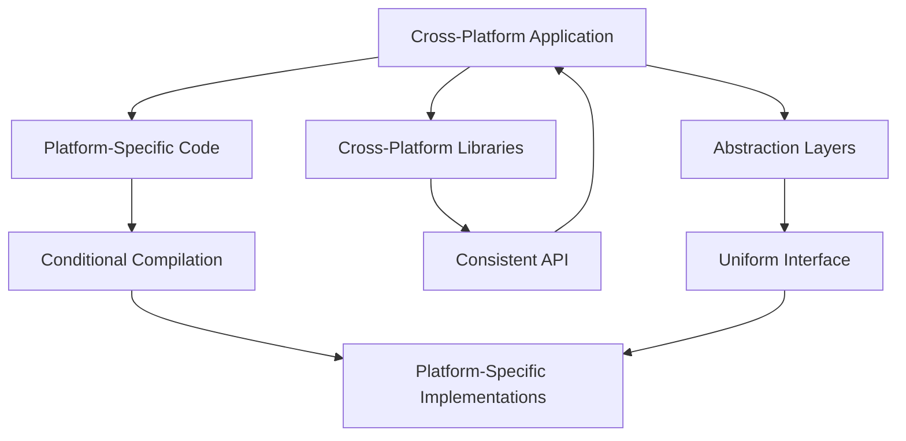

## 20.7 Cross-Platform Development

In today's diverse technological landscape, software engineers and architects face the challenge of developing applications that run seamlessly across multiple platforms. Cross-platform development in C++ is a strategic approach that allows developers to write code that can be compiled and executed on different operating systems and hardware architectures. This section delves into the essential aspects of cross-platform development, including managing platform-specific code, utilizing cross-platform libraries, and employing conditional compilation and abstraction layers. By mastering these techniques, you can create robust, efficient, and maintainable C++ applications that transcend platform boundaries.

### Understanding Cross-Platform Development

Cross-platform development refers to the practice of writing software that can run on multiple operating systems or environments with minimal modification. The primary goal is to maximize code reuse and reduce the effort required to maintain separate codebases for different platforms. In C++, this involves careful consideration of platform-specific APIs, libraries, and system calls, as well as the use of abstraction layers and conditional compilation techniques.

#### Key Concepts

- **Platform-Specific Code**: Code that relies on features or APIs unique to a particular operating system or hardware architecture.
- **Cross-Platform Libraries**: Libraries designed to provide a consistent interface across different platforms, abstracting away platform-specific details.
- **Conditional Compilation**: The use of preprocessor directives to include or exclude code based on the target platform.
- **Abstraction Layers**: Layers of code that hide platform-specific details, providing a uniform interface to the rest of the application.

### Managing Platform-Specific Code

Managing platform-specific code is a critical aspect of cross-platform development. It involves identifying portions of code that are dependent on specific operating systems or hardware and isolating them in a way that minimizes their impact on the overall codebase.

#### Strategies for Managing Platform-Specific Code

1. **Isolation of Platform-Specific Code**: Encapsulate platform-specific logic within separate modules or classes. This approach keeps the main codebase clean and reduces the risk of platform-specific bugs.

2. **Use of Interfaces and Abstract Classes**: Define interfaces or abstract classes to represent platform-specific functionality. Implement these interfaces in platform-specific classes, allowing the main application to interact with a consistent API.

3. **Platform-Specific Build Configurations**: Use build systems like CMake to define platform-specific build configurations. This allows you to compile different versions of the code depending on the target platform.

4. **Testing on Multiple Platforms**: Regularly test your application on all target platforms to ensure consistent behavior and performance. Automated testing frameworks can help streamline this process.

#### Code Example: Platform-Specific File Handling

```cpp
#ifdef _WIN32
#include <windows.h>
void openFile(const std::string& filename) {
    // Windows-specific file handling
    HANDLE file = CreateFile(filename.c_str(), GENERIC_READ, 0, NULL, OPEN_EXISTING, FILE_ATTRIBUTE_NORMAL, NULL);
    if (file == INVALID_HANDLE_VALUE) {
        // Handle error
    }
    // Process file
    CloseHandle(file);
}
#else
#include <fcntl.h>
#include <unistd.h>
void openFile(const std::string& filename) {
    // POSIX-specific file handling
    int file = open(filename.c_str(), O_RDONLY);
    if (file < 0) {
        // Handle error
    }
    // Process file
    close(file);
}
#endif
```

### Utilizing Cross-Platform Libraries

Cross-platform libraries are invaluable tools for developers aiming to write portable code. These libraries abstract away platform-specific details, providing a consistent API that can be used across different environments.

#### Popular Cross-Platform Libraries

1. **Boost**: A collection of portable C++ libraries that work well with the C++ Standard Library. Boost provides libraries for tasks such as threading, file handling, and networking.

2. **Qt**: A comprehensive framework for developing cross-platform applications with a focus on GUI development. Qt provides tools for building applications that run on Windows, macOS, Linux, and mobile platforms.

3. **POCO C++ Libraries**: A set of C++ libraries for building network-centric applications. POCO provides components for networking, file handling, and multithreading.

4. **SDL (Simple DirectMedia Layer)**: A library for handling multimedia, input, and graphics. SDL is widely used in game development and other multimedia applications.

#### Code Example: Using the Qt Framework

```cpp
#include <QApplication>
#include <QPushButton>

int main(int argc, char *argv[]) {
    QApplication app(argc, argv);

    QPushButton button("Hello, World!");
    button.resize(200, 100);
    button.show();

    return app.exec();
}
```

### Conditional Compilation and Abstraction Layers

Conditional compilation and abstraction layers are techniques used to manage platform-specific code and ensure that applications can be built and run on different platforms with minimal changes.

#### Conditional Compilation

Conditional compilation involves using preprocessor directives to include or exclude code based on the target platform. This technique allows developers to maintain a single codebase while accommodating platform-specific differences.

##### Key Preprocessor Directives

- `#ifdef`, `#ifndef`, `#if`, `#else`, `#elif`, `#endif`: Used to conditionally include or exclude code.
- `#define`, `#undef`: Used to define or undefine macros.

#### Code Example: Conditional Compilation

```cpp
#include <iostream>

int main() {
#ifdef _WIN32
    std::cout << "Running on Windows" << std::endl;
#elif __APPLE__
    std::cout << "Running on macOS" << std::endl;
#elif __linux__
    std::cout << "Running on Linux" << std::endl;
#else
    std::cout << "Unknown platform" << std::endl;
#endif
    return 0;
}
```

#### Abstraction Layers

Abstraction layers provide a way to separate platform-specific code from the rest of the application. By defining a uniform interface, abstraction layers allow the main application to interact with platform-specific functionality without being aware of the underlying details.

##### Benefits of Abstraction Layers

- **Code Reusability**: Abstraction layers promote code reuse by providing a consistent interface across different platforms.
- **Maintainability**: By isolating platform-specific code, abstraction layers make it easier to update or modify platform-specific implementations without affecting the rest of the application.
- **Portability**: Applications that use abstraction layers are more portable, as they can be easily adapted to new platforms by implementing the necessary platform-specific functionality.

#### Code Example: Abstraction Layer for File Handling

```cpp
class FileHandler {
public:
    virtual ~FileHandler() {}
    virtual void open(const std::string& filename) = 0;
    virtual void close() = 0;
};

#ifdef _WIN32
class WindowsFileHandler : public FileHandler {
public:
    void open(const std::string& filename) override {
        // Windows-specific file handling
    }
    void close() override {
        // Windows-specific file closing
    }
};
#else
class POSIXFileHandler : public FileHandler {
public:
    void open(const std::string& filename) override {
        // POSIX-specific file handling
    }
    void close() override {
        // POSIX-specific file closing
    }
};
#endif

void processFile(FileHandler* handler, const std::string& filename) {
    handler->open(filename);
    // Process file
    handler->close();
}
```

### Visualizing Cross-Platform Development

To better understand the flow of cross-platform development, let's visualize the process using a diagram that illustrates the interaction between platform-specific code, cross-platform libraries, conditional compilation, and abstraction layers.



**Diagram Description**: This diagram illustrates the components involved in cross-platform development. The cross-platform application interacts with platform-specific code, cross-platform libraries, and abstraction layers. Platform-specific code is managed using conditional compilation, while cross-platform libraries provide a consistent API. Abstraction layers offer a uniform interface, allowing the application to remain portable and maintainable.

### Best Practices for Cross-Platform Development

To achieve successful cross-platform development, consider the following best practices:

1. **Consistent Coding Standards**: Adhere to consistent coding standards across all platforms to ensure code readability and maintainability.

2. **Automated Testing**: Implement automated testing frameworks to regularly test your application on all target platforms. This helps identify platform-specific issues early in the development process.

3. **Documentation**: Maintain comprehensive documentation of platform-specific code and configurations. This aids in understanding and maintaining the codebase.

4. **Version Control**: Use version control systems to manage changes to the codebase. This is especially important when dealing with multiple platform-specific branches.

5. **Community and Support**: Engage with the developer community and seek support from forums and online resources. Many cross-platform libraries have active communities that can provide valuable insights and assistance.

### Try It Yourself

Experiment with the code examples provided in this section by modifying them to suit different platforms. For instance, try adding support for a new platform by implementing the necessary platform-specific code and updating the conditional compilation directives. This hands-on approach will deepen your understanding of cross-platform development techniques and their practical applications.

### Knowledge Check

Before moving on, take a moment to reflect on what you've learned about cross-platform development. Consider the following questions:

- How can you isolate platform-specific code to improve maintainability?
- What are the benefits of using cross-platform libraries in your projects?
- How do conditional compilation and abstraction layers contribute to cross-platform development?

### Conclusion

Cross-platform development in C++ is a powerful approach that enables developers to create applications that run seamlessly across multiple platforms. By managing platform-specific code, utilizing cross-platform libraries, and employing conditional compilation and abstraction layers, you can build robust, efficient, and maintainable software. As you continue your journey in mastering C++ design patterns, remember to embrace the principles of cross-platform development and apply them to your projects.

## Quiz Time!



### What is the primary goal of cross-platform development?

- [x] To maximize code reuse and reduce the effort required to maintain separate codebases for different platforms.
- [ ] To create applications that only run on Windows.
- [ ] To focus solely on GUI development.
- [ ] To develop software that is incompatible with other platforms.

> **Explanation:** The primary goal of cross-platform development is to maximize code reuse and reduce the effort required to maintain separate codebases for different platforms.

### Which of the following is a popular cross-platform library for GUI development?

- [ ] Boost
- [x] Qt
- [ ] SDL
- [ ] POCO

> **Explanation:** Qt is a comprehensive framework for developing cross-platform applications with a focus on GUI development.

### What is conditional compilation used for?

- [x] To include or exclude code based on the target platform.
- [ ] To compile code faster.
- [ ] To optimize memory usage.
- [ ] To encrypt source code.

> **Explanation:** Conditional compilation involves using preprocessor directives to include or exclude code based on the target platform.

### What is the benefit of using abstraction layers in cross-platform development?

- [x] They provide a uniform interface, allowing the main application to interact with platform-specific functionality without being aware of the underlying details.
- [ ] They make the code run faster.
- [ ] They increase the complexity of the code.
- [ ] They are only used in game development.

> **Explanation:** Abstraction layers provide a uniform interface, allowing the main application to interact with platform-specific functionality without being aware of the underlying details.

### Which preprocessor directive is used to conditionally include code?

- [x] #ifdef
- [ ] #include
- [ ] #pragma
- [ ] #error

> **Explanation:** The `#ifdef` directive is used to conditionally include code based on whether a macro is defined.

### What is a key advantage of using cross-platform libraries?

- [x] They abstract away platform-specific details, providing a consistent API that can be used across different environments.
- [ ] They are only available for Windows.
- [ ] They increase the size of the application.
- [ ] They are used to encrypt data.

> **Explanation:** Cross-platform libraries abstract away platform-specific details, providing a consistent API that can be used across different environments.

### What is the purpose of using interfaces and abstract classes in cross-platform development?

- [x] To define platform-specific functionality and allow the main application to interact with a consistent API.
- [ ] To make the code more complex.
- [ ] To slow down the application.
- [ ] To only support Windows platforms.

> **Explanation:** Interfaces and abstract classes are used to define platform-specific functionality and allow the main application to interact with a consistent API.

### What is the role of automated testing in cross-platform development?

- [x] To regularly test the application on all target platforms and identify platform-specific issues early in the development process.
- [ ] To make the application run faster.
- [ ] To reduce the size of the codebase.
- [ ] To encrypt the application.

> **Explanation:** Automated testing is used to regularly test the application on all target platforms and identify platform-specific issues early in the development process.

### Which of the following is NOT a cross-platform library?

- [ ] Boost
- [ ] Qt
- [x] DirectX
- [ ] SDL

> **Explanation:** DirectX is a collection of APIs for handling tasks related to multimedia, especially game programming and video, on Microsoft platforms.

### True or False: Cross-platform development only applies to desktop applications.

- [ ] True
- [x] False

> **Explanation:** Cross-platform development applies to a wide range of applications, including desktop, mobile, and web applications.


