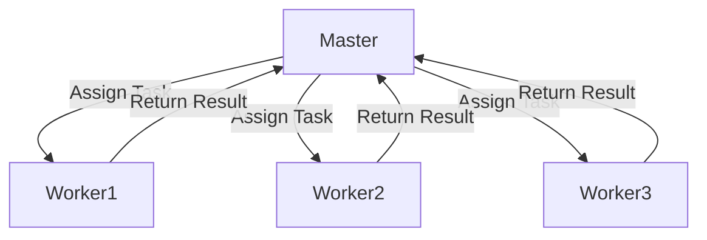

## 20.8 Patterns for High-Performance Computing (HPC)

High-Performance Computing (HPC) is a critical domain where C++ shines due to its performance capabilities and control over system resources. This section delves into the design patterns and paradigms that are essential for developing efficient parallel computing applications using MPI, OpenMP, and CUDA in C++. Let's explore these patterns and see how they can be applied to harness the full potential of modern hardware.

### Introduction to High-Performance Computing

High-Performance Computing involves the use of supercomputers and parallel processing techniques to solve complex computational problems. HPC applications span various domains, including scientific simulations, financial modeling, and data analysis. The goal is to achieve maximum computational speed and efficiency, often by distributing workloads across multiple processors or nodes.

### Parallel Computing Patterns

Parallel computing patterns are essential for designing systems that can efficiently utilize multiple processors or cores. These patterns help in structuring applications to perform tasks concurrently, thereby reducing execution time and improving performance.

#### Key Concepts in Parallel Computing

- **Concurrency vs. Parallelism**: Concurrency involves multiple tasks making progress, while parallelism involves tasks running simultaneously.
- **Data Parallelism**: Distributes data across different parallel computing nodes.
- **Task Parallelism**: Distributes tasks across different parallel computing nodes.

### MPI (Message Passing Interface)

MPI is a standardized and portable message-passing system designed to function on parallel computing architectures. It is widely used for programming parallel computers and clusters.

#### Design Pattern: Master-Worker

**Intent**: The Master-Worker pattern is used to distribute tasks among multiple worker processes. The master process assigns tasks to workers and collects results.

**Key Participants**:
- **Master**: Assigns tasks and gathers results.
- **Workers**: Execute assigned tasks and return results to the master.

**Applicability**: Use this pattern when tasks can be divided into independent units of work.

**Sample Code Snippet**:

```cpp
#include <mpi.h>
#include <iostream>
#include <vector>

void master(int num_workers) {
    int task_id = 0;
    int result;
    MPI_Status status;

    // Distribute tasks
    for (int i = 1; i <= num_workers; ++i) {
        MPI_Send(&task_id, 1, MPI_INT, i, 0, MPI_COMM_WORLD);
        task_id++;
    }

    // Collect results
    for (int i = 0; i < num_workers; ++i) {
        MPI_Recv(&result, 1, MPI_INT, MPI_ANY_SOURCE, MPI_ANY_TAG, MPI_COMM_WORLD, &status);
        std::cout << "Received result: " << result << " from worker " << status.MPI_SOURCE << std::endl;
    }
}

void worker() {
    int task_id;
    MPI_Status status;

    // Receive task
    MPI_Recv(&task_id, 1, MPI_INT, 0, 0, MPI_COMM_WORLD, &status);

    // Perform task
    int result = task_id * 2; // Example computation

    // Send result back to master
    MPI_Send(&result, 1, MPI_INT, 0, 0, MPI_COMM_WORLD);
}

int main(int argc, char** argv) {
    MPI_Init(&argc, &argv);

    int world_rank;
    MPI_Comm_rank(MPI_COMM_WORLD, &world_rank);

    int world_size;
    MPI_Comm_size(MPI_COMM_WORLD, &world_size);

    if (world_rank == 0) {
        master(world_size - 1);
    } else {
        worker();
    }

    MPI_Finalize();
    return 0;
}
```

**Design Considerations**: Ensure that the workload is evenly distributed among workers to avoid bottlenecks. Use non-blocking communication for better performance.

**Differences and Similarities**: Similar to the Producer-Consumer pattern but focuses on task distribution rather than data flow.

### OpenMP (Open Multi-Processing)

OpenMP is an API that supports multi-platform shared memory multiprocessing programming in C, C++, and Fortran. It is used to write parallel applications for shared memory architectures.

#### Design Pattern: Fork-Join

**Intent**: The Fork-Join pattern divides a task into subtasks that can be processed in parallel, and then combines the results.

**Key Participants**:
- **Fork**: Splits the task into parallel subtasks.
- **Join**: Combines the results of the subtasks.

**Applicability**: Use this pattern when tasks can be divided into independent subtasks that can be processed concurrently.

**Sample Code Snippet**:

```cpp
#include <omp.h>
#include <iostream>
#include <vector>

int main() {
    const int num_elements = 1000;
    std::vector<int> data(num_elements, 1);
    int sum = 0;

    #pragma omp parallel for reduction(+:sum)
    for (int i = 0; i < num_elements; ++i) {
        sum += data[i];
    }

    std::cout << "Sum: " << sum << std::endl;
    return 0;
}
```

**Design Considerations**: Ensure that the workload is balanced across threads. Use reduction clauses to safely combine results from parallel regions.

**Differences and Similarities**: Similar to the Divide and Conquer pattern but focuses on parallel execution.

### CUDA (Compute Unified Device Architecture)

CUDA is a parallel computing platform and application programming interface model created by NVIDIA. It allows developers to use a CUDA-enabled graphics processing unit (GPU) for general-purpose processing.

#### Design Pattern: Data Parallelism

**Intent**: The Data Parallelism pattern involves distributing data across multiple processing units, allowing each unit to perform the same operation on different pieces of data.

**Key Participants**:
- **Host**: Manages data and kernel execution.
- **Device**: Executes kernels on the GPU.

**Applicability**: Use this pattern when the same operation needs to be performed on large datasets.

**Sample Code Snippet**:

```cpp
#include <iostream>
#include <cuda_runtime.h>

__global__ void add(int* a, int* b, int* c, int n) {
    int index = threadIdx.x + blockIdx.x * blockDim.x;
    if (index < n) {
        c[index] = a[index] + b[index];
    }
}

int main() {
    const int array_size = 1000;
    int a[array_size], b[array_size], c[array_size];
    int *d_a, *d_b, *d_c;

    // Initialize arrays
    for (int i = 0; i < array_size; ++i) {
        a[i] = i;
        b[i] = i * 2;
    }

    // Allocate device memory
    cudaMalloc((void**)&d_a, array_size * sizeof(int));
    cudaMalloc((void**)&d_b, array_size * sizeof(int));
    cudaMalloc((void**)&d_c, array_size * sizeof(int));

    // Copy data to device
    cudaMemcpy(d_a, a, array_size * sizeof(int), cudaMemcpyHostToDevice);
    cudaMemcpy(d_b, b, array_size * sizeof(int), cudaMemcpyHostToDevice);

    // Launch kernel
    int block_size = 256;
    int num_blocks = (array_size + block_size - 1) / block_size;
    add<<<num_blocks, block_size>>>(d_a, d_b, d_c, array_size);

    // Copy result back to host
    cudaMemcpy(c, d_c, array_size * sizeof(int), cudaMemcpyDeviceToHost);

    // Free device memory
    cudaFree(d_a);
    cudaFree(d_b);
    cudaFree(d_c);

    // Display result
    for (int i = 0; i < 10; ++i) {
        std::cout << c[i] << " ";
    }
    std::cout << std::endl;

    return 0;
}
```

**Design Considerations**: Ensure that data transfer between host and device is minimized to reduce overhead. Optimize kernel execution by choosing appropriate block and grid sizes.

**Differences and Similarities**: Similar to the SIMD (Single Instruction, Multiple Data) pattern but leverages GPU capabilities for massive parallelism.

### Visualizing Parallel Computing Patterns

To better understand how these patterns work, let's visualize the Master-Worker pattern using a diagram.



**Description**: This diagram illustrates the Master-Worker pattern where the master process assigns tasks to worker processes, and workers return results back to the master.

### Try It Yourself

Experiment with the provided code examples by modifying the number of tasks, threads, or data size. Observe how these changes affect performance and scalability. Try implementing additional patterns such as Pipeline or Divide and Conquer using MPI, OpenMP, or CUDA.

### Knowledge Check

- What are the main differences between MPI and OpenMP?
- How does CUDA leverage GPU capabilities for parallel computing?
- What are the benefits of using the Fork-Join pattern in OpenMP?

### Conclusion

High-Performance Computing in C++ is a powerful way to tackle complex computational problems. By leveraging parallel computing patterns with MPI, OpenMP, and CUDA, developers can create efficient and scalable applications. Remember, this is just the beginning. As you progress, you'll discover more patterns and techniques to optimize performance in your C++ applications. Keep experimenting, stay curious, and enjoy the journey!

## Quiz Time!



### What is the primary goal of High-Performance Computing (HPC)?

- [x] To achieve maximum computational speed and efficiency
- [ ] To simplify code readability
- [ ] To reduce code size
- [ ] To enhance user interface design

> **Explanation:** The primary goal of HPC is to achieve maximum computational speed and efficiency, often by distributing workloads across multiple processors or nodes.

### Which pattern is used in MPI to distribute tasks among multiple worker processes?

- [x] Master-Worker
- [ ] Fork-Join
- [ ] Data Parallelism
- [ ] Observer

> **Explanation:** The Master-Worker pattern is used in MPI to distribute tasks among multiple worker processes, with the master process assigning tasks and collecting results.

### In OpenMP, what does the Fork-Join pattern do?

- [x] Divides a task into subtasks that can be processed in parallel and then combines the results
- [ ] Distributes data across different parallel computing nodes
- [ ] Controls access to shared resources
- [ ] Encapsulates requests as objects

> **Explanation:** In OpenMP, the Fork-Join pattern divides a task into subtasks that can be processed in parallel and then combines the results.

### What is the role of the host in CUDA's Data Parallelism pattern?

- [x] Manages data and kernel execution
- [ ] Executes kernels on the GPU
- [ ] Assigns tasks to worker processes
- [ ] Combines results from parallel regions

> **Explanation:** In CUDA's Data Parallelism pattern, the host manages data and kernel execution, while the device executes kernels on the GPU.

### Which of the following is a key consideration when using the Master-Worker pattern in MPI?

- [x] Ensuring workload is evenly distributed among workers
- [ ] Using reduction clauses to combine results
- [ ] Minimizing data transfer between host and device
- [ ] Choosing appropriate block and grid sizes

> **Explanation:** When using the Master-Worker pattern in MPI, it is important to ensure that the workload is evenly distributed among workers to avoid bottlenecks.

### How does CUDA leverage GPU capabilities for parallel computing?

- [x] By allowing each processing unit to perform the same operation on different pieces of data
- [ ] By splitting tasks into parallel subtasks
- [ ] By using message-passing systems
- [ ] By centralizing complex communications

> **Explanation:** CUDA leverages GPU capabilities for parallel computing by allowing each processing unit to perform the same operation on different pieces of data, enabling massive parallelism.

### What is a common use case for the Fork-Join pattern in OpenMP?

- [x] When tasks can be divided into independent subtasks that can be processed concurrently
- [ ] When tasks need to be distributed among multiple worker processes
- [ ] When the same operation needs to be performed on large datasets
- [ ] When tasks need to be encapsulated as objects

> **Explanation:** A common use case for the Fork-Join pattern in OpenMP is when tasks can be divided into independent subtasks that can be processed concurrently.

### Which of the following is a benefit of using OpenMP for parallel computing?

- [x] It supports multi-platform shared memory multiprocessing programming
- [ ] It allows developers to use a CUDA-enabled GPU for general-purpose processing
- [ ] It is a standardized message-passing system
- [ ] It provides a unified interface to a set of interfaces

> **Explanation:** OpenMP supports multi-platform shared memory multiprocessing programming, making it beneficial for parallel computing on shared memory architectures.

### What is a key difference between MPI and OpenMP?

- [x] MPI is used for distributed memory systems, while OpenMP is used for shared memory systems
- [ ] MPI is used for shared memory systems, while OpenMP is used for distributed memory systems
- [ ] MPI is a parallel computing platform, while OpenMP is a message-passing system
- [ ] MPI is used for GPU programming, while OpenMP is used for CPU programming

> **Explanation:** MPI is used for distributed memory systems, while OpenMP is used for shared memory systems, making them suitable for different parallel computing architectures.

### True or False: CUDA is specifically designed for CPU parallel computing.

- [ ] True
- [x] False

> **Explanation:** False. CUDA is specifically designed for GPU parallel computing, allowing developers to use a CUDA-enabled GPU for general-purpose processing.


