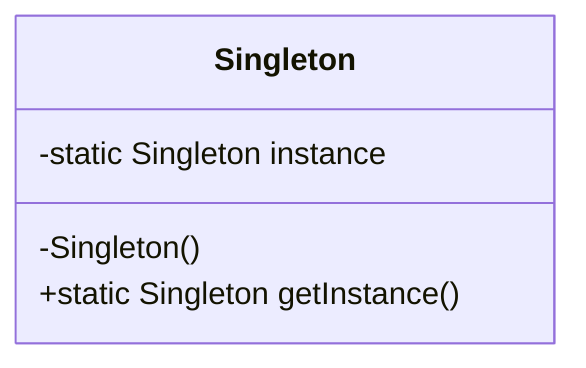
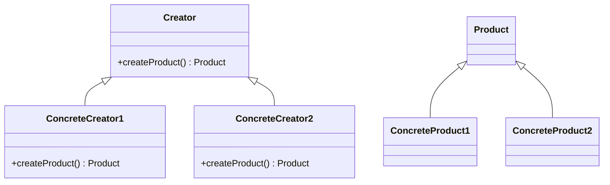
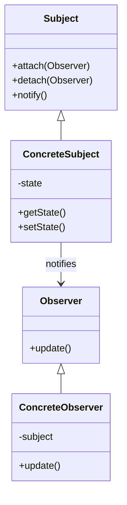

## 21.1 Selecting the Right Pattern

Design patterns are powerful tools in a software engineer's toolkit, offering reusable solutions to common problems. However, selecting the right pattern for a given problem is crucial to harnessing their full potential. In this section, we'll explore how to analyze problem domains, avoid over-engineering, and conduct a cost-benefit analysis to select the most appropriate design pattern for your C++ projects.

### Understanding Problem Domains

Before diving into the selection of a design pattern, it's essential to thoroughly understand the problem domain. This involves analyzing the specific requirements, constraints, and goals of the project. Here are some steps to guide you:

1. **Identify Core Requirements**: Clearly define the primary objectives and functionalities that the software must achieve. This will help you focus on the essential aspects of the problem.

2. **Analyze Constraints**: Consider any limitations related to performance, memory, scalability, or platform-specific requirements. These constraints can significantly influence pattern selection.

3. **Understand Stakeholder Needs**: Engage with stakeholders to gather insights into their expectations and priorities. This will ensure that the chosen pattern aligns with business goals.

4. **Evaluate Existing Solutions**: Review existing solutions or patterns that have been applied to similar problems. This can provide valuable insights and inspiration.

5. **Identify Variability and Change**: Determine areas of the system that are likely to change over time. Patterns that support flexibility and adaptability can be beneficial in such cases.

### Avoiding Over-Engineering

Over-engineering occurs when a solution is more complex than necessary, often due to the inappropriate application of design patterns. To avoid this pitfall:

- **Keep It Simple**: Aim for simplicity in your design. Choose patterns that address the problem without introducing unnecessary complexity.

- **Focus on Current Needs**: While it's important to consider future requirements, avoid designing for hypothetical scenarios that may never occur.

- **Iterate and Refine**: Start with a basic implementation and iteratively refine it as new requirements emerge. This approach allows you to adapt to changes without over-complicating the initial design.

- **Use Patterns Judiciously**: Not every problem requires a design pattern. Sometimes, a straightforward solution is more effective.

### Conducting a Cost-Benefit Analysis

A cost-benefit analysis helps you weigh the advantages and disadvantages of using a particular design pattern. Consider the following factors:

- **Implementation Complexity**: Evaluate the complexity of implementing the pattern. Some patterns may require significant effort and expertise, which can impact development timelines.

- **Performance Impact**: Assess how the pattern affects the performance of the system. Some patterns may introduce overhead, while others can optimize resource usage.

- **Maintainability and Scalability**: Consider how the pattern affects the maintainability and scalability of the system. Patterns that promote modularity and reusability can simplify future enhancements.

- **Flexibility and Adaptability**: Determine whether the pattern allows for easy adaptation to changing requirements. Patterns that support flexibility can reduce the cost of future modifications.

- **Risk and Uncertainty**: Identify any risks associated with the pattern, such as potential for misuse or difficulty in understanding. Weigh these risks against the potential benefits.

### Common Design Patterns and Their Applicability

Let's explore some common design patterns and discuss scenarios where they are most applicable:

#### Creational Patterns

1. **Singleton Pattern**
   - **Intent**: Ensure a class has only one instance and provide a global point of access to it.
   - **Applicability**: Use when a single instance of a class is needed across the application, such as a configuration manager or logging service.
   - **Considerations**: Be cautious of global state and potential issues with multithreading.

2. **Factory Method Pattern**
   - **Intent**: Define an interface for creating an object but let subclasses alter the type of objects that will be created.
   - **Applicability**: Use when a class cannot anticipate the class of objects it must create or when subclasses need to specify the objects they create.
   - **Considerations**: Promotes loose coupling and adherence to the Open/Closed Principle.

3. **Builder Pattern**
   - **Intent**: Separate the construction of a complex object from its representation.
   - **Applicability**: Use when constructing a complex object step by step is required, such as building a complex configuration or assembling a composite object.
   - **Considerations**: Enhances code readability and maintainability by separating construction logic.

#### Structural Patterns

1. **Adapter Pattern**
   - **Intent**: Convert the interface of a class into another interface clients expect.
   - **Applicability**: Use when you want to integrate a class with an incompatible interface into your system.
   - **Considerations**: Facilitates integration with legacy systems or third-party libraries.

2. **Decorator Pattern**
   - **Intent**: Attach additional responsibilities to an object dynamically.
   - **Applicability**: Use when you need to add behavior to individual objects without affecting other objects of the same class.
   - **Considerations**: Promotes flexibility and adherence to the Open/Closed Principle.

3. **Facade Pattern**
   - **Intent**: Provide a unified interface to a set of interfaces in a subsystem.
   - **Applicability**: Use when you want to simplify interactions with a complex subsystem.
   - **Considerations**: Enhances ease of use and reduces coupling between clients and subsystems.

#### Behavioral Patterns

1. **Observer Pattern**
   - **Intent**: Define a one-to-many dependency between objects so that when one object changes state, all its dependents are notified.
   - **Applicability**: Use when changes to one object require changes to others, such as in event-driven systems.
   - **Considerations**: Promotes loose coupling and scalability.

2. **Strategy Pattern**
   - **Intent**: Define a family of algorithms, encapsulate each one, and make them interchangeable.
   - **Applicability**: Use when you want to define multiple algorithms for a task and switch between them at runtime.
   - **Considerations**: Avoids conditional statements and promotes code reuse.

3. **Command Pattern**
   - **Intent**: Encapsulate a request as an object, thereby allowing for parameterization of clients with queues, requests, and operations.
   - **Applicability**: Use when you want to queue operations, undo/redo actions, or log changes.
   - **Considerations**: Facilitates undo functionality and decouples sender and receiver.

### Visualizing Design Patterns

To better understand how design patterns fit into a software architecture, let's visualize some of the key patterns using Mermaid.js diagrams.

#### Singleton Pattern



**Description**: The Singleton pattern ensures a class has only one instance and provides a global point of access to it.

#### Factory Method Pattern



**Description**: The Factory Method pattern defines an interface for creating an object, but lets subclasses decide which class to instantiate.

#### Observer Pattern



**Description**: The Observer pattern defines a one-to-many dependency between objects so that when one object changes state, all its dependents are notified.

### Sample Code Snippets

Let's look at some sample code snippets to illustrate the implementation of these patterns in C++.

#### Singleton Pattern

```cpp
#include <iostream>
#include <mutex>

class Singleton {
public:
    static Singleton& getInstance() {
        static Singleton instance; // Meyers' Singleton
        return instance;
    }

    void showMessage() {
        std::cout << "Singleton Instance" << std::endl;
    }

private:
    Singleton() {} // Private constructor
    Singleton(const Singleton&) = delete;
    Singleton& operator=(const Singleton&) = delete;
};

// Usage
int main() {
    Singleton& singleton = Singleton::getInstance();
    singleton.showMessage();
    return 0;
}
```

**Explanation**: This code demonstrates a thread-safe Singleton implementation using Meyers' Singleton, which leverages the static local variable initialization.

#### Factory Method Pattern

```cpp
#include <iostream>
#include <memory>

// Product interface
class Product {
public:
    virtual void use() = 0;
};

// Concrete Product 1
class ConcreteProduct1 : public Product {
public:
    void use() override {
        std::cout << "Using ConcreteProduct1" << std::endl;
    }
};

// Concrete Product 2
class ConcreteProduct2 : public Product {
public:
    void use() override {
        std::cout << "Using ConcreteProduct2" << std::endl;
    }
};

// Creator interface
class Creator {
public:
    virtual std::unique_ptr<Product> createProduct() = 0;
};

// Concrete Creator 1
class ConcreteCreator1 : public Creator {
public:
    std::unique_ptr<Product> createProduct() override {
        return std::make_unique<ConcreteProduct1>();
    }
};

// Concrete Creator 2
class ConcreteCreator2 : public Creator {
public:
    std::unique_ptr<Product> createProduct() override {
        return std::make_unique<ConcreteProduct2>();
    }
};

// Usage
int main() {
    std::unique_ptr<Creator> creator = std::make_unique<ConcreteCreator1>();
    std::unique_ptr<Product> product = creator->createProduct();
    product->use();

    creator = std::make_unique<ConcreteCreator2>();
    product = creator->createProduct();
    product->use();

    return 0;
}
```

**Explanation**: This code demonstrates the Factory Method pattern, where the `Creator` interface defines a method for creating a `Product`, and `ConcreteCreator1` and `ConcreteCreator2` provide specific implementations.

#### Observer Pattern

```cpp
#include <iostream>
#include <vector>
#include <memory>

// Observer interface
class Observer {
public:
    virtual void update() = 0;
};

// Subject interface
class Subject {
public:
    void attach(std::shared_ptr<Observer> observer) {
        observers.push_back(observer);
    }

    void detach(std::shared_ptr<Observer> observer) {
        observers.erase(std::remove(observers.begin(), observers.end(), observer), observers.end());
    }

    void notify() {
        for (auto& observer : observers) {
            observer->update();
        }
    }

private:
    std::vector<std::shared_ptr<Observer>> observers;
};

// Concrete Observer
class ConcreteObserver : public Observer {
public:
    void update() override {
        std::cout << "Observer updated" << std::endl;
    }
};

// Usage
int main() {
    auto subject = std::make_shared<Subject>();
    auto observer1 = std::make_shared<ConcreteObserver>();
    auto observer2 = std::make_shared<ConcreteObserver>();

    subject->attach(observer1);
    subject->attach(observer2);

    subject->notify();

    return 0;
}
```

**Explanation**: This code illustrates the Observer pattern, where `Subject` manages a list of `Observer` objects and notifies them of any state changes.

### Try It Yourself

To deepen your understanding, try modifying the code examples above:

- **Singleton Pattern**: Experiment with making the Singleton thread-safe using a mutex.
- **Factory Method Pattern**: Add a new `ConcreteProduct` and `ConcreteCreator` to the Factory Method example.
- **Observer Pattern**: Implement a new type of `Observer` that performs a different action when notified.

### Knowledge Check

To reinforce your understanding, consider the following questions:

- What are the key differences between the Factory Method and Abstract Factory patterns?
- How does the Observer pattern promote loose coupling in event-driven systems?
- Why is it important to avoid over-engineering when selecting a design pattern?

### Embrace the Journey

Remember, selecting the right design pattern is an art that improves with practice and experience. As you continue to work on C++ projects, you'll develop an intuition for choosing the most appropriate patterns for different scenarios. Keep experimenting, stay curious, and enjoy the journey!

## Quiz Time!



### What is the primary purpose of the Singleton pattern?

- [x] To ensure a class has only one instance and provide a global point of access to it.
- [ ] To create a family of related objects without specifying their concrete classes.
- [ ] To define a one-to-many dependency between objects.
- [ ] To convert the interface of a class into another interface clients expect.

> **Explanation:** The Singleton pattern ensures a class has only one instance and provides a global point of access to it.

### Which pattern is best suited for creating a complex object step by step?

- [ ] Singleton Pattern
- [ ] Observer Pattern
- [x] Builder Pattern
- [ ] Factory Method Pattern

> **Explanation:** The Builder Pattern is used to construct complex objects step by step.

### What is a key consideration when using the Adapter pattern?

- [ ] It should be used to simplify interactions with a complex subsystem.
- [x] It should be used to integrate a class with an incompatible interface into your system.
- [ ] It should be used to define a family of algorithms.
- [ ] It should be used to encapsulate a request as an object.

> **Explanation:** The Adapter pattern is used to integrate a class with an incompatible interface into your system.

### How does the Decorator pattern enhance flexibility?

- [ ] By ensuring a class has only one instance.
- [x] By attaching additional responsibilities to an object dynamically.
- [ ] By providing a unified interface to a set of interfaces.
- [ ] By defining a one-to-many dependency between objects.

> **Explanation:** The Decorator pattern enhances flexibility by attaching additional responsibilities to an object dynamically.

### What is the main advantage of using the Observer pattern?

- [ ] It simplifies interactions with complex subsystems.
- [x] It promotes loose coupling and scalability.
- [ ] It ensures a class has only one instance.
- [ ] It provides a unified interface to a set of interfaces.

> **Explanation:** The Observer pattern promotes loose coupling and scalability by defining a one-to-many dependency between objects.

### Which pattern is suitable for implementing undo functionality?

- [ ] Singleton Pattern
- [x] Command Pattern
- [ ] Factory Method Pattern
- [ ] Strategy Pattern

> **Explanation:** The Command Pattern is suitable for implementing undo functionality by encapsulating requests as objects.

### What is a potential risk of over-engineering?

- [ ] Improved performance
- [x] Increased complexity
- [ ] Enhanced flexibility
- [ ] Simplified design

> **Explanation:** Over-engineering can lead to increased complexity, making the system harder to maintain and understand.

### Why is it important to conduct a cost-benefit analysis when selecting a pattern?

- [x] To weigh the advantages and disadvantages of using a particular design pattern.
- [ ] To ensure the pattern is implemented correctly.
- [ ] To simplify the codebase.
- [ ] To avoid using design patterns altogether.

> **Explanation:** Conducting a cost-benefit analysis helps weigh the advantages and disadvantages of using a particular design pattern, ensuring the best choice for the project.

### Which pattern is used to define a family of algorithms and make them interchangeable?

- [ ] Observer Pattern
- [ ] Singleton Pattern
- [ ] Factory Method Pattern
- [x] Strategy Pattern

> **Explanation:** The Strategy Pattern is used to define a family of algorithms, encapsulate each one, and make them interchangeable.

### True or False: The Factory Method pattern allows subclasses to alter the type of objects that will be created.

- [x] True
- [ ] False

> **Explanation:** True. The Factory Method pattern defines an interface for creating an object but lets subclasses alter the type of objects that will be created.


