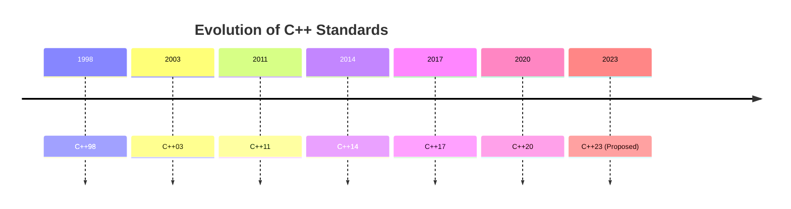

## 21.10 Keeping Up with C++ Standards

In the fast-paced world of software development, staying updated with the latest C++ standards is crucial for maintaining a competitive edge. The C++ language has evolved significantly over the years, introducing powerful new features that enhance performance, safety, and expressiveness. In this section, we will explore how to stay current with C++ standards, effectively leverage new features, and actively participate in the C++ community.

### Understanding the Evolution of C++ Standards

The evolution of C++ standards is a testament to the language's adaptability and robustness. Each new standard builds upon the previous ones, introducing features that address modern programming challenges. Let's take a look at the major milestones in C++ development:

- **C++98**: The first standardized version, introduced in 1998, laid the foundation with features like templates, exceptions, and the Standard Template Library (STL).
- **C++03**: A bug-fix release that refined C++98 without introducing new features.
- **C++11**: A major update that revolutionized C++ with features like auto, lambda expressions, smart pointers, and more.
- **C++14**: A minor update that improved upon C++11 with features like generic lambdas and variable templates.
- **C++17**: Introduced features like std::optional, std::variant, and parallel algorithms.
- **C++20**: Brought significant additions like concepts, ranges, coroutines, and modules.
- **C++23 and Beyond**: Continues to refine and expand the language with new features and optimizations.

### Leveraging New Features Appropriately

With each new standard, C++ introduces features that can significantly improve code quality and performance. However, it's essential to understand when and how to use these features effectively. Let's explore some key features from recent standards and how to leverage them:

#### 1. Lambda Expressions and Functional Programming

Lambda expressions, introduced in C++11, allow for concise and expressive function objects. They are particularly useful in functional programming paradigms and can simplify code significantly.

```cpp
#include <iostream>
#include <vector>
#include <algorithm>

int main() {
    std::vector<int> numbers = {1, 2, 3, 4, 5};
    int sum = 0;

    // Using a lambda expression to calculate the sum
    std::for_each(numbers.begin(), numbers.end(), [&sum](int n) {
        sum += n;
    });

    std::cout << "Sum: " << sum << std::endl;
    return 0;
}
```

**Try It Yourself:** Modify the lambda to calculate the product of the numbers instead of the sum.

#### 2. Smart Pointers for Memory Management

Smart pointers, such as `std::unique_ptr` and `std::shared_ptr`, introduced in C++11, provide automatic memory management and help prevent memory leaks.

```cpp
#include <iostream>
#include <memory>

class Resource {
public:
    Resource() { std::cout << "Resource acquired\n"; }
    ~Resource() { std::cout << "Resource destroyed\n"; }
};

int main() {
    std::unique_ptr<Resource> res1(new Resource());
    // Resource is automatically released when res1 goes out of scope

    std::shared_ptr<Resource> res2 = std::make_shared<Resource>();
    std::shared_ptr<Resource> res3 = res2; // Shared ownership

    return 0;
}
```

**Try It Yourself:** Experiment with `std::weak_ptr` to manage cyclic dependencies.

#### 3. Concurrency with `std::thread` and `std::async`

C++11 introduced threading support, allowing developers to write concurrent programs more easily. `std::thread` and `std::async` are two key components for managing concurrency.

```cpp
#include <iostream>
#include <thread>
#include <future>

void doWork() {
    std::cout << "Work done in thread\n";
}

int main() {
    std::thread t(doWork);
    t.join(); // Wait for the thread to finish

    // Using std::async for asynchronous execution
    auto fut = std::async(std::launch::async, [] {
        std::cout << "Work done asynchronously\n";
    });
    fut.wait(); // Wait for the async task to complete

    return 0;
}
```

**Try It Yourself:** Create a multithreaded program that calculates the sum of an array in parallel.

#### 4. Ranges and Views (C++20)

The ranges library simplifies operations on collections by providing a more expressive and readable syntax.

```cpp
#include <iostream>
#include <ranges>
#include <vector>

int main() {
    std::vector<int> numbers = {1, 2, 3, 4, 5};

    // Using ranges to filter and transform
    auto result = numbers | std::ranges::views::filter([](int n) { return n % 2 == 0; })
                          | std::ranges::views::transform([](int n) { return n * n; });

    for (int n : result) {
        std::cout << n << " ";
    }
    std::cout << std::endl;

    return 0;
}
```

**Try It Yourself:** Modify the code to filter odd numbers and calculate their cubes.

### Participating in the C++ Community

Staying up-to-date with C++ standards is not just about learning new features; it's also about engaging with the community. Here are some ways to participate:

#### 1. Join Online Forums and Communities

Participate in online forums such as [Stack Overflow](https://stackoverflow.com/questions/tagged/c%2b%2b) and [Reddit's C++ community](https://www.reddit.com/r/cpp/). These platforms are great for asking questions, sharing knowledge, and staying informed about the latest developments.

#### 2. Attend Conferences and Meetups

Conferences like [CppCon](https://cppcon.org/) and [C++Now](https://cppnow.org/) offer opportunities to learn from experts, network with peers, and discover new trends in C++ development.

#### 3. Contribute to Open Source Projects

Contributing to open source projects is a fantastic way to apply your skills, learn from others, and give back to the community. Platforms like [GitHub](https://github.com/) host numerous C++ projects that welcome contributions.

#### 4. Follow Influential C++ Developers

Follow influential C++ developers and organizations on social media platforms like Twitter and LinkedIn. They often share valuable insights, articles, and updates about the language.

### Staying Current with C++ Standards

To effectively keep up with C++ standards, consider the following strategies:

#### 1. Regularly Review the ISO C++ Standard

The ISO C++ standard is the authoritative source for all language features. While it can be dense, reviewing it regularly helps you understand the rationale behind new features and how to use them effectively.

#### 2. Read Books and Articles

Books like "Effective Modern C++" by Scott Meyers and "C++ Concurrency in Action" by Anthony Williams provide in-depth insights into modern C++ features. Additionally, articles on platforms like [Medium](https://medium.com/tag/c%2B%2B) and [Dev.to](https://dev.to/t/cplusplus) offer practical tips and tutorials.

#### 3. Experiment with New Features

Hands-on experimentation is one of the best ways to learn. Use online compilers like [Compiler Explorer](https://godbolt.org/) to test new features without setting up a local environment.

#### 4. Stay Informed About Upcoming Standards

Keep an eye on proposals and discussions for upcoming C++ standards. Websites like [isocpp.org](https://isocpp.org/) provide updates on the standardization process and upcoming features.

### Visualizing the Evolution of C++ Standards

To better understand the progression of C++ standards, let's visualize the timeline of major features introduced in each standard.



This timeline highlights the key milestones in C++ development, showcasing the language's growth and adaptation to modern programming needs.

### Knowledge Check

Before we conclude, let's reinforce our understanding with a few questions:

1. What are some key features introduced in C++11?
2. How can lambda expressions improve code readability?
3. What is the purpose of smart pointers in C++?
4. How do `std::thread` and `std::async` facilitate concurrency?
5. What are the benefits of participating in the C++ community?

### Conclusion

Keeping up with C++ standards is an ongoing journey that requires dedication and curiosity. By leveraging new features appropriately, engaging with the community, and continuously learning, you can harness the full potential of modern C++ to build robust, efficient, and maintainable software. Remember, this is just the beginning. As you progress, you'll discover even more ways to innovate and excel in the world of C++ development. Keep experimenting, stay curious, and enjoy the journey!

## Quiz Time!



### What is the primary purpose of lambda expressions in C++?

- [x] To create concise and expressive function objects
- [ ] To manage memory automatically
- [ ] To facilitate concurrency
- [ ] To handle exceptions

> **Explanation:** Lambda expressions allow for concise and expressive function objects, simplifying code and enabling functional programming paradigms.

### Which C++ standard introduced smart pointers?

- [ ] C++98
- [ ] C++03
- [x] C++11
- [ ] C++14

> **Explanation:** Smart pointers, such as `std::unique_ptr` and `std::shared_ptr`, were introduced in C++11 to provide automatic memory management.

### What is the role of `std::async` in C++?

- [ ] To handle exceptions
- [x] To facilitate asynchronous execution
- [ ] To manage memory automatically
- [ ] To create lambda expressions

> **Explanation:** `std::async` is used for asynchronous execution, allowing functions to run concurrently without blocking the main thread.

### How can you participate in the C++ community?

- [x] Join online forums and communities
- [x] Attend conferences and meetups
- [x] Contribute to open source projects
- [x] Follow influential C++ developers

> **Explanation:** Participating in online forums, attending conferences, contributing to open source projects, and following influential developers are all ways to engage with the C++ community.

### What is the benefit of using the ranges library in C++20?

- [ ] To manage memory automatically
- [ ] To handle exceptions
- [x] To simplify operations on collections
- [ ] To facilitate concurrency

> **Explanation:** The ranges library simplifies operations on collections by providing a more expressive and readable syntax.

### What is a key strategy for staying current with C++ standards?

- [x] Regularly review the ISO C++ standard
- [ ] Ignore new features until they are widely adopted
- [ ] Focus only on older standards
- [ ] Avoid participating in the C++ community

> **Explanation:** Regularly reviewing the ISO C++ standard helps you understand the rationale behind new features and how to use them effectively.

### Which platform is recommended for testing new C++ features online?

- [ ] Stack Overflow
- [ ] GitHub
- [x] Compiler Explorer
- [ ] Reddit

> **Explanation:** Compiler Explorer is an online platform that allows you to test new C++ features without setting up a local environment.

### What is the significance of C++20 in the evolution of C++ standards?

- [ ] It introduced smart pointers
- [ ] It was a bug-fix release
- [x] It brought significant additions like concepts, ranges, and coroutines
- [ ] It was the first standardized version

> **Explanation:** C++20 introduced significant additions like concepts, ranges, and coroutines, enhancing the language's capabilities.

### How can smart pointers help in C++ programming?

- [x] By providing automatic memory management
- [ ] By facilitating concurrency
- [ ] By creating concise function objects
- [ ] By handling exceptions

> **Explanation:** Smart pointers provide automatic memory management, helping to prevent memory leaks and manage resource lifetimes.

### True or False: Participating in the C++ community is only beneficial for beginners.

- [ ] True
- [x] False

> **Explanation:** Participating in the C++ community is beneficial for developers at all levels, providing opportunities to learn, share knowledge, and stay informed about the latest developments.


