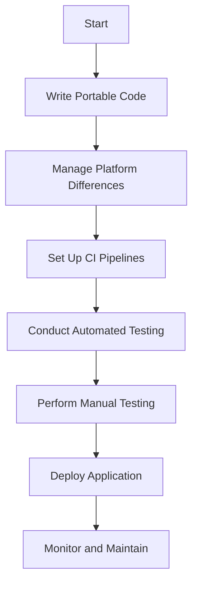

## 21.11 Cross-Platform Development Best Practices

In today's diverse computing environment, developing cross-platform applications is a crucial skill for C++ developers. By writing portable code, managing platform differences, and testing across platforms, you can ensure your applications run seamlessly on various operating systems and architectures. This section will guide you through the best practices for achieving cross-platform compatibility in C++ development.

### Writing Portable Code

Writing portable code is the foundation of cross-platform development. It involves creating code that can be compiled and executed on multiple platforms without modification. Here are some key strategies to achieve this:

#### Use Standard Libraries

The C++ Standard Library provides a wealth of functionality that is consistent across platforms. By relying on standard libraries, you can minimize platform-specific code and ensure greater portability.

```cpp
#include <iostream>
#include <vector>
#include <algorithm>

int main() {
    std::vector<int> numbers = {1, 2, 3, 4, 5};
    std::for_each(numbers.begin(), numbers.end(), [](int n) {
        std::cout << n << " ";
    });
    return 0;
}
```

In this example, we use the `<vector>` and `<algorithm>` libraries, which are part of the C++ Standard Library and available on all platforms.

#### Avoid Platform-Specific APIs

Platform-specific APIs can hinder portability. Instead, use cross-platform libraries or frameworks that abstract away platform differences. For instance, use SDL or SFML for graphics and input handling instead of platform-specific APIs like DirectX or Cocoa.

#### Leverage Preprocessor Directives

Preprocessor directives can help manage platform-specific code by conditionally including or excluding code blocks. However, use them sparingly to avoid clutter and maintain readability.

```cpp
#ifdef _WIN32
    #include <windows.h>
#elif __linux__
    #include <unistd.h>
#endif
```

#### Use Portable Data Types

Different platforms may have varying sizes for basic data types. Use fixed-width integer types from `<cstdint>` to ensure consistent behavior across platforms.

```cpp
#include <cstdint>

int32_t myNumber = 42;
```

#### Ensure Endianness Compatibility

Endianness refers to the byte order of data storage. Be mindful of endianness when dealing with binary data, especially in network communication or file I/O. Use functions like `htonl()` and `ntohl()` for network byte order conversions.

#### Abstract Platform-Specific Code

Encapsulate platform-specific code in separate modules or classes. This abstraction allows you to isolate platform dependencies and swap implementations as needed.

```cpp
class FileSystem {
public:
    virtual void readFile(const std::string& path) = 0;
};

#ifdef _WIN32
class WindowsFileSystem : public FileSystem {
public:
    void readFile(const std::string& path) override {
        // Windows-specific file reading
    }
};
#else
class UnixFileSystem : public FileSystem {
public:
    void readFile(const std::string& path) override {
        // Unix-specific file reading
    }
};
#endif
```

### Managing Platform Differences

Even with portable code, some platform-specific differences must be managed. Here are strategies to handle these differences effectively:

#### Use Cross-Platform Build Systems

Build systems like CMake or Meson can generate platform-specific build scripts, allowing you to compile your code on different platforms without manual intervention.

```cmake
cmake_minimum_required(VERSION 3.10)
project(CrossPlatformApp)

add_executable(CrossPlatformApp main.cpp)
```

#### Handle File Paths and Line Endings

File paths and line endings differ across platforms. Use libraries like `<filesystem>` in C++17 and later to handle file paths, and be mindful of line endings when reading or writing text files.

```cpp
#include <filesystem>

std::filesystem::path myPath = "/path/to/file";
```

#### Manage Character Encoding

Character encoding can vary between platforms. Use UTF-8 encoding for text data to ensure consistency. Libraries like ICU can help manage character encoding and localization.

#### Address Threading and Concurrency

Threading models and concurrency primitives can differ between platforms. Use the C++ Standard Library's threading facilities (`<thread>`, `<mutex>`, etc.) to ensure consistent behavior.

```cpp
#include <thread>
#include <mutex>

std::mutex mtx;

void threadFunction() {
    std::lock_guard<std::mutex> lock(mtx);
    // Thread-safe operations
}

int main() {
    std::thread t1(threadFunction);
    std::thread t2(threadFunction);

    t1.join();
    t2.join();
    return 0;
}
```

#### Consider Platform-Specific Optimizations

While maintaining portability, you may need to implement platform-specific optimizations for performance-critical code. Use preprocessor directives to conditionally compile optimized code paths.

### Testing Across Platforms

Testing is crucial to ensure your application behaves consistently on all target platforms. Here are best practices for cross-platform testing:

#### Use Continuous Integration (CI) Tools

CI tools like Jenkins, Travis CI, or GitHub Actions can automate the build and testing process across multiple platforms. Set up CI pipelines to compile and test your code on different operating systems.

#### Employ Virtual Machines and Containers

Virtual machines (VMs) and containers (e.g., Docker) allow you to simulate different environments and test your application on various platforms without needing physical hardware.

#### Conduct Manual Testing

While automated testing is essential, manual testing can help identify platform-specific issues that automated tests might miss. Test your application on actual devices and operating systems.

#### Perform Cross-Browser Testing

If your application includes a web component, ensure it works across different browsers and devices. Tools like Selenium or BrowserStack can facilitate cross-browser testing.

#### Utilize Platform-Specific Testing Tools

Some platforms offer specific testing tools that can help identify issues unique to that environment. For example, use Xcode's testing tools for macOS and iOS applications, or Visual Studio's tools for Windows applications.

### Visualizing Cross-Platform Development

To better understand the flow of cross-platform development, let's visualize the process using a flowchart.



This flowchart outlines the key steps in cross-platform development, from writing portable code to deploying and maintaining your application.

### Try It Yourself

To solidify your understanding of cross-platform development, try modifying the code examples provided. Experiment with different preprocessor directives, implement platform-specific optimizations, or set up a CI pipeline for your project. By actively engaging with the material, you'll gain a deeper understanding of cross-platform development best practices.

### Knowledge Check

Before moving on, let's review some key concepts:

- What are the benefits of using standard libraries in cross-platform development?
- How can preprocessor directives help manage platform-specific code?
- Why is it important to use portable data types?
- What role do CI tools play in cross-platform testing?

### Embrace the Journey

Cross-platform development can be challenging, but it's a rewarding journey that expands your skills and broadens your application's reach. Remember, this is just the beginning. As you progress, you'll build more robust and versatile applications. Keep experimenting, stay curious, and enjoy the journey!

## Quiz Time!



### What is a key benefit of using standard libraries in cross-platform development?

- [x] Ensures consistent functionality across platforms
- [ ] Increases code complexity
- [ ] Limits the use of advanced features
- [ ] Requires more platform-specific code

> **Explanation:** Standard libraries provide consistent functionality across platforms, reducing the need for platform-specific code.

### How can preprocessor directives assist in cross-platform development?

- [x] By conditionally including platform-specific code
- [ ] By increasing code complexity
- [ ] By reducing code readability
- [ ] By enforcing strict type checking

> **Explanation:** Preprocessor directives allow you to conditionally include or exclude platform-specific code, aiding in cross-platform development.

### Why is it important to use portable data types?

- [x] To ensure consistent behavior across platforms
- [ ] To increase code complexity
- [ ] To limit code functionality
- [ ] To enforce strict type checking

> **Explanation:** Portable data types ensure consistent behavior across platforms, as different platforms may have varying sizes for basic data types.

### What is the role of CI tools in cross-platform testing?

- [x] Automating the build and testing process across platforms
- [ ] Increasing code complexity
- [ ] Limiting code functionality
- [ ] Enforcing strict type checking

> **Explanation:** CI tools automate the build and testing process across multiple platforms, ensuring consistent application behavior.

### Which of the following is a strategy for managing platform differences?

- [x] Using cross-platform build systems
- [ ] Increasing code complexity
- [ ] Limiting code functionality
- [ ] Enforcing strict type checking

> **Explanation:** Cross-platform build systems help manage platform differences by generating platform-specific build scripts.

### What is a common challenge in cross-platform development?

- [x] Managing platform-specific differences
- [ ] Increasing code complexity
- [ ] Limiting code functionality
- [ ] Enforcing strict type checking

> **Explanation:** Managing platform-specific differences is a common challenge in cross-platform development, requiring careful consideration and testing.

### How can virtual machines aid in cross-platform testing?

- [x] By simulating different environments
- [ ] By increasing code complexity
- [ ] By limiting code functionality
- [ ] By enforcing strict type checking

> **Explanation:** Virtual machines allow you to simulate different environments, facilitating cross-platform testing without needing physical hardware.

### Why is manual testing important in cross-platform development?

- [x] To identify platform-specific issues
- [ ] To increase code complexity
- [ ] To limit code functionality
- [ ] To enforce strict type checking

> **Explanation:** Manual testing helps identify platform-specific issues that automated tests might miss, ensuring consistent application behavior.

### What is a benefit of using cross-platform libraries?

- [x] Reduces the need for platform-specific code
- [ ] Increases code complexity
- [ ] Limits code functionality
- [ ] Enforces strict type checking

> **Explanation:** Cross-platform libraries abstract away platform differences, reducing the need for platform-specific code and enhancing portability.

### True or False: Cross-platform development only involves writing code that compiles on multiple platforms.

- [x] False
- [ ] True

> **Explanation:** Cross-platform development involves more than just writing code that compiles on multiple platforms; it also includes managing platform differences, testing, and ensuring consistent application behavior.



By following these best practices, you'll be well-equipped to tackle the challenges of cross-platform development in C++. Keep exploring and refining your skills, and you'll create applications that are both versatile and robust.
