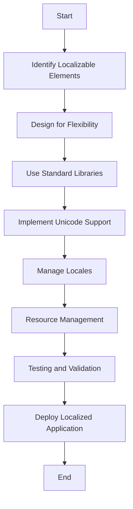

## 21.12 Internationalization and Localization

In today's globalized world, software applications must cater to a diverse audience with varying languages, cultures, and regional preferences. Internationalization (i18n) and localization (l10n) are essential processes in software development that enable applications to be adapted for different languages and regions without engineering changes. This section will guide you through the intricacies of implementing internationalization and localization in C++ applications, focusing on Unicode and character encoding.

### Understanding Internationalization and Localization

**Internationalization (i18n)** is the process of designing a software application so that it can be adapted to various languages and regions without requiring engineering changes. It involves planning and implementing products and services so that they can easily be localized.

**Localization (l10n)**, on the other hand, is the adaptation of an internationalized application to a specific region or language by adding locale-specific components and translating text. Localization involves translating the user interface, adapting graphics, modifying content to suit local tastes, and ensuring that the application complies with local regulations.

### Key Concepts in Internationalization and Localization

#### 1. Unicode and Character Encoding

Unicode is a universal character encoding standard that assigns a code to every character and symbol in every language in the world. It enables consistent encoding, representation, and handling of text. In C++, handling Unicode involves understanding different character encodings and using appropriate libraries to manage text data.

#### 2. Locale

A locale is a set of parameters that defines the user's language, country, and any special variant preferences. It affects the way information is presented, such as date and time formats, currency symbols, and number formatting.

#### 3. Resource Bundles

Resource bundles are collections of localized resources, such as strings and images, that are used to adapt an application to different locales. They allow developers to separate localizable content from the code, making it easier to manage translations and other locale-specific adaptations.

### Implementing Internationalization in C++ Applications

#### 1. Planning for Internationalization

Before diving into code, it's crucial to plan your internationalization strategy. Here are some steps to consider:

- **Identify Localizable Elements**: Determine which parts of your application need localization, such as user interface text, error messages, and documentation.
- **Design for Flexibility**: Structure your application to support multiple languages and regions. Avoid hardcoding strings and other locale-specific elements.
- **Use Standard Libraries**: Leverage existing libraries and frameworks that support internationalization and localization.

#### 2. Using Unicode in C++

C++ provides several ways to handle Unicode, including wide characters and UTF-8 encoding. Let's explore these options:

##### Wide Characters

C++ supports wide characters through the `wchar_t` type, which can represent a larger set of characters than the standard `char` type. Here's an example of using wide characters:

```cpp
#include <iostream>
#include <locale>

int main() {
    std::locale::global(std::locale("en_US.UTF-8"));
    std::wcout.imbue(std::locale());

    wchar_t wide_char = L'あ'; // Japanese Hiragana character
    std::wcout << L"Wide character: " << wide_char << std::endl;

    return 0;
}
```

##### UTF-8 Encoding

UTF-8 is a variable-length character encoding for Unicode. It is backward compatible with ASCII and is widely used for text data. In C++, you can use `std::string` to store UTF-8 encoded text:

```cpp
#include <iostream>
#include <string>

int main() {
    std::string utf8_string = u8"こんにちは"; // "Hello" in Japanese
    std::cout << "UTF-8 string: " << utf8_string << std::endl;

    return 0;
}
```

#### 3. Handling Locales

C++ provides the `<locale>` library to manage locale-specific settings. You can use it to format numbers, dates, and currencies according to the user's locale:

```cpp
#include <iostream>
#include <locale>
#include <iomanip>

int main() {
    std::locale::global(std::locale("en_US.UTF-8"));
    std::cout.imbue(std::locale());

    double number = 1234567.89;
    std::cout << "Formatted number: " << std::fixed << std::setprecision(2) << number << std::endl;

    return 0;
}
```

#### 4. Resource Management

Managing resources such as strings and images is crucial for localization. Use resource files to store localizable content separately from your code. This approach allows you to switch resources based on the user's locale.

### Best Practices for Localization

#### 1. Use Translation Tools

Utilize translation management tools to streamline the localization process. These tools can help manage translations, track changes, and ensure consistency across different languages.

#### 2. Test with Real Data

Testing your application with real data in different languages is essential. It helps identify issues such as text overflow, incorrect formatting, and cultural insensitivity.

#### 3. Collaborate with Local Experts

Working with native speakers and local experts can provide valuable insights into cultural nuances and ensure that your application resonates with the target audience.

### Challenges in Internationalization and Localization

#### 1. Text Expansion

Text in different languages can vary significantly in length. Ensure your application can accommodate text expansion without breaking the layout.

#### 2. Cultural Differences

Consider cultural differences in symbols, colors, and imagery. What works in one culture may not be appropriate in another.

#### 3. Time Zones and Calendars

Handling time zones and different calendar systems can be complex. Use libraries that provide robust support for these features.

### Tools and Libraries for Internationalization and Localization

Several tools and libraries can assist in the internationalization and localization process:

- **Boost.Locale**: A C++ library that provides localization support, including message formatting, date and time formatting, and character conversion.
- **ICU (International Components for Unicode)**: A mature, widely used library that offers comprehensive Unicode and locale support.
- **gettext**: A tool for managing translations and localizing applications.

### Try It Yourself

To get hands-on experience with internationalization and localization in C++, try modifying the code examples provided. Experiment with different locales, character encodings, and resource files. Consider creating a small application that supports multiple languages and test it with real-world data.

### Visualizing Internationalization and Localization

To better understand the process of internationalization and localization, let's visualize the workflow using a flowchart:



This flowchart outlines the key steps in internationalizing and localizing a C++ application, from planning to deployment.

### Knowledge Check

- What is the difference between internationalization and localization?
- How can you handle Unicode in C++?
- What are some challenges you might face when localizing an application?
- Why is it important to test with real data in different languages?

### Embrace the Journey

Remember, internationalization and localization are ongoing processes. As you continue to develop and improve your applications, keep exploring new tools and techniques to enhance your global reach. Stay curious, embrace cultural diversity, and enjoy the journey of creating software that transcends borders!

### References and Links

- [Unicode Consortium](https://unicode.org/)
- [ICU Project](http://site.icu-project.org/)
- [Boost.Locale Documentation](https://www.boost.org/doc/libs/release/libs/locale/doc/html/index.html)
- [gettext Manual](https://www.gnu.org/software/gettext/manual/)

## Quiz Time!



### What is the primary goal of internationalization (i18n)?

- [x] To design software that can be easily adapted to different languages and regions without engineering changes.
- [ ] To translate software into multiple languages.
- [ ] To create a single version of software for all regions.
- [ ] To focus on a specific language and region.

> **Explanation:** Internationalization involves designing software so that it can be adapted to various languages and regions without requiring engineering changes.

### Which C++ type is used for wide characters?

- [x] `wchar_t`
- [ ] `char`
- [ ] `std::string`
- [ ] `int`

> **Explanation:** `wchar_t` is used for wide characters in C++, which can represent a larger set of characters than the standard `char` type.

### What is a locale in the context of software internationalization?

- [x] A set of parameters that defines the user's language, country, and special variant preferences.
- [ ] A file containing translations.
- [ ] A library for managing character encodings.
- [ ] A tool for testing software in different languages.

> **Explanation:** A locale is a set of parameters that defines the user's language, country, and any special variant preferences, affecting how information is presented.

### Which library provides comprehensive Unicode and locale support in C++?

- [x] ICU (International Components for Unicode)
- [ ] Boost.Locale
- [ ] gettext
- [ ] STL

> **Explanation:** ICU is a mature, widely used library that offers comprehensive Unicode and locale support.

### What is the purpose of resource bundles in localization?

- [x] To store localized resources such as strings and images separately from the code.
- [ ] To compile translations into the application.
- [ ] To manage user preferences.
- [ ] To format dates and numbers.

> **Explanation:** Resource bundles are collections of localized resources that allow developers to separate localizable content from the code, making it easier to manage translations.

### Why is it important to test localized applications with real data?

- [x] To identify issues such as text overflow, incorrect formatting, and cultural insensitivity.
- [ ] To ensure the application compiles correctly.
- [ ] To verify that the code follows best practices.
- [ ] To check for memory leaks.

> **Explanation:** Testing with real data helps identify issues such as text overflow, incorrect formatting, and cultural insensitivity in localized applications.

### Which character encoding is backward compatible with ASCII?

- [x] UTF-8
- [ ] UTF-16
- [ ] UTF-32
- [ ] ISO-8859-1

> **Explanation:** UTF-8 is a variable-length character encoding for Unicode that is backward compatible with ASCII.

### What is a common challenge in software localization?

- [x] Text expansion
- [ ] Code compilation
- [ ] Memory management
- [ ] Algorithm optimization

> **Explanation:** Text expansion is a common challenge in localization, as text in different languages can vary significantly in length.

### True or False: Localization involves modifying the application's code to support different languages.

- [ ] True
- [x] False

> **Explanation:** Localization involves adapting an internationalized application to a specific region or language by adding locale-specific components and translating text, without modifying the application's code.

### What is the role of translation management tools in localization?

- [x] To streamline the localization process by managing translations, tracking changes, and ensuring consistency.
- [ ] To compile the application code.
- [ ] To manage memory allocation.
- [ ] To optimize application performance.

> **Explanation:** Translation management tools help streamline the localization process by managing translations, tracking changes, and ensuring consistency across different languages.


