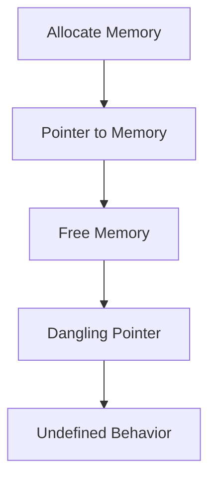
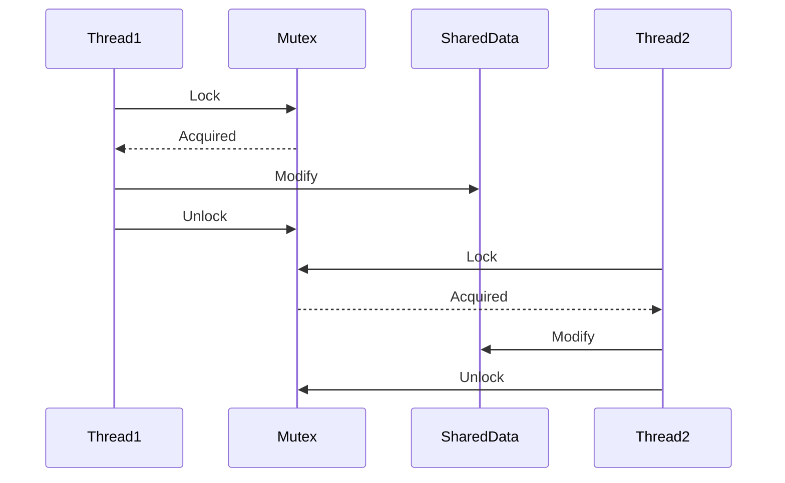

## 21.13 Memory Safety Best Practices

In the realm of C++ programming, memory safety is paramount. The language's power and flexibility come with the responsibility of managing memory manually, which can lead to issues like dangling pointers and memory corruption if not handled carefully. In this section, we will delve into best practices for ensuring memory safety, focusing on avoiding common pitfalls and implementing safe concurrency practices.

### Understanding Memory Safety

Memory safety refers to the protection against common programming errors that lead to memory corruption, such as accessing memory that has been freed (dangling pointers) or writing beyond the bounds of allocated memory (buffer overflows). These errors can cause unpredictable behavior, crashes, and security vulnerabilities.

#### Key Concepts

- **Dangling Pointers**: Pointers that reference memory that has been freed. Accessing such memory can lead to undefined behavior.
- **Memory Corruption**: Occurs when a program writes data outside the bounds of allocated memory, potentially overwriting other data or code.
- **Concurrency Safety**: Ensures that memory operations are safe in a multithreaded environment, preventing race conditions and data corruption.

### Best Practices for Avoiding Dangling Pointers

#### 1. Use Smart Pointers

Smart pointers, such as `std::unique_ptr` and `std::shared_ptr`, automate memory management by ensuring that memory is freed when it is no longer needed.

```cpp
#include <memory>
#include <iostream>

void useSmartPointer() {
    std::unique_ptr<int> ptr = std::make_unique<int>(10);
    std::cout << "Value: " << *ptr << std::endl;
} // Memory is automatically freed when ptr goes out of scope
```

- **`std::unique_ptr`**: Ensures exclusive ownership of a resource. When the `unique_ptr` goes out of scope, the resource is automatically freed.
- **`std::shared_ptr`**: Allows shared ownership of a resource. The resource is freed when the last `shared_ptr` pointing to it is destroyed.

#### 2. Avoid Manual Memory Management

Whenever possible, avoid using raw pointers and manual memory management (`new` and `delete`). Instead, rely on RAII (Resource Acquisition Is Initialization) principles and smart pointers.

```cpp
void manualMemoryManagement() {
    int* ptr = new int(10);
    // ... use ptr ...
    delete ptr; // Risk of forgetting this line, leading to memory leaks
}
```

#### 3. Initialize Pointers

Always initialize pointers to `nullptr` if they are not immediately assigned a valid memory address. This prevents accidental dereferencing of uninitialized pointers.

```cpp
int* ptr = nullptr;
if (ptr) {
    std::cout << *ptr << std::endl; // Safe check before dereferencing
}
```

#### 4. Use `nullptr` Instead of `NULL`

In modern C++, use `nullptr` instead of `NULL` for pointer initialization. `nullptr` is type-safe and avoids ambiguity.

```cpp
int* ptr = nullptr; // Preferred over int* ptr = NULL;
```

#### 5. Avoid Returning Pointers to Local Variables

Returning pointers to local variables can lead to dangling pointers because the local variable's memory is deallocated when the function exits.

```cpp
int* dangerousFunction() {
    int localVar = 42;
    return &localVar; // Dangling pointer risk
}
```

### Best Practices for Preventing Memory Corruption

#### 1. Use Bounds-Checked Containers

Prefer using standard library containers like `std::vector` and `std::array` which provide bounds-checked access methods (`at()`).

```cpp
#include <vector>
#include <iostream>

void safeAccess() {
    std::vector<int> vec = {1, 2, 3};
    try {
        std::cout << vec.at(3) << std::endl; // Throws std::out_of_range
    } catch (const std::out_of_range& e) {
        std::cerr << "Out of range error: " << e.what() << std::endl;
    }
}
```

#### 2. Use Static Analysis Tools

Employ static analysis tools to detect potential buffer overflows and other memory-related issues. Tools like Clang Static Analyzer and Cppcheck can help identify problematic code.

#### 3. Enable Compiler Warnings

Always compile with warnings enabled (`-Wall -Wextra` in GCC/Clang) and treat warnings as errors (`-Werror`). This helps catch potential issues early in the development process.

```bash
g++ -Wall -Wextra -Werror my_program.cpp -o my_program
```

#### 4. Validate Input Data

Ensure that all input data is validated before use, especially when dealing with arrays and buffers. This prevents buffer overflows and other memory corruption issues.

```cpp
#include <cstring>
#include <iostream>

void safeCopy(char* dest, const char* src, size_t destSize) {
    if (strlen(src) < destSize) {
        strcpy(dest, src);
    } else {
        std::cerr << "Source string too large for destination buffer" << std::endl;
    }
}
```

### Safe Concurrency Practices

Concurrency introduces additional challenges for memory safety, such as race conditions and data corruption. Here are some best practices to ensure safe concurrency in C++.

#### 1. Use Mutexes for Synchronization

Use `std::mutex` and `std::lock_guard` to protect shared data from concurrent access.

```cpp
#include <iostream>
#include <thread>
#include <mutex>

std::mutex mtx;
int sharedData = 0;

void increment() {
    std::lock_guard<std::mutex> lock(mtx);
    ++sharedData;
}

int main() {
    std::thread t1(increment);
    std::thread t2(increment);
    t1.join();
    t2.join();
    std::cout << "Shared Data: " << sharedData << std::endl;
    return 0;
}
```

#### 2. Avoid Data Races

Ensure that no two threads access shared data simultaneously unless it is read-only. Use atomic operations or mutexes to prevent data races.

```cpp
#include <atomic>
#include <iostream>
#include <thread>

std::atomic<int> atomicCounter(0);

void incrementAtomic() {
    atomicCounter.fetch_add(1, std::memory_order_relaxed);
}

int main() {
    std::thread t1(incrementAtomic);
    std::thread t2(incrementAtomic);
    t1.join();
    t2.join();
    std::cout << "Atomic Counter: " << atomicCounter.load() << std::endl;
    return 0;
}
```

#### 3. Use Condition Variables for Coordination

Use `std::condition_variable` to coordinate between threads, especially when one thread needs to wait for a condition to be met.

```cpp
#include <iostream>
#include <thread>
#include <mutex>
#include <condition_variable>

std::mutex mtx;
std::condition_variable cv;
bool ready = false;

void waitForSignal() {
    std::unique_lock<std::mutex> lock(mtx);
    cv.wait(lock, []{ return ready; });
    std::cout << "Thread received signal" << std::endl;
}

void sendSignal() {
    std::lock_guard<std::mutex> lock(mtx);
    ready = true;
    cv.notify_one();
}

int main() {
    std::thread t1(waitForSignal);
    std::thread t2(sendSignal);
    t1.join();
    t2.join();
    return 0;
}
```

#### 4. Prefer Immutable Data Structures

Immutable data structures are inherently thread-safe because they cannot be modified after creation. Use `const` and immutable patterns to ensure data safety.

```cpp
#include <iostream>

class ImmutableData {
public:
    ImmutableData(int value) : data(value) {}
    int getData() const { return data; }
private:
    const int data;
};

int main() {
    ImmutableData id(42);
    std::cout << "Immutable Data: " << id.getData() << std::endl;
    return 0;
}
```

### Visualizing Memory Safety Concepts

To better understand the concepts of memory safety, let's visualize some of the key ideas using Mermaid.js diagrams.

#### Visualizing Dangling Pointers



**Caption**: This diagram illustrates the lifecycle of a pointer that becomes dangling after the memory it points to is freed.

#### Visualizing Mutex Usage



**Caption**: This sequence diagram shows how two threads use a mutex to safely access and modify shared data.

### Try It Yourself

To solidify your understanding of memory safety, try modifying the code examples provided. For instance, experiment with:

- Changing the order of operations in the concurrency examples to see how it affects the program's behavior.
- Introducing intentional errors, such as accessing a dangling pointer, to observe the consequences and learn how to prevent them.
- Implementing your own smart pointer class to understand the mechanics behind `std::unique_ptr` and `std::shared_ptr`.

### Knowledge Check

Let's reinforce what we've learned with a few questions:

1. What is a dangling pointer, and why is it dangerous?
2. How do smart pointers help prevent memory leaks?
3. Why is it important to use `nullptr` instead of `NULL` in modern C++?
4. How can static analysis tools help improve memory safety?
5. What is the role of `std::mutex` in concurrent programming?

### Conclusion

Memory safety is a critical aspect of C++ programming that requires careful attention to detail. By following best practices such as using smart pointers, validating inputs, and employing safe concurrency techniques, we can minimize the risk of memory-related errors and build robust, reliable applications.

Remember, mastering memory safety is an ongoing journey. Keep experimenting, stay curious, and continue to refine your skills as you work with C++. The insights and practices covered in this section will serve as a strong foundation for writing safe and efficient C++ code.

## Quiz Time!



### What is a dangling pointer?

- [x] A pointer that references memory that has been freed.
- [ ] A pointer that is initialized to `nullptr`.
- [ ] A pointer that points to a valid memory location.
- [ ] A pointer that is used in a multithreaded environment.

> **Explanation:** A dangling pointer is a pointer that references memory that has been freed, leading to undefined behavior if accessed.

### How do smart pointers help prevent memory leaks?

- [x] By automatically deallocating memory when it is no longer needed.
- [ ] By allowing manual memory management.
- [ ] By preventing the use of raw pointers.
- [ ] By providing bounds-checked access to arrays.

> **Explanation:** Smart pointers automatically deallocate memory when they go out of scope, preventing memory leaks.

### Why is it important to use `nullptr` instead of `NULL` in modern C++?

- [x] `nullptr` is type-safe and avoids ambiguity.
- [ ] `nullptr` is faster than `NULL`.
- [ ] `nullptr` is compatible with C code.
- [ ] `nullptr` is a keyword in C++98.

> **Explanation:** `nullptr` is type-safe and avoids the ambiguity associated with `NULL`, which can be implicitly converted to integral types.

### How can static analysis tools help improve memory safety?

- [x] By detecting potential memory-related issues in code.
- [ ] By automatically fixing memory leaks.
- [ ] By replacing raw pointers with smart pointers.
- [ ] By providing runtime error messages.

> **Explanation:** Static analysis tools analyze code to detect potential memory-related issues, such as buffer overflows and use-after-free errors.

### What is the role of `std::mutex` in concurrent programming?

- [x] To protect shared data from concurrent access.
- [ ] To speed up program execution.
- [ ] To prevent memory leaks.
- [ ] To manage memory allocation.

> **Explanation:** `std::mutex` is used to protect shared data from concurrent access, ensuring that only one thread can modify the data at a time.

### What is a common cause of memory corruption?

- [x] Writing beyond the bounds of allocated memory.
- [ ] Using smart pointers.
- [ ] Initializing pointers to `nullptr`.
- [ ] Using bounds-checked containers.

> **Explanation:** Memory corruption often occurs when a program writes data beyond the bounds of allocated memory, potentially overwriting other data or code.

### How can condition variables be used in concurrent programming?

- [x] To coordinate between threads by allowing one thread to wait for a condition to be met.
- [ ] To allocate memory dynamically.
- [ ] To replace mutexes.
- [ ] To prevent memory leaks.

> **Explanation:** Condition variables are used to coordinate between threads, allowing one thread to wait for a condition to be met before proceeding.

### What is the benefit of using immutable data structures in concurrent programming?

- [x] They are inherently thread-safe because they cannot be modified after creation.
- [ ] They are faster than mutable data structures.
- [ ] They use less memory.
- [ ] They automatically synchronize data between threads.

> **Explanation:** Immutable data structures are inherently thread-safe because they cannot be modified after creation, eliminating the need for synchronization.

### What is the advantage of using `std::atomic` in concurrent programming?

- [x] It provides atomic operations that prevent data races.
- [ ] It speeds up program execution.
- [ ] It reduces memory usage.
- [ ] It automatically manages memory allocation.

> **Explanation:** `std::atomic` provides atomic operations that prevent data races by ensuring that operations on shared data are completed without interruption.

### True or False: Returning pointers to local variables is safe in C++.

- [ ] True
- [x] False

> **Explanation:** Returning pointers to local variables is unsafe because the memory for local variables is deallocated when the function exits, leading to dangling pointers.


