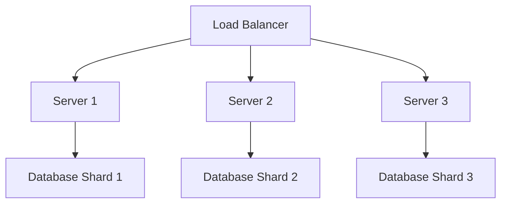
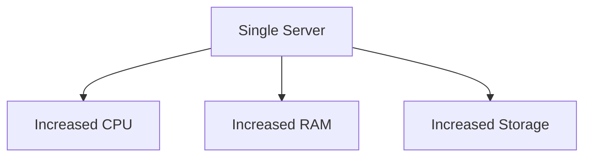

## 21.3 Scalability Considerations

In the ever-evolving landscape of software development, scalability is a crucial aspect that ensures your application can handle growth in terms of users, data volume, and functionality. In this section, we will delve into the principles of scalability, focusing on horizontal and vertical scaling strategies. By understanding and implementing these strategies, you can design C++ applications that are robust, efficient, and future-proof.

### Understanding Scalability

Scalability refers to the ability of a system to handle increased load by adding resources. It is a measure of a system's capacity to grow and manage increased demand without compromising performance. Scalability is essential for applications that anticipate growth in user base, data volume, or computational demand.

#### Key Concepts in Scalability

- **Load**: The amount of work a system has to perform, which can include user requests, data processing, and computational tasks.
- **Performance**: The speed and efficiency with which a system processes requests and delivers results.
- **Capacity**: The maximum load a system can handle before performance degrades.

### Horizontal vs. Vertical Scaling

Scalability can be achieved through two primary strategies: horizontal scaling and vertical scaling. Each approach has its advantages and challenges, and the choice between them depends on the specific requirements and constraints of your application.

#### Horizontal Scaling

Horizontal scaling, also known as scaling out, involves adding more machines or nodes to your system. This approach distributes the load across multiple servers, allowing the system to handle more requests simultaneously.

**Advantages of Horizontal Scaling:**

- **Fault Tolerance**: With multiple nodes, the failure of one node does not bring down the entire system.
- **Flexibility**: Nodes can be added or removed as needed, providing flexibility in managing resources.
- **Cost-Effective**: Commodity hardware can be used, reducing costs compared to high-end servers required for vertical scaling.

**Challenges of Horizontal Scaling:**

- **Complexity**: Managing a distributed system can be complex, requiring robust load balancing and data synchronization mechanisms.
- **Consistency**: Ensuring data consistency across nodes can be challenging, especially in distributed databases.

#### Vertical Scaling

Vertical scaling, or scaling up, involves adding more resources (CPU, RAM, storage) to an existing machine. This approach enhances the capacity of a single node to handle more load.

**Advantages of Vertical Scaling:**

- **Simplicity**: Easier to implement as it involves upgrading existing hardware without changing the system architecture.
- **Consistency**: Data consistency is easier to maintain since all data resides on a single machine.

**Challenges of Vertical Scaling:**

- **Single Point of Failure**: The system relies on a single machine, which can be a point of failure.
- **Resource Limits**: There is a physical limit to how much a single machine can be upgraded.

### Designing for Scalability in C++

When designing scalable C++ applications, consider both horizontal and vertical scaling strategies. The choice between them depends on the application's architecture, expected growth, and resource constraints.

#### Architectural Considerations

1. **Modular Design**: Break down your application into independent modules or services. This allows you to scale specific parts of the application independently.

2. **Asynchronous Processing**: Use asynchronous processing to handle tasks that do not require immediate responses. This can improve system throughput and responsiveness.

3. **Load Balancing**: Implement load balancing to distribute incoming requests evenly across available resources. This ensures no single node is overwhelmed.

4. **Caching**: Use caching to store frequently accessed data in memory, reducing the need for repeated database queries and improving response times.

5. **Database Sharding**: Distribute data across multiple databases to improve performance and scalability. Sharding can help manage large datasets by dividing them into smaller, more manageable pieces.

#### Code Examples

Let's explore some C++ code examples that illustrate these concepts.

##### Asynchronous Processing with `std::async`

```cpp
#include <iostream>
#include <future>
#include <chrono>

// Simulate a long-running task
int longRunningTask() {
    std::this_thread::sleep_for(std::chrono::seconds(2));
    return 42;
}

int main() {
    // Launch the task asynchronously
    std::future<int> result = std::async(std::launch::async, longRunningTask);

    // Do other work while the task is running
    std::cout << "Doing other work..." << std::endl;

    // Get the result of the task
    int value = result.get();
    std::cout << "Result of long-running task: " << value << std::endl;

    return 0;
}
```

**Explanation:** In this example, we use `std::async` to run a long-running task asynchronously. This allows the main thread to continue executing other work while waiting for the task to complete. Asynchronous processing can improve the scalability of your application by allowing it to handle multiple tasks concurrently.

##### Load Balancing with a Simple Round-Robin Algorithm

```cpp
#include <iostream>
#include <vector>
#include <string>

// Simulate a server handling a request
void handleRequest(const std::string& server, const std::string& request) {
    std::cout << "Server " << server << " handling request: " << request << std::endl;
}

int main() {
    std::vector<std::string> servers = {"Server1", "Server2", "Server3"};
    std::vector<std::string> requests = {"Request1", "Request2", "Request3", "Request4", "Request5"};

    int serverIndex = 0;
    for (const auto& request : requests) {
        handleRequest(servers[serverIndex], request);
        serverIndex = (serverIndex + 1) % servers.size(); // Round-robin
    }

    return 0;
}
```

**Explanation:** This example demonstrates a simple round-robin load balancing algorithm. Requests are distributed evenly across a list of servers, ensuring that no single server is overloaded. Load balancing is a key component of horizontal scaling, allowing your application to distribute load efficiently.

### Visualizing Scalability Strategies

To better understand scalability strategies, let's visualize the concepts using Mermaid.js diagrams.

#### Horizontal Scaling Architecture



**Description:** This diagram illustrates a horizontally scaled architecture. A load balancer distributes incoming requests to multiple servers, each connected to its own database shard. This setup allows the system to handle increased load by adding more servers and database shards.

#### Vertical Scaling Architecture



**Description:** This diagram represents a vertically scaled architecture. A single server is upgraded with more CPU, RAM, and storage to handle increased load. While simpler to implement, this approach has physical limitations.

### Best Practices for Scalability

1. **Monitor and Analyze**: Continuously monitor system performance and analyze bottlenecks. Use tools like profilers and log analyzers to identify areas for improvement.

2. **Automate Scaling**: Implement automated scaling mechanisms to adjust resources based on demand. Cloud platforms often provide tools for auto-scaling.

3. **Optimize Code**: Write efficient code that minimizes resource usage. Use profiling tools to identify and optimize performance-critical sections.

4. **Test for Scalability**: Conduct load testing to evaluate how your application performs under high load. Use tools like Apache JMeter or Gatling to simulate traffic and identify potential issues.

5. **Plan for Growth**: Anticipate future growth and design your architecture to accommodate it. Consider both short-term and long-term scalability needs.

### Try It Yourself

Experiment with the code examples provided in this section. Try modifying the asynchronous processing example to handle multiple tasks concurrently. For the load balancing example, add more servers and requests to see how the round-robin algorithm distributes the load.

### Knowledge Check

- **What is the difference between horizontal and vertical scaling?**
- **Why is load balancing important in a horizontally scaled architecture?**
- **How can caching improve the scalability of an application?**

### Embrace the Journey

Scalability is a journey, not a destination. As your application grows, new challenges will arise, and your scalability strategies will need to evolve. Stay curious, keep learning, and embrace the journey of building scalable C++ applications.

## Quiz Time!



### What is scalability in software design?

- [x] The ability of a system to handle increased load by adding resources.
- [ ] The process of reducing the size of a software application.
- [ ] A method for improving the security of a software system.
- [ ] A technique for optimizing memory usage.

> **Explanation:** Scalability refers to a system's capacity to grow and manage increased demand without compromising performance.

### What is horizontal scaling?

- [x] Adding more machines or nodes to a system to distribute the load.
- [ ] Upgrading the hardware of a single machine to handle more load.
- [ ] Reducing the number of servers to optimize performance.
- [ ] Implementing more efficient algorithms to improve speed.

> **Explanation:** Horizontal scaling involves adding more machines or nodes to distribute the load across multiple servers.

### What is a key advantage of vertical scaling?

- [x] Simplicity in implementation.
- [ ] Unlimited resource expansion.
- [ ] Improved fault tolerance.
- [ ] Reduced hardware costs.

> **Explanation:** Vertical scaling is simpler to implement as it involves upgrading existing hardware without changing the system architecture.

### How does load balancing contribute to scalability?

- [x] By distributing incoming requests evenly across available resources.
- [ ] By reducing the number of servers needed.
- [ ] By improving data consistency.
- [ ] By increasing the complexity of the system.

> **Explanation:** Load balancing ensures no single node is overwhelmed, contributing to efficient resource utilization and scalability.

### What is a challenge of horizontal scaling?

- [x] Ensuring data consistency across nodes.
- [ ] Limited resource expansion.
- [ ] High cost of upgrading hardware.
- [ ] Single point of failure.

> **Explanation:** Ensuring data consistency across nodes is a challenge in distributed systems, which is common in horizontal scaling.

### Which C++ feature can be used for asynchronous processing?

- [x] `std::async`
- [ ] `std::vector`
- [ ] `std::map`
- [ ] `std::string`

> **Explanation:** `std::async` is used for running tasks asynchronously, allowing concurrent execution.

### What is database sharding?

- [x] Distributing data across multiple databases to improve performance.
- [ ] Storing all data in a single database for consistency.
- [ ] Encrypting database entries for security.
- [ ] Caching database queries to reduce load.

> **Explanation:** Database sharding involves distributing data across multiple databases to manage large datasets effectively.

### What tool can be used for load testing?

- [x] Apache JMeter
- [ ] Valgrind
- [ ] GDB
- [ ] Clang-Tidy

> **Explanation:** Apache JMeter is a tool used for load testing to evaluate application performance under high load.

### What is a benefit of caching in scalable applications?

- [x] Reducing the need for repeated database queries.
- [ ] Increasing the complexity of the codebase.
- [ ] Slowing down response times.
- [ ] Decreasing system reliability.

> **Explanation:** Caching stores frequently accessed data in memory, reducing the need for repeated database queries and improving response times.

### True or False: Vertical scaling has no physical limits.

- [ ] True
- [x] False

> **Explanation:** Vertical scaling has physical limits as there is a maximum capacity to which a single machine can be upgraded.


