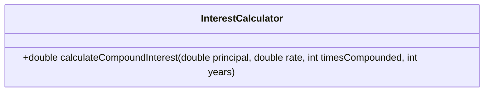
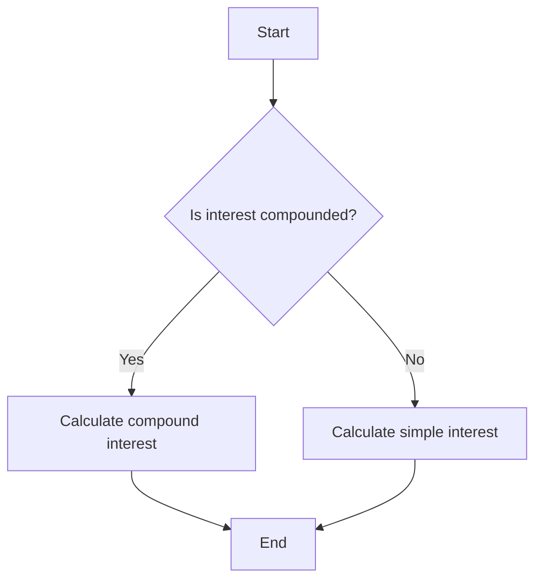
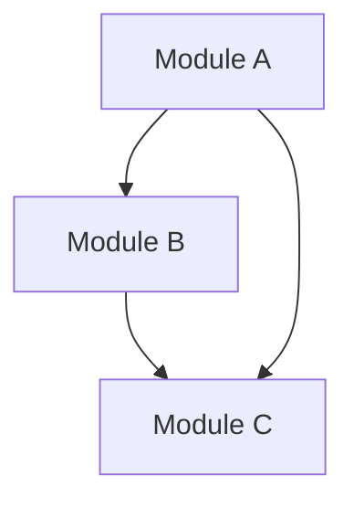

## 21.4 Documentation and Maintainability

In the world of software engineering, especially when dealing with complex systems like those built using C++ design patterns, documentation and maintainability are not just best practices—they are necessities. This section will delve into the importance of keeping code understandable, simplifying complex designs, and maintaining comprehensive documentation. We will explore strategies, tools, and techniques that can be employed to ensure that your C++ code remains robust, scalable, and easy to maintain.

### Keeping Code Understandable

Understanding code is the first step toward maintaining it. As systems grow in complexity, the need for clear, concise, and well-structured code becomes paramount. Let's explore how to achieve this:

#### 1. Consistent Naming Conventions

Consistent naming conventions help in understanding the purpose and usage of variables, functions, classes, and other entities in the code. Use descriptive names that convey the intent and functionality.

- **Variables and Functions**: Use camelCase or snake_case consistently. For example, `calculateInterest` or `calculate_interest`.
- **Classes and Structs**: Use PascalCase, such as `InterestCalculator`.
- **Constants**: Use all uppercase with underscores, like `MAX_BUFFER_SIZE`.

#### 2. Code Formatting and Style Guides

Adhering to a consistent code style makes it easier for developers to read and understand the code. Use tools like `clang-format` to enforce style guides.

- **Indentation**: Use spaces or tabs consistently. A common practice is using four spaces per indentation level.
- **Braces**: Place opening braces on the same line as the statement or on a new line, but be consistent throughout the codebase.

#### 3. Commenting and Code Annotations

Comments should explain the "why" behind the code, not the "what." Use comments to clarify complex logic or decisions.

```cpp
// Calculate the compound interest using the formula A = P(1 + r/n)^(nt)
double calculateCompoundInterest(double principal, double rate, int timesCompounded, int years) {
    return principal * pow((1 + rate / timesCompounded), timesCompounded * years);
}
```

#### 4. Modular Code Design

Break down large functions and classes into smaller, reusable modules. This not only improves readability but also enhances testability and maintainability.

- **Single Responsibility Principle**: Each class or function should have one responsibility or task.
- **Separation of Concerns**: Divide the code into distinct sections, each handling a specific aspect of the application.

#### 5. Use of Design Patterns

Design patterns provide a proven solution to common problems. They help in structuring code in a way that is both understandable and maintainable.

- **Example**: Use the Singleton pattern to ensure a class has only one instance and provide a global point of access to it.

### Simplifying Complex Designs

Complex designs can be a nightmare to maintain. Simplifying these designs is crucial for long-term maintainability.

#### 1. Refactoring

Refactoring is the process of restructuring existing code without changing its external behavior. It helps in improving the design, structure, and implementation.

- **Code Smells**: Identify and eliminate code smells like duplicated code, long methods, and large classes.
- **Automated Refactoring Tools**: Use tools like `CLion` or `Visual Studio` to assist in refactoring tasks.

#### 2. Avoiding Over-Engineering

Over-engineering can lead to unnecessary complexity. Focus on solving the problem at hand without adding features or abstractions that are not needed.

- **YAGNI Principle**: "You Aren't Gonna Need It"—avoid adding functionality until it is necessary.
- **KISS Principle**: "Keep It Simple, Stupid"—strive for simplicity in design and implementation.

#### 3. Encapsulation and Abstraction

Encapsulation hides the internal state of objects, while abstraction simplifies complex systems by modeling them at a higher level.

- **Encapsulation**: Use access specifiers (`private`, `protected`, `public`) to control access to class members.
- **Abstraction**: Use abstract classes and interfaces to define common behaviors and hide implementation details.

#### 4. Dependency Injection

Dependency Injection (DI) is a technique where an object receives its dependencies from an external source rather than creating them itself. This promotes loose coupling and enhances testability.

- **Constructor Injection**: Pass dependencies through the constructor.
- **Setter Injection**: Provide setter methods for dependencies.

### Maintaining Documentation

Documentation is a critical component of software development. It serves as a guide for developers, both current and future, to understand and maintain the codebase.

#### 1. Inline Documentation

Inline documentation involves adding comments and annotations directly within the code. This helps in understanding the logic and purpose of the code.

- **Doxygen**: Use Doxygen to generate documentation from annotated C++ source code. It supports various output formats, including HTML and PDF.

```cpp
/**
 * @brief Calculates the compound interest.
 * 
 * @param principal The principal amount.
 * @param rate The annual interest rate.
 * @param timesCompounded The number of times interest is compounded per year.
 * @param years The number of years the money is invested for.
 * @return The amount of money accumulated after n years, including interest.
 */
double calculateCompoundInterest(double principal, double rate, int timesCompounded, int years);
```

#### 2. External Documentation

External documentation includes user manuals, API documentation, and design documents. These are typically maintained separately from the codebase.

- **API Documentation**: Use tools like Doxygen or Sphinx to generate API documentation.
- **Design Documents**: Maintain design documents that describe the architecture, design patterns, and key decisions.

#### 3. Version Control and Documentation

Version control systems like Git can be used to maintain documentation alongside the code. This ensures that documentation is versioned and can be updated as the code evolves.

- **README Files**: Include README files in repositories to provide an overview of the project, setup instructions, and usage examples.
- **Changelogs**: Maintain a changelog to document changes, new features, and bug fixes.

#### 4. Code Reviews and Documentation

Code reviews are an excellent opportunity to ensure that documentation is accurate and up-to-date. Encourage reviewers to check for missing or outdated documentation.

- **Review Checklists**: Include documentation checks in code review checklists.
- **Peer Reviews**: Conduct peer reviews to ensure that documentation is clear and understandable.

### Tools and Techniques for Documentation and Maintainability

There are several tools and techniques available to assist in maintaining documentation and ensuring code maintainability.

#### 1. Static Analysis Tools

Static analysis tools analyze code for potential errors, code smells, and adherence to coding standards. They can help in identifying areas that need documentation or refactoring.

- **Clang-Tidy**: A clang-based C++ linter tool that provides linting and static analysis.
- **Cppcheck**: A static analysis tool for C++ that detects bugs, undefined behavior, and other issues.

#### 2. Integrated Development Environments (IDEs)

IDEs like CLion, Visual Studio, and Eclipse provide features that enhance code maintainability, such as code navigation, refactoring tools, and integration with version control systems.

- **Code Navigation**: Use features like "Go to Definition" and "Find Usages" to navigate the codebase efficiently.
- **Refactoring Tools**: Use built-in refactoring tools to rename variables, extract methods, and perform other refactoring tasks.

#### 3. Continuous Integration and Continuous Deployment (CI/CD)

CI/CD pipelines automate the process of building, testing, and deploying code. They ensure that documentation is generated and updated as part of the build process.

- **Automated Documentation Generation**: Integrate tools like Doxygen into the CI/CD pipeline to generate and publish documentation automatically.
- **Testing and Validation**: Ensure that tests are run as part of the CI/CD pipeline to catch issues early.

### Visualizing Code Structure and Documentation

Visual representations can greatly enhance the understanding of complex code structures and documentation.

#### 1. UML Diagrams

Unified Modeling Language (UML) diagrams are a standard way to visualize the design of a system. They can be used to represent class hierarchies, object interactions, and more.

- **Class Diagrams**: Show the static structure of a system, including classes, attributes, and relationships.
- **Sequence Diagrams**: Represent the flow of messages between objects over time.



#### 2. Flowcharts

Flowcharts are used to represent the flow of control in a program. They can help in understanding complex algorithms and processes.



#### 3. Dependency Graphs

Dependency graphs show the dependencies between different modules or components in a system. They can help in identifying tightly coupled components and areas that need refactoring.



### Try It Yourself

To reinforce your understanding, try experimenting with the following:

1. **Refactor a Complex Function**: Take a complex function from your codebase and refactor it into smaller, more manageable functions. Document each function using Doxygen comments.

2. **Create a UML Diagram**: Use a tool like PlantUML to create a class diagram for a module in your project. Identify areas where design patterns can be applied to simplify the design.

3. **Automate Documentation Generation**: Set up a CI/CD pipeline to automatically generate and publish documentation using Doxygen. Ensure that the documentation is updated with each commit.

### Knowledge Check

- **What are the benefits of using consistent naming conventions in code?**
- **How can refactoring improve code maintainability?**
- **Why is it important to avoid over-engineering in software design?**
- **What role does encapsulation play in simplifying complex designs?**
- **How can dependency injection enhance testability and maintainability?**

### Embrace the Journey

Remember, mastering documentation and maintainability is a continuous journey. As you progress, you'll find new ways to simplify designs, improve code clarity, and maintain comprehensive documentation. Keep experimenting, stay curious, and enjoy the journey!

## Quiz Time!



### What is the primary benefit of using consistent naming conventions in code?

- [x] Enhances code readability and understanding
- [ ] Reduces code execution time
- [ ] Increases code complexity
- [ ] Decreases memory usage

> **Explanation:** Consistent naming conventions enhance code readability and understanding by making it easier to identify the purpose and usage of variables, functions, and classes.


### Which principle suggests avoiding adding functionality until it is necessary?

- [x] YAGNI (You Aren't Gonna Need It)
- [ ] DRY (Don't Repeat Yourself)
- [ ] SOLID
- [ ] KISS (Keep It Simple, Stupid)

> **Explanation:** The YAGNI principle suggests avoiding adding functionality until it is necessary, helping to prevent over-engineering.


### What is the purpose of encapsulation in object-oriented programming?

- [x] To hide the internal state of objects and control access
- [ ] To increase the size of the codebase
- [ ] To make code execution faster
- [ ] To decrease the number of classes

> **Explanation:** Encapsulation hides the internal state of objects and controls access through access specifiers, promoting modularity and maintainability.


### Which tool can be used to generate documentation from annotated C++ source code?

- [x] Doxygen
- [ ] Git
- [ ] Clang-Tidy
- [ ] Cppcheck

> **Explanation:** Doxygen is a tool used to generate documentation from annotated C++ source code, supporting various output formats.


### How can dependency injection enhance testability?

- [x] By promoting loose coupling and allowing dependencies to be injected externally
- [ ] By increasing the number of dependencies
- [ ] By making code execution faster
- [ ] By decreasing the number of classes

> **Explanation:** Dependency injection promotes loose coupling by allowing dependencies to be injected externally, enhancing testability.


### What is the role of UML diagrams in software design?

- [x] To visualize the design of a system, including class hierarchies and object interactions
- [ ] To increase code execution speed
- [ ] To decrease memory usage
- [ ] To make code more complex

> **Explanation:** UML diagrams visualize the design of a system, including class hierarchies and object interactions, aiding in understanding and communication.


### Which tool is a clang-based C++ linter that provides linting and static analysis?

- [x] Clang-Tidy
- [ ] Doxygen
- [ ] Git
- [ ] Cppcheck

> **Explanation:** Clang-Tidy is a clang-based C++ linter tool that provides linting and static analysis, helping to identify potential issues in code.


### What is the purpose of a changelog in a project?

- [x] To document changes, new features, and bug fixes
- [ ] To increase code execution speed
- [ ] To decrease memory usage
- [ ] To make code more complex

> **Explanation:** A changelog documents changes, new features, and bug fixes, providing a history of the project's development.


### What is the benefit of using automated documentation generation in CI/CD pipelines?

- [x] Ensures documentation is generated and updated automatically with each commit
- [ ] Increases code execution speed
- [ ] Decreases memory usage
- [ ] Makes code more complex

> **Explanation:** Automated documentation generation in CI/CD pipelines ensures that documentation is generated and updated automatically with each commit, keeping it current.


### True or False: Over-engineering can lead to unnecessary complexity in software design.

- [x] True
- [ ] False

> **Explanation:** True. Over-engineering can lead to unnecessary complexity by adding features or abstractions that are not needed, making the system harder to maintain.


