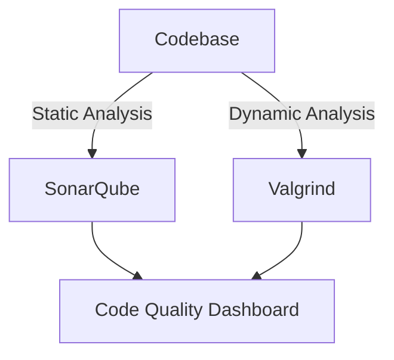

## 21.5 Code Quality Tools

In the world of software development, maintaining high-quality code is paramount. For C++ developers, this involves using a suite of tools designed to enforce coding standards, perform static and dynamic analysis, and ensure that the codebase remains robust, maintainable, and efficient. In this section, we will explore the essential code quality tools available for C++ developers and how they can be used to enhance the quality of your software projects.

### Introduction to Code Quality Tools

Code quality tools are software applications that help developers identify and fix issues in their code. These tools can be broadly categorized into linters, static analyzers, and dynamic analyzers. Each type of tool serves a unique purpose and offers different benefits.

- **Linters**: These tools analyze source code to flag programming errors, bugs, stylistic errors, and suspicious constructs. They help enforce coding standards and improve code readability.
- **Static Analyzers**: These tools examine code without executing it. They can detect potential errors, security vulnerabilities, and code smells that might not be immediately apparent.
- **Dynamic Analyzers**: These tools analyze code during execution. They can detect runtime errors, memory leaks, and performance bottlenecks.

### Using Linters to Enforce Coding Standards

Linters are invaluable for maintaining consistent coding standards across a project. They help ensure that code adheres to a predefined style guide, which can improve readability and maintainability. Some popular linters for C++ include:

#### Clang-Tidy

Clang-Tidy is a powerful linter and static analysis tool that is part of the LLVM project. It is highly configurable and supports a wide range of checks. Clang-Tidy can be used to enforce coding standards, detect common programming errors, and suggest improvements.

```cpp
// Example of using Clang-Tidy to enforce coding standards
#include <iostream>

int main() {
    std::cout << "Hello, World!" << std::endl;
    return 0;
}
```

To run Clang-Tidy, you can use the following command:

```bash
clang-tidy your_file.cpp -- -I/path/to/include
```

#### Cppcheck

Cppcheck is another popular static analysis tool that focuses on detecting bugs and potential issues in C++ code. It is easy to integrate into build systems and CI/CD pipelines.

```bash
cppcheck --enable=all your_file.cpp
```

Cppcheck can be configured to check for a variety of issues, including memory leaks, null pointer dereferences, and more.

### Static Analysis for Code Quality

Static analysis tools analyze code without executing it, providing insights into potential issues that might not be immediately visible. These tools can help identify security vulnerabilities, code smells, and other issues that could affect the quality of the code.

#### SonarQube

SonarQube is a popular platform for continuous inspection of code quality. It provides detailed reports on code quality metrics, including code coverage, duplications, and complexity.

```bash
sonar-scanner -Dsonar.projectKey=your_project_key -Dsonar.sources=src
```

SonarQube can be integrated with various CI/CD tools to ensure that code quality is continuously monitored and improved.

#### Coverity

Coverity is a static analysis tool that helps identify defects in C++ code. It is widely used in industries where software reliability is critical, such as automotive and aerospace.

```bash
cov-analyze --dir cov-int --all
```

Coverity provides detailed reports on issues such as buffer overflows, null pointer dereferences, and resource leaks.

### Dynamic Analysis for Runtime Issues

Dynamic analysis tools are used to analyze code during execution. They can help identify runtime errors, memory leaks, and performance bottlenecks.

#### Valgrind

Valgrind is a powerful tool for dynamic analysis of C++ programs. It can detect memory leaks, invalid memory access, and other runtime errors.

```bash
valgrind --leak-check=full ./your_program
```

Valgrind provides detailed reports on memory usage, helping developers identify and fix memory-related issues.

#### AddressSanitizer

AddressSanitizer is a fast memory error detector that is part of the LLVM project. It can detect a wide range of memory errors, including buffer overflows and use-after-free errors.

```bash
clang++ -fsanitize=address your_file.cpp -o your_program
```

Running the program will produce a detailed report of any memory errors detected during execution.

### Enforcing Coding Standards

Enforcing coding standards is crucial for maintaining a consistent codebase. It helps improve code readability and maintainability, making it easier for developers to collaborate on a project.

#### Google C++ Style Guide

The Google C++ Style Guide is a widely used set of coding standards that covers various aspects of C++ programming, including naming conventions, formatting, and best practices.

- **Naming Conventions**: Use descriptive names for variables, functions, and classes. Use camelCase for variables and functions, and PascalCase for classes.
- **Formatting**: Use consistent indentation and spacing. Limit line length to 80 characters.
- **Best Practices**: Use RAII for resource management, prefer smart pointers over raw pointers, and avoid using macros.

#### Integrating Linters with CI/CD

Integrating linters with CI/CD pipelines ensures that code quality is continuously monitored and improved. This can be achieved by adding linter checks to the build process, ensuring that code adheres to the defined standards before it is merged into the main codebase.

```yaml
name: C++ Lint

on: [push, pull_request]

jobs:
  lint:
    runs-on: ubuntu-latest
    steps:
    - uses: actions/checkout@v2
    - name: Run Clang-Tidy
      run: clang-tidy your_file.cpp -- -I/path/to/include
```

### Static and Dynamic Analysis: A Combined Approach

Combining static and dynamic analysis provides a comprehensive approach to code quality. Static analysis can catch issues early in the development process, while dynamic analysis can identify runtime errors that might not be detected by static analysis alone.

#### Example: Combining Clang-Tidy and Valgrind

By using both Clang-Tidy and Valgrind, developers can ensure that their code is free of both compile-time and runtime errors.

```bash
clang-tidy your_file.cpp -- -I/path/to/include

clang++ -fsanitize=address your_file.cpp -o your_program

valgrind --leak-check=full ./your_program
```

### Visualizing Code Quality with Diagrams

Visualizing code quality metrics can help developers understand the state of their codebase and identify areas for improvement. Tools like SonarQube provide dashboards and reports that visualize code quality metrics such as code coverage, complexity, and duplications.



*Figure: Visualizing Code Quality Analysis with SonarQube and Valgrind*

### References and Further Reading

- [Clang-Tidy Documentation](https://clang.llvm.org/extra/clang-tidy/)
- [Cppcheck Documentation](http://cppcheck.sourceforge.net/)
- [SonarQube Documentation](https://docs.sonarqube.org/)
- [Valgrind Documentation](http://valgrind.org/)
- [Google C++ Style Guide](https://google.github.io/styleguide/cppguide.html)

### Knowledge Check

- What are the differences between static and dynamic analysis?
- How can linters help enforce coding standards?
- What are some common issues that static analyzers can detect?
- How can dynamic analysis tools help identify runtime errors?

### Exercises

1. Set up Clang-Tidy in your C++ project and configure it to enforce a specific coding standard.
2. Use Cppcheck to analyze a sample C++ project and identify potential issues.
3. Integrate Valgrind into your build process and use it to detect memory leaks in a sample program.

### Embrace the Journey

Remember, maintaining high-quality code is an ongoing process. By using the right tools and techniques, you can ensure that your C++ projects remain robust, maintainable, and efficient. Keep experimenting, stay curious, and enjoy the journey!

## Quiz Time!



### What is the primary purpose of a linter in C++ development?

- [x] To enforce coding standards and improve code readability
- [ ] To execute code and identify runtime errors
- [ ] To compile code and generate executable files
- [ ] To manage project dependencies

> **Explanation:** Linters are used to enforce coding standards and improve code readability by analyzing source code for stylistic errors and suspicious constructs.

### Which tool is part of the LLVM project and is used for static analysis in C++?

- [x] Clang-Tidy
- [ ] Valgrind
- [ ] Cppcheck
- [ ] SonarQube

> **Explanation:** Clang-Tidy is part of the LLVM project and is used for static analysis in C++.

### What type of analysis does Valgrind perform?

- [ ] Static analysis
- [x] Dynamic analysis
- [ ] Code compilation
- [ ] Dependency management

> **Explanation:** Valgrind performs dynamic analysis by analyzing code during execution to detect runtime errors and memory issues.

### Which tool provides a platform for continuous inspection of code quality?

- [ ] Clang-Tidy
- [ ] Valgrind
- [ ] Cppcheck
- [x] SonarQube

> **Explanation:** SonarQube provides a platform for continuous inspection of code quality, offering detailed reports on various code quality metrics.

### What is the benefit of integrating linters with CI/CD pipelines?

- [x] Ensures code quality is continuously monitored and improved
- [ ] Speeds up the code compilation process
- [ ] Automatically fixes all code errors
- [ ] Eliminates the need for code reviews

> **Explanation:** Integrating linters with CI/CD pipelines ensures that code quality is continuously monitored and improved by checking code against defined standards before it is merged into the main codebase.

### Which tool can detect memory leaks and invalid memory access in C++ programs?

- [x] Valgrind
- [ ] Clang-Tidy
- [ ] SonarQube
- [ ] Cppcheck

> **Explanation:** Valgrind can detect memory leaks and invalid memory access in C++ programs by performing dynamic analysis during execution.

### What is the Google C++ Style Guide used for?

- [x] Enforcing coding standards and best practices
- [ ] Compiling C++ code
- [ ] Managing project dependencies
- [ ] Executing C++ programs

> **Explanation:** The Google C++ Style Guide is used for enforcing coding standards and best practices in C++ development.

### Which tool is known for its fast memory error detection capabilities?

- [ ] Cppcheck
- [x] AddressSanitizer
- [ ] SonarQube
- [ ] Clang-Tidy

> **Explanation:** AddressSanitizer is known for its fast memory error detection capabilities, detecting a wide range of memory errors including buffer overflows and use-after-free errors.

### How does static analysis differ from dynamic analysis?

- [x] Static analysis examines code without executing it, while dynamic analysis examines code during execution.
- [ ] Static analysis examines code during execution, while dynamic analysis examines code without executing it.
- [ ] Both static and dynamic analysis examine code without executing it.
- [ ] Both static and dynamic analysis examine code during execution.

> **Explanation:** Static analysis examines code without executing it, identifying potential issues at compile time, while dynamic analysis examines code during execution to detect runtime errors.

### True or False: Linters can automatically fix all code errors.

- [ ] True
- [x] False

> **Explanation:** Linters can identify and suggest fixes for coding errors, but they do not automatically fix all code errors. Developers must review and apply suggested changes.


