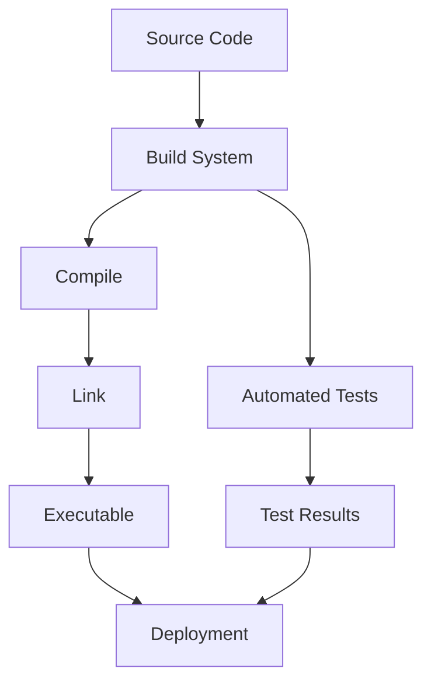

## 21.6 Build Systems and Automation

In the realm of C++ development, build systems and automation play a pivotal role in ensuring efficient, reliable, and scalable software production. As projects grow in complexity, managing dependencies, compiling code, and running tests manually becomes impractical. This section delves into the essential tools and practices that streamline these processes, focusing on Makefiles, CMake, and continuous integration (CI) practices.

### Introduction to Build Systems

Build systems are tools that automate the process of converting source code into executable programs. They manage dependencies, compile source files, link libraries, and package the final product. By automating these tasks, build systems reduce human error, save time, and ensure consistency across different environments.

#### Key Concepts

- **Source Code Compilation**: The process of converting human-readable code into machine code.
- **Linking**: Combining compiled code with libraries to produce an executable.
- **Dependencies**: External libraries or modules that a project relies on.
- **Automation**: Using scripts and tools to perform repetitive tasks without manual intervention.

### Using Makefiles

Makefiles are a traditional and widely used tool for managing build processes, especially in Unix-based systems. They define a set of rules to determine how to build different parts of a project.

#### Structure of a Makefile

A Makefile consists of a series of rules, each specifying a target, dependencies, and a set of commands to execute.

```makefile

CC = g++
CFLAGS = -Wall -g

all: myapp

myapp: main.o utils.o
	$(CC) $(CFLAGS) -o myapp main.o utils.o

main.o: main.cpp
	$(CC) $(CFLAGS) -c main.cpp

utils.o: utils.cpp
	$(CC) $(CFLAGS) -c utils.cpp

clean:
	rm -f *.o myapp
```

#### Key Components

- **Variables**: Used to store values like compiler options (`CC`, `CFLAGS`).
- **Targets**: The files or actions to be produced (`myapp`, `main.o`).
- **Dependencies**: Files that a target depends on (`main.cpp` for `main.o`).
- **Commands**: Shell commands executed to build the target (`$(CC) $(CFLAGS) -c main.cpp`).

#### Benefits of Makefiles

- **Simplicity**: Easy to write and understand for small to medium projects.
- **Flexibility**: Can be tailored to specific project needs.
- **Portability**: Works on most Unix-like systems.

### CMake: A Modern Build System

CMake is a cross-platform build system generator that simplifies the build process for complex projects. It generates native build scripts for various platforms, such as Makefiles for Unix and Visual Studio projects for Windows.

#### Basic CMakeLists.txt

A `CMakeLists.txt` file defines the build configuration for a project.

```cmake
cmake_minimum_required(VERSION 3.10)

project(MyApp)

set(CMAKE_CXX_STANDARD 17)

add_executable(myapp main.cpp utils.cpp)
```

#### Key Features

- **Cross-Platform**: Generates build scripts for multiple platforms.
- **Modular**: Supports complex projects with multiple modules.
- **Integration**: Works well with IDEs and CI systems.

#### Advanced CMake Usage

CMake provides advanced features like finding packages, setting build options, and managing dependencies.

```cmake
find_package(Boost REQUIRED)

include_directories(${Boost_INCLUDE_DIRS})

target_link_libraries(myapp ${Boost_LIBRARIES})
```

#### Benefits of CMake

- **Scalability**: Handles large projects with ease.
- **Configurability**: Offers extensive configuration options.
- **Community Support**: Widely used with extensive documentation and community support.

### Automating Builds and Tests

Automation is crucial for maintaining high code quality and reducing manual effort. By automating builds and tests, developers can focus on writing code rather than managing the build process.

#### Continuous Integration (CI)

CI is a development practice where developers integrate code into a shared repository frequently. Each integration is verified by an automated build and test process.

##### Key CI Practices

- **Frequent Commits**: Encourage small, frequent commits to the main branch.
- **Automated Builds**: Trigger builds automatically on each commit.
- **Automated Tests**: Run tests automatically to catch issues early.

#### Popular CI Tools

- **Jenkins**: An open-source automation server with a rich plugin ecosystem.
- **GitHub Actions**: Integrated CI/CD service within GitHub.
- **Travis CI**: A cloud-based CI service for open-source projects.

##### Example: GitHub Actions Workflow

```yaml

name: C++ CI

on: [push, pull_request]

jobs:
  build:
    runs-on: ubuntu-latest

    steps:
    - uses: actions/checkout@v2
    - name: Set up CMake
      uses: lukka/get-cmake@v2
    - name: Build with CMake
      run: |
        mkdir build
        cd build
        cmake ..
        cmake --build .
    - name: Run Tests
      run: |
        cd build
        ctest
```

#### Benefits of CI

- **Early Bug Detection**: Catch issues early in the development cycle.
- **Consistent Builds**: Ensure builds are consistent across different environments.
- **Improved Collaboration**: Facilitate collaboration among team members.

### Continuous Integration Practices

Implementing CI effectively requires adherence to certain best practices and strategies.

#### Best Practices

- **Maintain a Single Source Repository**: Use a version control system to manage code.
- **Automate the Build**: Ensure the build process is fully automated.
- **Make the Build Self-Testing**: Integrate testing into the build process.
- **Keep the Build Fast**: Optimize build times to maintain developer productivity.
- **Test in a Clone of the Production Environment**: Ensure tests mimic the production environment as closely as possible.

#### Challenges and Solutions

- **Flaky Tests**: Address tests that fail intermittently by improving test stability.
- **Long Build Times**: Use build caching and parallelization to speed up builds.
- **Complex Dependencies**: Manage dependencies carefully to avoid conflicts.

### Visualizing Build Systems and Automation

To better understand the flow of build systems and automation, let's visualize the process using a flowchart.



**Caption**: This flowchart illustrates the typical flow of a build system, from source code to deployment, including compilation, linking, and testing.

### Code Example: Automating a C++ Project with CMake and GitHub Actions

Let's walk through a complete example of automating a C++ project using CMake and GitHub Actions.

#### Step 1: Create a CMakeLists.txt

```cmake

cmake_minimum_required(VERSION 3.10)
project(AutomatedApp)

set(CMAKE_CXX_STANDARD 17)

add_executable(automated_app main.cpp)
```

#### Step 2: Write a Simple C++ Program

```cpp
// main.cpp

#include <iostream>

int main() {
    std::cout << "Hello, C++ Build Automation!" << std::endl;
    return 0;
}
```

#### Step 3: Configure GitHub Actions

Create a `.github/workflows/build.yml` file in your repository.

```yaml

name: C++ CI

on: [push, pull_request]

jobs:
  build:
    runs-on: ubuntu-latest

    steps:
    - uses: actions/checkout@v2
    - name: Set up CMake
      uses: lukka/get-cmake@v2
    - name: Build with CMake
      run: |
        mkdir build
        cd build
        cmake ..
        cmake --build .
    - name: Run Executable
      run: |
        cd build
        ./automated_app
```

### Try It Yourself

Experiment with the provided example by modifying the C++ program or the CMake configuration. Try adding new source files, linking libraries, or integrating additional CI steps.

### Knowledge Check

- **Question**: What is the primary purpose of a build system?
  - **Answer**: To automate the process of converting source code into executable programs.

- **Question**: Name two popular build systems used in C++ development.
  - **Answer**: Makefiles and CMake.

### Conclusion

Build systems and automation are indispensable in modern C++ development. By leveraging tools like Makefiles, CMake, and CI practices, developers can streamline their workflows, reduce errors, and improve collaboration. As you continue to explore these tools, remember that the key to success lies in continuous learning and adaptation.

## Quiz Time!



### What is the primary purpose of a build system in C++ development?

- [x] To automate the process of converting source code into executable programs
- [ ] To write source code
- [ ] To manage user interfaces
- [ ] To handle database operations

> **Explanation:** Build systems automate the process of compiling and linking code to create executable programs, reducing manual effort and errors.

### Which tool is a traditional build system used in Unix-based systems?

- [x] Makefiles
- [ ] CMake
- [ ] Jenkins
- [ ] GitHub Actions

> **Explanation:** Makefiles are a traditional tool for managing build processes, especially in Unix-based systems.

### What is a key feature of CMake?

- [x] Cross-platform build script generation
- [ ] Integrated development environment
- [ ] Source code editor
- [ ] Database management

> **Explanation:** CMake generates build scripts for multiple platforms, making it a versatile tool for cross-platform development.

### What is the role of continuous integration in software development?

- [x] To integrate code changes frequently and verify them with automated builds and tests
- [ ] To manage user interfaces
- [ ] To handle database operations
- [ ] To write source code

> **Explanation:** Continuous integration involves frequent code integration and verification through automated processes to ensure code quality.

### Which CI tool is integrated within GitHub?

- [x] GitHub Actions
- [ ] Jenkins
- [ ] Travis CI
- [ ] CircleCI

> **Explanation:** GitHub Actions is a CI/CD service integrated within GitHub, allowing for automated workflows.

### What is a common challenge in implementing CI practices?

- [x] Flaky tests
- [ ] Writing source code
- [ ] Managing user interfaces
- [ ] Handling database operations

> **Explanation:** Flaky tests, which fail intermittently, are a common challenge in CI, requiring improved test stability.

### What is the benefit of automating builds and tests?

- [x] Reducing manual effort and improving code quality
- [ ] Writing source code
- [ ] Managing user interfaces
- [ ] Handling database operations

> **Explanation:** Automation reduces manual effort and ensures consistent, high-quality builds and tests.

### What does a Makefile typically consist of?

- [x] Targets, dependencies, and commands
- [ ] User interfaces
- [ ] Database schemas
- [ ] Source code editors

> **Explanation:** A Makefile consists of targets, dependencies, and commands that define how to build a project.

### What is a benefit of using CMake over Makefiles?

- [x] Scalability and cross-platform support
- [ ] Simplicity for small projects
- [ ] Integrated development environment
- [ ] Source code editor

> **Explanation:** CMake offers scalability and cross-platform support, making it suitable for large, complex projects.

### True or False: Continuous integration practices involve manual testing.

- [ ] True
- [x] False

> **Explanation:** Continuous integration practices focus on automated testing to ensure code quality and consistency.



Remember, mastering build systems and automation is a journey. As you progress, you'll find more efficient ways to manage your projects and improve your workflows. Keep experimenting, stay curious, and enjoy the journey!
