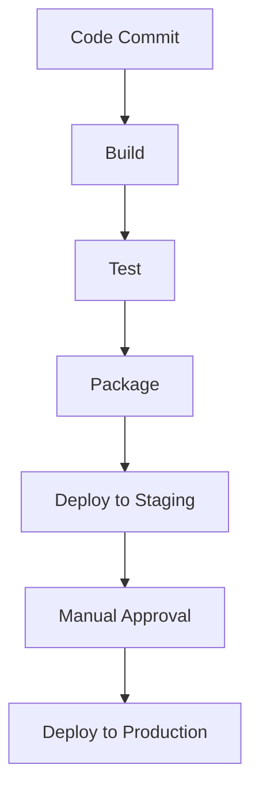

## 21.7 Continuous Integration and Deployment

Continuous Integration (CI) and Continuous Deployment (CD) are crucial practices in modern software development, ensuring that code changes are automatically tested and deployed, leading to more reliable and efficient software delivery. In this section, we will delve into the best practices for setting up CI environments, implementing automated testing, and developing effective deployment strategies specifically for C++ projects.

### Introduction to CI/CD

Continuous Integration and Deployment are practices that aim to minimize integration issues and accelerate the delivery of software. CI involves automatically building and testing code changes, while CD extends this process to automatically deploy code changes to production environments. These practices help teams to deliver high-quality software quickly and reliably.

### Setting Up CI Environments

Setting up a robust CI environment is the first step towards implementing CI/CD. This involves selecting the right tools, configuring build pipelines, and ensuring that the environment can handle the specific needs of C++ projects.

#### Choosing CI Tools

There are several CI tools available, each with its own strengths and weaknesses. Some popular CI tools include:

- **Jenkins**: An open-source automation server that is highly customizable and supports a wide range of plugins.
- **GitLab CI/CD**: Integrated with GitLab, it offers a seamless experience for projects hosted on GitLab.
- **Travis CI**: A cloud-based CI service that is easy to set up and integrates well with GitHub.
- **CircleCI**: Known for its speed and efficiency, it provides a robust set of features for CI/CD.

When choosing a CI tool, consider factors such as ease of integration with your version control system, support for C++ build tools, and the ability to scale with your project's needs.

#### Configuring Build Pipelines

A build pipeline is a series of steps that code changes go through before they are integrated into the main codebase. A typical CI pipeline for a C++ project might include the following stages:

1. **Checkout**: Retrieve the latest code from the version control system.
2. **Build**: Compile the code using a build system like CMake or Make.
3. **Test**: Run automated tests to verify the code's functionality.
4. **Package**: Create deployable artifacts, such as binaries or libraries.
5. **Deploy**: Optionally, deploy the artifacts to a staging or production environment.

Each stage in the pipeline should be automated and capable of running in parallel to reduce the time it takes to get feedback on code changes.

#### Ensuring Environment Consistency

Consistency across different environments (development, testing, staging, production) is crucial for CI/CD. Use containerization technologies like Docker to create consistent environments that can be easily replicated across different stages of the pipeline. Docker allows you to define your environment in a Dockerfile, ensuring that all dependencies are installed and configured correctly.

### Best Practices for Automated Testing

Automated testing is a cornerstone of CI/CD, providing confidence that code changes do not introduce new bugs. Here are some best practices for implementing automated testing in C++ projects:

#### Writing Effective Unit Tests

Unit tests are small tests that verify the behavior of individual functions or classes. They should be fast, isolated, and deterministic. Use a testing framework like Google Test or Catch2 to write and run unit tests.

```cpp
#include <gtest/gtest.h>
#include "MyClass.h"

TEST(MyClassTest, TestFunction) {
    MyClass obj;
    EXPECT_EQ(obj.function(), expected_value);
}
```

Ensure that your unit tests cover all edge cases and handle both expected and unexpected inputs.

#### Implementing Integration Tests

Integration tests verify that different components of the system work together as expected. These tests are typically more complex and slower than unit tests but provide valuable insights into the system's overall behavior.

```cpp
#include <gtest/gtest.h>
#include "ComponentA.h"
#include "ComponentB.h"

TEST(IntegrationTest, TestComponentsInteraction) {
    ComponentA a;
    ComponentB b;
    EXPECT_TRUE(a.interactWith(b));
}
```

Use integration tests to validate interactions between modules, especially those that involve external systems or databases.

#### Continuous Testing

Continuous testing involves running automated tests as part of the CI pipeline. This ensures that tests are executed every time code changes are made, providing immediate feedback to developers.

- **Test Coverage**: Aim for high test coverage to ensure that most of the codebase is tested. Use tools like gcov or lcov to measure test coverage.
- **Test Parallelization**: Run tests in parallel to reduce the time it takes to get feedback. Most CI tools support parallel test execution.

### Deployment Strategies

Deployment is the process of delivering software to users. In a CI/CD context, deployment should be automated, reliable, and repeatable. Here are some strategies for deploying C++ applications:

#### Blue-Green Deployment

Blue-green deployment involves maintaining two identical environments: one for the current production version (blue) and one for the new version (green). This strategy allows you to switch traffic between environments with minimal downtime.

- **Setup**: Configure two identical environments.
- **Deploy**: Deploy the new version to the green environment.
- **Switch**: Redirect traffic to the green environment once testing is complete.

This approach minimizes downtime and allows for easy rollback if issues are detected.

#### Canary Releases

Canary releases involve deploying a new version to a small subset of users before rolling it out to the entire user base. This strategy allows you to test the new version in a real-world environment and gather feedback before full deployment.

- **Deploy**: Deploy the new version to a small group of users.
- **Monitor**: Monitor the system for any issues or feedback.
- **Rollout**: Gradually increase the number of users on the new version.

Canary releases reduce the risk of deploying new features by limiting exposure to potential issues.

#### Rolling Updates

Rolling updates involve gradually replacing instances of the old version with the new version. This strategy is useful for applications running in environments that support multiple instances, such as cloud-based services.

- **Update**: Update instances one at a time or in small batches.
- **Monitor**: Continuously monitor the system for issues.
- **Rollback**: Roll back to the previous version if problems are detected.

Rolling updates minimize downtime and allow for seamless transitions between versions.

### Visualizing CI/CD Workflow

To better understand the CI/CD workflow, let's visualize a typical CI/CD pipeline using a flowchart.



- **Code Commit**: Developers commit code changes to the version control system.
- **Build**: The CI system automatically builds the code.
- **Test**: Automated tests are run to verify the code's functionality.
- **Package**: Deployable artifacts are created.
- **Deploy to Staging**: Artifacts are deployed to a staging environment for further testing.
- **Manual Approval**: A manual approval step ensures that only approved changes are deployed to production.
- **Deploy to Production**: The final step involves deploying the changes to the production environment.

### References and Links

For further reading on CI/CD, consider the following resources:

- [Continuous Integration on Wikipedia](https://en.wikipedia.org/wiki/Continuous_integration)
- [Jenkins Documentation](https://www.jenkins.io/doc/)
- [Docker Documentation](https://docs.docker.com/)
- [Google Test Documentation](https://github.com/google/googletest)

### Knowledge Check

To reinforce your understanding of CI/CD, consider the following questions:

- What are the key benefits of implementing CI/CD in a C++ project?
- How does containerization help ensure environment consistency?
- What are the differences between blue-green deployment and canary releases?
- Why is automated testing important in a CI/CD pipeline?

### Embrace the Journey

Remember, mastering CI/CD is an ongoing process. As you gain experience, you'll discover new ways to optimize your pipelines and improve your deployment strategies. Keep experimenting, stay curious, and enjoy the journey!

## Quiz Time!



### What is Continuous Integration (CI)?

- [x] A practice where code changes are automatically built and tested.
- [ ] A method of deploying code changes manually.
- [ ] A process of writing code without tests.
- [ ] A way to manage version control systems.

> **Explanation:** Continuous Integration involves automatically building and testing code changes to ensure they integrate smoothly with the existing codebase.

### Which tool is commonly used for CI/CD in C++ projects?

- [x] Jenkins
- [ ] Microsoft Word
- [ ] Adobe Photoshop
- [ ] Blender

> **Explanation:** Jenkins is a popular CI/CD tool that supports a wide range of plugins and is highly customizable for various programming languages, including C++.

### What is the purpose of a build pipeline?

- [x] To automate the process of building, testing, and deploying code changes.
- [ ] To manually compile code.
- [ ] To write code without any structure.
- [ ] To delete old code versions.

> **Explanation:** A build pipeline automates the process of building, testing, and deploying code changes, ensuring a consistent and efficient workflow.

### What is a blue-green deployment?

- [x] A strategy that involves maintaining two identical environments to minimize downtime.
- [ ] A method of writing code with two colors.
- [ ] A way to manage databases.
- [ ] A technique for designing user interfaces.

> **Explanation:** Blue-green deployment involves maintaining two identical environments (blue and green) to minimize downtime during deployments.

### How does containerization help in CI/CD?

- [x] By creating consistent environments that can be easily replicated.
- [ ] By making code changes manually.
- [ ] By deleting old code versions.
- [ ] By writing code without any structure.

> **Explanation:** Containerization helps create consistent environments that can be easily replicated across different stages of the CI/CD pipeline.

### What is the benefit of canary releases?

- [x] They allow testing of new versions in a real-world environment with a small subset of users.
- [ ] They involve deploying all changes at once.
- [ ] They require manual testing of every change.
- [ ] They are used for writing code without tests.

> **Explanation:** Canary releases allow testing of new versions in a real-world environment with a small subset of users, reducing the risk of deploying new features.

### What is the role of automated testing in CI/CD?

- [x] To provide confidence that code changes do not introduce new bugs.
- [ ] To manually compile code.
- [ ] To delete old code versions.
- [ ] To write code without any structure.

> **Explanation:** Automated testing provides confidence that code changes do not introduce new bugs, ensuring the reliability of the software.

### What is the purpose of a manual approval step in a CI/CD pipeline?

- [x] To ensure that only approved changes are deployed to production.
- [ ] To manually compile code.
- [ ] To write code without any structure.
- [ ] To delete old code versions.

> **Explanation:** A manual approval step ensures that only approved changes are deployed to production, adding an extra layer of verification.

### What is the difference between unit tests and integration tests?

- [x] Unit tests verify individual functions or classes, while integration tests verify interactions between components.
- [ ] Unit tests are for manual testing, while integration tests are automated.
- [ ] Unit tests are for writing code, while integration tests are for deleting code.
- [ ] Unit tests are for designing user interfaces, while integration tests are for managing databases.

> **Explanation:** Unit tests verify individual functions or classes, while integration tests verify interactions between components, ensuring the system works as a whole.

### True or False: Continuous Deployment involves automatically deploying code changes to production environments.

- [x] True
- [ ] False

> **Explanation:** Continuous Deployment extends the CI process to automatically deploy code changes to production environments, ensuring rapid delivery of software.


