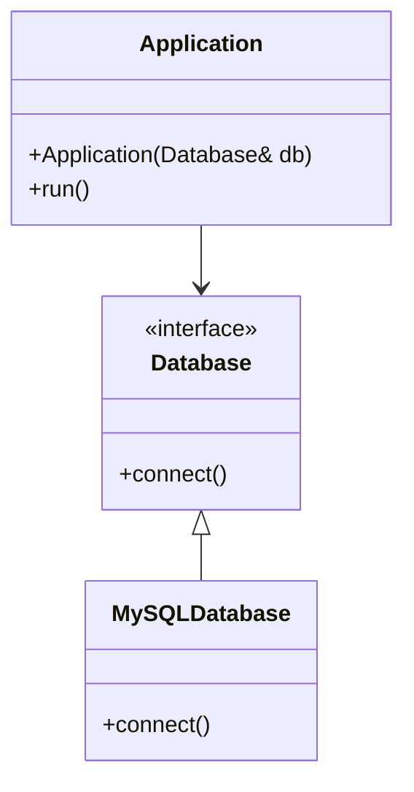

## 21.8 Design for Testability

In the realm of software engineering, ensuring that your code is testable is as crucial as ensuring it is functional. Testability is the degree to which a system or component facilitates the establishment of test criteria and the performance of tests to determine whether those criteria have been met. In this section, we will delve into strategies for designing C++ code that is easy to test, focusing on dependency injection, interface segregation, and the use of mocking and stubbing.

### Understanding Testability

Testability is not just about writing tests; it's about designing your code in a way that makes testing straightforward and effective. A testable design allows for:

- **Isolation**: Components can be tested independently of one another.
- **Control**: Testers can control the environment and inputs to the system.
- **Observability**: Testers can observe the outputs and internal states of the system.

Let's explore how these principles can be applied in C++ programming to enhance the testability of your code.

### Writing Code that is Easy to Test

Designing for testability involves several key practices:

1. **Separation of Concerns**: Break down your code into smaller, focused components.
2. **Loose Coupling**: Minimize dependencies between components.
3. **High Cohesion**: Ensure that each component has a single, well-defined purpose.

#### Separation of Concerns

Separation of concerns is a design principle for separating a computer program into distinct sections, such that each section addresses a separate concern. By doing so, you make your code more modular and easier to test. For example, consider a simple application that processes user input and displays results. By separating the input processing and display logic into different classes, you can test them independently.

#### Loose Coupling

Loose coupling refers to the degree of direct knowledge that one element has of another. In a loosely coupled system, components interact with each other through well-defined interfaces, minimizing dependencies. This makes it easier to replace or modify components without affecting others.

#### High Cohesion

High cohesion means that the responsibilities of a single module are closely related. A highly cohesive module performs a single task or a group of related tasks, making it easier to test and maintain.

### Dependency Injection

Dependency Injection (DI) is a design pattern used to implement IoC (Inversion of Control), allowing the creation of dependent objects outside of a class and providing those objects to a class through various ways. It helps in achieving loose coupling and promotes testability.

#### Types of Dependency Injection

1. **Constructor Injection**: Dependencies are provided through a class constructor.
2. **Setter Injection**: Dependencies are provided through setter methods.
3. **Interface Injection**: The dependency provides an injector method that will inject the dependency into any client passed to it.

Let's explore each type with examples.

#### Constructor Injection

Constructor injection is the most common form of dependency injection. It involves passing dependencies to the class through its constructor.

```cpp
class Database {
public:
    virtual void connect() = 0;
    virtual ~Database() = default;
};

class MySQLDatabase : public Database {
public:
    void connect() override {
        // Connect to MySQL database
    }
};

class Application {
private:
    Database& database;
public:
    Application(Database& db) : database(db) {}

    void run() {
        database.connect();
        // Other operations
    }
};

int main() {
    MySQLDatabase mySQL;
    Application app(mySQL);
    app.run();
    return 0;
}
```

In this example, `Application` is dependent on `Database`, but it does not create a `Database` instance itself. Instead, it receives a `Database` reference through its constructor, allowing for easy testing with mock databases.

#### Setter Injection

Setter injection involves providing dependencies through setter methods. This approach is useful when you want to change dependencies at runtime.

```cpp
class Application {
private:
    Database* database;
public:
    void setDatabase(Database* db) {
        database = db;
    }

    void run() {
        if (database) {
            database->connect();
            // Other operations
        }
    }
};

int main() {
    MySQLDatabase mySQL;
    Application app;
    app.setDatabase(&mySQL);
    app.run();
    return 0;
}
```

Setter injection allows for more flexibility but requires additional checks to ensure dependencies are set before use.

#### Interface Injection

Interface injection is less common and involves providing an injector method that will inject the dependency into any client passed to it.

```cpp
class DatabaseInjector {
public:
    virtual void injectDatabase(Database& db) = 0;
};

class Application : public DatabaseInjector {
private:
    Database* database;
public:
    void injectDatabase(Database& db) override {
        database = &db;
    }

    void run() {
        if (database) {
            database->connect();
            // Other operations
        }
    }
};
```

### Interface Segregation

The Interface Segregation Principle (ISP) states that no client should be forced to depend on methods it does not use. This principle is part of the SOLID principles of object-oriented design and helps in creating more modular and testable code.

#### Implementing Interface Segregation

To implement interface segregation, you should:

- **Define small, focused interfaces**: Each interface should have a specific purpose.
- **Avoid "fat" interfaces**: Do not create interfaces with too many methods.

Consider the following example:

```cpp
class Printer {
public:
    virtual void print() = 0;
    virtual void scan() = 0;
    virtual void fax() = 0;
};

class SimplePrinter : public Printer {
public:
    void print() override {
        // Print implementation
    }

    void scan() override {
        // Scan implementation
    }

    void fax() override {
        // Fax implementation
    }
};
```

In this example, `Printer` is a "fat" interface. A `SimplePrinter` may not need to implement `scan` or `fax`. Instead, we can segregate the interfaces:

```cpp
class IPrint {
public:
    virtual void print() = 0;
};

class IScan {
public:
    virtual void scan() = 0;
};

class IFax {
public:
    virtual void fax() = 0;
};

class SimplePrinter : public IPrint {
public:
    void print() override {
        // Print implementation
    }
};
```

By segregating interfaces, we ensure that classes only implement the functionality they need, making them easier to test.

### Mocking and Stubbing

Mocking and stubbing are techniques used in unit testing to simulate the behavior of complex, real objects. They allow you to test components in isolation by replacing dependencies with mock objects.

#### Mocking

Mocking involves creating objects that simulate the behavior of real objects. Mocks are used to verify interactions between objects.

```cpp
#include <iostream>
#include <gmock/gmock.h>

class Database {
public:
    virtual void connect() = 0;
    virtual ~Database() = default;
};

class MockDatabase : public Database {
public:
    MOCK_METHOD(void, connect, (), (override));
};

class Application {
private:
    Database& database;
public:
    Application(Database& db) : database(db) {}

    void run() {
        database.connect();
        // Other operations
    }
};

int main() {
    MockDatabase mockDb;
    EXPECT_CALL(mockDb, connect()).Times(1);

    Application app(mockDb);
    app.run();

    return 0;
}
```

In this example, `MockDatabase` is a mock object that simulates the behavior of a real `Database`. We use Google Mock to verify that the `connect` method is called exactly once.

#### Stubbing

Stubbing involves creating objects that return predefined responses to method calls. Stubs are used to provide indirect inputs to the system under test.

```cpp
#include <iostream>
#include <gtest/gtest.h>

class Database {
public:
    virtual bool isConnected() = 0;
    virtual ~Database() = default;
};

class StubDatabase : public Database {
public:
    bool isConnected() override {
        return true; // Always returns true
    }
};

class Application {
private:
    Database& database;
public:
    Application(Database& db) : database(db) {}

    bool checkConnection() {
        return database.isConnected();
    }
};

TEST(ApplicationTest, CheckConnection) {
    StubDatabase stubDb;
    Application app(stubDb);

    ASSERT_TRUE(app.checkConnection());
}

int main(int argc, char** argv) {
    ::testing::InitGoogleTest(&argc, argv);
    return RUN_ALL_TESTS();
}
```

In this example, `StubDatabase` is a stub object that always returns `true` for the `isConnected` method. We use Google Test to verify that `Application::checkConnection` behaves correctly.

### Try It Yourself

To solidify your understanding, try modifying the code examples above:

- **Experiment with different types of dependency injection**: Implement a new class that uses setter injection and observe how it affects testability.
- **Create your own mock and stub classes**: Write tests for a new component using Google Mock and Google Test.
- **Refactor a "fat" interface**: Identify a "fat" interface in your codebase and refactor it into smaller, focused interfaces.

### Visualizing Dependency Injection

Let's visualize the concept of dependency injection using a class diagram:



**Figure 1**: This diagram illustrates how `Application` depends on the `Database` interface, allowing for different implementations like `MySQLDatabase`.

### References and Links

- [Google Test Documentation](https://google.github.io/googletest/)
- [Google Mock Documentation](https://google.github.io/googletest/gmock_for_dummies.html)
- [Martin Fowler's Inversion of Control Containers and the Dependency Injection pattern](https://martinfowler.com/articles/injection.html)

### Knowledge Check

- **What is the main benefit of dependency injection?**
- **How does interface segregation improve testability?**
- **What is the difference between mocking and stubbing?**

### Embrace the Journey

Designing for testability is an ongoing process. As you continue to develop your skills, remember to:

- **Keep experimenting**: Try different design patterns and techniques to find what works best for your projects.
- **Stay curious**: Continuously learn about new testing tools and methodologies.
- **Enjoy the journey**: Building testable software is a rewarding endeavor that leads to more robust and maintainable applications.

### Quiz Time!



### What is the primary goal of designing for testability?

- [x] To make code easier to test and maintain
- [ ] To increase the complexity of the code
- [ ] To ensure code runs faster
- [ ] To reduce the number of tests needed

> **Explanation:** Designing for testability aims to make code easier to test and maintain by promoting practices like separation of concerns and loose coupling.

### Which type of dependency injection involves passing dependencies through a class constructor?

- [x] Constructor Injection
- [ ] Setter Injection
- [ ] Interface Injection
- [ ] Method Injection

> **Explanation:** Constructor injection involves passing dependencies to a class through its constructor, promoting immutability and simplicity.

### What does the Interface Segregation Principle (ISP) advocate?

- [x] No client should be forced to depend on methods it does not use
- [ ] All interfaces should be as large as possible
- [ ] Interfaces should be implemented by only one class
- [ ] Interfaces should never change

> **Explanation:** ISP advocates that no client should be forced to depend on methods it does not use, promoting smaller, more focused interfaces.

### In the context of testing, what is a mock object used for?

- [x] Simulating the behavior of real objects
- [ ] Returning predefined responses
- [ ] Performing complex calculations
- [ ] Storing data persistently

> **Explanation:** Mock objects simulate the behavior of real objects to verify interactions between components during testing.

### Which of the following is a benefit of using stubs in testing?

- [x] They provide indirect inputs to the system under test
- [ ] They verify interactions between objects
- [ ] They increase the execution speed of tests
- [ ] They automatically generate test cases

> **Explanation:** Stubs provide indirect inputs to the system under test by returning predefined responses, allowing for isolated testing of components.

### What is the main difference between mocking and stubbing?

- [x] Mocking verifies interactions; stubbing provides predefined responses
- [ ] Mocking is faster than stubbing
- [ ] Stubbing is more accurate than mocking
- [ ] Mocking and stubbing are the same

> **Explanation:** Mocking verifies interactions between objects, while stubbing provides predefined responses to method calls.

### How does dependency injection improve testability?

- [x] By allowing dependencies to be easily replaced with mocks or stubs
- [ ] By reducing the number of classes in a project
- [ ] By increasing the execution speed of the code
- [ ] By making code more complex

> **Explanation:** Dependency injection improves testability by allowing dependencies to be easily replaced with mocks or stubs, facilitating isolated testing.

### What is a "fat" interface?

- [x] An interface with too many methods
- [ ] An interface with no methods
- [ ] An interface implemented by only one class
- [ ] An interface that changes frequently

> **Explanation:** A "fat" interface is one that has too many methods, often leading to unnecessary dependencies and reduced testability.

### True or False: Interface segregation leads to more modular and testable code.

- [x] True
- [ ] False

> **Explanation:** True. Interface segregation leads to more modular and testable code by promoting smaller, focused interfaces that reduce dependencies.

### Which of the following is NOT a type of dependency injection?

- [ ] Constructor Injection
- [ ] Setter Injection
- [ ] Interface Injection
- [x] Method Injection

> **Explanation:** Method injection is not a recognized type of dependency injection. The common types are constructor, setter, and interface injection.



Remember, this is just the beginning. As you progress, you'll build more complex and interactive applications. Keep experimenting, stay curious, and enjoy the journey!
