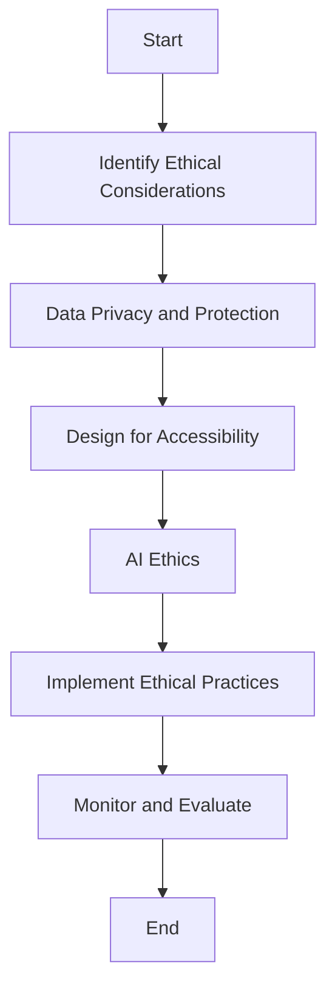

## 21.9 Ethical Considerations in Software Design

In the rapidly evolving landscape of software development, ethical considerations have become paramount. As software engineers and architects, we wield significant influence over the systems we design and the impact they have on society. This section delves into the ethical dimensions of software design, focusing on handling user data responsibly, designing for accessibility, and addressing artificial intelligence (AI) ethics. By understanding and implementing these principles, we can create software solutions that are not only innovative but also ethical and inclusive.

### Handling User Data Responsibly

User data is a valuable asset in the digital age, but with great power comes great responsibility. Mishandling user data can lead to privacy breaches, identity theft, and loss of trust. Therefore, it is crucial to prioritize data protection and privacy in software design.

#### Data Privacy and Protection

**Explain the Importance of Data Privacy**

Data privacy is the right of individuals to control how their personal information is collected, used, and shared. As software developers, we must respect this right by implementing robust data protection measures.

**Implement Data Minimization**

Data minimization is the practice of collecting only the data that is necessary for a specific purpose. By limiting data collection, we reduce the risk of data breaches and enhance user privacy.

```cpp
// Example: Implementing data minimization in C++
#include <iostream>
#include <string>

class UserData {
public:
    UserData(const std::string& name, const std::string& email)
        : name_(name), email_(email) {}

    void DisplayInfo() const {
        std::cout << "Name: " << name_ << "\n";
        // Email is not displayed to minimize data exposure
    }

private:
    std::string name_;
    std::string email_;
};

int main() {
    UserData user("Alice", "alice@example.com");
    user.DisplayInfo();
    return 0;
}
```

**Ensure Data Encryption**

Encrypting data both at rest and in transit is essential to protect it from unauthorized access. Use strong encryption algorithms and keep encryption keys secure.

**Provide Transparency and Control**

Inform users about what data is being collected and why. Provide them with control over their data, allowing them to access, modify, or delete it as needed.

#### Compliance with Regulations

**Understand Relevant Regulations**

Familiarize yourself with data protection regulations such as the General Data Protection Regulation (GDPR) and the California Consumer Privacy Act (CCPA). These regulations set standards for data handling and user rights.

**Implement Compliance Measures**

Ensure that your software complies with relevant regulations by incorporating features such as consent management, data access requests, and data breach notifications.

### Designing for Accessibility

Accessibility is about making software usable for everyone, including people with disabilities. By designing for accessibility, we create inclusive solutions that cater to a diverse user base.

#### Principles of Accessible Design

**Perceivable**

Ensure that information and user interface components are presented in ways that users can perceive. This includes providing text alternatives for non-text content and ensuring content is adaptable.

**Operable**

Make sure that user interface components and navigation are operable. This means providing keyboard accessibility and allowing users enough time to read and use content.

**Understandable**

Design content that is easy to understand. Use clear and simple language, and provide consistent navigation and input assistance.

**Robust**

Create content that can be reliably interpreted by a wide variety of user agents, including assistive technologies.

#### Implementing Accessibility in Software

**Use Semantic HTML**

When developing web applications, use semantic HTML to ensure that assistive technologies can interpret content correctly.

```html
<!-- Example: Using semantic HTML for accessibility -->
<nav aria-label="Main Navigation">
    <ul>
        <li><a href="#home">Home</a></li>
        <li><a href="#about">About</a></li>
        <li><a href="#contact">Contact</a></li>
    </ul>
</nav>
```

**Provide Keyboard Navigation**

Ensure that all interactive elements can be accessed and operated using a keyboard. This is crucial for users who cannot use a mouse.

**Test with Assistive Technologies**

Regularly test your software with screen readers and other assistive technologies to ensure compatibility and usability.

**Include Accessibility Features**

Incorporate features such as adjustable text size, high-contrast modes, and screen reader support to enhance accessibility.

### Artificial Intelligence Ethics

As AI becomes increasingly integrated into software systems, ethical considerations surrounding its use are critical. AI can influence decisions, automate processes, and impact lives, making ethical AI design essential.

#### Bias and Fairness

**Identify and Mitigate Bias**

AI systems can inadvertently perpetuate biases present in training data. Identify potential biases and implement strategies to mitigate them, such as diverse data sets and fairness-aware algorithms.

**Ensure Fairness in AI Models**

Design AI models that treat all users equitably. Regularly evaluate models for fairness and adjust them as needed to prevent discrimination.

#### Transparency and Accountability

**Provide Explainability**

Ensure that AI decisions are explainable to users. This builds trust and allows users to understand how decisions are made.

**Establish Accountability**

Define clear accountability for AI systems. Assign responsibility for monitoring AI behavior and addressing any issues that arise.

#### Privacy and Security in AI

**Protect User Data**

AI systems often require large amounts of data. Implement strong data protection measures to safeguard user information.

**Secure AI Models**

Protect AI models from adversarial attacks and unauthorized access. Regularly update security measures to address emerging threats.

### Visualizing Ethical Software Design

To better understand the interplay of ethical considerations in software design, let's visualize the process using a flowchart. This diagram illustrates the key steps and considerations in designing ethical software.



**Caption:** This flowchart outlines the process of integrating ethical considerations into software design, from identifying key areas to implementing and evaluating ethical practices.

### References and Links

For further reading on ethical software design, consider exploring the following resources:

- [GDPR Overview](https://gdpr-info.eu/)
- [Web Content Accessibility Guidelines (WCAG)](https://www.w3.org/WAI/standards-guidelines/wcag/)
- [AI Ethics Guidelines](https://www.oecd.org/going-digital/ai/principles/)

### Knowledge Check

To reinforce your understanding of ethical considerations in software design, consider the following questions:

- What are the key principles of accessible design?
- How can we mitigate bias in AI systems?
- Why is data minimization important for user privacy?

### Embrace the Journey

Remember, ethical software design is an ongoing journey. As technology evolves, so do the ethical challenges we face. Stay informed, remain vigilant, and continue to prioritize ethics in your work. By doing so, you'll contribute to a more inclusive and responsible digital world.

## Quiz Time!



### What is data minimization?

- [x] Collecting only the data necessary for a specific purpose
- [ ] Collecting as much data as possible
- [ ] Sharing data with third parties
- [ ] Encrypting all user data

> **Explanation:** Data minimization involves collecting only the data necessary for a specific purpose, reducing the risk of data breaches and enhancing user privacy.

### Which of the following is a principle of accessible design?

- [x] Perceivable
- [ ] Invisible
- [ ] Unreachable
- [ ] Complex

> **Explanation:** Perceivable is a principle of accessible design, ensuring that information and user interface components are presented in ways that users can perceive.

### How can we mitigate bias in AI systems?

- [x] Use diverse data sets
- [ ] Ignore potential biases
- [ ] Use only historical data
- [ ] Avoid testing AI models

> **Explanation:** Mitigating bias in AI systems involves using diverse data sets and fairness-aware algorithms to prevent discrimination.

### What is the purpose of providing explainability in AI systems?

- [x] To build trust and allow users to understand decisions
- [ ] To make AI systems more complex
- [ ] To hide decision-making processes
- [ ] To reduce transparency

> **Explanation:** Explainability in AI systems builds trust and allows users to understand how decisions are made, enhancing transparency.

### Why is encrypting data important?

- [x] To protect it from unauthorized access
- [ ] To make it unreadable by users
- [ ] To increase data size
- [ ] To slow down data processing

> **Explanation:** Encrypting data protects it from unauthorized access, ensuring data privacy and security.

### What is the role of accountability in AI ethics?

- [x] To define responsibility for monitoring AI behavior
- [ ] To make AI systems autonomous
- [ ] To eliminate human oversight
- [ ] To reduce transparency

> **Explanation:** Accountability in AI ethics involves defining responsibility for monitoring AI behavior and addressing any issues that arise.

### How can we ensure keyboard accessibility in software?

- [x] By making all interactive elements operable using a keyboard
- [ ] By requiring a mouse for navigation
- [ ] By disabling keyboard shortcuts
- [ ] By hiding keyboard focus indicators

> **Explanation:** Ensuring keyboard accessibility involves making all interactive elements operable using a keyboard, crucial for users who cannot use a mouse.

### What is the significance of data protection regulations like GDPR?

- [x] They set standards for data handling and user rights
- [ ] They allow unrestricted data sharing
- [ ] They eliminate the need for data encryption
- [ ] They reduce user control over data

> **Explanation:** Data protection regulations like GDPR set standards for data handling and user rights, ensuring user privacy and protection.

### What is the purpose of testing software with assistive technologies?

- [x] To ensure compatibility and usability
- [ ] To increase development time
- [ ] To make software more complex
- [ ] To reduce accessibility

> **Explanation:** Testing software with assistive technologies ensures compatibility and usability, enhancing accessibility for all users.

### True or False: Ethical software design is a one-time process.

- [ ] True
- [x] False

> **Explanation:** Ethical software design is an ongoing journey, requiring continuous attention and adaptation to evolving technologies and challenges.


