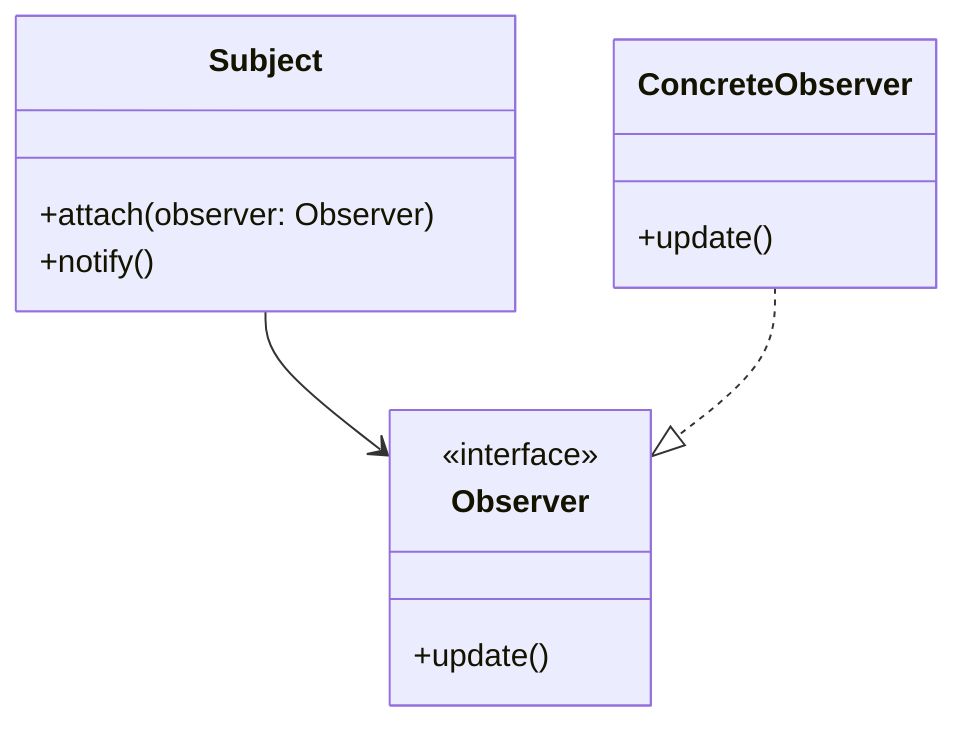

## 22.1 Recap of Key Concepts

As we conclude our journey through the intricate world of C++ design patterns, it's important to consolidate our understanding of the essential concepts and techniques that have been explored. This section serves as a comprehensive recap, highlighting the key takeaways that will empower you to apply these patterns effectively in your software engineering endeavors.

### Understanding Design Patterns

**Design Patterns** are reusable solutions to common software design problems. They provide a template for solving issues that occur repeatedly in software development. By understanding and applying design patterns, developers can create more modular, scalable, and maintainable code.

#### Key Participants in Design Patterns

- **Creational Patterns**: Focus on the process of object creation. Examples include Singleton, Factory Method, and Builder.
- **Structural Patterns**: Deal with object composition and typically help ensure that if one part of a system changes, the entire system doesn't need to do the same. Examples include Adapter, Composite, and Decorator.
- **Behavioral Patterns**: Concerned with algorithms and the assignment of responsibilities between objects. Examples include Observer, Strategy, and Command.

### Modern C++ Features

The evolution of C++ from C++11 to C++20 has introduced numerous features that enhance the implementation of design patterns:

- **Lambda Expressions**: Allow for concise function objects and are particularly useful in implementing behavioral patterns like Strategy and Observer.
- **Smart Pointers**: (`std::unique_ptr`, `std::shared_ptr`, `std::weak_ptr`) facilitate automatic memory management, reducing the risk of memory leaks and dangling pointers.
- **Concurrency Support**: With `std::thread`, `std::mutex`, and `std::async`, C++ provides robust tools for concurrent programming, crucial for implementing patterns like Active Object and Monitor Object.
- **Templates and Metaprogramming**: Enable generic programming and compile-time polymorphism, essential for patterns like Factory and Strategy.

### Best Practices in C++ Software Design

Adhering to best practices is crucial for leveraging the full potential of C++ design patterns:

- **SOLID Principles**: These principles (Single Responsibility, Open-Closed, Liskov Substitution, Interface Segregation, Dependency Inversion) guide the design of robust, maintainable, and scalable software.
- **RAII (Resource Acquisition Is Initialization)**: Ensures that resources are properly managed, which is particularly important in C++ due to its manual memory management.
- **Exception Safety**: Writing code that is safe in the presence of exceptions is critical. This involves using RAII and ensuring that resources are released properly.

### Code Examples and Visualizations

Throughout this guide, we've provided numerous code examples and visualizations to illustrate the application of design patterns. Let's revisit a few key examples:

#### Singleton Pattern Example

```cpp
#include <iostream>
#include <mutex>

class Singleton {
public:
    static Singleton& getInstance() {
        static Singleton instance;
        return instance;
    }

    void showMessage() {
        std::cout << "Hello from Singleton!" << std::endl;
    }

private:
    Singleton() = default;
    ~Singleton() = default;
    Singleton(const Singleton&) = delete;
    Singleton& operator=(const Singleton&) = delete;
};
```

**Key Points:**
- **Thread Safety**: The use of `static` ensures that the instance is created only once, even in a multithreaded environment.
- **Private Constructor**: Prevents the creation of additional instances.

#### Observer Pattern Example

```cpp
#include <iostream>
#include <vector>
#include <memory>

class Observer {
public:
    virtual void update() = 0;
};

class Subject {
    std::vector<std::shared_ptr<Observer>> observers;
public:
    void attach(std::shared_ptr<Observer> observer) {
        observers.push_back(observer);
    }

    void notify() {
        for (auto& observer : observers) {
            observer->update();
        }
    }
};

class ConcreteObserver : public Observer {
public:
    void update() override {
        std::cout << "Observer updated!" << std::endl;
    }
};
```

**Key Points:**
- **Decoupling**: The Observer pattern decouples the subject from the observers, allowing for flexible and dynamic relationships.
- **Use of Smart Pointers**: Ensures proper memory management and avoids memory leaks.

### Visualizing Design Patterns

To better understand the relationships and interactions within design patterns, visualizations can be immensely helpful. Below is a Mermaid.js diagram illustrating the Observer pattern:



**Diagram Explanation:**
- **Subject**: Maintains a list of observers and notifies them of changes.
- **Observer Interface**: Defines the `update` method that observers must implement.
- **ConcreteObserver**: Implements the `Observer` interface and defines the specific update behavior.

### Applying Patterns in Real-World Scenarios

Understanding design patterns is only part of the equation. Applying them effectively in real-world scenarios is where the true value lies. Consider the following examples:

#### Game Development

In game development, patterns like **State** and **Observer** are commonly used. The State pattern can manage different game states (e.g., menu, play, pause), while the Observer pattern can handle event-driven systems, such as updating the UI when the player's score changes.

#### High-Performance Computing

For high-performance computing applications, patterns like **Flyweight** and **Prototype** are invaluable. Flyweight helps manage memory usage by sharing common data, while Prototype allows for efficient object creation through cloning.

### Knowledge Check

To reinforce your understanding, consider the following questions:

- How does the Singleton pattern ensure a class has only one instance?
- What are the benefits of using smart pointers in C++?
- How can the Observer pattern be used to decouple components in a system?

### Embrace the Journey

As we wrap up this guide, remember that mastering C++ design patterns is an ongoing journey. The concepts and techniques you've learned here are just the beginning. As you continue to develop your skills, keep experimenting, stay curious, and enjoy the process of creating robust and efficient software.

### Try It Yourself

To deepen your understanding, try modifying the provided code examples. For instance, implement a thread-safe Singleton using `std::mutex`, or extend the Observer pattern to include a `detach` method for removing observers.

### References and Further Reading

For more information on C++ design patterns and best practices, consider exploring the following resources:

- [Design Patterns: Elements of Reusable Object-Oriented Software](https://en.wikipedia.org/wiki/Design_Patterns)
- [Modern C++ Design: Generic Programming and Design Patterns Applied](https://en.wikipedia.org/wiki/Modern_C%2B%2B_Design)
- [C++ Programming Language Documentation](https://en.cppreference.com/)

## Quiz Time!



### What is a key benefit of using design patterns in software development?

- [x] They provide reusable solutions to common problems.
- [ ] They make code execution faster.
- [ ] They eliminate the need for debugging.
- [ ] They replace the need for documentation.

> **Explanation:** Design patterns offer reusable solutions to common software design problems, enhancing code modularity and maintainability.

### Which C++ feature is crucial for implementing the Observer pattern?

- [x] Smart pointers
- [ ] Raw pointers
- [ ] Macros
- [ ] Inline functions

> **Explanation:** Smart pointers, such as `std::shared_ptr`, are crucial for managing observer lifecycles and preventing memory leaks.

### What principle does RAII in C++ stand for?

- [x] Resource Acquisition Is Initialization
- [ ] Random Access Is Immediate
- [ ] Resource Allocation Is Immediate
- [ ] Random Access Is Initialization

> **Explanation:** RAII stands for Resource Acquisition Is Initialization, a principle that ensures resources are properly managed in C++.

### Which design pattern is used to ensure a class has only one instance?

- [x] Singleton
- [ ] Factory
- [ ] Observer
- [ ] Strategy

> **Explanation:** The Singleton pattern ensures that a class has only one instance and provides a global point of access to it.

### What is the primary purpose of the Factory Method pattern?

- [x] To define an interface for creating objects
- [ ] To manage object lifecycles
- [ ] To encapsulate object behavior
- [ ] To provide a unified interface to a set of interfaces

> **Explanation:** The Factory Method pattern defines an interface for creating objects, allowing subclasses to alter the type of objects that will be created.

### How do lambda expressions enhance C++ programming?

- [x] They allow for concise function objects.
- [ ] They replace the need for classes.
- [ ] They eliminate the need for templates.
- [ ] They make code execution faster.

> **Explanation:** Lambda expressions allow for concise function objects, making it easier to implement patterns like Strategy and Observer.

### Which pattern is commonly used in game development for managing different game states?

- [x] State
- [ ] Singleton
- [ ] Adapter
- [ ] Proxy

> **Explanation:** The State pattern is commonly used in game development to manage different game states, such as menu, play, and pause.

### What is a key advantage of using the Flyweight pattern?

- [x] It reduces memory usage by sharing data.
- [ ] It speeds up object creation.
- [ ] It simplifies code structure.
- [ ] It enhances code readability.

> **Explanation:** The Flyweight pattern reduces memory usage by sharing common data among multiple objects.

### What is the role of the Observer pattern in software design?

- [x] To decouple components by defining a one-to-many dependency
- [ ] To encapsulate object creation logic
- [ ] To manage object lifecycles
- [ ] To provide a unified interface to a set of interfaces

> **Explanation:** The Observer pattern decouples components by defining a one-to-many dependency, allowing observers to be notified of changes in the subject.

### True or False: The use of smart pointers eliminates the need for manual memory management in C++.

- [x] True
- [ ] False

> **Explanation:** Smart pointers automate memory management, reducing the need for manual memory management and preventing memory leaks.



By revisiting these key concepts and examples, you can solidify your understanding of C++ design patterns and their application in modern software development. Keep exploring and applying these patterns to build robust, efficient, and maintainable software solutions.
