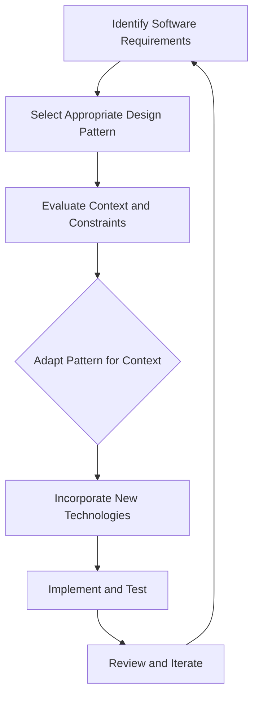

## 22.3 Final Thoughts on Design Patterns in C++

As we conclude our comprehensive exploration of design patterns in C++, it's essential to reflect on the journey we've undertaken. We've delved into the intricacies of creational, structural, behavioral, and concurrency patterns, each offering unique solutions to common software design challenges. However, the journey doesn't end here. In this section, we'll emphasize the importance of continual learning and the adaptation of design patterns to meet the ever-evolving needs of software development.

### The Ever-Evolving Landscape of Software Development

Software development is a dynamic field, constantly shaped by new technologies, methodologies, and user requirements. As expert developers and architects, we must remain agile and adaptable, ready to embrace change and leverage new tools and techniques. Design patterns, while rooted in timeless principles, must also evolve to address contemporary challenges.

#### Embrace Modern C++ Features

One of the most significant developments in recent years is the evolution of the C++ language itself. With the introduction of C++11, C++14, C++17, and C++20, developers have access to a plethora of modern features that enhance the implementation of design patterns. Concepts such as lambda expressions, smart pointers, and concurrency libraries have revolutionized the way we approach software design.

**Example: Leveraging Lambda Expressions in the Strategy Pattern**

Lambda expressions in C++ allow us to define inline functions, making the Strategy Pattern more flexible and concise. Consider the following example:

```cpp
#include <iostream>
#include <functional>
#include <vector>

// Strategy pattern using lambda expressions
int main() {
    std::vector<std::function<int(int, int)>> strategies;

    // Adding strategies using lambda expressions
    strategies.push_back([](int a, int b) { return a + b; });
    strategies.push_back([](int a, int b) { return a - b; });
    strategies.push_back([](int a, int b) { return a * b; });

    int a = 5, b = 3;

    for (const auto& strategy : strategies) {
        std::cout << "Result: " << strategy(a, b) << std::endl;
    }

    return 0;
}
```

In this example, we use lambda expressions to define different strategies for arithmetic operations. This approach simplifies the code and enhances readability.

### Adapting Patterns to Changing Needs

Design patterns are not rigid templates but flexible guidelines that can be adapted to fit specific contexts. As software requirements evolve, so too must our application of design patterns. Here are some ways to adapt patterns to changing needs:

#### 1. **Contextual Application**

Each software project is unique, with its own set of requirements and constraints. It's crucial to evaluate the context in which a pattern is applied and make necessary adjustments. For instance, the Singleton Pattern may need to be adapted for thread safety in a multithreaded environment.

**Example: Thread-Safe Singleton Pattern**

```cpp
#include <iostream>
#include <mutex>

class Singleton {
public:
    static Singleton& getInstance() {
        static Singleton instance;
        return instance;
    }

    void showMessage() {
        std::cout << "Singleton Instance" << std::endl;
    }

private:
    Singleton() = default;
    ~Singleton() = default;
    Singleton(const Singleton&) = delete;
    Singleton& operator=(const Singleton&) = delete;
};

// Usage
int main() {
    Singleton& singleton = Singleton::getInstance();
    singleton.showMessage();
    return 0;
}
```

In this example, we ensure thread safety by using a local static variable, which is initialized once in a thread-safe manner.

#### 2. **Incorporating New Technologies**

As new technologies emerge, they can be integrated into existing design patterns to enhance functionality and performance. For example, the Observer Pattern can be extended with reactive programming libraries to handle asynchronous data streams more effectively.

**Example: Observer Pattern with Reactive Extensions**

```cpp
#include <rxcpp/rx.hpp>
#include <iostream>

int main() {
    auto values = rxcpp::observable<>::range(1, 5);

    values.subscribe(
        [](int v) { std::cout << "OnNext: " << v << std::endl; },
        []() { std::cout << "OnCompleted" << std::endl; }
    );

    return 0;
}
```

In this example, we use the RxCpp library to implement the Observer Pattern with reactive extensions, allowing for efficient handling of data streams.

### Continuous Learning and Improvement

The field of software development is characterized by continuous learning and improvement. As expert developers, we must stay informed about the latest advancements in C++ and design patterns. Here are some strategies to foster continuous learning:

#### 1. **Engage with the Community**

Participate in online forums, attend conferences, and join professional organizations to stay connected with the C++ community. Engaging with peers and industry experts provides valuable insights and keeps you updated on emerging trends.

#### 2. **Explore Open Source Projects**

Contributing to open source projects is an excellent way to gain practical experience and learn from seasoned developers. Analyze how design patterns are applied in real-world projects and consider how you might improve or adapt them.

#### 3. **Experiment with New Patterns**

Don't hesitate to experiment with new patterns or variations of existing ones. Innovation often arises from exploring uncharted territory. Consider how patterns from other programming paradigms, such as functional programming, can be integrated into C++.

### Visualizing the Adaptation of Design Patterns

To better understand how design patterns can be adapted and evolved, let's visualize the process using a flowchart.



**Figure 1: Adapting Design Patterns to Evolving Needs**

This flowchart illustrates the iterative process of adapting design patterns to meet changing requirements. It emphasizes the importance of continuous evaluation and iteration.

### Embrace the Journey

As we conclude this guide, remember that mastering design patterns in C++ is a journey, not a destination. The knowledge and skills you've gained are tools to help you build robust, scalable, and maintainable software. Embrace the challenges and opportunities that come your way, and continue to refine your craft.

### Key Takeaways

- **Adaptation is Key**: Design patterns are flexible tools that can be adapted to fit specific contexts and evolving requirements.
- **Leverage Modern C++ Features**: Utilize the latest C++ features to enhance the implementation of design patterns.
- **Continuous Learning**: Stay informed about industry trends and engage with the community to foster continuous learning and improvement.
- **Experiment and Innovate**: Don't be afraid to experiment with new patterns and approaches to find innovative solutions.

### Try It Yourself

To solidify your understanding, try modifying the code examples provided in this section. Experiment with different design patterns and explore how modern C++ features can enhance their implementation. Consider integrating new technologies or libraries to address specific challenges in your projects.

## Quiz Time!



### What is a key benefit of using lambda expressions in design patterns?

- [x] They allow for more concise and readable code.
- [ ] They increase the execution speed of the program.
- [ ] They eliminate the need for classes in C++.
- [ ] They automatically handle all memory management.

> **Explanation:** Lambda expressions provide a concise way to define inline functions, making code more readable and maintainable.

### How can design patterns be adapted to meet changing software requirements?

- [x] By evaluating the context and making necessary adjustments.
- [ ] By strictly adhering to the original pattern definitions.
- [ ] By avoiding the use of modern C++ features.
- [ ] By implementing patterns exactly as described in textbooks.

> **Explanation:** Design patterns should be adapted to fit the specific context and requirements of a project, which may involve making adjustments or incorporating new technologies.

### What is a recommended approach for ensuring thread safety in a Singleton pattern?

- [x] Use a local static variable for initialization.
- [ ] Use global variables for instance management.
- [ ] Avoid using Singleton in multithreaded environments.
- [ ] Use dynamic memory allocation for the instance.

> **Explanation:** A local static variable ensures thread-safe initialization of a Singleton instance.

### Why is continuous learning important in software development?

- [x] It helps developers stay informed about the latest advancements and trends.
- [ ] It allows developers to avoid using design patterns altogether.
- [ ] It guarantees that all software projects will be successful.
- [ ] It eliminates the need for testing and debugging.

> **Explanation:** Continuous learning keeps developers updated on new technologies and methodologies, enabling them to apply the best practices in their projects.

### What is the role of the C++ community in a developer's learning journey?

- [x] Providing valuable insights and updates on emerging trends.
- [ ] Offering free software and tools for development.
- [ ] Replacing formal education and training.
- [ ] Ensuring all developers use the same coding style.

> **Explanation:** Engaging with the C++ community provides insights and updates on industry trends, fostering continuous learning.

### How can open source projects contribute to a developer's growth?

- [x] By providing practical experience and exposure to real-world applications of design patterns.
- [ ] By offering financial compensation for contributions.
- [ ] By replacing the need for personal projects.
- [ ] By guaranteeing a job in the software industry.

> **Explanation:** Contributing to open source projects offers practical experience and exposure to how design patterns are applied in real-world scenarios.

### What is an advantage of experimenting with new design patterns?

- [x] It can lead to innovative solutions and improvements.
- [ ] It ensures that all code is error-free.
- [ ] It eliminates the need for existing patterns.
- [ ] It guarantees faster software development.

> **Explanation:** Experimenting with new patterns can lead to innovative solutions and improvements in software design.

### What is the significance of the flowchart in this section?

- [x] It illustrates the iterative process of adapting design patterns to evolving needs.
- [ ] It provides a step-by-step guide to implementing all design patterns.
- [ ] It replaces the need for code examples.
- [ ] It guarantees successful software projects.

> **Explanation:** The flowchart visually represents the iterative process of adapting design patterns to meet changing requirements.

### What should developers do to embrace the journey of mastering design patterns?

- [x] Continuously refine their craft and embrace challenges.
- [ ] Avoid experimenting with new patterns.
- [ ] Rely solely on textbooks for guidance.
- [ ] Focus only on the patterns they are most comfortable with.

> **Explanation:** Developers should continuously refine their craft, embrace challenges, and explore new patterns to master design patterns.

### True or False: Design patterns are rigid templates that should not be altered.

- [ ] True
- [x] False

> **Explanation:** Design patterns are flexible guidelines that can be adapted to fit specific contexts and evolving requirements.


