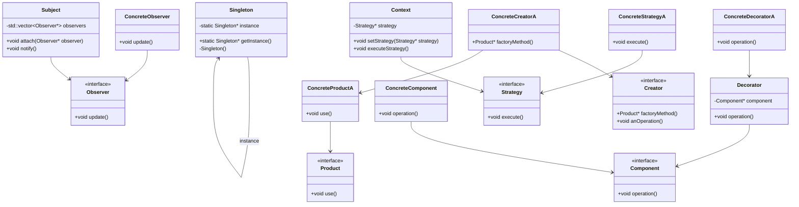

## 23.4 Common Interview Questions

Preparing for a technical interview can be a daunting task, especially when it comes to mastering C++ design patterns. This section is dedicated to helping you navigate through some of the most common interview questions related to design patterns in C++. We'll explore key concepts, provide code examples, and offer insights into the best practices for answering these questions effectively. Whether you're a seasoned developer or just starting out, this guide will equip you with the knowledge and confidence you need to excel in your next interview.

### Introduction to C++ Design Patterns Interview Questions

Design patterns are a crucial aspect of software design and architecture. They provide reusable solutions to common problems and help in building scalable and maintainable software. In a C++ interview, you may be asked to demonstrate your understanding of various design patterns, their implementation, and their applicability in real-world scenarios.

### Understanding Design Patterns

Before diving into specific questions, let's briefly revisit what design patterns are. Design patterns are proven solutions to recurring design problems. They are categorized into three main types:

1. **Creational Patterns**: Deal with object creation mechanisms.
2. **Structural Patterns**: Concerned with object composition and structure.
3. **Behavioral Patterns**: Focus on object interaction and communication.

### Common Interview Questions

Let's explore some common interview questions related to C++ design patterns, along with explanations and code examples.

#### 1. Explain the Singleton Pattern and Its Use Cases

**Intent**: Ensure a class has only one instance and provide a global point of access to it.

**Key Participants**:
- Singleton Class: The class that is restricted to a single instance.

**Applicability**: Use the Singleton pattern when:
- Exactly one instance of a class is needed.
- The single instance should be accessible by multiple clients.

**Sample Code Snippet**:

```cpp
class Singleton {
private:
    static Singleton* instance;
    Singleton() {} // Private constructor

public:
    static Singleton* getInstance() {
        if (!instance) {
            instance = new Singleton();
        }
        return instance;
    }
};

// Initialize pointer to zero so that it can be initialized in first call to getInstance
Singleton* Singleton::instance = nullptr;
```

**Design Considerations**:
- Thread safety: Ensure the Singleton is thread-safe in a multithreaded environment.
- Lazy initialization: Delay the creation of the Singleton instance until it's needed.

**Try It Yourself**: Modify the code to make the Singleton thread-safe using C++11's `std::call_once`.

#### 2. Describe the Factory Method Pattern and Provide an Example

**Intent**: Define an interface for creating an object, but let subclasses alter the type of objects that will be created.

**Key Participants**:
- Product: The interface of objects the factory method creates.
- Creator: Declares the factory method, which returns an object of type Product.

**Applicability**: Use the Factory Method pattern when:
- A class cannot anticipate the class of objects it must create.
- A class wants its subclasses to specify the objects it creates.

**Sample Code Snippet**:

```cpp
class Product {
public:
    virtual void use() = 0;
};

class ConcreteProductA : public Product {
public:
    void use() override {
        std::cout << "Using Product A" << std::endl;
    }
};

class Creator {
public:
    virtual Product* factoryMethod() = 0;
    void anOperation() {
        Product* product = factoryMethod();
        product->use();
        delete product;
    }
};

class ConcreteCreatorA : public Creator {
public:
    Product* factoryMethod() override {
        return new ConcreteProductA();
    }
};
```

**Design Considerations**:
- The Factory Method pattern promotes loose coupling by eliminating the need to bind application-specific classes into your code.
- It allows a class to defer instantiation to subclasses.

**Try It Yourself**: Implement another concrete product and creator.

#### 3. What is the Observer Pattern and How is it Implemented?

**Intent**: Define a one-to-many dependency between objects so that when one object changes state, all its dependents are notified and updated automatically.

**Key Participants**:
- Subject: Knows its observers and provides an interface for attaching and detaching observers.
- Observer: Defines an updating interface for objects that should be notified of changes in a subject.

**Applicability**: Use the Observer pattern when:
- A change to one object requires changing others, and you don't know how many objects need to be changed.
- An object should be able to notify other objects without making assumptions about who these objects are.

**Sample Code Snippet**:

```cpp
class Observer {
public:
    virtual void update() = 0;
};

class Subject {
private:
    std::vector<Observer*> observers;

public:
    void attach(Observer* observer) {
        observers.push_back(observer);
    }

    void notify() {
        for (Observer* observer : observers) {
            observer->update();
        }
    }
};

class ConcreteObserver : public Observer {
public:
    void update() override {
        std::cout << "Observer updated!" << std::endl;
    }
};
```

**Design Considerations**:
- The Observer pattern is useful for implementing distributed event-handling systems.
- It can lead to memory leaks if observers are not properly detached.

**Try It Yourself**: Implement a detach method for the Subject class.

#### 4. How Does the Strategy Pattern Work?

**Intent**: Define a family of algorithms, encapsulate each one, and make them interchangeable. Strategy lets the algorithm vary independently from clients that use it.

**Key Participants**:
- Strategy: Declares an interface common to all supported algorithms.
- Context: Maintains a reference to a Strategy object.

**Applicability**: Use the Strategy pattern when:
- Many related classes differ only in their behavior.
- You need different variants of an algorithm.

**Sample Code Snippet**:

```cpp
class Strategy {
public:
    virtual void execute() = 0;
};

class ConcreteStrategyA : public Strategy {
public:
    void execute() override {
        std::cout << "Executing Strategy A" << std::endl;
    }
};

class Context {
private:
    Strategy* strategy;

public:
    Context(Strategy* strategy) : strategy(strategy) {}

    void setStrategy(Strategy* strategy) {
        this->strategy = strategy;
    }

    void executeStrategy() {
        strategy->execute();
    }
};
```

**Design Considerations**:
- Strategies can be selected at runtime.
- The Strategy pattern increases the number of objects in the application.

**Try It Yourself**: Add another strategy and switch between them at runtime.

#### 5. Explain the Decorator Pattern with an Example

**Intent**: Attach additional responsibilities to an object dynamically. Decorators provide a flexible alternative to subclassing for extending functionality.

**Key Participants**:
- Component: Defines the interface for objects that can have responsibilities added to them dynamically.
- Decorator: Maintains a reference to a Component object and defines an interface that conforms to Component's interface.

**Applicability**: Use the Decorator pattern when:
- You want to add responsibilities to individual objects dynamically and transparently.
- You want to avoid a feature-laden class hierarchy.

**Sample Code Snippet**:

```cpp
class Component {
public:
    virtual void operation() = 0;
};

class ConcreteComponent : public Component {
public:
    void operation() override {
        std::cout << "ConcreteComponent operation" << std::endl;
    }
};

class Decorator : public Component {
protected:
    Component* component;

public:
    Decorator(Component* component) : component(component) {}

    void operation() override {
        component->operation();
    }
};

class ConcreteDecoratorA : public Decorator {
public:
    ConcreteDecoratorA(Component* component) : Decorator(component) {}

    void operation() override {
        Decorator::operation();
        std::cout << "ConcreteDecoratorA additional operation" << std::endl;
    }
};
```

**Design Considerations**:
- Decorators can result in many small objects in a system.
- They provide a flexible alternative to subclassing.

**Try It Yourself**: Implement another decorator and chain multiple decorators together.

### Visualizing Design Patterns

To better understand how these patterns interact, let's visualize the relationships and interactions using a class diagram.



### Preparing for the Interview

When preparing for a C++ design pattern interview, consider the following tips:

1. **Understand the Patterns**: Ensure you have a solid understanding of the patterns, their intent, and when to use them.

2. **Practice Coding**: Write code examples for each pattern. This will help you internalize the concepts and be ready to implement them during an interview.

3. **Visualize**: Use diagrams to visualize the relationships and interactions between different components in a pattern.

4. **Explain Clearly**: Practice explaining the patterns and your code to someone else. This will help you articulate your thoughts clearly during an interview.

5. **Stay Updated**: Keep up with the latest C++ standards and features, as they can impact how you implement certain patterns.

### Knowledge Check

To reinforce your understanding, consider the following questions:

1. What are the main differences between the Factory Method and Abstract Factory patterns?
2. How can you ensure thread safety in a Singleton pattern?
3. When would you choose to use the Observer pattern over the Mediator pattern?
4. What are the trade-offs of using the Decorator pattern compared to subclassing?
5. How does the Strategy pattern promote the Open/Closed Principle?

### Embrace the Journey

Remember, mastering C++ design patterns is a journey. Each pattern offers unique insights and solutions to common problems. As you continue to explore and apply these patterns, you'll become more adept at designing robust and scalable software. Keep experimenting, stay curious, and enjoy the process!

## Quiz Time!



### What is the primary intent of the Singleton pattern?

- [x] To ensure a class has only one instance and provide a global point of access to it.
- [ ] To define an interface for creating an object, but let subclasses alter the type of objects that will be created.
- [ ] To define a one-to-many dependency between objects so that when one object changes state, all its dependents are notified and updated automatically.
- [ ] To define a family of algorithms, encapsulate each one, and make them interchangeable.

> **Explanation:** The Singleton pattern ensures that a class has only one instance and provides a global point of access to it.

### Which pattern is used to define an interface for creating an object, but allows subclasses to alter the type of objects that will be created?

- [ ] Singleton
- [x] Factory Method
- [ ] Observer
- [ ] Strategy

> **Explanation:** The Factory Method pattern defines an interface for creating an object, but lets subclasses alter the type of objects that will be created.

### In the Observer pattern, what is the role of the Subject?

- [x] To know its observers and provide an interface for attaching and detaching observers.
- [ ] To declare an interface common to all supported algorithms.
- [ ] To define an updating interface for objects that should be notified of changes in a subject.
- [ ] To maintain a reference to a Strategy object.

> **Explanation:** In the Observer pattern, the Subject knows its observers and provides an interface for attaching and detaching observers.

### What is a key benefit of using the Strategy pattern?

- [x] It allows algorithms to vary independently from clients that use them.
- [ ] It ensures a class has only one instance.
- [ ] It attaches additional responsibilities to an object dynamically.
- [ ] It provides a global point of access to a class.

> **Explanation:** The Strategy pattern allows algorithms to vary independently from clients that use them, promoting flexibility and reusability.

### Which pattern is best suited for dynamically adding responsibilities to individual objects?

- [ ] Singleton
- [ ] Factory Method
- [ ] Observer
- [x] Decorator

> **Explanation:** The Decorator pattern is best suited for dynamically adding responsibilities to individual objects.

### How does the Decorator pattern differ from subclassing?

- [x] It provides a flexible alternative to subclassing for extending functionality.
- [ ] It ensures a class has only one instance.
- [ ] It defines an interface for creating an object.
- [ ] It defines a one-to-many dependency between objects.

> **Explanation:** The Decorator pattern provides a flexible alternative to subclassing for extending functionality, allowing responsibilities to be added dynamically.

### What is a potential drawback of using the Observer pattern?

- [x] It can lead to memory leaks if observers are not properly detached.
- [ ] It increases the number of objects in the application.
- [ ] It requires a global point of access to a class.
- [ ] It makes algorithms vary independently from clients.

> **Explanation:** A potential drawback of the Observer pattern is that it can lead to memory leaks if observers are not properly detached.

### Which pattern is used to encapsulate a request as an object, thereby allowing for parameterization of clients with queues, requests, and operations?

- [ ] Singleton
- [ ] Factory Method
- [ ] Observer
- [x] Command

> **Explanation:** The Command pattern encapsulates a request as an object, allowing for parameterization of clients with queues, requests, and operations.

### What is the primary role of a Decorator in the Decorator pattern?

- [x] To maintain a reference to a Component object and define an interface that conforms to Component's interface.
- [ ] To declare an interface common to all supported algorithms.
- [ ] To define a one-to-many dependency between objects.
- [ ] To ensure a class has only one instance.

> **Explanation:** In the Decorator pattern, the Decorator maintains a reference to a Component object and defines an interface that conforms to Component's interface.

### True or False: The Strategy pattern allows for the dynamic selection of algorithms at runtime.

- [x] True
- [ ] False

> **Explanation:** True. The Strategy pattern allows for the dynamic selection of algorithms at runtime, promoting flexibility and reusability.


