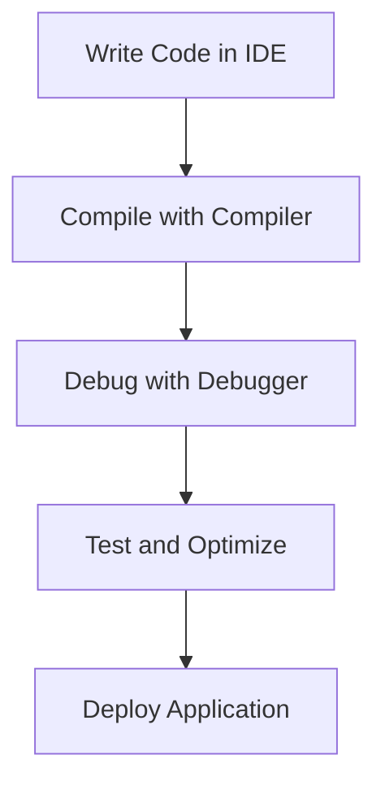

## 23.7 Tools and Resources

In the journey of mastering C++ design patterns, having the right set of tools and resources is crucial. These tools not only enhance productivity but also ensure that your code is robust, efficient, and maintainable. In this section, we will explore a comprehensive list of compilers, integrated development environments (IDEs), debugging tools, libraries, and frameworks that are indispensable for expert software engineers and architects working with C++.

### Compilers

Compilers are the backbone of any C++ development environment. They translate your high-level C++ code into machine code that can be executed by the computer. Here are some of the most widely used C++ compilers:

#### 1. GCC (GNU Compiler Collection)

- **Overview:** GCC is a free and open-source compiler that supports a wide range of programming languages, including C++.
- **Features:** It offers excellent optimization capabilities, supports the latest C++ standards, and is available on most Unix-like systems.
- **Installation:** You can install GCC on Linux using package managers like `apt` or `yum`. For Windows, you can use MinGW or Cygwin.
- **Usage Example:**
  ```bash
  g++ -o myprogram myprogram.cpp
  ```

#### 2. Clang

- **Overview:** Clang is part of the LLVM project and is known for its fast compilation times and excellent diagnostics.
- **Features:** It provides detailed error and warning messages, supports modern C++ standards, and is highly modular.
- **Installation:** Clang can be installed on macOS using Homebrew and on Linux using package managers.
- **Usage Example:**
  ```bash
  clang++ -o myprogram myprogram.cpp
  ```

#### 3. MSVC (Microsoft Visual C++)

- **Overview:** MSVC is the compiler provided by Microsoft as part of the Visual Studio suite.
- **Features:** It offers excellent integration with Windows development, supports the latest C++ standards, and provides powerful debugging tools.
- **Installation:** MSVC is included with Visual Studio, which can be downloaded from the Microsoft website.
- **Usage Example:** Compilation is typically done within the Visual Studio IDE.

### Integrated Development Environments (IDEs)

IDEs provide a comprehensive environment for writing, debugging, and managing C++ projects. They offer features like code completion, syntax highlighting, and integrated debugging tools.

#### 1. Visual Studio

- **Overview:** Visual Studio is a powerful IDE developed by Microsoft, widely used for C++ development on Windows.
- **Features:** It offers a rich set of tools for code editing, debugging, and performance profiling, along with support for version control systems.
- **Installation:** Available for download from the Microsoft website.
- **Key Features:**
  - IntelliSense for code completion
  - Integrated Git support
  - Visual debugging tools

#### 2. CLion

- **Overview:** CLion is a cross-platform IDE developed by JetBrains, known for its smart code analysis and refactoring capabilities.
- **Features:** It supports CMake, offers powerful debugging tools, and integrates with version control systems.
- **Installation:** Available for download from the JetBrains website.
- **Key Features:**
  - Code navigation and refactoring
  - Integrated terminal and version control
  - Support for Google Test and Catch2

#### 3. Eclipse CDT

- **Overview:** Eclipse CDT is an open-source IDE for C++ development, part of the Eclipse project.
- **Features:** It offers a flexible and extensible environment with support for various plugins and tools.
- **Installation:** Available for download from the Eclipse website.
- **Key Features:**
  - Code templates and snippets
  - Integrated debugger
  - Support for multiple compilers

### Debugging Tools

Debugging is an essential part of the software development process. Effective debugging tools help identify and fix issues in your code efficiently.

#### 1. GDB (GNU Debugger)

- **Overview:** GDB is a powerful command-line debugger for C++ programs.
- **Features:** It allows you to inspect variables, set breakpoints, and step through code execution.
- **Usage Example:**
  ```bash
  gdb ./myprogram
  ```

#### 2. Valgrind

- **Overview:** Valgrind is a tool for memory debugging, memory leak detection, and profiling.
- **Features:** It helps identify memory management issues such as leaks, invalid accesses, and undefined values.
- **Usage Example:**
  ```bash
  valgrind --leak-check=full ./myprogram
  ```

#### 3. LLDB

- **Overview:** LLDB is a modern debugger that is part of the LLVM project.
- **Features:** It provides a powerful debugging experience with support for multithreading and remote debugging.
- **Usage Example:**
  ```bash
  lldb ./myprogram
  ```

### Libraries and Frameworks

Libraries and frameworks provide pre-written code that you can use to perform common tasks, saving you time and effort.

#### 1. Boost

- **Overview:** Boost is a collection of peer-reviewed, portable C++ source libraries.
- **Features:** It covers a wide range of functionality, including algorithms, data structures, and threading.
- **Installation:** Available for download from the Boost website.
- **Key Libraries:**
  - Boost.Asio for asynchronous I/O
  - Boost.Thread for multithreading
  - Boost.Filesystem for file system operations

#### 2. Qt

- **Overview:** Qt is a cross-platform framework for developing applications with graphical user interfaces.
- **Features:** It offers a wide range of tools for GUI development, as well as support for networking, databases, and more.
- **Installation:** Available for download from the Qt website.
- **Key Features:**
  - Signal and slot mechanism for event handling
  - Integrated development tools like Qt Creator
  - Support for 2D and 3D graphics

#### 3. POCO C++ Libraries

- **Overview:** POCO provides a set of C++ class libraries for building network-centric applications.
- **Features:** It includes libraries for networking, file system access, and multithreading.
- **Installation:** Available for download from the POCO website.
- **Key Libraries:**
  - POCO::Net for network programming
  - POCO::Util for application utilities
  - POCO::XML for XML parsing

### Try It Yourself

To get hands-on experience with these tools, try setting up a simple C++ project using one of the IDEs mentioned above. Experiment with different compilers and debugging tools to see how they affect your development workflow. For instance, you can create a small application using Qt and explore its signal and slot mechanism.

### Visualizing the C++ Development Workflow

To better understand how these tools fit into the C++ development workflow, let's visualize the process using a flowchart:



**Figure 1:** This flowchart illustrates the typical C++ development workflow, starting from writing code in an IDE, compiling it with a compiler, debugging, testing, and finally deploying the application.

### References and Links

- [GCC Official Website](https://gcc.gnu.org/)
- [Clang Official Website](https://clang.llvm.org/)
- [Visual Studio Official Website](https://visualstudio.microsoft.com/)
- [JetBrains CLion](https://www.jetbrains.com/clion/)
- [Eclipse CDT](https://www.eclipse.org/cdt/)
- [GDB Documentation](https://www.gnu.org/software/gdb/)
- [Valgrind Official Website](http://valgrind.org/)
- [Boost Libraries](https://www.boost.org/)
- [Qt Framework](https://www.qt.io/)
- [POCO C++ Libraries](https://pocoproject.org/)

### Knowledge Check

1. **What are some of the key features of GCC?**
   - Excellent optimization capabilities
   - Support for the latest C++ standards

2. **How does Clang differ from GCC?**
   - Clang is known for its fast compilation times and detailed diagnostics.

3. **What is the primary use of Valgrind?**
   - Memory debugging and leak detection.

4. **What are some of the features of Qt?**
   - Cross-platform GUI development and signal-slot mechanism.

5. **How can you install MSVC?**
   - By downloading Visual Studio from the Microsoft website.

### Embrace the Journey

Remember, mastering these tools and resources is an ongoing journey. As you continue to explore and experiment, you'll discover new ways to enhance your C++ development skills. Stay curious, keep learning, and enjoy the process!

## Quiz Time!



### Which of the following is a feature of GCC?

- [x] Excellent optimization capabilities
- [ ] Integrated development environment
- [ ] GUI development tools
- [ ] Memory debugging

> **Explanation:** GCC is known for its excellent optimization capabilities, making it a popular choice for C++ development.

### What is the primary advantage of using Clang over GCC?

- [x] Fast compilation times
- [ ] Better optimization
- [ ] More supported languages
- [ ] Integrated GUI tools

> **Explanation:** Clang is known for its fast compilation times and detailed diagnostics, which are its primary advantages over GCC.

### Which tool is primarily used for memory debugging in C++?

- [x] Valgrind
- [ ] GDB
- [ ] Clang
- [ ] Eclipse CDT

> **Explanation:** Valgrind is a tool specifically designed for memory debugging, leak detection, and profiling.

### What is a key feature of the Qt framework?

- [x] Signal and slot mechanism
- [ ] Command-line interface
- [ ] Memory leak detection
- [ ] Compiler optimization

> **Explanation:** Qt is known for its signal and slot mechanism, which is used for event handling in GUI applications.

### How can you install MSVC on your system?

- [x] By downloading Visual Studio from the Microsoft website
- [ ] By using Homebrew
- [ ] By using apt-get
- [ ] By downloading from the GCC website

> **Explanation:** MSVC is part of the Visual Studio suite, which can be downloaded from the Microsoft website.

### What is a primary feature of CLion?

- [x] Smart code analysis and refactoring
- [ ] Memory debugging
- [ ] Compiler optimization
- [ ] GUI development

> **Explanation:** CLion is known for its smart code analysis and refactoring capabilities, making it a powerful IDE for C++ development.

### Which library is part of the Boost collection?

- [x] Boost.Asio
- [ ] Qt Creator
- [ ] Eclipse CDT
- [ ] Visual Studio

> **Explanation:** Boost.Asio is part of the Boost collection, providing tools for asynchronous I/O operations.

### What is the purpose of POCO C++ Libraries?

- [x] Building network-centric applications
- [ ] GUI development
- [ ] Memory debugging
- [ ] Compiler optimization

> **Explanation:** POCO C++ Libraries are designed for building network-centric applications, providing tools for networking, file system access, and more.

### Which debugger is part of the LLVM project?

- [x] LLDB
- [ ] GDB
- [ ] Valgrind
- [ ] Eclipse CDT

> **Explanation:** LLDB is a modern debugger that is part of the LLVM project, known for its powerful debugging capabilities.

### True or False: Eclipse CDT is a proprietary IDE for C++ development.

- [ ] True
- [x] False

> **Explanation:** Eclipse CDT is an open-source IDE for C++ development, part of the Eclipse project.



By mastering these tools and resources, you'll be well-equipped to tackle complex C++ projects and design patterns with confidence. Keep exploring and refining your skills, and you'll continue to grow as an expert software engineer and architect.
