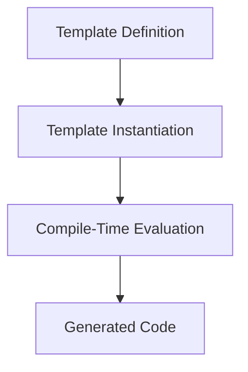

## 3.10 Templates, Metaprogramming, and SFINAE

Welcome to the fascinating world of C++ templates, metaprogramming, and SFINAE (Substitution Failure Is Not An Error). In this section, we'll delve deep into these advanced topics, which are essential for crafting efficient, reusable, and flexible code. Whether you're building complex libraries or optimizing performance-critical applications, mastering these concepts will elevate your C++ programming skills to new heights.

### Understanding C++ Templates

Templates are a powerful feature of C++ that allow you to write generic and reusable code. They enable the creation of functions and classes that work with any data type, providing a foundation for generic programming.

#### Function Templates

Function templates allow you to define a function without specifying the exact data types. The compiler generates the appropriate function based on the types of arguments passed.

```cpp
#include <iostream>

// Function template to find the maximum of two values
template <typename T>
T max(T a, T b) {
    return (a > b) ? a : b;
}

int main() {
    std::cout << "Max of 3 and 7: " << max(3, 7) << std::endl;
    std::cout << "Max of 3.5 and 2.1: " << max(3.5, 2.1) << std::endl;
    return 0;
}
```

In this example, the `max` function template works with both integers and floating-point numbers. The compiler generates the appropriate version of the function based on the argument types.

#### Class Templates

Class templates allow you to create classes that can handle any data type. This is particularly useful for creating container classes like vectors, stacks, and queues.

```cpp
#include <iostream>

// Class template for a simple pair
template <typename T1, typename T2>
class Pair {
public:
    T1 first;
    T2 second;
    
    Pair(T1 f, T2 s) : first(f), second(s) {}
    
    void display() const {
        std::cout << "Pair: (" << first << ", " << second << ")" << std::endl;
    }
};

int main() {
    Pair<int, double> p(42, 3.14);
    p.display();
    return 0;
}
```

Here, the `Pair` class template can hold any two types of data, demonstrating the flexibility of class templates.

### Template Metaprogramming Basics

Template metaprogramming is a technique that uses templates to perform computations at compile time. This can lead to more efficient code by reducing runtime overhead.

#### Compile-Time Factorial

Let's explore a simple example of template metaprogramming by calculating the factorial of a number at compile time.

```cpp
#include <iostream>

// Template metaprogramming to calculate factorial
template <int N>
struct Factorial {
    static const int value = N * Factorial<N - 1>::value;
};

// Base case specialization
template <>
struct Factorial<0> {
    static const int value = 1;
};

int main() {
    std::cout << "Factorial of 5: " << Factorial<5>::value << std::endl;
    return 0;
}
```

In this example, the `Factorial` struct template recursively calculates the factorial of a number at compile time. The base case specialization for `Factorial<0>` ensures that the recursion terminates.

### Using SFINAE (Substitution Failure Is Not An Error)

SFINAE is a powerful feature of C++ templates that allows you to enable or disable template instantiations based on certain conditions. This is particularly useful for creating generic algorithms that work with a wide range of types.

#### SFINAE with Function Overloading

Let's see how SFINAE can be used to conditionally enable function overloads based on type traits.

```cpp
#include <iostream>
#include <type_traits>

// Function to handle integral types
template <typename T>
typename std::enable_if<std::is_integral<T>::value, void>::type
process(T value) {
    std::cout << "Processing integral type: " << value << std::endl;
}

// Function to handle floating-point types
template <typename T>
typename std::enable_if<std::is_floating_point<T>::value, void>::type
process(T value) {
    std::cout << "Processing floating-point type: " << value << std::endl;
}

int main() {
    process(42);        // Calls the integral version
    process(3.14);      // Calls the floating-point version
    return 0;
}
```

In this example, we use `std::enable_if` to conditionally enable different versions of the `process` function based on whether the type is integral or floating-point.

### Implementing Generic Algorithms with Templates

Templates allow you to implement algorithms that work with any data type, making your code more flexible and reusable.

#### Generic Sorting Algorithm

Let's implement a simple generic sorting algorithm using templates.

```cpp
#include <iostream>
#include <vector>

// Function template for bubble sort
template <typename T>
void bubbleSort(std::vector<T>& arr) {
    for (size_t i = 0; i < arr.size() - 1; ++i) {
        for (size_t j = 0; j < arr.size() - i - 1; ++j) {
            if (arr[j] > arr[j + 1]) {
                std::swap(arr[j], arr[j + 1]);
            }
        }
    }
}

int main() {
    std::vector<int> numbers = {5, 2, 9, 1, 5, 6};
    bubbleSort(numbers);
    for (int num : numbers) {
        std::cout << num << " ";
    }
    std::cout << std::endl;
    return 0;
}
```

This example demonstrates a generic bubble sort algorithm that can sort vectors of any data type.

### `std::enable_if` and Type Traits

`std::enable_if` is a utility that allows you to conditionally enable template instantiations based on compile-time conditions. Combined with type traits, it provides a powerful mechanism for creating flexible and type-safe code.

#### Using `std::enable_if` with Type Traits

Let's explore how `std::enable_if` can be used with type traits to create a function that only accepts certain types.

```cpp
#include <iostream>
#include <type_traits>

// Function template that only accepts arithmetic types
template <typename T>
typename std::enable_if<std::is_arithmetic<T>::value, T>::type
add(T a, T b) {
    return a + b;
}

int main() {
    std::cout << "Sum of 3 and 4: " << add(3, 4) << std::endl;
    std::cout << "Sum of 3.5 and 2.5: " << add(3.5, 2.5) << std::endl;
    // add("Hello", "World"); // This line would cause a compilation error
    return 0;
}
```

In this example, the `add` function template is only enabled for arithmetic types, preventing compilation errors for unsupported types.

### Visualizing Template Metaprogramming

To better understand how template metaprogramming works, let's visualize the process using a diagram.



This diagram illustrates the flow of template metaprogramming, from defining templates to generating code at compile time.

### Try It Yourself

Now that we've covered the basics, it's time to experiment with templates, metaprogramming, and SFINAE. Here are a few challenges to get you started:

1. **Create a Template Function**: Write a template function that calculates the power of a number using recursion.
2. **Implement a Type Trait**: Create a custom type trait that checks if a type is a pointer.
3. **Use SFINAE**: Implement a function that only accepts types with a specific member function.

### References and Links

For further reading and deeper dives into these topics, check out the following resources:

- [C++ Templates: The Complete Guide](https://www.amazon.com/C-Templates-Complete-Guide-2nd/dp/0321714121)
- [cppreference.com - Templates](https://en.cppreference.com/w/cpp/language/templates)
- [cppreference.com - Type Traits](https://en.cppreference.com/w/cpp/types)

### Knowledge Check

Before we wrap up, let's reinforce what we've learned with a few questions:

- What is the primary purpose of templates in C++?
- How does SFINAE help in creating flexible code?
- What is the role of `std::enable_if` in template programming?

### Embrace the Journey

Remember, mastering templates, metaprogramming, and SFINAE is a journey. As you continue to explore these topics, you'll discover new ways to write efficient and flexible code. Keep experimenting, stay curious, and enjoy the journey!

## Quiz Time!



### What is the primary purpose of templates in C++?

- [x] To enable generic programming by allowing functions and classes to operate with any data type.
- [ ] To improve runtime performance by optimizing code execution.
- [ ] To simplify the syntax of complex algorithms.
- [ ] To enforce strict type checking at compile time.

> **Explanation:** Templates in C++ are primarily used to enable generic programming, allowing functions and classes to work with any data type.

### How does SFINAE contribute to creating flexible code?

- [x] By allowing template instantiations to fail without causing compilation errors, enabling conditional code paths.
- [ ] By optimizing code execution paths at runtime.
- [ ] By enforcing strict type compatibility during template instantiation.
- [ ] By simplifying the syntax of template definitions.

> **Explanation:** SFINAE allows template instantiations to fail gracefully, enabling conditional code paths based on type traits and other compile-time conditions.

### What is the role of `std::enable_if` in template programming?

- [x] To conditionally enable or disable template instantiations based on compile-time conditions.
- [ ] To optimize the execution speed of template functions.
- [ ] To simplify the syntax of template specializations.
- [ ] To enforce strict type checking during template instantiation.

> **Explanation:** `std::enable_if` is used to conditionally enable or disable template instantiations based on compile-time conditions, often in conjunction with type traits.

### Which of the following is an example of a type trait in C++?

- [x] `std::is_integral`
- [ ] `std::enable_if`
- [ ] `std::forward`
- [ ] `std::move`

> **Explanation:** `std::is_integral` is a type trait that checks whether a type is an integral type.

### What is the benefit of using template metaprogramming?

- [x] It allows computations to be performed at compile time, reducing runtime overhead.
- [ ] It simplifies the syntax of complex algorithms.
- [ ] It enforces strict type checking at compile time.
- [ ] It improves runtime performance by optimizing code execution paths.

> **Explanation:** Template metaprogramming allows computations to be performed at compile time, which can reduce runtime overhead and improve efficiency.

### How can you use SFINAE to enable function overloads based on type traits?

- [x] By using `std::enable_if` to conditionally enable different function overloads.
- [ ] By using `std::forward` to forward function arguments.
- [ ] By using `std::move` to transfer ownership of resources.
- [ ] By using `std::is_integral` to check for integral types.

> **Explanation:** SFINAE can be used with `std::enable_if` to conditionally enable different function overloads based on type traits.

### What is the purpose of a base case specialization in template metaprogramming?

- [x] To terminate recursion and provide a base value for computations.
- [ ] To optimize the execution speed of template functions.
- [ ] To simplify the syntax of template definitions.
- [ ] To enforce strict type checking during template instantiation.

> **Explanation:** A base case specialization in template metaprogramming is used to terminate recursion and provide a base value for computations.

### Which of the following is a common use case for class templates?

- [x] Creating container classes like vectors, stacks, and queues.
- [ ] Optimizing the execution speed of complex algorithms.
- [ ] Simplifying the syntax of function definitions.
- [ ] Enforcing strict type checking at compile time.

> **Explanation:** Class templates are commonly used to create container classes like vectors, stacks, and queues, which can handle any data type.

### What is the advantage of using `std::enable_if` with type traits?

- [x] It allows for the creation of flexible and type-safe code by conditionally enabling template instantiations.
- [ ] It simplifies the syntax of template specializations.
- [ ] It optimizes the execution speed of template functions.
- [ ] It enforces strict type checking during template instantiation.

> **Explanation:** Using `std::enable_if` with type traits allows for the creation of flexible and type-safe code by conditionally enabling template instantiations.

### True or False: Template metaprogramming can be used to perform computations at runtime.

- [ ] True
- [x] False

> **Explanation:** Template metaprogramming is used to perform computations at compile time, not runtime.


