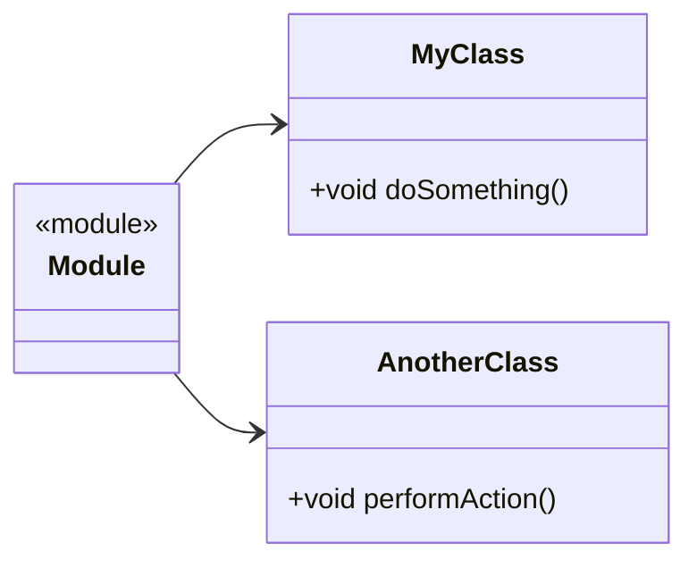

## 3.11 Code Organization and Modularization

In the realm of C++ programming, effective code organization and modularization are pivotal for creating maintainable, scalable, and efficient software systems. As projects grow in complexity, the need for a structured approach to organizing code becomes increasingly important. This section delves into the best practices for file and class organization, the strategic use of header files, managing dependencies, and introduces the powerful new feature of C++20: modules. Let's explore how these elements come together to enhance the development process.

### File and Class Organization

#### The Importance of Structure

In C++, organizing files and classes effectively is crucial for several reasons:

- **Maintainability**: A well-organized codebase is easier to navigate, understand, and modify.
- **Scalability**: As projects grow, a structured approach allows for seamless integration of new features.
- **Collaboration**: Clear organization aids team members in understanding and contributing to the codebase.

#### Best Practices for File Organization

1. **Separate Interface and Implementation**: 
   - Use header files (`.h` or `.hpp`) to declare class interfaces and source files (`.cpp`) for implementations. This separation facilitates compilation and reduces dependencies.

2. **Consistent Naming Conventions**:
   - Adopt a consistent naming convention for files and classes. For instance, `CamelCase` for classes and `snake_case` for file names.

3. **Logical Grouping**:
   - Group related classes and functions into directories. For example, place all networking-related classes in a `network` directory.

4. **Use of Namespaces**:
   - Encapsulate classes and functions within namespaces to avoid name clashes and clarify the context.

5. **Avoid Deep Directory Structures**:
   - Keep directory structures shallow to simplify navigation and reduce complexity.

#### Class Organization

1. **Single Responsibility Principle**:
   - Ensure each class has a single responsibility or purpose. This makes classes easier to understand and test.

2. **Encapsulation**:
   - Keep data members private and provide public methods for interaction. This protects the internal state of the class.

3. **Use of Interfaces**:
   - Define interfaces (abstract classes) for polymorphic behavior. This allows for flexible and interchangeable implementations.

4. **Dependency Injection**:
   - Use dependency injection to decouple classes and improve testability.

### Using Header Files Effectively

Header files play a critical role in C++ development by defining interfaces and facilitating code reuse. However, improper use can lead to issues such as increased compile times and circular dependencies. Let's explore how to use header files effectively.

#### Key Practices for Header Files

1. **Include Guards**:
   - Use include guards (`#ifndef`, `#define`, `#endif`) to prevent multiple inclusions of the same header file.

   ```cpp
   #ifndef MYCLASS_H
   #define MYCLASS_H

   class MyClass {
   public:
       void doSomething();
   };

   #endif // MYCLASS_H
   ```

2. **Forward Declarations**:
   - Use forward declarations to reduce dependencies and improve compile times. This is particularly useful when a header file only needs to declare pointers or references to a class.

   ```cpp
   class AnotherClass; // Forward declaration

   class MyClass {
   public:
       void setAnotherClass(AnotherClass* obj);
   };
   ```

3. **Minimal Includes**:
   - Include only what is necessary in header files. Prefer including headers in source files (`.cpp`) to minimize dependencies.

4. **Separate Interface and Implementation**:
   - As mentioned earlier, keep interface declarations in header files and implementations in source files.

5. **Documentation**:
   - Document classes and functions within header files using comments or tools like Doxygen to generate API documentation.

### Managing Dependencies

Dependency management is crucial for maintaining a clean and efficient codebase. Poor dependency management can lead to tightly coupled code, making it difficult to modify or extend. Here are some strategies for managing dependencies effectively.

#### Strategies for Dependency Management

1. **Dependency Inversion Principle**:
   - High-level modules should not depend on low-level modules. Both should depend on abstractions. This principle can be implemented using interfaces or abstract classes.

2. **Use of Interfaces**:
   - Define interfaces for dependencies and inject them into classes. This decouples the implementation from the interface and allows for easy swapping of implementations.

3. **Modular Design**:
   - Design the system in modules or components with well-defined interfaces. This promotes separation of concerns and reduces interdependencies.

4. **Third-Party Libraries**:
   - Use package managers like `vcpkg` or `Conan` to manage third-party libraries. This simplifies dependency management and ensures consistent versions across different environments.

5. **Avoid Circular Dependencies**:
   - Circular dependencies can lead to compilation issues and complex code. Use forward declarations and refactor code to eliminate circular dependencies.

### Introducing Modules (C++20)

C++20 introduces modules, a powerful feature that aims to improve the way we organize and compile code. Modules provide a modern alternative to header files, addressing some of the limitations associated with traditional header-based inclusion.

#### Benefits of Modules

1. **Faster Compilation**:
   - Modules reduce compile times by avoiding redundant parsing of header files. Once a module is compiled, it can be reused without recompilation.

2. **Better Encapsulation**:
   - Modules provide better encapsulation by allowing the separation of interface and implementation. This reduces the leakage of implementation details.

3. **Improved Dependency Management**:
   - Modules eliminate the need for include guards and reduce the risk of circular dependencies.

4. **Cleaner Code**:
   - Modules encourage cleaner code by allowing developers to export only the necessary parts of a module.

#### Using Modules in C++20

1. **Defining a Module**:
   - A module is defined using the `module` keyword. The module interface is specified in a `.cppm` file.

   ```cpp
   // mymodule.cppm
   export module mymodule;

   export class MyClass {
   public:
       void doSomething();
   };
   ```

2. **Importing a Module**:
   - Modules are imported using the `import` keyword. This replaces the traditional `#include` directive.

   ```cpp
   import mymodule;

   int main() {
       MyClass obj;
       obj.doSomething();
       return 0;
   }
   ```

3. **Module Partitions**:
   - Modules can be divided into partitions to organize code further. This is useful for large modules with multiple components.

   ```cpp
   // mymodule_part.cppm
   module mymodule:part;

   export void helperFunction();
   ```

4. **Transitioning from Headers to Modules**:
   - Gradually transition from header files to modules by identifying frequently included headers and converting them into modules.

### Visualizing Code Organization

To better understand the concepts of code organization and modularization, let's visualize a simple project structure using a class diagram.



**Diagram Description**: This class diagram illustrates a simple module containing two classes, `MyClass` and `AnotherClass`. The module encapsulates these classes, providing a clear structure and encapsulation.

### Try It Yourself

Experiment with the concepts discussed in this section by organizing a small C++ project:

1. **Create a Module**: Define a module with two classes, each with a simple method.
2. **Use Forward Declarations**: Implement a method in one class that takes a pointer to the other class, using forward declarations.
3. **Manage Dependencies**: Introduce a third-party library using a package manager and integrate it into your project.

### Knowledge Check

- **Question**: Why is it important to separate interface and implementation in C++?
- **Challenge**: Refactor a small project to use modules instead of header files. What benefits do you observe?

### Summary

In this section, we've explored the importance of code organization and modularization in C++. By following best practices for file and class organization, using header files effectively, managing dependencies, and leveraging C++20 modules, we can create robust and maintainable software systems. Remember, this is just the beginning. As you continue to refine your skills, you'll discover new ways to enhance your codebase. Keep experimenting, stay curious, and enjoy the journey!

## Quiz Time!



### Why is it important to separate interface and implementation in C++?

- [x] To improve maintainability and reduce dependencies
- [ ] To increase the size of the codebase
- [ ] To make the code harder to understand
- [ ] To ensure all code is in one file

> **Explanation:** Separating interface and implementation improves maintainability by reducing dependencies and making the code easier to manage.

### What is the purpose of include guards in header files?

- [x] To prevent multiple inclusions of the same header file
- [ ] To increase compilation time
- [ ] To make the code less readable
- [ ] To ensure all code is in one file

> **Explanation:** Include guards prevent multiple inclusions of the same header file, reducing compilation errors and improving efficiency.

### How do modules in C++20 improve dependency management?

- [x] By eliminating the need for include guards and reducing circular dependencies
- [ ] By increasing the complexity of the code
- [ ] By making the code harder to understand
- [ ] By requiring more header files

> **Explanation:** Modules eliminate the need for include guards and reduce circular dependencies, improving dependency management.

### What is a key benefit of using namespaces in C++?

- [x] To avoid name clashes and clarify context
- [ ] To increase the size of the codebase
- [ ] To make the code harder to understand
- [ ] To ensure all code is in one file

> **Explanation:** Namespaces help avoid name clashes and clarify the context, making the code more organized and easier to understand.

### What is a forward declaration in C++?

- [x] A declaration of a class or function before its full definition
- [ ] A complete implementation of a class or function
- [ ] A way to increase compilation time
- [ ] A method to make the code less readable

> **Explanation:** A forward declaration is a declaration of a class or function before its full definition, used to reduce dependencies and improve compile times.

### How do modules in C++20 improve compilation times?

- [x] By avoiding redundant parsing of header files
- [ ] By increasing the complexity of the code
- [ ] By requiring more header files
- [ ] By making the code harder to understand

> **Explanation:** Modules improve compilation times by avoiding redundant parsing of header files, making the build process more efficient.

### What is the Dependency Inversion Principle?

- [x] High-level modules should not depend on low-level modules; both should depend on abstractions
- [ ] Low-level modules should depend on high-level modules
- [ ] All modules should depend on each other
- [ ] Modules should not have any dependencies

> **Explanation:** The Dependency Inversion Principle states that high-level modules should not depend on low-level modules; both should depend on abstractions, promoting decoupling and flexibility.

### What is a module partition in C++20?

- [x] A way to organize a module into multiple components
- [ ] A complete implementation of a module
- [ ] A method to increase compilation time
- [ ] A way to make the code less readable

> **Explanation:** A module partition is a way to organize a module into multiple components, useful for large modules with multiple parts.

### Why should deep directory structures be avoided in C++ projects?

- [x] To simplify navigation and reduce complexity
- [ ] To increase the size of the codebase
- [ ] To make the code harder to understand
- [ ] To ensure all code is in one file

> **Explanation:** Deep directory structures can complicate navigation and increase complexity, so keeping them shallow simplifies project management.

### True or False: Modules in C++20 completely replace the need for header files.

- [ ] True
- [x] False

> **Explanation:** While modules offer many advantages over header files, they do not completely replace them. Header files are still useful, especially in legacy codebases and for certain use cases.


