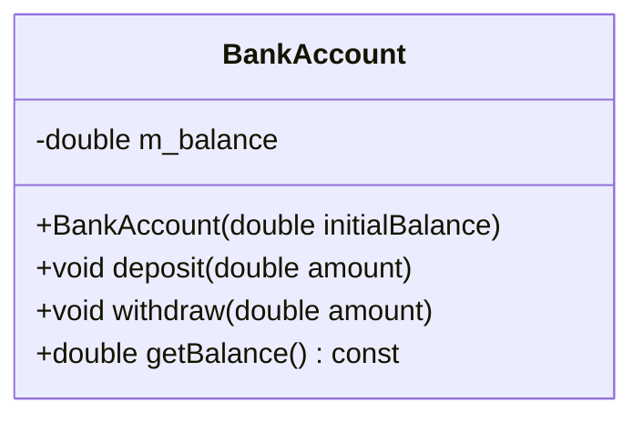

## 3.12 Naming Conventions and Coding Standards

In the realm of software development, especially in a language as intricate as C++, naming conventions and coding standards play a pivotal role in ensuring code readability, maintainability, and collaboration. This section delves into the best practices for naming conventions and coding standards in C++, providing expert guidance for software engineers and architects.

### Introduction to Naming Conventions

Naming conventions are a set of rules and guidelines used to create meaningful and consistent names for variables, functions, classes, and other entities in code. They are crucial for several reasons:

- **Readability**: Clear and descriptive names make code easier to read and understand.
- **Maintainability**: Consistent naming helps maintain code over time, especially in large projects.
- **Collaboration**: Adhering to a common naming standard facilitates teamwork and code sharing.

### Importance of Coding Standards

Coding standards encompass a broader set of guidelines that include naming conventions, formatting rules, and best practices. They are essential for:

- **Consistency**: Ensuring that all code follows a uniform style.
- **Quality**: Promoting best practices that lead to high-quality, error-free code.
- **Efficiency**: Streamlining the development process by reducing misunderstandings and errors.

### Key Principles of Naming Conventions

#### 1. Descriptive Names

Ensure that names are descriptive and convey the purpose or function of the entity. For example, use `calculateInterest` instead of `calcInt`.

#### 2. Consistent Case Usage

Adopt a consistent case style for different types of identifiers:

- **CamelCase**: Used for class names and function names (e.g., `MyClass`, `calculateInterest`).
- **snake_case**: Commonly used for variable names and function parameters (e.g., `interest_rate`, `total_amount`).
- **ALL_CAPS**: Reserved for constants and macros (e.g., `MAX_BUFFER_SIZE`).

#### 3. Avoid Abbreviations

Avoid using abbreviations unless they are widely recognized. This ensures clarity and reduces confusion.

#### 4. Use Meaningful Prefixes

Use prefixes to convey additional information about the variable type or scope. For example, `m_` for member variables (e.g., `m_interestRate`).

#### 5. Consistency Across the Codebase

Maintain consistency in naming conventions throughout the entire codebase to ensure uniformity and ease of understanding.

### Coding Standards in C++

#### 1. Indentation and Formatting

Use consistent indentation and formatting to enhance code readability. The common practice is to use four spaces per indentation level.

#### 2. Brace Style

Choose a brace style and stick to it. The two most common styles are:

- **K&R Style**: 
  ```cpp
  if (condition) {
      // code
  }
  ```

- **Allman Style**: 
  ```cpp
  if (condition)
  {
      // code
  }
  ```

#### 3. Line Length

Limit line length to a reasonable number of characters (typically 80-120) to ensure code readability across different devices and editors.

#### 4. Commenting

Provide meaningful comments to explain complex logic and assumptions. Use comments to clarify the intent rather than stating the obvious.

#### 5. Use of `const`

Use `const` to indicate immutability and express intent clearly. This helps prevent accidental modifications and enhances code safety.

#### 6. Error Handling

Adopt a consistent approach to error handling, such as using exceptions or error codes. Ensure that error handling logic is clear and robust.

#### 7. Use of Smart Pointers

Prefer smart pointers over raw pointers to manage dynamic memory safely and efficiently. Use `std::unique_ptr` for exclusive ownership and `std::shared_ptr` for shared ownership.

#### 8. Namespace Management

Organize code into namespaces to avoid name clashes and improve modularity. Use nested namespaces judiciously to maintain clarity.

### Example of Naming Conventions

Let's consider a simple example to illustrate naming conventions in C++:

```cpp
#include <iostream>
#include <memory>

// Class representing a bank account
class BankAccount {
public:
    BankAccount(double initialBalance) : m_balance(initialBalance) {}

    void deposit(double amount) {
        m_balance += amount;
    }

    void withdraw(double amount) {
        if (amount <= m_balance) {
            m_balance -= amount;
        } else {
            std::cerr << "Insufficient funds!" << std::endl;
        }
    }

    double getBalance() const {
        return m_balance;
    }

private:
    double m_balance; // Member variable with prefix 'm_'
};

int main() {
    std::unique_ptr<BankAccount> account = std::make_unique<BankAccount>(1000.0);
    account->deposit(500.0);
    account->withdraw(200.0);
    std::cout << "Current balance: $" << account->getBalance() << std::endl;
    return 0;
}
```

### Visualizing Naming Conventions

Below is a diagram illustrating the naming conventions used in the example above:



**Diagram Description**: The `BankAccount` class diagram shows the use of CamelCase for class and method names, and the `m_` prefix for member variables.

### Industry Coding Standards

#### 1. Google C++ Style Guide

The [Google C++ Style Guide](https://google.github.io/styleguide/cppguide.html) is a widely recognized set of guidelines that covers naming conventions, formatting, and best practices. It emphasizes consistency, readability, and simplicity.

#### 2. C++ Core Guidelines

The [C++ Core Guidelines](https://isocpp.github.io/CppCoreGuidelines/CppCoreGuidelines) provide comprehensive advice on modern C++ programming, including naming conventions, resource management, and error handling.

#### 3. MISRA C++ Guidelines

The [MISRA C++ Guidelines](https://www.misra.org.uk/) focus on safety and reliability, particularly in embedded systems. They provide rules for naming, formatting, and avoiding common pitfalls.

### Style Guides and Best Practices

#### 1. Consistent Naming Across Teams

Ensure that all team members adhere to the agreed-upon naming conventions and coding standards. This promotes uniformity and reduces friction in collaborative environments.

#### 2. Code Reviews

Conduct regular code reviews to enforce coding standards and identify areas for improvement. Use automated tools to check for compliance with style guides.

#### 3. Documentation

Maintain comprehensive documentation of coding standards and naming conventions. This serves as a reference for new team members and helps ensure consistency.

#### 4. Continuous Learning

Encourage continuous learning and adaptation of best practices. Stay updated with the latest developments in C++ and incorporate new techniques into the coding standards.

### Try It Yourself

Experiment with the code example by modifying the naming conventions and observing the impact on readability. Consider changing the case style or prefixes and see how it affects the code's clarity.

### Knowledge Check

- Why is it important to use descriptive names in code?
- What are the benefits of adhering to a consistent naming convention?
- How do coding standards contribute to code quality and maintainability?

### Conclusion

Naming conventions and coding standards are foundational elements of high-quality software development. By adhering to these guidelines, developers can create code that is not only functional but also readable, maintainable, and collaborative. As you continue your journey in mastering C++ design patterns, remember that consistency and clarity are key to successful software architecture.

## Quiz Time!



### Why are naming conventions important in C++?

- [x] They enhance code readability and maintainability.
- [ ] They increase the execution speed of the code.
- [ ] They reduce the size of the compiled binary.
- [ ] They eliminate the need for comments.

> **Explanation:** Naming conventions improve readability and maintainability by providing consistent and meaningful names for code elements.

### What is the recommended case style for class names in C++?

- [x] CamelCase
- [ ] snake_case
- [ ] ALL_CAPS
- [ ] kebab-case

> **Explanation:** CamelCase is typically used for class names in C++ to enhance readability and distinguish them from other identifiers.

### Which prefix is commonly used for member variables in C++?

- [x] m_
- [ ] p_
- [ ] g_
- [ ] l_

> **Explanation:** The `m_` prefix is often used to denote member variables, indicating their scope within a class.

### What is the primary purpose of coding standards?

- [x] To ensure consistency and quality in the codebase.
- [ ] To increase the speed of code execution.
- [ ] To reduce the number of lines of code.
- [ ] To automate code generation.

> **Explanation:** Coding standards ensure consistency and quality by providing guidelines for writing clear and maintainable code.

### Which of the following is a common brace style in C++?

- [x] K&R Style
- [x] Allman Style
- [ ] Pascal Style
- [ ] Hungarian Style

> **Explanation:** K&R and Allman are common brace styles used in C++ for formatting code blocks.

### What is the recommended line length for C++ code?

- [x] 80-120 characters
- [ ] 40-60 characters
- [ ] 200-250 characters
- [ ] 10-20 characters

> **Explanation:** Limiting line length to 80-120 characters ensures code readability across different devices and editors.

### Why should `const` be used in C++?

- [x] To indicate immutability and prevent accidental modifications.
- [ ] To increase the speed of code execution.
- [ ] To reduce memory usage.
- [ ] To eliminate the need for error handling.

> **Explanation:** Using `const` indicates immutability, helping to prevent accidental modifications and enhancing code safety.

### Which tool is commonly used for automated code style checking?

- [x] Clang-Tidy
- [ ] GDB
- [ ] Valgrind
- [ ] Make

> **Explanation:** Clang-Tidy is a tool used for automated code style checking and static analysis.

### What is the benefit of using smart pointers in C++?

- [x] They help manage dynamic memory safely and efficiently.
- [ ] They increase the speed of code execution.
- [ ] They reduce the size of the compiled binary.
- [ ] They eliminate the need for error handling.

> **Explanation:** Smart pointers manage dynamic memory safely and efficiently, reducing the risk of memory leaks and dangling pointers.

### True or False: Consistent naming conventions can improve team collaboration.

- [x] True
- [ ] False

> **Explanation:** Consistent naming conventions improve team collaboration by ensuring that all team members understand and adhere to the same naming rules.


